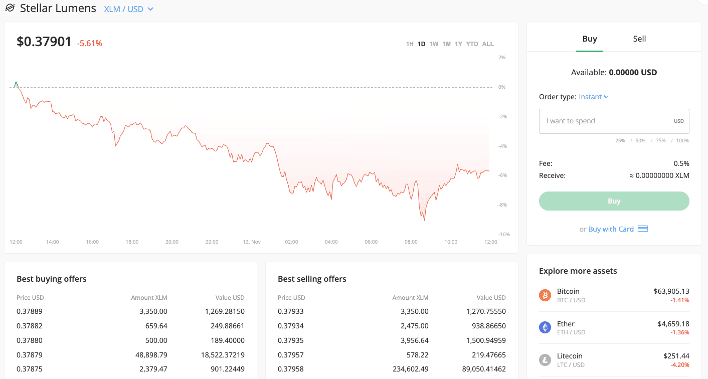

Bitstamp, founded in 2011, has established itself as one of the oldest and most reliable cryptocurrency exchanges globally. Recognized for its long-standing presence in the rapidly evolving cryptocurrency market, Bitstamp provides a platform that accommodates both novice and seasoned traders. Its longevity in the industry is a testament to its adaptability and commitment to meeting user needs.

With an emphasis on simplicity and security, Bitstamp continues to be a favored choice for those eager to explore crypto trading. The platform's design prioritizes user-friendliness, ensuring that individuals new to cryptocurrencies can navigate and engage with the market with ease. Additionally, seasoned traders appreciate the robust trading options available, which cater to more complex trading strategies.



Bitstamp's commitment to security is another cornerstone of its reputation. Security features are paramount given the historical challenges and threats within the cryptocurrency space. Bitstamp maintains an edge with competitive fees, which are transparent and structured to offer cost savings to those engaging in higher trading volumes. The exchange's comprehensive suite of trading options ensures users can access a broad spectrum of trade types and tools, regardless of their experience level.

This article will provide a thorough review of Bitstamp, examining the various services offered, its fee structure, security protocols, and a comparative analysis with other major platforms such as Coinbase. This review aims to equip potential and current users with the necessary insights to make informed decisions about leveraging Bitstamp for their cryptocurrency trading endeavors.

## Table of Contents

## Company Overview

Bitstamp, established in 2011 by co-founders Nejc Kodrič and Damijan Merlak, originated in Slovenia as a response to the rising demand for cryptocurrency exchanges after the inception of Bitcoin. It quickly gained prominence due to its reliability and user-centric services. The company strategically relocated its headquarters to Luxembourg in 2016, positioning itself as a European Union-regulated financial institution. This move bolstered its credibility and enabled it to align with regulatory standards in various jurisdictions.

Today, Bitstamp operates globally with offices in key financial markets, including the United Kingdom, United States, Singapore, and its headquarters in Luxembourg. This international presence ensures that Bitstamp can cater to a diverse and expansive clientele, providing tailored services to meet varying regional needs and regulatory requirements.

The Bitstamp platform currently supports over 80 cryptocurrencies, making it a robust choice for traders seeking variety. Among these digital assets are major cryptocurrencies like Bitcoin (BTC), Ethereum (ETH), and Litecoin (LTC), which are essential for both trading and investment portfolios. In promoting a comprehensive trading experience, Bitstamp addresses the needs of beginner and intermediate traders by offering an intuitive interface and educational resources.

While Bitstamp's selection of cryptocurrencies may be smaller than some of its competitors, this is intentional to ensure focus on high-[liquidity](/wiki/liquidity-risk-premium) and high-demand assets. This strategy not only enhances user experience by reducing the complexity associated with myriad options but also aligns with the platform's emphasis on security and regulatory compliance.

## Cryptocurrencies Available

Bitstamp provides a wide selection of cryptocurrencies, making it a versatile platform for both novice and intermediate traders. Although the total count exceeds 80 different cryptocurrencies, this selection is modest compared to other prominent exchanges. Notable cryptocurrencies available on Bitstamp include Bitcoin (BTC), Ethereum (ETH), and Uniswap (UNI). 

Bitcoin, the first and most recognized [cryptocurrency](/wiki/cryptocurrency), is a staple on most platforms, including Bitstamp. Ethereum, known for its robust blockchain facilitating smart contracts and decentralized applications (DApps), is another critical offering. Uniswap, a decentralized finance token known for its role in automated trading of decentralized finance (DeFi) tokens, also features on Bitstamp's platform.

It is important to note that regulations affect the availability of certain cryptocurrencies on Bitstamp, particularly concerning U.S. traders. For instance, XRP, the digital asset associated with the Ripple network, is unavailable for U.S. traders due to ongoing legal and regulatory considerations. This limitation underscores the need for users to be aware of jurisdiction-specific restrictions when trading cryptocurrencies on Bitstamp.

Overall, while Bitstamp may not offer as extensive a catalog as some of its competitors, it covers a substantial breadth of well-known and emerging cryptocurrencies, catering effectively to a broad range of trading preferences and strategies.

## Trading Experience

Bitstamp offers a robust trading experience through its three main platforms, catering to a wide range of traders from novices to more experienced professionals. 

- **Bitstamp.net**: This platform is particularly designed for basic trades, offering a straightforward interface that simplifies the trading process for those new to cryptocurrency. Users can easily buy, sell, and trade various digital assets using standard order types like market orders, limit orders, and stop orders. 

- **Tradeview**: For traders seeking advanced trading options, Tradeview provides a comprehensive suite of tools. This platform features sophisticated charting tools and a variety of technical indicators, enabling users to conduct in-depth analyses of market trends and strategies. The advanced interface supports more complex order types, such as fill or kill (FOK) and immediate or cancel (IOC) orders, which are crucial for implementing specific trading strategies.

- **Mobile App**: Bitstamp’s mobile app delivers a seamless trading experience for users on the go. Available on both iOS and Android devices, the app replicates much of the functionality found on the desktop platforms, allowing users to execute trades, manage their portfolios, and monitor market prices in real-time. The mobile app’s user-friendly interface ensures that traders can perform essential transactions efficiently, making it a convenient tool for active traders.

Overall, Bitstamp’s platforms are well-suited for different trading styles and strategies, providing users with the flexibility to navigate the cryptocurrency market according to their experience levels and preferences. These platforms collectively ensure that whether a trader is executing simple trades or employing complex trading strategies, they have access to the necessary tools and features.

## Fees

Bitstamp's fee structure is designed to be competitive in the cryptocurrency exchange market. The fees start at 0.30% for users with a monthly trading [volume](/wiki/volume-trading-strategy) below $10,000. This fee percentage decreases as the trading volume increases, making it advantageous for high-volume traders. For instance, the fee drops to 0.24% for those who trade between $10,000 and $20,000 monthly, and it continues to decrease at various volume thresholds until it reaches 0.05% for traders whose volume exceeds $20 million per month.

For deposit methods, Bitstamp offers multiple avenues through which users can fund their accounts. Bank transfers, such as SEPA (Single Euro Payments Area) transfers within the EU, are generally fee-free for deposits. However, international wire transfers incur a 0.05% fee with a minimum fee of $7.50. It is important to note that credit card deposits incur higher costs, typically around 5% of the transaction amount. This variation in fee structures between deposit methods highlights the importance of users choosing the most cost-effective option for their needs.

Withdrawals from Bitstamp also have associated fees. For SEPA withdrawals, the fee is €3.00, while international wire withdrawals cost 0.1% of the total amount, with a minimum fee of $25.00. The platform emphasizes transparency in its fee structure, making it clear what costs are involved, which allows users to plan transactions effectively.

Compared to other major exchanges, Bitstamp's fees are largely in line with industry standards. While it may not be the absolute lowest in cost for all types of transactions, its fees are competitive, particularly for traders with significant monthly volumes. Users should consider both trading and non-trading fees when assessing the overall cost of using the platform.

For those interested in calculating potential fees based on their trading volume, a simple Python function could help estimate the transaction cost given a specific fee schedule:

```python
def calculate_fee(volume: float) -> float:
    if volume < 10000:
        return volume * 0.0030
    elif volume < 20000:
        return volume * 0.0024
    # Add more conditions as per volume brackets
    elif volume > 20000000:
        return volume * 0.0005
    return 0.0

# Example usage
volume = 15000
fee = calculate_fee(volume)
print(f"Trading fee for a volume of ${volume} is ${fee:.2f}")
```

This simple function provides an approximate fee calculation that may vary slightly in a real-world scenario due to changes in the fee schedule or additional considerations such as promotions or loyalty programs.

## Security

Bitstamp places a high emphasis on security, employing advanced protective measures to safeguard user funds and data. One of the primary security protocols implemented is the storage of the majority of assets in cold storage. Cold storage refers to the practice of keeping cryptocurrencies offline, which substantially reduces the risk of hacking attempts. This method is a cornerstone of cryptocurrency security, as it minimizes exposure to potential security breaches that often target online or hot wallets.

Another critical layer of security at Bitstamp is the use of two-[factor](/wiki/factor-investing) authentication (2FA). This feature adds an extra step during the login process, ensuring that even if a user's password is compromised, unauthorized access is still significantly hindered. Users are encouraged to activate 2FA to provide an extra shield against possible account breaches.

In 2015, Bitstamp experienced a security incident where hackers accessed its hot wallet, resulting in a loss of approximately 19,000 Bitcoin. In response to this breach, Bitstamp undertook a comprehensive overhaul of its security infrastructure to restore user confidence and improve system resilience. This included the implementation of more robust security protocols and enhancements to existing systems to prevent future attacks.

Bitstamp’s commitment to maintaining high-security standards is also evident in its adherence to regulatory compliance and the use of industry best practices. These include regular audits, security testing, and collaborations with leading cybersecurity firms to continually monitor and improve system defenses. By maintaining a strong focus on security, Bitstamp aims to protect its users and maintain a reputation as a trustworthy and reliable cryptocurrency exchange.

## Algo Trading

Bitstamp provides robust support for [algorithmic trading](/wiki/algorithmic-trading), enabling traders and investors to leverage advanced strategies through its Application Programming Interfaces (APIs). Algorithmic trading, often referred to as algo trading, involves the use of computer programs to execute trades based on pre-defined criteria, enabling users to maximize efficiency and response time in the fast-paced cryptocurrency markets.

### Bitstamp's API Offering

Bitstamp offers both REST and WebSocket APIs, providing comprehensive access to its trading features. The REST API facilitates standard trading operations, such as fetching market data, placing or canceling orders, and managing user accounts. This makes it ideal for developing custom trading applications that require interaction with Bitstamp's markets at regular intervals.

In contrast, the WebSocket API allows for real-time data streaming, which is invaluable for strategies that depend on immediate market data updates. This API supports receiving live market data and [order book](/wiki/order-book-trading-strategies) updates, enabling traders to execute high-frequency trading strategies that demand swift reaction to price changes.

### Benefits of Algo Trading

1. **Speed and Efficiency**: Algorithmic trading automates the trading process, executing trades at speeds much faster than the human capacity. This is critical in crypto markets, where prices can fluctuate rapidly within seconds.

2. **Elimination of Emotional Bias**: Algo trading removes human emotions from trading decisions. This ensures consistency and adherence to trading strategies, leading to potentially improved outcomes.

3. **Backtesting**: Traders can test their trading strategies on historical data to identify potential weaknesses and optimize performance before deploying them in live markets.

4. **Diversification**: Automation allows traders to simultaneously execute multiple strategies across different markets or cryptocurrency pairs, enhancing the potential for diversifying their trading approaches and risks.

### Example Implementation

For a simple automated trading strategy, such as a moving average crossover, Python can be utilized in conjunction with Bitstamp's APIs:

```python
import requests

def get_market_data():
    response = requests.get('https://www.bitstamp.net/api/v2/ticker/btcusd/')
    return response.json()

def calculate_moving_average(prices, window_size):
    if len(prices) < window_size:
        return None
    return sum(prices[-window_size:]) / window_size

prices = []
short_window = 5
long_window = 20

while True:
    market_data = get_market_data()
    prices.append(float(market_data['last']))

    short_ma = calculate_moving_average(prices, short_window)
    long_ma = calculate_moving_average(prices, long_window)

    if short_ma and long_ma:
        if short_ma > long_ma:
            print("Signal: Buy")
        elif short_ma < long_ma:
            print("Signal: Sell")
```

The above script collects Bitcoin market data from Bitstamp, calculates short and long moving averages, and prints buy/sell signals based on crossover events. For deployment in a live environment, additional components such as risk management and integration with Bitstamp's trading API for order execution would be necessary.

### Conclusion

Bitstamp's support for algorithmic trading through its APIs presents an attractive option for traders aiming to harness the power of automated strategies. Its user-friendly integration and comprehensive data access make it suitable for both novice programmers and experienced developers. This capability, combined with Bitstamp's extensive security features and market presence, positions it as a competitive choice in the evolving landscape of crypto trading platforms.

## Customer Service and Satisfaction

Bitstamp offers customer support through email and phone, providing users with traditional means of communication. However, feedback from users reveals areas that could benefit from improvement, particularly when it comes to response times. While some users acknowledge that issues are eventually resolved, the delay in response can be a source of frustration, especially in the fast-paced world of cryptocurrency trading.

The experiences of Bitstamp users are mixed in terms of customer service satisfaction. Some users have reported slow processing times for withdrawals, which can be problematic for traders who need to react swiftly to market changes. Additionally, interactions with support staff have occasionally been described as less than satisfactory, with some users feeling that their concerns were not fully addressed or that the support lacked the necessary technical expertise.

Bitstamp's efforts to maintain a reliable and secure platform are evident, yet user expectations regarding customer support continue to rise. For instance, implementing a more intuitive and responsive support system, possibly involving live chat or more rapid email turnover, could enhance user satisfaction. Moreover, improving the consistency and quality of support staff interactions would likely strengthen Bitstamp's reputation among its user base.

Although Bitstamp remains a credible and secure choice for many traders, its customer service could benefit from advancements in both technologically adaptive solutions and staff training to cater to the evolving needs of its clientele.

## Final Verdict

Bitstamp is recognized as a robust choice for both newcomers to the cryptocurrency market and seasoned traders who prioritize straightforward functionality. The platform's hallmark lies in its competitive fee structure, which begins at 0.30% and scales down with increased trading volumes, making it an attractive option for cost-conscious traders who engage in high-frequency trading. Its longevity in the market, since its inception in 2011, is a testament to its stability and reliability.

Security measures are another key strength of Bitstamp, with most funds securely stored in cold wallets, which are offline and therefore shielded from online threats. Additionally, the platform employs comprehensive measures such as two-factor authentication to enhance user account protection. Despite a significant security breach in 2015, Bitstamp has substantially improved its protective protocols, reassuring users about the safety of their assets.

However, while Bitstamp excels in cost and security, it may fall short for users seeking an expansive selection of cryptocurrencies or those interested in advanced features such as staking, especially within the U.S. market. The platform currently offers over 80 cryptocurrencies, which, although substantial, is limited compared to some of its competitors. Furthermore, advanced trading options, such as staking, are not available for U.S. traders, potentially steering those looking for such features towards other exchanges that offer broader capabilities. 

Overall, Bitstamp's longevity, user-friendly platform, and focus on security make it a reliable choice for those wanting a straightforward trading experience, while those seeking more extensive cryptocurrency options or specific advanced features might consider evaluating additional alternatives.

## FAQs

Is Bitstamp suitable for beginners? Yes, Bitstamp is particularly user-friendly and caters well to beginners. Its platform is designed with simplicity in mind, featuring intuitive interfaces that allow users new to cryptocurrency trading to navigate and conduct trades with ease. Features like a straightforward dashboard, easy-to-understand metrics, and a variety of educational resources help beginners familiarize themselves with the market dynamics and trading principles. Bitstamp also offers a mobile application, which provides on-the-go access and allows users to manage their portfolios conveniently, further enhancing the ease of use for those starting out in cryptocurrency trading.

Does Bitstamp support algo trading? Yes, Bitstamp provides APIs for algorithmic trading, appealing to advanced users. The platform supports a range of API functions that enable traders to deploy automated trading strategies, execute trades programmatically, and manage their portfolios efficiently. This feature is particularly beneficial for professional investors and traders who wish to implement sophisticated trading algorithms. The availability of these APIs allows for seamless integration with trading bots and custom software, providing flexibility in strategy development and execution. Here is a basic example of how one might begin to interact with Bitstamp's API using Python:

```python
import requests

# Define basic API endpoint and parameters
base_url = "https://www.bitstamp.net/api/v2"
ticker_endpoint = "/ticker/btcusd/"

# Send a request to Bitstamp API to get BTC/USD ticker data
response = requests.get(base_url + ticker_endpoint)

# Check if the request was successful
if response.status_code == 200:
    data = response.json()
    print(f"Current BTC/USD Price: {data['last']}")
else:
    print(f"Failed to fetch data: {response.status_code}")
```

This example demonstrates how to fetch the current Bitcoin to USD price using Bitstamp’s API, laying the foundation for more complex algorithmic trading operations.

## References & Further Reading

[1]: Lavi, R., & Villadsen, B. (2019). ["Cryptocurrency Trading & Investing: Evaluating Security and Risks"](https://pmc.ncbi.nlm.nih.gov/articles/PMC8670570/). Security Magazine.

[2]: Nakamoto, S. (2008). ["Bitcoin: A Peer-to-Peer Electronic Cash System"](https://nakamotoinstitute.org/library/bitcoin/).

[3]: Golumbia, D. (2016). ["The Politics of Bitcoin: Software as Right-Wing Extremism"](https://archive.org/details/politicsofbitcoi0000golu). University of Minnesota Press.

[4]: Shreve, S. E. (2004). ["Stochastic Calculus for Finance I & II"](https://link.springer.com/book/9780387401010). Springer Finance Textbooks.

[5]: Burniske, C., & Tatar, J. (2017). ["Cryptoassets: The Innovative Investor's Guide to Bitcoin and Beyond"](https://www.amazon.com/Cryptoassets-Innovative-Investors-Bitcoin-Beyond/dp/1260026671). McGraw-Hill Education.