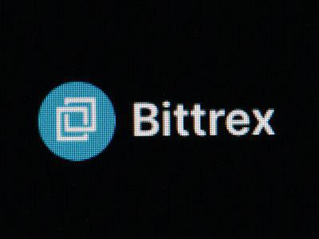

Cryptocurrency trading has seen exponential growth in recent years, with more individuals and institutions seeking to leverage digital assets for financial gain. As this sector expands, the importance of reliable exchanges becomes crucial to ensure secure, efficient, and cost-effective trading experiences. Bittrex stands out as a prominent entity within the cryptocurrency exchange landscape, appreciated for its diverse selection of cryptocurrencies and competitive trading fees.

Established in 2014, Bittrex has cemented its reputation as a trustworthy platform, catering to both novice and experienced traders. It offers an expansive portfolio of over 250 cryptocurrencies, encompassing well-known coins like Bitcoin and Ethereum, as well as a wide array of lesser-known altcoins. This vast selection provides traders with unique opportunities to diversify their portfolios and engage with emerging digital assets.

Bittrex’s trading infrastructure is designed to accommodate various strategies, including complex algorithmic trading. Its advanced order types and robust technical support position it as a favorable choice for those implementing and testing automated trading algorithms. Furthermore, the platform's security measures, such as extensive use of cold storage and two-factor authentication, reassure users of the safety of their assets.

Throughout this article, we will conduct a thorough review of Bittrex, highlighting its features, trading experience, fees, and security protocols. We will also assess its role in the arena of algorithmic trading, catering to traders seeking sophisticated trading methods.

## Table of Contents

## Company Overview

Bittrex was established in 2014 by a team of engineers: Bill Shihara, Richie Lai, and Rami Kawach. The company is headquartered in Seattle, Washington, and has positioned itself as a prominent player within the cryptocurrency exchange market. Originally, Bittrex was designed to operate exclusively as a crypto-to-crypto exchange, allowing users to trade one type of cryptocurrency for another. This focus enabled the company to rapidly build a comprehensive platform offering robust trading features and a wide array of digital assets.

Recognizing the evolving needs of its users, Bittrex expanded its services to include fiat-to-crypto trading. This addition marked a significant shift for the platform, broadening its appeal to a more extensive user base by allowing the direct purchase of cryptocurrencies using fiat currencies like the US Dollar. The capability to facilitate fiat transactions has made Bittrex more accessible to new investors and those seeking to transfer traditional currencies into digital assets.

Bittrex offers an extensive range of cryptocurrencies, providing its users access to over 250 different [cryptocurrency](/wiki/cryptocurrency) assets. This diversity in offerings makes Bittrex one of the more versatile exchanges in the cryptocurrency industry, offering numerous trading opportunities for both beginners and seasoned traders. The broad selection includes major cryptocurrencies such as Bitcoin (BTC) and Ethereum (ETH), as well as a multitude of lesser-known altcoins, ensuring that users have access to a wide variety of investment options.

## Cryptocurrencies Available on Bittrex

Bittrex is renowned for its extensive selection of cryptocurrencies, offering traders access to more than 250 different coins. This diverse range includes major cryptocurrencies such as Bitcoin (BTC) and Ethereum (ETH), which are staples in most trading portfolios due to their high [liquidity](/wiki/liquidity-risk-premium) and widespread adoption. In addition to these prominent digital currencies, Bittrex also lists a multitude of lesser-known altcoins, providing both novice and seasoned investors with myriad investment opportunities.

The presence of numerous altcoins allows traders to diversify their portfolios effectively. Diversification is a key strategy in minimizing risk, as it involves spreading investments across various assets. For instance, by investing in several cryptocurrencies rather than focusing on a single asset, traders can mitigate losses if one particular currency experiences a downturn.

The impressive variety of assets on Bittrex also supports speculative trading strategies. Speculative traders often seek out less popular altcoins for their potential high returns. While these lesser-known cryptocurrencies might possess higher [volatility](/wiki/volatility-trading-strategies) and risk, they also offer the possibility of substantial profits if they achieve market success.

Furthermore, Bittrex frequently updates its platform with new cryptocurrencies, aligning with the evolving digital asset landscape. This agility ensures traders can partake in emerging market trends and capitalize on lucrative opportunities.

Bittrex provides the necessary tools for users to [carry](/wiki/carry-trading) out comprehensive due diligence on each listed cryptocurrency. This includes access to historical price data, market trends, and relevant news. This transparency is essential, allowing traders to make informed decisions regarding the coins that meet their investment criteria and risk appetite.

Ultimately, the expansive selection of cryptocurrencies available on Bittrex caters to a wide array of trading strategies, from long-term investments in established coins to high-risk, high-reward ventures into altcoins. This aspect makes Bittrex an attractive platform for traders looking to explore a broad spectrum of digital assets.

## Trading Experience

Bittrex offers a user-friendly trading experience with a focus on straightforward navigation across both its desktop and mobile platforms. This design ensures that users can efficiently manage their portfolios and execute trades, regardless of their location. The platform is built with robust features that accommodate both novice traders and seasoned investors.

A standout feature of Bittrex is its offering of advanced order types. These include stop orders, where a trade is executed once the price reaches a predetermined level; stop-limit orders, which combine the features of stop orders with limit orders to provide more precise control over the trading process; and trailing stop orders, which allow traders to protect gains by enabling a stop order to move with the market price. These advanced tools cater to complex trading strategies, providing traders with more flexibility and control over their trades.

The platform also integrates real-time data and charting tools that equip traders with the necessary information to make informed trading decisions. This feature is essential for analyzing market trends and executing trades at opportune moments. Furthermore, the Bittrex interface allows for customization, enabling traders to personalize their trading spaces according to their preferences and requirements.

Overall, Bittrex emphasizes a seamless and comprehensive trading experience, capable of supporting a diverse range of trading strategies through its sophisticated features and accessible design.

## Fees and Costs

Bittrex operates with a maker/taker fee model, which is prevalent among cryptocurrency exchanges. This structure ensures that both market makers (who provide liquidity) and market takers (who consume liquidity) are charged fees, albeit at different rates. For Bittrex, the standard fee starts at 0.35% for both makers and takers. However, traders benefit from discounted rates as their trading [volume](/wiki/volume-trading-strategy) increases over a 30-day period.

This model not only incentivizes higher trading volumes but also provides traders with a clear and straightforward understanding of their transaction costs. By maintaining a transparent fee calculation method, Bittrex enables traders to more effectively manage their investment strategies and forecast expenses associated with frequent trading.

The fee reduction based on trading volume can be explained mathematically as follows. Suppose $v$ is the trading volume over the past 30 days. The fee $f$ as a function of $v$ can be represented as:

$$
f(v) = \begin{cases} 
0.35\% & \text{if } v < V_1 \\
0.25\% & \text{if } V_1 \leq v < V_2 \\
0.15\% & \text{if } V_2 \leq v \\
\end{cases}
$$

Here, $V_1$ and $V_2$ represent the thresholds at which the fee reductions occur. These thresholds are set by Bittrex and are available on their platform's fee schedule. This tiered approach encourages users to increase their trading activity, subsequently benefiting from lower fees, which is particularly advantageous for algorithmic traders who frequently execute large volumes of trades.

## Security Measures

Bittrex distinguishes itself in the cryptocurrency exchange market by implementing stringent security measures designed to protect user assets. A cornerstone of these security protocols is the storage of the majority of funds in cold storage. Cold storage involves keeping cryptocurrencies offline, significantly reducing the risk of unauthorized access and cyber-attacks. This practice ensures that most user funds remain insulated from potential security breaches that target online exchanges.

In addition to cold storage, Bittrex enhances account security through the implementation of two-[factor](/wiki/factor-investing) authentication (2FA). This security layer requires users to verify their identities using a second factor, typically a mobile device, in addition to their passwords. By doing so, Bittrex dramatically reduces the likelihood of unauthorized account access, even in cases where a user's password is compromised.

Bittrex also employs additional security measures such as IP whitelisting and wallet address whitelisting. IP whitelisting allows users to define specific IP addresses that are permitted to access their accounts. This means that even if login credentials are stolen, an unauthorized party cannot access an account from an unapproved IP address. Wallet address whitelisting functions similarly by enabling users to designate specific wallet addresses that can receive funds. This adds another layer of security, as any attempt to withdraw funds to a non-whitelisted address would be blocked.

These combined security measures underscore Bittrex's commitment to safeguarding user assets against potential threats and providing a secure trading environment for its users.

## Algorithmic Trading on Bittrex

Bittrex offers a robust platform for [algorithmic trading](/wiki/algorithmic-trading), capitalizing on its comprehensive cryptocurrency support and advanced order types. The platform's API functionality is a critical feature for traders seeking to leverage algorithms in their trading strategies. By utilizing Bittrex's API, developers can automate trading processes, execute trades based on predefined criteria, and manage portfolios with minimal manual intervention.

Algorithmic trading involves using computer programs to follow a defined set of instructions for placing trades, often at speeds and frequencies that are impossible for human traders. Bittrex's API allows access to real-time data and market analytics, providing traders with the insights needed to develop complex algorithms. The flexibility to integrate with external software further enhances the ability to customize trading strategies.

Bittrex supports a variety of order types, including stop, stop-limit, and trailing stop orders, enabling algorithm-driven traders to manage risk and execute trades with precision. For example, a stop-limit order can be programmed to trigger a buy or sell action when an asset reaches a specified price, offering automated portfolio management that aligns with market conditions.

Moreover, the exchange supports over 250 cryptocurrencies, offering algorithmic traders a diverse range of assets to incorporate into their strategies. This broad selection enables the creation of algorithms that can exploit [arbitrage](/wiki/arbitrage) opportunities or execute multi-currency strategies, enhancing potential profitability.

For algorithmic traders, Bittrex’s commitment to security ensures that sensitive data and assets are protected. This is achieved through practices such as cold storage of funds and two-factor authentication, which bolster confidence in the integrity and safety of the trading environment.

In summary, Bittrex's platform is well-equipped for algorithmic trading, offering a combination of extensive cryptocurrency options, advanced trading features, and robust security measures. The availability of API support further ensures that traders can implement and test sophisticated trading algorithms effectively.

## Customer Service and User Satisfaction

Bittrex offers customer support through a variety of channels, including its online help center, a chatbot, and a support ticket system. This multi-tiered approach helps address a wide range of user inquiries and technical issues. However, Bittrex does not provide direct phone support, a service that some users find crucial for resolving complex issues promptly.

User satisfaction with Bittrex's customer service varies. Many users appreciate the platform's robust security and extensive selection of cryptocurrencies, acknowledging these as significant advantages. The security features, such as two-factor authentication and cold storage, are often highlighted positively in user reviews. Additionally, traders value the breadth of cryptocurrency options, which allows for diversified trading strategies.

Conversely, the absence of direct phone support is a common criticism among users, who feel that this limits the immediacy of assistance required in urgent situations. The reliance on asynchronous communication methods, like email and support tickets, can lead to delays that some users find frustrating. The effectiveness of the chatbot and help center in resolving technical issues and account-related inquiries appears to be mixed, with some users finding them adequate and others experiencing challenges navigating these resources.

Overall, while Bittrex's security and range of cryptocurrencies are frequently praised, the customer service experience presents areas for potential improvement to enhance user satisfaction. Addressing the communication gaps, particularly the lack of immediate support, could contribute significantly to improving user perceptions and overall satisfaction with the platform.

## Comparisons with Other Exchanges

Bittrex is recognized for its extensive selection of cryptocurrencies, offering over 250 different coins and tokens for trading. This is a significant advantage over many other exchanges, such as Kraken, which boasts a smaller selection of cryptocurrencies. Kraken provides access to around 70 different coins, focusing primarily on popular and high-volume assets. Thus, for traders seeking exposure to a broader variety of digital assets, Bittrex is the more suitable option. 

In terms of fees, Bittrex employs a maker/taker model with fees starting at 0.35%. While this is generally competitive, it can be slightly higher compared to Kraken, which offers a fee structure starting at 0.16% for makers and 0.26% for takers. The fee advantage at Kraken can become a decisive factor for high-frequency traders or those engaging in significant volume trading, where cost efficiency is crucial.

Customer support is another area where the two exchanges differ significantly. Bittrex provides customer service through a help center, support tickets, and a chatbot but does not offer direct phone support. This lack of phone support may be a concern for users who prefer direct and immediate assistance. In contrast, Kraken provides a more comprehensive support system, which includes phone support, potentially offering quicker resolutions for urgent issues and a more reassuring experience for users.

While both exchanges prioritize security, with measures like two-factor authentication and cold storage for the majority of digital assets, users must consider their specific needs, such as asset variety, fee structures, and customer service preferences, when choosing between them. Bittrex stands out with its broad asset offerings, while Kraken might be preferred by those seeking lower fees and more robust customer support options.

## Conclusion

Bittrex stands out as a formidable option for seasoned traders, primarily due to its wide array of cryptocurrency offerings and robust security measures. The platform supports over 250 cryptocurrencies, making it a versatile choice for those seeking diverse investment opportunities. This extensive selection not only includes major cryptocurrencies like Bitcoin and Ethereum but also a multitude of altcoins that cater to varied trading strategies.

For experienced traders, Bittrex provides advanced trading features such as diverse order types and substantial API support, enabling the deployment of sophisticated trading algorithms. The platform's emphasis on security is evident through its implementation of measures like cold storage for funds and two-factor authentication, which contribute to safeguarding user assets effectively.

While Bittrex excels in accommodating the needs of advanced traders, its interface may present challenges for beginners. The complexity of navigating through its features might be daunting for those new to cryptocurrency trading. Despite this, the platform's strong security features and capabilities for algorithmic trading command attention from committed traders who prioritize these aspects in their trading activities.

In summary, Bittrex offers an appealing blend of extensive cryptocurrency options and security, making it particularly attractive for those with experience in cryptocurrency trading. Its infrastructure supports a high level of customization and control over trades, appealing to traders seeking both depth and breadth in their cryptocurrency endeavors.

## References & Further Reading

[1]: ["Advances in Financial Machine Learning"](https://www.amazon.com/Advances-Financial-Machine-Learning-Marcos/dp/1119482089) by Marcos Lopez de Prado

[2]: ["Evidence-Based Technical Analysis: Applying the Scientific Method and Statistical Inference to Trading Signals"](https://www.amazon.com/Evidence-Based-Technical-Analysis-Scientific-Statistical/dp/0470008741) by David Aronson

[3]: ["Machine Learning for Algorithmic Trading"](https://github.com/stefan-jansen/machine-learning-for-trading) by Stefan Jansen

[4]: ["Quantitative Trading: How to Build Your Own Algorithmic Trading Business"](https://www.amazon.com/Quantitative-Trading-Build-Algorithmic-Business/dp/1119800064) by Ernest P. Chan

[5]: Bovaird, C. (2018). ["What is Algorithmic Trading, and What is It Used For?"](https://www.researchgate.net/publication/378548435_Algorithmic_Trading_and_AI_A_Review_of_Strategies_and_Market_Impact) Investopedia.

[6]: Cerchiello, P., & Giudici, P. (2016). ["Big Data analysis for financial risk management."](https://journalofbigdata.springeropen.com/articles/10.1186/s40537-016-0053-4) Journal of Banking & Finance.

[7]: Zohar, A., & Rosenthal, D. (2017). ["Bitcoin: An Innovative Alternative Digital Currency."](https://www.researchgate.net/publication/228199328_Bitcoin_An_Innovative_Alternative_Digital_Currency) Computer.

[8]: Favell, H. (2018). ["Cryptocurrency and Blockchain: An Introduction."](https://papers.ssrn.com/sol3/papers.cfm?abstract_id=3288059) Organisation for Economic Co-operation and Development.