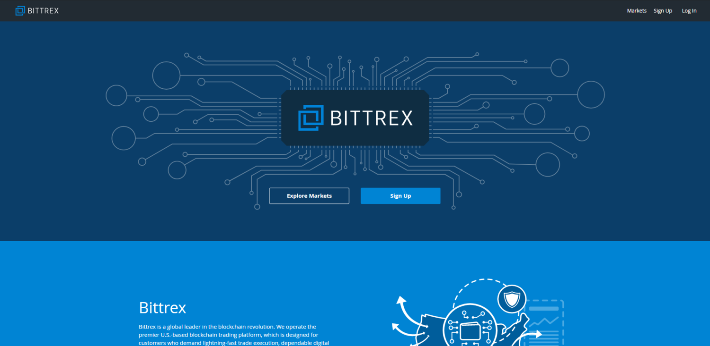

## Table of Contents

## What is Bittrex Exchange?

Bittrex is a cryptocurrency exchange where people can buy, sell, and trade different types of cryptocurrencies. It was started in 2014 by three people who used to work at Microsoft. Bittrex is known for being safe and secure, which is important because it helps protect users' money and information.

The exchange offers a lot of different cryptocurrencies, which means users have many choices for trading. It's also easy to use, even if you're new to trading. Bittrex has tools that help users keep track of their trades and make smart decisions. Overall, Bittrex is a popular choice for people who want to trade cryptocurrencies in a safe and user-friendly way.

## How do I sign up for a Bittrex account?

To sign up for a Bittrex account, go to their website and click on the "Sign Up" button. You'll need to enter your email address and create a strong password. Make sure your password is something only you know and is hard for others to guess. After you enter your email and password, you'll need to agree to Bittrex's terms of service. Once you do that, Bittrex will send you an email to confirm your email address. Click on the link in the email to finish the sign-up process.

After you confirm your email, you'll need to complete some extra steps to make sure your account is secure. Bittrex will ask you to set up two-[factor](/wiki/factor-investing) authentication (2FA), which adds another layer of security to your account. You can use an app like Google Authenticator or Authy for this. Once 2FA is set up, you'll need to verify your identity by uploading a photo of your ID and a selfie. This is to make sure you are who you say you are. After all these steps are done, your Bittrex account will be ready to use, and you can start trading cryptocurrencies.

## What are the fees associated with using Bittrex?

When you use Bittrex, you have to pay fees for trading and for taking money out of your account. The trading fee is different depending on if you are a maker or a taker. A maker adds a new order to the market, and they pay a fee of 0.35%. A taker takes an order that is already there, and they pay a fee of 0.35% too. But, if you trade a lot, you can get a discount on these fees. The more you trade, the less you pay.

For taking money out of your account, the fees change depending on what kind of [cryptocurrency](/wiki/cryptocurrency) you are taking out. Each type of cryptocurrency has its own fee. For example, taking out Bitcoin costs 0.0005 BTC, and taking out Ethereum costs 0.006 ETH. There are no fees for putting money into your account, which is good. It's important to check the fees for the specific cryptocurrency you are using because they can be different.

## How do I deposit and withdraw funds on Bittrex?

To deposit funds on Bittrex, first log into your account. Go to the "Holdings" section and find the cryptocurrency you want to deposit. Click on the "Deposit" button next to it. Bittrex will give you a unique address for that cryptocurrency. Copy this address and use it to send your cryptocurrency from your wallet or another exchange to your Bittrex account. Make sure you send the right cryptocurrency to the right address, or you could lose your money. It might take some time for the deposit to show up in your Bittrex account, depending on the cryptocurrency and the network it uses.

To withdraw funds from Bittrex, go to the "Holdings" section again and find the cryptocurrency you want to take out. Click on the "Withdraw" button next to it. You'll need to enter the address where you want to send the cryptocurrency and the amount you want to withdraw. Bittrex will show you the withdrawal fee for that cryptocurrency, so make sure you know how much it will cost. Double-check the address you entered because you can't undo a withdrawal once it's sent. After you confirm everything, Bittrex will process your withdrawal, and it will take some time to reach your wallet, depending on the cryptocurrency and the network.

## What types of cryptocurrencies does Bittrex support?

Bittrex supports a lot of different cryptocurrencies. Some of the most popular ones you can find on Bittrex are Bitcoin, Ethereum, and Litecoin. They also have many other cryptocurrencies like Ripple, Cardano, and Stellar. This means you have a lot of choices if you want to trade or invest in different types of digital money.

Bittrex keeps adding new cryptocurrencies all the time. This is good because it gives you more options to trade with. But, it's important to check the Bittrex website to see the full list of cryptocurrencies they support because it can change. They might add new ones or take away some that are not used much anymore.

## How does Bittrex ensure the security of user funds and data?

Bittrex works hard to keep your money and information safe. They use something called cold storage for most of the money on their platform. This means the money is kept offline, where hackers can't get to it easily. They also have a special team that watches for any strange activity all the time. This team helps stop any attacks before they can hurt users. Bittrex also makes sure that when you log in, you use two-factor authentication (2FA). This means you need more than just a password to get into your account, which makes it much harder for someone else to get in.

Another way Bittrex keeps things secure is by following strict rules and getting checked by outside companies. They make sure to follow all the laws about keeping money safe and stopping crime. Bittrex also lets users check their account activity to make sure everything looks right. If you see something strange, you can tell Bittrex right away. All these steps together help make sure your money and information stay safe on Bittrex.

## What are the trading options available on Bittrex?

Bittrex has different ways for you to trade cryptocurrencies. You can do simple trades where you swap one cryptocurrency for another. This is easy and good if you just want to change your money from one type to another. Bittrex also has something called limit orders. With limit orders, you can say what price you want to buy or sell at, and the trade will happen only if the price is right. This can help you get a better deal.

Another trading option on Bittrex is called stop orders. These are useful if you want to limit how much you might lose. You can set a stop order to sell your cryptocurrency if the price goes down to a certain level. This way, you don't have to watch the market all the time. Bittrex also has a feature called market orders, which let you buy or sell right away at the current price. This is good if you want to trade quickly. All these options make it easy for you to trade in the way that works best for you.

## How can I use the Bittrex mobile app?

To use the Bittrex mobile app, first download it from the Apple App Store or Google Play Store. Once you have the app on your phone, open it and log in with your Bittrex account. If you don't have an account yet, you can sign up right from the app. After logging in, you'll see a screen that shows your money and the different cryptocurrencies you can trade. You can tap on any cryptocurrency to see more details about it, like its price and how much you have.

The app makes it easy to trade. You can buy or sell cryptocurrencies by tapping on the "Trade" button. You can choose to do a quick trade at the current price or set a specific price you want to buy or sell at. The app also has charts and other tools to help you make good trading choices. If you need to add or take out money, you can do that too. Just go to the "Holdings" section, pick the cryptocurrency, and follow the steps to deposit or withdraw. The Bittrex mobile app makes trading on the go simple and safe.

## What are the key features that differentiate Bittrex from other exchanges?

Bittrex stands out from other exchanges because it focuses a lot on keeping your money safe. They use something called cold storage to keep most of the money offline, where it's hard for hackers to get to it. Bittrex also has a team that watches for any strange activity all the time, which helps stop attacks before they can hurt users. They make sure you use two-factor authentication (2FA) to log in, which adds another layer of security. Plus, Bittrex follows strict rules and gets checked by outside companies to make sure they're doing everything right. All these steps together make Bittrex a very safe place to trade.

Another thing that makes Bittrex different is the wide range of cryptocurrencies they support. You can trade popular ones like Bitcoin and Ethereum, but also many other types like Ripple and Cardano. This gives you a lot of choices if you want to trade or invest in different kinds of digital money. Bittrex also has a user-friendly mobile app, so you can trade on the go easily. They offer different ways to trade, like limit orders and stop orders, which can help you get better deals and limit how much you might lose. All these features make Bittrex a great choice for people who want to trade many types of cryptocurrencies in a safe and easy way.

## How does Bittrex comply with regulatory requirements?

Bittrex works hard to follow all the rules set by governments and other groups. They do this by checking who their users are, which is called Know Your Customer (KYC) rules. When you sign up for Bittrex, you have to give them a picture of your ID and a selfie. This helps them make sure you are who you say you are. Bittrex also follows rules about stopping money laundering and fraud. They watch for any strange activity and report it if they need to. This helps keep the platform safe and honest.

Bittrex also gets checked by outside companies to make sure they are following all the rules. These checks are called audits, and they help Bittrex show that they are doing things the right way. By following these rules, Bittrex makes sure that they are a trusted place for people to trade cryptocurrencies. This is important because it helps protect users and keeps the whole system fair and safe.

## What are the advanced trading features available on Bittrex?

Bittrex has some advanced trading features that can help you trade better. One of these is called limit orders. With limit orders, you can set the exact price you want to buy or sell a cryptocurrency. Your trade will only happen if the price is right. This can help you get a better deal than if you just traded at the current price. Another advanced feature is stop orders. These are useful if you want to limit how much you might lose. You can set a stop order to sell your cryptocurrency if the price goes down to a certain level. This way, you don't have to watch the market all the time.

Bittrex also has charts and other tools that can help you make smart trading choices. These tools show you how the price of a cryptocurrency is changing over time. You can look at these charts to see if the price is going up or down and decide when to buy or sell. Bittrex also has something called an API, which lets you use other programs to trade on Bittrex. This can be helpful if you want to trade a lot or use special trading strategies. All these advanced features make Bittrex a good choice for people who want to trade in a more detailed way.

## How can I optimize my trading strategy using Bittrex's tools and data?

To optimize your trading strategy on Bittrex, you can use their charts and tools to understand how prices are moving. Look at the price charts to see if a cryptocurrency is going up or down over time. This can help you decide when to buy or sell. You can also use the different order types like limit orders and stop orders. Limit orders let you set a specific price for buying or selling, which can help you get a better deal. Stop orders can protect you from losing too much money by selling your cryptocurrency if the price drops to a certain level.

Another way to improve your trading is by using Bittrex's API. The API lets you connect other programs to Bittrex, so you can trade more easily and use special trading strategies. If you trade a lot, you can also get discounts on fees, which can save you money. By watching the market closely and using these tools, you can make smarter trading choices and hopefully make more money.

## What are the fees and costs?

Bittrex operates with a maker/taker fee model, which is prevalent among cryptocurrency exchanges. This structure ensures that both market makers (who provide [liquidity](/wiki/liquidity-risk-premium)) and market takers (who consume liquidity) are charged fees, albeit at different rates. For Bittrex, the standard fee starts at 0.35% for both makers and takers. However, traders benefit from discounted rates as their trading [volume](/wiki/volume-trading-strategy) increases over a 30-day period.

This model not only incentivizes higher trading volumes but also provides traders with a clear and straightforward understanding of their transaction costs. By maintaining a transparent fee calculation method, Bittrex enables traders to more effectively manage their investment strategies and forecast expenses associated with frequent trading.

The fee reduction based on trading volume can be explained mathematically as follows. Suppose $v$ is the trading volume over the past 30 days. The fee $f$ as a function of $v$ can be represented as:

$$
f(v) = \begin{cases} 
0.35\% & \text{if } v < V_1 \\
0.25\% & \text{if } V_1 \leq v < V_2 \\
0.15\% & \text{if } V_2 \leq v \\
\end{cases}
$$

Here, $V_1$ and $V_2$ represent the thresholds at which the fee reductions occur. These thresholds are set by Bittrex and are available on their platform's fee schedule. This tiered approach encourages users to increase their trading activity, subsequently benefiting from lower fees, which is particularly advantageous for algorithmic traders who frequently execute large volumes of trades.

## References & Further Reading

[1]: ["Advances in Financial Machine Learning"](https://www.amazon.com/Advances-Financial-Machine-Learning-Marcos/dp/1119482089) by Marcos Lopez de Prado

[2]: ["Evidence-Based Technical Analysis: Applying the Scientific Method and Statistical Inference to Trading Signals"](https://www.amazon.com/Evidence-Based-Technical-Analysis-Scientific-Statistical/dp/0470008741) by David Aronson

[3]: ["Machine Learning for Algorithmic Trading"](https://github.com/stefan-jansen/machine-learning-for-trading) by Stefan Jansen

[4]: ["Quantitative Trading: How to Build Your Own Algorithmic Trading Business"](https://www.amazon.com/Quantitative-Trading-Build-Algorithmic-Business/dp/1119800064) by Ernest P. Chan

[5]: Bovaird, C. (2018). ["What is Algorithmic Trading, and What is It Used For?"](https://www.researchgate.net/publication/378548435_Algorithmic_Trading_and_AI_A_Review_of_Strategies_and_Market_Impact) Investopedia.

[6]: Cerchiello, P., & Giudici, P. (2016). ["Big Data analysis for financial risk management."](https://journalofbigdata.springeropen.com/articles/10.1186/s40537-016-0053-4) Journal of Banking & Finance.

[7]: Zohar, A., & Rosenthal, D. (2017). ["Bitcoin: An Innovative Alternative Digital Currency."](https://www.researchgate.net/publication/228199328_Bitcoin_An_Innovative_Alternative_Digital_Currency) Computer.

[8]: Favell, H. (2018). ["Cryptocurrency and Blockchain: An Introduction."](https://papers.ssrn.com/sol3/papers.cfm?abstract_id=3288059) Organisation for Economic Co-operation and Development.