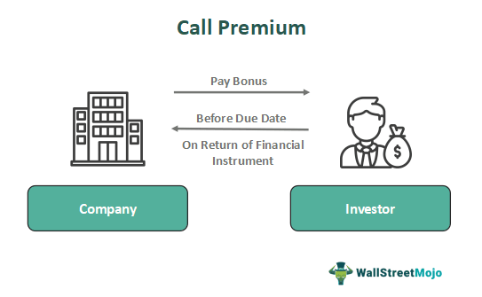

## Table of Contents

## What is a call premium?

A call premium is the price that an investor pays to buy a call option. A call option is a contract that gives the buyer the right, but not the obligation, to buy a stock at a certain price before a specific date. The premium is what the buyer pays to the seller for this right. It's like paying for a ticket that lets you buy a stock later if you want to.

The amount of the call premium depends on a few things. One is how much the stock's price is expected to go up. If people think the stock will go up a lot, the premium will be higher. Another thing is how long the option lasts. Longer time means more chance for the stock to move, so the premium might be higher. The premium also depends on how stable the stock's price is. If the stock's price jumps around a lot, the premium could be higher because it's riskier.

## How is a call premium calculated?

A call premium is figured out by looking at a few key things. The first thing is how much the stock's price is expected to go up, which is called the stock's volatility. If people think the stock will jump a lot, the call premium will be higher because there's a bigger chance the option will be worth something. The second thing is how long the option lasts before it expires. If the option lasts longer, the premium might be higher because there's more time for the stock to move in a good way.

Another thing that affects the call premium is the difference between the stock's current price and the price at which you can buy the stock with the option, called the strike price. If the stock's price is much lower than the strike price, the premium will be lower because it's less likely the option will be used. Also, interest rates and how much the stock pays in dividends can change the premium a bit. All these things together help decide what the call premium will be.

## What factors influence the price of a call premium?

Several things can change the price of a call premium. One important thing is how much the stock's price might go up or down, which we call [volatility](/wiki/volatility-trading-strategies). If the stock is expected to move a lot, the call premium will be higher because there's a bigger chance the option will be worth something. Another thing is how long the option lasts before it expires. If the option has more time left, the premium might be higher because there's more time for the stock to move in a good way.

The difference between the stock's current price and the price at which you can buy the stock with the option, called the strike price, also matters. If the stock's price is a lot lower than the strike price, the premium will be lower because it's less likely you'll use the option. Interest rates and how much the stock pays in dividends can also affect the premium a little bit. All these things together help decide what the call premium will be.

## What are the different types of call premiums?

There are a few different ways to talk about call premiums, but mostly they are split into two main types: in-the-money and out-of-the-money. An in-the-money call premium is when the stock's price is higher than the strike price of the option. This means if you use the option right away, you could buy the stock cheaper than it's selling for now. So, the premium for this type of option is usually higher because it already has some value.

On the other hand, an out-of-the-money call premium is when the stock's price is lower than the strike price. This means if you use the option right now, you would be buying the stock for more than its current price, so it doesn't have any immediate value. The premium for out-of-the-money options is usually lower because there's a chance the stock's price won't go up enough before the option expires. There's also a third type, at-the-money, where the stock's price is the same as the strike price, and the premium for this type is somewhere in between the other two.

## Can you explain the difference between American and European call premiums?

American and European call premiums are different because of how the options can be used. An American call option lets you buy the stock at any time before the option expires. This means if the stock's price goes up a lot, you can use the option right away and make some money. Because you have more chances to use the option, the premium for an American call option might be a bit higher than for a European one.

A European call option, on the other hand, only lets you buy the stock on the day the option expires. You can't use it before that day, even if the stock's price goes up a lot. This makes the European call option a bit less flexible, so the premium might be a little lower than for an American call option. The difference in premiums depends on how much the stock's price might change and how long you have to wait before using the option.

## What is the significance of the strike price in relation to call premiums?

The strike price is really important when we talk about call premiums. It's the price at which you can buy the stock if you use the call option. If the stock's price is higher than the strike price, we say the option is "in-the-money." This means if you use the option, you can buy the stock for less than it's worth now. So, the call premium for an in-the-money option will be higher because it already has some value.

On the other hand, if the stock's price is lower than the strike price, the option is "out-of-the-money." Using the option now would mean buying the stock for more than it's worth, so it doesn't have any immediate value. The call premium for an out-of-the-money option will be lower because there's a chance the stock's price won't go up enough before the option expires. The strike price helps decide how much the call premium will be, depending on how far away it is from the current stock price.

## How does the time to expiration affect the value of a call premium?

The time until a call option expires is a big deal when it comes to how much the call premium costs. If the option has a lot of time left before it expires, the premium will be higher. This is because there's more time for the stock's price to go up. The longer the time, the more chances the stock has to move in a good way for the option buyer. So, people are willing to pay more for an option that lasts longer.

On the other hand, if the option is close to expiring, the premium will be lower. There's less time for the stock's price to change a lot, so there's less chance for the option to become valuable. If the stock's price doesn't go up enough before the option expires, the option could end up being worthless. That's why options that are about to expire usually have lower premiums.

## What role does implied volatility play in determining call premium prices?

Implied volatility is a big deal when it comes to figuring out how much a call premium costs. It's like a guess about how much the stock's price might jump around in the future. If people think the stock will move a lot, the implied volatility goes up. This makes the call premium higher because there's a bigger chance the option will be worth something. It's like buying a ticket for a roller coaster that might go really fast – you'll pay more for that thrill.

On the other hand, if people think the stock will stay pretty steady, the implied volatility goes down. This means the call premium will be lower because there's less chance for big changes in the stock's price. It's like buying a ticket for a calm ride – it costs less because it's not as exciting. So, implied volatility helps decide how much you'll pay for a call option, based on how wild the stock's price might get.

## How can an investor use call premiums to hedge their portfolio?

An investor can use call premiums to hedge their portfolio by buying call options on stocks they already own. This can protect them if the stock's price goes down. For example, if an investor owns a stock that's worth $100, they might buy a call option with a strike price of $105. If the stock's price drops to $90, the investor loses money on the stock but can still use the call option to buy it at $105 if it goes up again. This way, the call premium acts like insurance, helping to limit losses.

Another way to use call premiums for hedging is by selling call options on stocks in the portfolio. This can bring in extra money that can help if the stock's price goes down. For example, if an investor sells a call option with a strike price of $110 on a stock they own, they get the premium right away. If the stock's price stays below $110, they keep the premium and the stock. But if the stock goes above $110, they have to sell it at that price. This strategy can help balance out any losses from the stock going down.

## What are the tax implications of trading call premiums?

When you trade call premiums, you need to think about taxes. If you make money from selling call options, that money is usually taxed as capital gains. How much tax you pay depends on how long you held the option. If you held it for a year or less, it's a short-term capital gain, and you'll pay your regular income tax rate on it. If you held it for more than a year, it's a long-term capital gain, and you'll pay a lower tax rate, usually between 0% and 20%, depending on your income.

If you lose money on call options, you can use those losses to lower your taxes. You can use these losses to reduce other capital gains you might have. If your losses are more than your gains, you can use up to $3,000 of those losses to lower your regular income. Any losses you can't use right away can be carried over to future years. It's a good idea to talk to a tax expert to make sure you're doing everything right and taking advantage of all the tax rules.

## How do market conditions impact the strategy for buying or selling call premiums?

Market conditions play a big role in deciding whether to buy or sell call premiums. If the market is going up and everyone is feeling good about stocks, you might want to buy call options. This is because there's a good chance the stock's price will keep going up, making your call option more valuable. On the other hand, if the market is shaky and people are worried, you might want to sell call options. By selling them, you get the premium right away, which can help if the stock's price goes down.

It's also important to think about how much the market might move around, which we call volatility. If the market is expected to be very volatile, call premiums will be higher because there's a bigger chance the stock's price will change a lot. This could be a good time to sell call options and collect those higher premiums. But if the market is calm and not expected to move much, call premiums will be lower, and it might be a better time to buy call options because they're cheaper.

## What advanced strategies involve the use of multiple call premiums?

One advanced strategy that uses multiple call premiums is called a call spread. This is when you buy one call option and sell another call option on the same stock but with different strike prices or expiration dates. For example, you might buy a call option with a strike price of $50 and sell a call option with a strike price of $60. This can help you make money if the stock's price goes up a bit, but it also limits how much you can lose if the stock's price doesn't move as much as you hoped. It's like betting on a small move in the stock's price while keeping your risk under control.

Another strategy is called a call ladder. This involves buying one call option and selling two or more call options with higher strike prices. For example, you could buy a call option with a strike price of $50, sell a call option with a strike price of $60, and sell another call option with a strike price of $70. This strategy can be useful if you think the stock's price will stay in a certain range. It lets you make money from the premiums of the options you sold, but it can also limit your gains if the stock's price goes way up. It's a way to make money in different market situations while managing your risk.

## What are Call Premiums and How Can They Be Understood?

Call premiums refer to the compensation an issuer provides to bondholders when a bond is redeemed before reaching its scheduled maturity. This financial mechanic is central to the structuring of callable bonds, which permit issuers the flexibility to refinance debt under favorable conditions. The call premium serves as an incentive for investors, offsetting the risk of potential loss in expected interest income due to the issuer's early redemption of the bond.

The call price of a bond is the total amount paid to investors upon early redemption, encompassing both the bond's face value and the additional call premium. The formula for calculating the call price (CP) can be represented as:

$$

CP = FV + P 
$$

where:
- $CP$ is the call price,
- $FV$ is the face value of the bond,
- $P$ is the call premium.

Typically, call premiums are most substantial near the issuance of the bond and generally decrease as the bond approaches its maturity. This is because issuers aim to offset the bondholder's loss of potential interest payments, a risk more pronounced when the bond is called early. For example, a bond redeemed during its initial call periods may include a higher premium compared to if it were called closer to its maturity date. Understanding these dynamics is vital for bond investors as they evaluate the overall yield offered by callable bonds.

Payments made above the bond's par value due to call premiums influence investors' decision-making. A potential early call can limit the price appreciation of the bond in the market, as prices tend to gravitate toward the call price, constraining upward movement even if interest rates decline. Consequently, callable bonds often come with higher yields compared to their non-callable counterparts, compensating investors for this embedded risk. Investors must thoroughly assess the size and schedule of call premiums and weigh them against the anticipated yield benefits when considering callable bonds as investment vehicles.

## References & Further Reading

[1]: ["The Handbook of Fixed Income Securities"](https://www.amazon.com/Handbook-Fixed-Income-Securities-Ninth/dp/1260473899) by Frank J. Fabozzi

[2]: ["Bond Markets, Analysis, and Strategies"](https://www.amazon.com/Bond-Markets-Analysis-Strategies-tenth/dp/026204627X) by Frank J. Fabozzi

[3]: ["Advanced Bond Portfolio Management: Best Practices in Modeling and Strategies"](https://www.wiley.com/en-us/Advanced+Bond+Portfolio+Management%3A+Best+Practices+in+Modeling+and+Strategies-p-9781119201151) by Frank J. Fabozzi

[4]: ["Fixed Income Analysis"](https://en.wikipedia.org/wiki/Fixed_income_analysis) by CFA Institute

[5]: ["Algorithmic Trading and DMA: An Introduction to Direct Access Trading Strategies"](https://archive.org/details/algorithmictradi0000john) by Barry Johnson 

[6]: ["Fixed Income Securities: Tools for Today's Markets"](https://www.amazon.com/Fixed-Income-Securities-Markets-Finance/dp/1119835550) by Bruce Tuckman

[7]: ["Handbook of Fixed-Income Securities"](https://www.mhebooklibrary.com/doi/book/10.1036/9781260473902?contentTab=true) by Pietro Veronesi

[8]: ["Machine Trading: Deploying Computer Algorithms to Conquer the Markets"](https://www.amazon.com/Machine-Trading-Deploying-Computer-Algorithms/dp/1119219604) by Ernest P. Chan