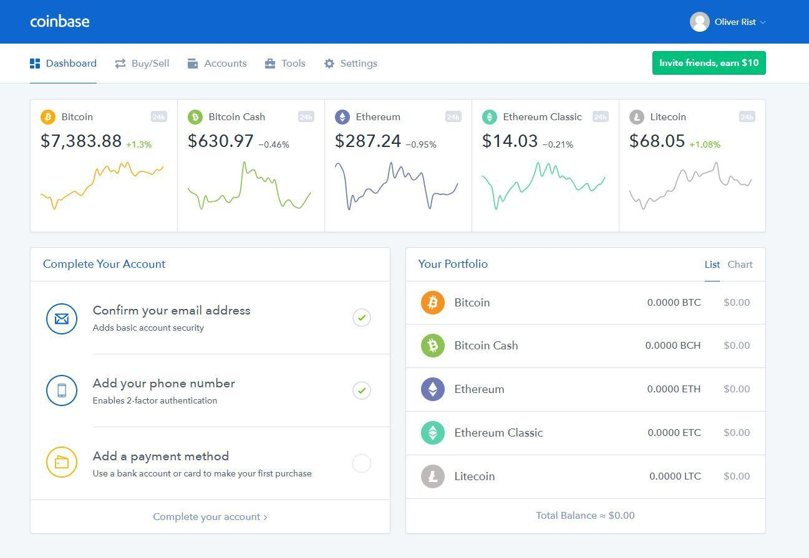

## Table of Contents

## What is Coinbase Wallet and what is its primary function?

Coinbase Wallet is a type of digital wallet that lets you store and manage different cryptocurrencies. It's like a digital version of a regular wallet, but instead of holding cash or cards, it holds your Bitcoin, Ethereum, and other digital currencies. You can use it on your phone or computer, and it's made by the same people who created the Coinbase exchange, which is a popular place to buy and sell cryptocurrencies.

The main job of Coinbase Wallet is to keep your cryptocurrencies safe and easy to use. It uses special technology to make sure that only you can access your money. You can send and receive cryptocurrencies with other people, and you can also use it to interact with apps and services that work with cryptocurrencies. It's designed to be simple and secure, so even if you're new to digital money, you can use it without any trouble.

## How do you set up a Coinbase Wallet for the first time?

To set up a Coinbase Wallet for the first time, start by downloading the Coinbase Wallet app from your phone's app store or by visiting the Coinbase Wallet website on your computer. Once you have the app or are on the website, you'll see a button that says "Get Started" or something similar. Click on it, and you'll be asked to create a new wallet. You'll need to enter your email address and create a strong password. Make sure your password is something only you know and is hard for others to guess.

After you've entered your email and password, the app will generate a special set of words called a "recovery phrase." This phrase is very important because it's the key to getting your money back if something happens to your phone or computer. Write down the recovery phrase and keep it in a safe place where no one else can find it. Don't store it on your phone or computer. Once you've written it down, you'll be asked to confirm the phrase by selecting the words in the right order. After you do that, your wallet is set up, and you can start using it to store and manage your cryptocurrencies.

## What are the key security features of Coinbase Wallet?

Coinbase Wallet has several important security features to keep your cryptocurrencies safe. One key feature is the use of a recovery phrase. This is a list of words that you write down when you set up your wallet. If you lose your phone or computer, you can use this phrase to get your money back. It's very important to keep this phrase secret and safe. Another feature is that Coinbase Wallet doesn't hold your money for you. Instead, you control your own money with private keys, which are like special codes that only you know. This means no one else can access your money without these codes.

Another important security feature is encryption. This means that all the information in your wallet is turned into a secret code that's hard for others to understand. When you send or receive money, this encryption helps keep your transactions private and secure. Coinbase Wallet also has a feature called biometric authentication. This means you can use your fingerprint or face to unlock your wallet, making it harder for someone else to get into your wallet if they get your phone. All these features work together to make sure your cryptocurrencies are safe and only you can use them.

## Can you explain how to send and receive cryptocurrencies using Coinbase Wallet?

To send cryptocurrencies using Coinbase Wallet, start by opening the app on your phone or the website on your computer. Once you're logged in, you'll see your list of cryptocurrencies. Tap or click on the [cryptocurrency](/wiki/cryptocurrency) you want to send. Then, look for a button that says "Send" and tap or click on it. You'll need to enter the recipient's wallet address, which is like their digital bank account number. Make sure you enter it correctly because if you make a mistake, you might lose your money. After entering the address, enter the amount you want to send. Double-check everything, then confirm the transaction. The app will ask you to use your fingerprint, face, or password to make sure it's really you sending the money.

To receive cryptocurrencies, open the Coinbase Wallet app or website and go to the list of your cryptocurrencies. Tap or click on the one you want to receive. Look for a button that says "Receive" and tap or click on it. The app will show you a special address that's like your digital bank account number. You can share this address with the person who wants to send you money. They'll need to enter this address in their wallet to send you the cryptocurrency. Once they send it, you'll see the money appear in your wallet. It's a good idea to double-check the address before sharing it to make sure you're receiving the right type of cryptocurrency.

## What types of cryptocurrencies does Coinbase Wallet support?

Coinbase Wallet supports a lot of different cryptocurrencies. Some of the most common ones you can use are Bitcoin, Ethereum, and Litecoin. These are popular choices that many people use. But Coinbase Wallet doesn't stop there. It also works with other cryptocurrencies like Bitcoin Cash, Ethereum Classic, and even some newer ones like Stellar Lumens and Ripple's XRP.

Besides these, Coinbase Wallet also supports many tokens that are built on top of other cryptocurrencies. For example, if you have Ethereum in your wallet, you can also hold and use tokens like USDC, DAI, and many others that run on the Ethereum network. This means you have a lot of options to choose from, depending on what you want to do with your digital money.

## How does Coinbase Wallet integrate with decentralized applications (dApps)?

Coinbase Wallet makes it easy for you to use decentralized applications, or dApps. These are special apps that run on blockchain networks like Ethereum. When you want to use a dApp, you can connect your Coinbase Wallet to it. This lets you interact with the app directly from your wallet. For example, if you want to play a blockchain-based game or use a decentralized finance app, you can do it all through your Coinbase Wallet without needing to move your money around.

The way it works is simple. When you open a dApp, it will ask you to connect your wallet. You just need to choose Coinbase Wallet from the list of options, and then use your fingerprint, face, or password to confirm. Once connected, you can use the dApp to send and receive tokens, play games, or do other things, all while keeping your money safe in your wallet. This makes it convenient and secure to explore the world of decentralized apps.

## What are the fees associated with using Coinbase Wallet?

Using Coinbase Wallet doesn't cost you anything just for having the wallet. You can store your cryptocurrencies in it for free. But, when you send or receive cryptocurrencies, there might be fees. These fees depend on the type of cryptocurrency you're using and the blockchain network it's on. For example, if you're sending Bitcoin, you'll need to pay a network fee, which goes to the people who help process the transaction on the Bitcoin network. These fees can change based on how busy the network is.

If you're using Coinbase Wallet to interact with decentralized apps or dApps, you might also have to pay for what's called "gas fees." These are fees you pay to use the Ethereum network, for example, when you're doing something like trading tokens or playing a blockchain game. The amount of these fees can go up or down depending on how many people are using the Ethereum network at that time. So, while Coinbase Wallet itself is free to use, the actions you take with your cryptocurrencies might come with costs.

## How can you backup and restore your Coinbase Wallet?

When you first set up your Coinbase Wallet, it gives you a special list of words called a recovery phrase. This is really important because it's like a secret key to your wallet. Write down this recovery phrase and keep it in a safe place where no one else can find it. Don't store it on your phone or computer. If something happens to your device, like it gets lost or broken, you can use this recovery phrase to get your money back. Just download the Coinbase Wallet app again, and when it asks if you have a recovery phrase, enter the words in the right order. This will restore your wallet, and you'll be able to see all your cryptocurrencies again.

If you ever need to move your Coinbase Wallet to a new phone or computer, the recovery phrase helps with that too. Just install the Coinbase Wallet app on your new device, and when it asks if you have a recovery phrase, enter the words you wrote down. This will bring back your wallet on the new device, just like it was on the old one. Remember, always keep your recovery phrase secret and safe, because if someone else gets it, they could take your money.

## What is the difference between Coinbase Wallet and Coinbase.com?

Coinbase Wallet and Coinbase.com are both made by the same company, but they do different things. Coinbase.com is like an online store where you can buy, sell, and trade cryptocurrencies. It's easy to use, and it holds your money for you, kind of like a bank. When you use Coinbase.com, you can easily turn your regular money into cryptocurrencies and back again. It's great if you're just starting out with digital money because it handles a lot of the complicated stuff for you.

On the other hand, Coinbase Wallet is more like a personal safe for your cryptocurrencies. It lets you keep your digital money in your own hands, not in a bank. You can use it to send and receive cryptocurrencies directly with other people, and it works with special apps called decentralized apps, or dApps. Coinbase Wallet gives you more control over your money, but it also means you're responsible for keeping it safe. So, while Coinbase.com is like a store and a bank, Coinbase Wallet is like your own private safe.

## How does Coinbase Wallet handle private keys and what are the implications for users?

Coinbase Wallet keeps your private keys safe and gives them to you when you set up your wallet. Private keys are special codes that let you control your cryptocurrencies. When you first use Coinbase Wallet, it gives you a recovery phrase, which is a list of words that you need to write down and keep secret. This recovery phrase is connected to your private keys. If you lose your phone or computer, you can use this phrase to get your money back. It's important to keep your private keys and recovery phrase safe because if someone else gets them, they could take your money.

Having control over your private keys means you have more freedom with your cryptocurrencies. You can send and receive money directly with other people and use special apps called decentralized apps, or dApps. But it also means you're responsible for keeping your money safe. If you lose your private keys or someone steals them, you might lose your money forever. So, while Coinbase Wallet gives you more control, it also requires you to be careful and protect your keys.

## What advanced features does Coinbase Wallet offer for experienced users?

Coinbase Wallet has some cool features for people who know a lot about cryptocurrencies. One of these is the ability to use different types of networks, like Ethereum and other blockchain networks. This means you can send and receive different kinds of cryptocurrencies and use special apps called decentralized apps, or dApps, that run on these networks. Experienced users can also use Coinbase Wallet to manage tokens that are built on top of other cryptocurrencies, like ERC-20 tokens on the Ethereum network. This gives them more options to play around with and use in different ways.

Another advanced feature is the ability to use hardware wallets with Coinbase Wallet. A hardware wallet is a special device that keeps your private keys super safe because it's not connected to the internet all the time. This makes it really hard for hackers to steal your money. Experienced users can connect their hardware wallets to Coinbase Wallet to make their cryptocurrencies even more secure. This way, they can still use all the features of Coinbase Wallet, like sending and receiving money and using dApps, but with an extra layer of protection.

## How can developers interact with Coinbase Wallet's API for custom integrations?

Developers can use Coinbase Wallet's API to make custom integrations that let them connect their apps or services with Coinbase Wallet. The API, which stands for Application Programming Interface, is like a set of tools that developers can use to talk to Coinbase Wallet. This means they can make it easier for people to send and receive cryptocurrencies, use decentralized apps, or do other things with their digital money right from their own apps. To use the API, developers need to sign up for a developer account on Coinbase's website and get special keys that let them connect to the API securely.

Once developers have their keys, they can start using the API to build features like sending and receiving transactions, checking wallet balances, and even working with decentralized apps. The API has a lot of different functions, so developers can do a lot of different things with it. They need to be careful, though, because working with cryptocurrencies means handling people's money, and it's important to keep everything safe and secure. By using Coinbase Wallet's API, developers can make their apps more useful and give people more ways to use their cryptocurrencies.

## References & Further Reading

[1]: ["Cryptoassets: The Innovative Investor's Guide to Bitcoin and Beyond"](https://www.amazon.com/Cryptoassets-Innovative-Investors-Bitcoin-Beyond/dp/1260026671) by Chris Burniske and Jack Tatar

[2]: Antonopoulos, A. M. (2017). ["Mastering Bitcoin: Unlocking Digital Cryptocurrencies"](https://books.google.com/books/about/Mastering_Bitcoin.html?id=IXmrBQAAQBAJ) O'Reilly Media.

[3]: ["Digital Gold: Bitcoin and the Inside Story of the Misfits and Millionaires Trying to Reinvent Money"](https://www.amazon.com/Digital-Gold-Bitcoin-Millionaires-Reinvent/dp/006236250X) by Nathaniel Popper

[4]: Narayanan, A., Bonneau, J., Felten, E., Miller, A., & Goldfeder, S. (2016). ["Bitcoin and Cryptocurrency Technologies: A Comprehensive Introduction"](https://press.princeton.edu/books/hardcover/9780691171692/bitcoin-and-cryptocurrency-technologies) Princeton University Press.

[5]: ["The Basics of Bitcoins and Blockchains: An Introduction to Cryptocurrencies and the Technology that Powers Them"](https://www.amazon.com/Basics-Bitcoins-Blockchains-Introduction-Cryptocurrencies/dp/1633538001) by Antony Lewis