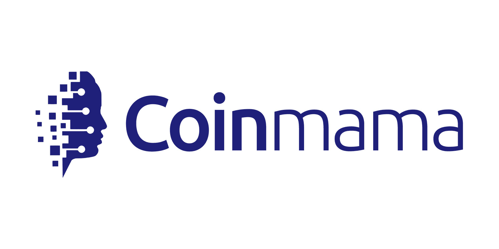

Cryptocurrency exchanges have become fundamental to the landscape of digital assets, offering platforms for the trading, buying, and selling of various digital currencies. Among these exchanges, Coinmama stands out for its simplicity and user-friendly nature, catering primarily to beginners entering the cryptocurrency market. Established in 2013 and headquartered in Ireland, Coinmama has positioned itself as a convenient gateway for those new to digital currency investment, focusing on ease of use and straightforward navigation.

This article will provide a detailed examination of Coinmama, including its core features, advantages, and disadvantages, as well as its significance in the context of algorithmic trading. Coinmama supports a limited range of cryptocurrencies, yet it maintains a strong emphasis on user security and customer support, making it an attractive option for entry-level users. As we explore these aspects, we will also consider the broader impact of Coinmama within the digital asset ecosystem, particularly in comparison to more complex exchanges.



## Table of Contents

## Overview of Coinmama

Coinmama is a cryptocurrency exchange that was founded in 2013, with its headquarters located in Ireland. The platform has made significant strides in the digital currency space by offering its services in over 190 countries, thereby providing a global reach for cryptocurrency enthusiasts. Coinmama allows users to buy and sell a select group of cryptocurrencies, most notably Bitcoin and Ethereum. This targeted offering ensures that the platform remains focused and maintains an uncomplicated user experience.

A distinguishing [factor](/wiki/factor-investing) of Coinmama is its straightforward and easy-to-use interface. Designed with simplicity in mind, the platform caters particularly to novice users who may find the world of cryptocurrencies daunting. By eliminating complexity, Coinmama enables users to transact effortlessly, making it an attractive choice for individuals new to cryptocurrency trading. 

The platform's design reflects its focus on accessibility and user-friendliness, prioritizing a seamless experience over a vast array of features. While this may result in fewer available options for seasoned traders, it strengthens Coinmama's position as a gateway for beginners entering the cryptocurrency market.

## Key Features of Coinmama

Coinmama is distinctly recognized for its user-friendly and straightforward interface, which makes it particularly appealing to beginners in the [cryptocurrency](/wiki/cryptocurrency) market. A key feature of Coinmama is its support for a variety of payment methods, enabling users to buy cryptocurrencies using credit cards, debit cards, bank transfers, and Apple Pay. This flexibility in payment options allows for a seamless purchasing process and caters to a wide demographic of users.

Another prominent feature of Coinmama is its approach to security. The platform does not provide a built-in cryptocurrency wallet. Instead, it requires users to transfer their purchased assets to personal wallets, reinforcing security by ensuring that users have direct control over their digital assets. This feature is crucial as it minimizes the risk associated with centralized storage of cryptocurrencies, commonly referred to as the "honeypot" risk, where centralized storage becomes a target for hackers.

Coinmama also rewards its users through a loyalty program designed to provide fee discounts based on transaction volumes. This program is tiered, with increased purchasing levels offering greater fee reductions. Such incentives not only encourage higher transaction volumes but also foster customer loyalty, making it financially beneficial for frequent users. 

In summary, Coinmama's key features revolve around a diverse range of payment options, a strong emphasis on security through the use of personal wallets, and a loyalty program that promotes and rewards high-[volume](/wiki/volume-trading-strategy) transactions. These elements contribute to its reputation as an accessible and secure platform for buying and selling cryptocurrency.

## Pros and Cons

Coinmama stands out for its user-friendly interface, making it an ideal choice for individuals new to cryptocurrency trading. The platform is designed to simplify the process of buying and selling cryptocurrencies, thus enhancing the overall user experience. Coinmama also provides quick account verification, which enables users to start trading without lengthy delays. Additionally, it offers high transaction limits compared to several other exchanges, allowing users to engage in substantial transactions with ease. Strong customer support further adds to its appeal, ensuring that users have access to assistance when needed.

Despite these advantages, Coinmama has certain limitations. The range of cryptocurrencies available on the platform is limited, which may not satisfy those looking to trade a diverse portfolio. Transaction fees on Coinmama tend to be relatively high, which could impact the profitability of frequent traders. Furthermore, the absence of a platform-provided crypto wallet means users must manage external wallets for their digital assets, adding a layer of complexity to the process. Lastly, Coinmama does not offer a mobile app, which might be inconvenient for users who prefer trading on the go.

## Algo Trading on Coinmama

Algorithmic trading, also known as algo trading, utilizes computer programs to execute a predefined set of instructions for initiating trades. These instructions are based on variables such as timing, price, and quantity, allowing trades to be placed at optimal conditions. Coinmama, known for its simplicity and user-friendly platform, does not offer inherent support for [algorithmic trading](/wiki/algorithmic-trading). However, its straightforward nature can still cater to traders who manage bots and automated systems externally.

Traders interested in employing algorithmic strategies with Coinmama may benefit from its uncomplicated user interface. By integrating external software or bots that can interact with the platform, these traders can potentially execute automated trades. Nevertheless, the current limited selection of cryptocurrencies on Coinmama could pose challenges for algo traders whose strategies require a broader range of assets. This restriction might hinder complex algorithmic models that seek to diversify across multiple cryptocurrencies.

For instance, Python, with its diverse library ecosystem like `ccxt` for connecting with exchanges or `pandas` for data manipulation, can be employed externally for algo trading. Here is a basic example of how an external script might look like when designed to interact with an exchange:

```python
import ccxt
import pandas as pd

# Initialize exchange (example using a different exchange since Coinmama API is not publicly documented)
exchange = ccxt.binance({
    'apiKey': 'YOUR_API_KEY',
    'secret': 'YOUR_SECRET',
})

# Fetch market data
def fetch_market_data(symbol):
    data = exchange.fetch_ohlcv(symbol, timeframe='1h')
    df = pd.DataFrame(data, columns=['timestamp', 'open', 'high', 'low', 'close', 'volume'])
    df['timestamp'] = pd.to_datetime(df['timestamp'], unit='ms')
    return df

# Example fetching market data for BTC/USDT
market_data = fetch_market_data('BTC/USDT')
print(market_data.head())
```

Although Coinmama may not directly facilitate algorithmic trading, traders who prefer a straightforward platform to conduct manual or semi-automated trading activities can benefit from its accessible features. However, algo traders who require a wider selection of cryptocurrencies for their strategies may need to consider other platforms that offer a broader market assortment.

## Security and Safety

Coinmama places a strong emphasis on user security by implementing comprehensive Know Your Customer (KYC) measures. This involves verifying the identity of users before allowing them to engage in transactions on the platform. KYC procedures are essential for preventing fraudulent activities and ensuring a secure trading environment. Additionally, Coinmama mitigates risks by not storing customer funds on its platform. Instead, users are required to transfer their assets to personal wallets, further safeguarding their crypto holdings from potential breaches.

In 2019, Coinmama experienced a security incident where customer data was compromised. However, no cryptocurrencies were lost due to the platform's policy of not holding users' funds. Following this incident, Coinmama has taken significant steps to strengthen its security protocols. These enhancements include more robust encryption methods and continuous monitoring to detect and respond to any suspicious activities swiftly. By prioritizing security measures and transparency, Coinmama continues to foster trust and confidence among its user base.

## Customer Service and Support

Coinmama has cultivated a commendable reputation for customer service, frequently recognized for its promptness and effectiveness on review platforms like Trustpilot. This positive feedback highlights Coinmama's commitment to addressing user inquiries and concerns swiftly, fostering a sense of trust and satisfaction among its users.

To facilitate communication, Coinmama provides multiple avenues for users to reach out to its support team. Customers can contact support via email, a preferred channel for detailed inquiries that may require document attachments or extensive explanations. Additionally, Coinmama maintains a comprehensive help center on its website, offering a wide range of articles and FAQs to guide users through common issues and questions, thereby empowering users to find solutions independently when possible.

Social media also plays a crucial role in Coinmama's support strategy. By maintaining active profiles on various social media platforms, Coinmama ensures that users can seek assistance via direct messaging or public comments, expanding the accessibility and immediacy of support. This multi-channel approach underscores Coinmama's dedication to user assistance, ensuring that help is readily available regardless of the user's preferred method of communication.

## Comparison with Other Exchanges

Coinmama distinguishes itself from many cryptocurrency exchanges through its simplicity and user-friendly design, especially appealing to beginners in the cryptocurrency world. Comparatively, exchanges like Coinbase offer a wider range of services and cryptocurrencies, making them more suitable for users seeking more comprehensive functionality. Coinbase, for instance, provides a variety of trading options, including a full-fledged marketplace where users can trade various cryptocurrencies and access advanced trading features.

However, the breadth of services offered by Coinbase can be overwhelming for new users unfamiliar with the complexities of cryptocurrency trading. Features like advanced order types, staking, and a dynamic marketplace can contribute to a steeper learning curve. This complexity may deter beginners who prioritize simplicity and quick access to purchasing cryptocurrencies, an area where Coinmama excels.

On the other hand, experienced traders may find Coinmama's lack of a trading market limiting. The absence of a marketplace means that users cannot engage in trading activities directly on the platform, such as spot trading or setting up limit orders. This limitation can be a significant drawback for those interested in active trading or implementing sophisticated trading strategies. Additionally, the limited cryptocurrency selection on Coinmama constrains users who desire a broader portfolio diversification beyond popular assets like Bitcoin and Ethereum.

For users interested in the security and simplicity of Coinmama but seeking additional functionalities, exchanges like Binance or Kraken may offer a middle ground. These platforms provide extensive trading features and support a wider array of cryptocurrencies, catering to both beginners and more advanced users. However, as with Coinbase, the increased functionalities can also complicate the user experience for those unfamiliar with such platforms.

Overall, Coinmama's primary strength lies in its straightforward approach to buying and selling cryptocurrencies, providing a clear and efficient user experience for newcomers. Nevertheless, users must weigh their preferences for simplicity against the need for broader trading functionalities and more diverse cryptocurrency options when choosing between Coinmama and other exchanges.

## Conclusion

Coinmama serves as an ideal platform for newcomers to the cryptocurrency market, largely due to its straightforward and user-friendly interface. This simplicity makes it particularly appealing to individuals who are new to digital currencies, as they can navigate the process of buying and selling cryptocurrencies without being overwhelmed by complex features or options. The platform's emphasis on ease of use is complemented by its robust security protocols, ensuring a safe environment for conducting transactions.

However, Coinmama's offerings may not fully satisfy the needs of more experienced traders or those engaged in algorithmic trading. The limited selection of cryptocurrencies available can be restrictive for traders seeking diversification or exposure to emerging crypto assets. Additionally, the absence of a dedicated trading marketplace within the platform limits opportunities for traders interested in leveraging market fluctuations for profit.

In summary, while Coinmama provides a secure and accessible entry point into the world of cryptocurrency, it might not meet the requirements of advanced traders or those looking to implement complex trading strategies. As such, prospective users should weigh these considerations alongside the platform's easy usability and strong security practices.

## Final Thoughts

Coinmama is recognized as a reliable platform, especially for those new to cryptocurrency trading. Its emphasis on security and user-friendly interface makes it an appealing choice for beginners in the cryptocurrency market. The platform's straightforward approach allows users to navigate easily without the complexities often associated with more advanced trading environments.

However, potential users need to consider certain factors before fully committing to Coinmama as their primary trading platform. One of the key considerations is the relatively higher transaction fees that Coinmama charges compared to some other exchanges. These fees can influence the overall cost of transactions, especially for frequent traders or those dealing in large volumes.

Additionally, the limited selection of cryptocurrencies available on Coinmama might be a disadvantage for traders looking to invest in a diverse portfolio of digital assets. Currently, Coinmama supports only a handful of major cryptocurrencies such as Bitcoin and Ethereum. This limitation could hinder users who wish to experiment with a broader range of lesser-known or emerging cryptocurrencies.

Given these aspects, prospective users should weigh the advantages of Coinmama's simplicity and security against its higher fees and limited cryptocurrency options. For those prioritizing ease of use and security, Coinmama presents a viable entry point into the world of cryptocurrency trading. However, users seeking more expansive trading functionalities and a wider array of assets might consider exploring additional platforms to complement their trading strategy.

## References & Further Reading

[1]: Narayanan, A., Bonneau, J., Felten, E., Miller, A., & Goldfeder, S. (2016). ["Bitcoin and Cryptocurrency Technologies: A Comprehensive Introduction"](https://press.princeton.edu/books/hardcover/9780691171692/bitcoin-and-cryptocurrency-technologies). Princeton University Press.

[2]: Chuen, D. L. K. (Ed.). (2015). ["Handbook of Digital Currency: Bitcoin, Innovation, Financial Instruments, and Big Data"](https://www.sciencedirect.com/book/9780128021170/handbook-of-digital-currency). Academic Press.

[3]: Antonopoulos, A. M., & Wood, G. (2018). ["Mastering Ethereum: Building Smart Contracts and DApps"](https://www.amazon.com/Mastering-Ethereum-Building-Smart-Contracts/dp/1491971940). O'Reilly Media.

[4]: Nakamoto, S. (2008). ["Bitcoin: A Peer-to-Peer Electronic Cash System"](https://nakamotoinstitute.org/library/bitcoin/).

[5]: Gandal, N., & Halaburda, H. (2014). ["Competition in the Cryptocurrency Market"](https://www.semanticscholar.org/paper/Competition-in-the-Cryptocurrency-Market-Halaburda-Gandal/bc9289eeabeb04437b5d9e469db132f28bb010ad). Econstor.