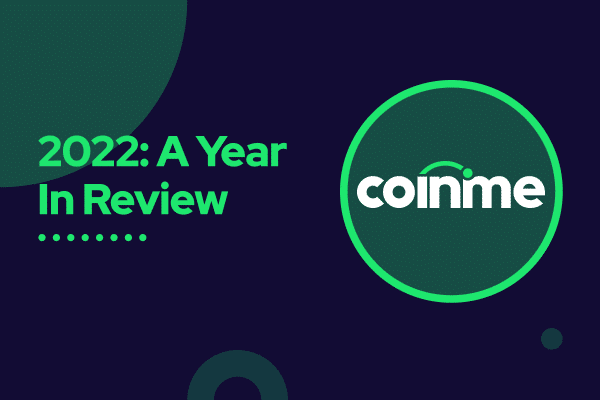

## Table of Contents

## What is Coinme and what services does it offer?

Coinme is a company that helps people buy and sell cryptocurrencies. It makes it easy for anyone to use digital money, even if they don't know much about it. Coinme works with many stores across the United States, so people can go to these stores to buy or sell cryptocurrencies.

Coinme offers a few main services. One is called Coinme Wallet, which is a safe place to keep your cryptocurrencies. You can use this wallet to send and receive digital money easily. Another service is their cash exchange, where you can trade your cash for cryptocurrencies at many locations, like at Coinstar kiosks in grocery stores. This makes it simple for people who want to use digital money but prefer dealing with cash.

## How does Coinme make cryptocurrency accessible to beginners?

Coinme makes cryptocurrency easy for beginners by letting them buy and sell digital money with cash at many stores. They have something called Coinstar kiosks in places like grocery stores, where people can go and use cash to get cryptocurrencies. This is helpful because not everyone knows how to use online platforms or feels comfortable with them. By using cash, it feels more familiar and less scary for people who are new to digital money.

Another way Coinme helps beginners is with their Coinme Wallet. This is a simple app where you can keep your cryptocurrencies safe. You don't need to be a tech expert to use it. The app is designed to be easy to understand, so anyone can send and receive digital money without feeling confused. By making the process simple and safe, Coinme helps more people feel confident about trying out cryptocurrencies.

## What are the steps to buy cryptocurrency using Coinme?

To buy cryptocurrency using Coinme, you first need to find a Coinstar kiosk near you. These kiosks are often in grocery stores or other places where you shop. Once you find a kiosk, you can go there with cash. At the kiosk, you'll see instructions on the screen that tell you what to do. You'll need to enter how much cash you want to spend and choose which cryptocurrency you want to buy, like Bitcoin or Ethereum. Then, you put your cash into the kiosk, and it will give you a receipt with a code on it.

After you get the receipt, you need to use the Coinme app on your phone. If you don't have the app yet, you can download it from the app store. Open the app and sign in or create a new account if you're new. Once you're logged in, go to the section where you can redeem your code. Enter the code from your receipt into the app. The app will then add the cryptocurrency you bought to your Coinme Wallet. Now you own the cryptocurrency and can keep it in your wallet or send it to someone else.

## Can you explain the fees associated with using Coinme services?

When you use Coinme to buy or sell cryptocurrency, you need to know about the fees. There are two main fees you might see. One is the transaction fee, which is a small amount of money that Coinme charges every time you buy or sell cryptocurrency. This fee helps cover the costs of making the transaction happen. The other fee is the network fee, which is what it costs to send the cryptocurrency over the internet. This fee can change depending on how busy the network is.

The exact amount of these fees can be different each time you use Coinme. The transaction fee is usually a percentage of the money you're spending or receiving. For example, if you're buying $100 worth of Bitcoin, Coinme might charge you a few dollars as a transaction fee. The network fee is harder to predict because it depends on the cryptocurrency you're using and how busy the network is at that moment. But Coinme will always show you the total cost, including all fees, before you finish your transaction, so you know exactly what you're paying.

## How does Coinme ensure the security of user transactions and data?

Coinme takes security very seriously to keep your transactions and data safe. They use strong encryption to protect your information when you use their app or website. Encryption is like a secret code that makes sure no one else can see your private stuff. Coinme also follows strict rules to make sure they are doing everything right and keeping your money safe. They have special teams that watch for anything strange or suspicious, so they can stop bad things from happening.

Another way Coinme keeps your transactions secure is by using something called two-factor authentication (2FA). This means that when you log into your account, you need to enter a special code sent to your phone. This makes it much harder for someone else to get into your account, even if they know your password. Plus, Coinme keeps most of the cryptocurrencies in special secure storage, which is like a super-safe vault. This way, even if something goes wrong, your money is still safe.

## What types of cryptocurrencies can be bought and sold through Coinme?

Coinme lets you buy and sell different kinds of cryptocurrencies. Some of the most popular ones you can use with Coinme are Bitcoin and Ethereum. These are well-known and many people use them.

Besides Bitcoin and Ethereum, Coinme also supports other cryptocurrencies like Litecoin and Bitcoin Cash. This gives you more choices if you want to try different types of digital money. Coinme makes it easy to pick the one that's right for you.

## How does Coinme's partnership with Coinstar affect its operations?

Coinme's partnership with Coinstar helps it reach more people by using Coinstar's kiosks in many stores. These kiosks let people buy cryptocurrencies with cash, which is easier for those who don't want to use online platforms. This partnership makes Coinme's services more available to everyone, especially beginners who feel more comfortable using cash.

Because of this partnership, Coinme can offer its services in places where people already go, like grocery stores. This makes it simple for people to try out cryptocurrencies without needing to go to a special place. It also helps Coinme grow its business by using Coinstar's network of kiosks across the country.

## What are the geographic locations where Coinme services are available?

Coinme services are available in many places across the United States. You can find their services in lots of states, like California, Texas, and New York. They work with stores like grocery shops and other places where people go every day.

Because Coinme partners with Coinstar, their services are easy to find at Coinstar kiosks. These kiosks are in many locations, so you can buy or sell cryptocurrencies with cash without needing to go to a special place. This makes it simple for anyone to use Coinme's services, no matter where they live in the U.S.

## How does Coinme comply with regulatory requirements in different regions?

Coinme makes sure to follow the rules in different places by working closely with the people who make the laws. They know that each state or region might have its own rules about buying and selling cryptocurrencies. So, Coinme checks these rules carefully and makes sure they do everything the right way. This means they might need to get special permissions or licenses to offer their services in certain areas.

To keep everything safe and legal, Coinme also uses special systems to watch for anything that might not be allowed. They have teams that look out for strange activities and make sure all transactions follow the rules. By doing this, Coinme helps make sure that people can trust their services and that they are doing business the right way, no matter where they are in the United States.

## What are the advantages of using Coinme compared to other cryptocurrency platforms?

One big advantage of using Coinme is how easy it is for beginners. Coinme lets you buy and sell cryptocurrencies with cash at many stores, thanks to their partnership with Coinstar. This makes it simple for people who might feel scared or confused about using online platforms. Instead of needing a computer or special app, you can just go to a store and use cash, which feels more familiar. Plus, Coinme's app, the Coinme Wallet, is designed to be easy to use, so you don't need to be a tech expert to keep your cryptocurrencies safe.

Another advantage is that Coinme is available in many places across the United States. Because they work with Coinstar, their services are in lots of grocery stores and other places where people go every day. This means you don't have to go out of your way to buy or sell cryptocurrencies. Coinme also makes sure to follow all the rules in different areas, so you can trust that they are doing things the right way. This focus on following the law and being easy to use makes Coinme a good choice for anyone looking to get into cryptocurrencies.

## Can you discuss any recent developments or future plans for Coinme?

Coinme has been working on making their services even better. They recently added more cryptocurrencies that you can buy and sell, like Litecoin and Bitcoin Cash. This gives people more choices when they want to use digital money. Coinme also made their app easier to use, so even if you're new to cryptocurrencies, you can figure it out quickly. They've been working hard to make sure their services are safe and follow all the rules, which helps people trust them more.

Looking ahead, Coinme wants to keep growing and reaching more people. They plan to add even more places where you can use their services, so it's easier for everyone to buy and sell cryptocurrencies. They're also thinking about new ways to make their app even better, like adding more features that help you manage your digital money. Coinme wants to keep making cryptocurrencies simple and safe for everyone, no matter where they live or how much they know about digital money.

## How does Coinme integrate with other financial systems or wallets?

Coinme makes it easy to use your cryptocurrencies with other financial systems and wallets. They have a special feature in their app called Coinme Wallet. This wallet lets you send and receive digital money easily. You can connect your Coinme Wallet to other wallets or financial apps, so you can move your cryptocurrencies around without any trouble. This is helpful if you want to use your digital money in different places or with different services.

Coinme also works with some banks and other financial services to make things even smoother. For example, you can use your bank account to add money to your Coinme Wallet or take money out. This makes it simple to go back and forth between regular money and cryptocurrencies. By working with other financial systems, Coinme helps you use your digital money in more ways, making it easier to manage your money all in one place.

## References & Further Reading

[1]: Bergstra, J., Bardenet, R., Bengio, Y., & Kégl, B. (2011). ["Algorithms for Hyper-Parameter Optimization."](https://dl.acm.org/doi/10.5555/2986459.2986743) Advances in Neural Information Processing Systems 24.

[2]: ["Advances in Financial Machine Learning"](https://www.amazon.com/Advances-Financial-Machine-Learning-Marcos/dp/1119482089) by Marcos Lopez de Prado

[3]: ["Evidence-Based Technical Analysis: Applying the Scientific Method and Statistical Inference to Trading Signals"](https://www.amazon.com/Evidence-Based-Technical-Analysis-Scientific-Statistical/dp/0470008741) by David Aronson

[4]: ["Machine Learning for Algorithmic Trading"](https://github.com/stefan-jansen/machine-learning-for-trading) by Stefan Jansen

[5]: ["Quantitative Trading: How to Build Your Own Algorithmic Trading Business"](https://www.amazon.com/Quantitative-Trading-Build-Algorithmic-Business/dp/1119800064) by Ernest P. Chan