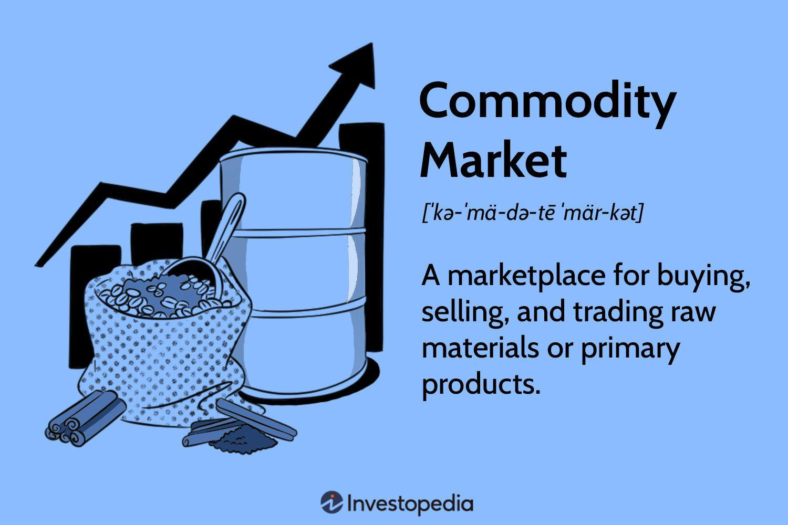

## Table of Contents

## What are commodities and why are they important in trading?

Commodities are basic goods that people use every day, like oil, gold, wheat, and coffee. They are traded on special markets where buyers and sellers come together to exchange these goods. Commodities are important because they are the raw materials that businesses need to make other products. For example, a bakery needs wheat to make bread, and a car manufacturer needs steel to build cars.

In trading, commodities are important because their prices can affect the economy. When the price of oil goes up, it can make everything more expensive because oil is used to transport goods. Traders watch commodity prices to predict how the economy might change. If they think the price of a commodity will go up, they might buy it now to sell it later for a profit. This buying and selling helps to set the prices of commodities, which in turn affects the prices of many other things we buy every day.

## What are the different types of commodities that can be traded?

Commodities that can be traded are divided into two main types: hard commodities and soft commodities. Hard commodities are things that come from the ground, like oil, natural gas, and metals like gold, silver, and copper. These are often used in industries and construction. Soft commodities, on the other hand, are things that are grown or raised, like wheat, corn, sugar, coffee, and livestock such as cattle and pigs. These are usually used in food and other products we use every day.

There is also another way to group commodities, which is by their use. Energy commodities, like oil and natural gas, are used to power our homes, cars, and factories. Metals, like gold and copper, are used in electronics, jewelry, and building. Agricultural commodities, like wheat and corn, are used to make food and feed animals. Each type of commodity has its own market where people buy and sell them, and the prices can change based on how much people want them and how much is available.

## How does the commodities market function and who are the key players?

The commodities market works a bit like a big store where people buy and sell things like oil, gold, and wheat. Instead of buying the actual thing, traders often buy and sell contracts that promise to deliver the commodity at a certain time in the future. These contracts are traded on special places called commodity exchanges, like the Chicago Mercantile Exchange or the New York Mercantile Exchange. The price of these contracts goes up and down based on how much people want the commodity and how much of it is available. If more people want it and there's not enough, the price goes up. If there's too much and not enough people want it, the price goes down.

The key players in the commodities market are producers, consumers, and traders. Producers are the people who grow or mine the commodities, like farmers who grow wheat or companies that drill for oil. Consumers are the people or companies that need the commodities to make other things, like bakeries that need wheat to make bread or car companies that need steel. Traders are people who buy and sell the commodity contracts, trying to make money by guessing if the price will go up or down. Sometimes, big investors like hedge funds and banks also play in the commodities market, trying to make money from the price changes.

## What are the basic steps to start trading commodities as a beginner?

To start trading commodities as a beginner, the first thing you need to do is learn about the different types of commodities and how they are traded. Commodities can be things like oil, gold, wheat, and coffee. They are traded on special markets called commodity exchanges. You can trade them by buying and selling contracts that promise to deliver the commodity at a certain time in the future. It's important to understand how these contracts work and how the prices of commodities can change based on how much people want them and how much is available.

Once you have a good understanding of commodities, the next step is to open an account with a broker that lets you trade commodities. A broker is like a middleman who helps you buy and sell the contracts. You'll need to put some money into your account to start trading. It's a good idea to start small and practice with a small amount of money until you get the hang of it. You can also use something called a demo account, which lets you practice trading without using real money. As you get more comfortable, you can start trading with more money and try different strategies to make a profit.

## What are futures contracts and how are they used in commodities trading?

Futures contracts are agreements to buy or sell a commodity at a certain price on a specific date in the future. They are used in commodities trading to help people manage the risk of price changes. For example, a farmer might use a futures contract to lock in a price for their wheat before they harvest it. This way, they know how much money they will get, even if the price of wheat goes down later. On the other hand, a bakery might use a futures contract to buy wheat at a set price, so they can plan their costs and avoid paying more if the price goes up.

In commodities trading, futures contracts are traded on special markets called commodity exchanges. Traders buy and sell these contracts, trying to make money by guessing if the price of the commodity will go up or down. If a trader thinks the price will go up, they might buy a futures contract now and sell it later for a profit. If they think the price will go down, they might sell a futures contract now and buy it back later at a lower price. This buying and selling helps set the prices of commodities, which can affect the economy and the prices of many things we use every day.

## What are the common strategies used by traders in the commodities market?

Traders in the commodities market use different strategies to make money. One common strategy is called [trend following](/wiki/trend-following). This means traders watch the prices of commodities to see if they are going up or down over time. If they see a trend, like the price of oil going up, they might buy a futures contract hoping to sell it later at a higher price. Another strategy is called spread trading. This is when traders buy and sell different futures contracts at the same time, trying to make money from the difference in their prices. For example, a trader might buy a contract for wheat to be delivered in March and sell a contract for wheat to be delivered in June, hoping to make money from the price difference between the two.

Another strategy traders use is called hedging. This is when they use futures contracts to protect themselves from price changes. For example, a farmer might sell a futures contract for their wheat to lock in a price before they harvest it. This way, they know how much money they will get, even if the price of wheat goes down later. A bakery might buy a futures contract for wheat to make sure they can buy it at a set price, so they don't have to pay more if the price goes up. Hedging helps traders and businesses manage risk and plan their costs better.

Some traders also use a strategy called [arbitrage](/wiki/arbitrage). This is when they buy a commodity in one market and sell it in another market where the price is higher. For example, if gold is cheaper in one country than another, a trader might buy it in the cheaper market and sell it in the more expensive market to make a profit. Arbitrage can be tricky because it requires quick action and good information about prices in different markets. But when done right, it can be a way to make money without taking a lot of risk.

## How do global economic factors influence commodity prices?

Global economic factors can have a big impact on commodity prices. One important [factor](/wiki/factor-investing) is the strength of different countries' currencies. If a country's currency gets stronger, it can make commodities cheaper for people in that country because they can buy more with their money. But it can make commodities more expensive for people in other countries because they need more of their money to buy the same amount. Another factor is how much people around the world want to buy things. If the economy is doing well and people are buying a lot, the demand for commodities like oil and metals can go up, which can push their prices higher. But if the economy is not doing well and people are not buying as much, the demand for commodities can go down, which can make their prices fall.

Another big factor is what's happening in the countries that produce a lot of commodities. If there's a problem like a war or a natural disaster in a country that produces a lot of oil, it can make less oil available, which can push the price up. Also, if a country decides to produce more of a commodity, like more wheat or more copper, it can make more of that commodity available, which can push the price down. Governments can also affect commodity prices with their policies. For example, if a government puts a tax on exporting a commodity, it can make that commodity more expensive for people in other countries. All these global economic factors can make commodity prices go up and down, which can affect the economy and the prices of many things we use every day.

## What role do commodity exchanges play and how do they operate?

Commodity exchanges are special places where people buy and sell commodities like oil, gold, and wheat. They help make trading easier and more organized. Instead of buying the actual commodity, traders usually buy and sell contracts that promise to deliver the commodity at a certain time in the future. These contracts are called futures contracts. The exchanges set rules for how these contracts can be traded, and they make sure everyone follows the rules. This helps keep the market fair and safe for everyone.

Commodity exchanges work by bringing together buyers and sellers from all over the world. They use computers and special software to match up people who want to buy with people who want to sell. The price of the contracts goes up and down based on how much people want the commodity and how much is available. If more people want it and there's not enough, the price goes up. If there's too much and not enough people want it, the price goes down. The exchanges also keep track of all the trades and make sure the contracts are delivered when they are supposed to be. This helps keep the market running smoothly and helps people trust that they will get what they paid for.

## How can one analyze commodity market trends and what tools are available?

To analyze commodity market trends, you need to look at different things like the prices of commodities over time, how much people want them, and how much is available. One way to do this is by using charts and graphs. These can show you if the price of a commodity is going up or down over time, which can help you see trends. Another way is to read reports and news about what's happening in the world that might affect commodity prices, like wars, natural disasters, or changes in government policies. You can also look at data about how much of a commodity is being produced and how much is being used, which can help you guess if the price might go up or down.

There are many tools available to help you analyze commodity market trends. One popular tool is technical analysis software, which uses math and charts to help you see patterns in the prices of commodities. This can help you make better guesses about where the prices might go next. Another tool is [fundamental analysis](/wiki/fundamental-analysis), which looks at the basic things that affect commodity prices, like how much is being produced and how much people want it. You can also use economic calendars and news feeds to keep up with what's happening in the world that might affect commodity prices. All these tools can help you make smarter decisions when you're trading commodities.

## What are the risks associated with commodities trading and how can they be managed?

Trading commodities can be risky because the prices can go up and down a lot. One big risk is called market risk. This is when the price of a commodity changes in a way you didn't expect. For example, if you buy a futures contract for oil hoping the price will go up, but it goes down instead, you could lose money. Another risk is called [liquidity](/wiki/liquidity-risk-premium) risk. This is when it's hard to buy or sell a commodity quickly because not enough people want to trade it. If you need to sell your contract fast but can't find a buyer, you might have to sell it for less than you wanted. There's also something called counterparty risk, which is when the person you're trading with can't pay you what they owe.

To manage these risks, traders use different strategies. One way is called diversification, which means not putting all your money into one commodity. If you spread your money across different commodities, a drop in one price might not hurt you as much. Another way is called hedging, which is using futures contracts to protect yourself from price changes. For example, if you're a farmer, you might sell a futures contract for your wheat to lock in a price before you harvest it. This way, you know how much money you'll get even if the price goes down later. You can also use something called stop-loss orders, which automatically sell your contract if the price drops to a certain level, helping you limit your losses. By using these strategies, you can make trading commodities less risky.

## What advanced trading techniques can experts use to gain an edge in commodities trading?

Experts in commodities trading often use advanced techniques to gain an edge in the market. One such technique is called [algorithmic trading](/wiki/algorithmic-trading), where they use computer programs to buy and sell commodities based on math formulas and patterns. These programs can look at a lot of data very quickly and make trades faster than a person could. This can help traders make money from small price changes that might be hard to spot without a computer. Another advanced technique is called options trading. Options are special contracts that give you the right, but not the obligation, to buy or sell a commodity at a certain price. Traders use options to make more complex bets on where they think the price of a commodity will go, which can help them make more money if they're right.

Another advanced technique experts use is called spread trading, where they buy and sell different futures contracts at the same time. This can help them make money from the difference in prices between the contracts. For example, a trader might buy a contract for wheat to be delivered in March and sell a contract for wheat to be delivered in June, hoping to make money from the price difference. Experts also use something called intermarket analysis, where they look at how different markets are connected. For example, they might look at how the price of oil affects the price of gasoline or how the price of gold affects the value of the dollar. By understanding these connections, they can make smarter trades and gain an edge in the market.

## How do regulations affect commodities trading and what compliance measures are necessary?

Regulations play a big role in commodities trading. They are rules made by governments and special organizations to make sure trading is fair and safe. These rules can affect how much you have to pay to trade, how much information you need to share, and how you can trade. For example, some regulations might limit how much of a commodity you can buy or sell at one time, to stop one person from controlling the market. Other rules might require you to report your trades to a special agency, so they can keep an eye on what's happening in the market. If you don't follow these rules, you could get in trouble and have to pay fines or even go to jail.

To comply with these regulations, traders need to take certain steps. First, they need to learn about the rules that apply to them. This might mean reading a lot of documents and maybe even hiring a lawyer to help them understand everything. Then, they need to set up systems to make sure they follow the rules. This could include keeping good records of their trades, reporting their trades on time, and making sure they don't trade more than they're allowed to. Sometimes, traders also need to get special licenses or permissions to trade certain commodities. By following these compliance measures, traders can avoid getting in trouble and keep trading smoothly.

## References & Further Reading

[1]: Bergstra, J., Bardenet, R., Bengio, Y., & Kégl, B. (2011). ["Algorithms for Hyper-Parameter Optimization."](https://papers.nips.cc/paper/4443-algorithms-for-hyper-parameter-optimization) Advances in Neural Information Processing Systems 24.

[2]: ["Advances in Financial Machine Learning"](https://www.amazon.com/Advances-Financial-Machine-Learning-Marcos/dp/1119482089) by Marcos Lopez de Prado

[3]: ["Evidence-Based Technical Analysis: Applying the Scientific Method and Statistical Inference to Trading Signals"](https://www.amazon.com/Evidence-Based-Technical-Analysis-Scientific-Statistical/dp/0470008741) by David Aronson

[4]: ["Machine Learning for Algorithmic Trading"](https://github.com/stefan-jansen/machine-learning-for-trading) by Stefan Jansen

[5]: ["Quantitative Trading: How to Build Your Own Algorithmic Trading Business"](https://www.amazon.com/Quantitative-Trading-Build-Algorithmic-Business/dp/1119800064) by Ernest P. Chan