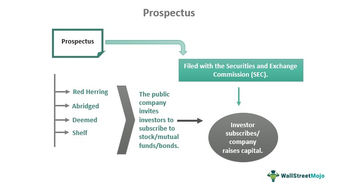

In the ever-evolving landscape of global finance, understanding key documents and strategies such as bonds prospectuses and algorithmic trading is crucial. A bond prospectus is a detailed document that lays the foundation for understanding an investment offering by providing essential information, such as interest rates, maturity dates, and issuer credibility. This is especially significant in the corporate bond market, where investors rely on such documents to make informed decisions, align investments with risk tolerance, and achieve financial objectives.

Simultaneously, algorithmic trading has emerged as a transformative force in modern markets. This form of trading leverages advanced computing algorithms to execute trades with unmatched speed and accuracy, optimizing investment outcomes by minimizing costs and exploiting market inefficiencies. The synergy between traditional financial documents and cutting-edge algorithmic strategies allows investors to craft a comprehensive investment approach that balances risk and return effectively.



This article explores the intricacies of bonds prospectuses, financial documents related to corporate bonds, and the rise of algorithmic trading. The objective is to provide insights into how these elements interact to form a cohesive investment strategy. Readers will gain an understanding of how to interpret financial documents and employ algorithmic trading to enhance investment performance. By integrating traditional financial analysis with innovative trading strategies, investors can achieve a well-rounded, strategic, and data-driven approach to investing in today's dynamic financial markets.

## Table of Contents

## Understanding Bonds Prospectuses

A bonds prospectus is an essential financial document that offers in-depth information about an investment offering, particularly focusing on bonds. It serves as a comprehensive guide for potential investors, encapsulating the necessary details that facilitate informed decision-making. The primary components of a bonds prospectus include data on interest payments, maturity dates, credit ratings, and call provisions. Each of these elements plays a crucial role in guiding investment decisions.

Interest payments, or coupon rates, outline the expected returns an investor will receive, typically expressed as a percentage of the bond's face value. These payments generally occur semi-annually, although the exact frequency may vary. Knowledge of the interest payments allows investors to calculate expected income over the lifespan of the bond.

The maturity date is another critical aspect, indicating when the bond will expire, and the principal will be repaid to the investor. The maturity date is essential for aligning bond investments with an investor's time horizon and cash flow needs. Bonds may be classified based on their maturity: short-term (less than three years), medium-term (three to ten years), or long-term (more than ten years).

Credit ratings are provided by rating agencies such as Standard & Poor's, Moody's, or Fitch Ratings. These ratings offer insights into the creditworthiness and default risk associated with the bond issuer. A higher rating implies a lower risk of default, which is often reflected in lower interest rates offered by the bond. Conversely, bonds with lower credit ratings might offer higher returns due to increased risk.

Call provisions give insight into the issuer's right to repay the bond before its maturity date. A callable bond allows the issuer to redeem the bond at a specified call price, potentially affecting the expected income stream for investors. Typically, bonds with call provisions offer higher interest rates to compensate investors for this uncertainty.

Regulatory bodies, such as the Securities and Exchange Commission (SEC) in the United States, mandate the preparation of bonds prospectuses. These regulations are meant to protect investors by ensuring they have access to all material information necessary for making sound investment decisions.

Investors can use a bonds prospectus to evaluate the credibility of the issuer and assess the viability of the bond as an investment. By examining the specific details offered within, investors can determine if a particular bond issuance aligns with their risk tolerance and investment objectives. A thorough understanding of bonds prospectuses allows investors to make strategic decisions that fit within their broader investment frameworks and financial goals.

## Key Financial Documents for Corporate Bonds

Financial documents such as balance sheets, income statements, and cash flow statements play a pivotal role in evaluating a company's financial health, particularly when assessing corporate bonds.

The **balance sheet** is integral for analyzing a company's financial stability. It provides a snapshot of the company's financial position at a specific point in time by detailing its assets, liabilities, and shareholders' equity. This document helps investors gauge how much a company owns (assets) versus how much it owes (liabilities), as well as the net worth attributable to shareholders. Using the basic accounting equation, Assets = Liabilities + Shareholders' Equity, investors can assess the leverage and equity cushion of the company, key indicators of financial soundness.

The **income statement** sheds light on a company's profitability over a specific accounting period by reporting revenue and expenses. This financial document reveals operating profits or losses, offering insights into the efficiency of the company's operations. For instance, the following formula succinctly captures the key elements of the income statement:

$$
\text{Net Income} = \text{Total Revenue} - \text{Total Expenses}
$$

This equation helps investors determine whether the company generates sufficient earnings relative to its operating costs, which is crucial for assessing its ability to meet bond obligations.

The **cash flow statement** is essential for understanding a company's [liquidity](/wiki/liquidity-risk-premium) and long-term solvency. It categorizes cash flows into three activities: operating, investing, and financing. By tracking the cash generated and used across these activities, investors can evaluate the company's ability to generate cash to meet debt servicing requirements and other obligations. For example, consistent positive cash flows from operating activities suggest robust core business performance, enhancing the company's bond repayment potential.

Together, these documents provide a comprehensive basis for assessing the risk and valuation of corporate bonds. Financial stability, profitability, and liquidity are critical factors in determining the likelihood of a company honoring its debt obligations. Consequently, investors analyze these documents to make informed decisions regarding bond investments, aligning selections with their risk tolerance and investment objectives.

## The Rise of Algorithmic Trading

Algorithmic trading employs computer algorithms to execute trades with extraordinary speed and precision, capabilities that significantly surpass those of human traders. This trading method has transformed financial markets by reducing transaction costs, enhancing market efficiency, and increasing liquidity. The fundamental advantage of [algorithmic trading](/wiki/algorithmic-trading) lies in its ability to analyze vast quantities of data and execute trades within fractions of a second, a feat impossible for human traders constrained by cognitive and physical limitations.

Reducing transaction costs is one of the primary benefits of algorithmic trading. By minimizing human intervention, these automated systems cut the overhead expenses associated with traditional trading, such as broker fees and opportunity costs due to slower execution times. Automated systems also allow for precise timing and rapid execution, capturing slight price discrepancies that manual trading might miss, thereby improving the profit margins.

The liquidity in markets has improved significantly with the advent of algorithmic trading. Algorithms often participate in [market making](/wiki/market-making)—a strategy involving the simultaneous buying and selling of securities to provide liquidity and narrow the bid-ask spreads, consequently stabilizing market prices. Moreover, high-frequency trading ([HFT](/wiki/high-frequency-trading-strategies)), a subset of algorithmic trading, exploits short-term market inefficiencies. HFT algorithms execute thousands of orders per second, capitalizing on small price movements, thus contributing to market depth and liquidity.

The late 20th century marked a pivotal shift with the adoption of electronic trading platforms, which facilitated the surge in algorithmic trading. These platforms provided the necessary infrastructure for implementing algorithms, democratizing access to market data and execution facilities. They enabled real-time pricing and immediate execution, critical for the success of algorithmic strategies.

Understanding the principles of algorithmic trading has become essential for modern investors aiming to remain competitive in global markets. Proficiency in mathematical models, statistical analysis, and programming, particularly in languages like Python, is becoming increasingly important. This coding expertise enables the development and optimization of algorithms that can process complex datasets and derive actionable trading signals.

Algorithmic trading strategies leverage various quantitative techniques. For instance, statistical [arbitrage](/wiki/arbitrage) involves identifying and exploiting relative price movements between securities, whereas [machine learning](/wiki/machine-learning) algorithms can dynamically adapt to market conditions, improving their predictive accuracy over time. Here’s a simple example of a moving average crossover strategy using Python:

```python
import pandas as pd

def moving_average_crossover(data, short_window, long_window):
    data['Short_MA'] = data['Close'].rolling(window=short_window, min_periods=1).mean()
    data['Long_MA'] = data['Close'].rolling(window=long_window, min_periods=1).mean()

    data['Signal'] = 0
    data['Signal'][short_window:] = \
        np.where(data['Short_MA'][short_window:] > data['Long_MA'][short_window:], 1, 0)
    data['Position'] = data['Signal'].diff()

    return data

# Example usage:
# stock_data = pd.read_csv('stock_prices.csv')
# signal_data = moving_average_crossover(stock_data, short_window=40, long_window=100)
```

In this example, a buy signal is generated when the short-term moving average crosses above the long-term moving average, indicating a potential upward trend in the price of a security.

As algorithmic trading continues to evolve, it reshapes the landscape of financial markets. Considering the speed and precision it offers, along with its data-driven nature, staying conversant with these innovations is imperative for investors and financial institutions alike.

## Integration: Bonds Prospectuses, Financial Documents, and Algo Trading

Combining insights from bonds prospectuses, financial documents, and algorithmic trading strategies yields a comprehensive approach to modern investment strategies. Bonds prospectuses provide crucial details about the terms and conditions of bond offerings, including interest rates, maturities, and credit ratings. These elements help algorithmic traders tailor their strategies by aligning investment goals with risk profiles. For instance, an understanding of credit ratings can assist in calibrating risk-taking algorithms to optimize returns while minimizing exposure to default risk.

Algorithmic trading leverages financial statements to extract quantitative data that informs trading models. Balance sheets, income statements, and cash flow statements offer metrics such as asset-to-liability ratios, profit margins, and liquidity indicators. These metrics support the creation of trading algorithms that adjust their strategies according to market conditions. For example, a Python script can be employed to parse financial statement data, allowing for real-time adjustments to trading positions based on liquidity metrics. Here is a simple Python example that demonstrates extracting and using financial ratios for trading decisions:

```python
import pandas as pd

# Sample financial data
data = {
    'Assets': [500, 700],
    'Liabilities': [300, 400],
    'Profit': [100, 150],
}

df = pd.DataFrame(data)

# Calculate financial ratios
df['Asset_to_Liability'] = df['Assets'] / df['Liabilities']
df['Profit_Margin'] = df['Profit'] / df['Assets']

# Trading strategy based on financial thresholds
def trading_decision(row):
    if row['Asset_to_Liability'] > 1.5 and row['Profit_Margin'] > 0.15:
        return 'Buy'
    elif row['Asset_to_Liability'] < 1.2 or row['Profit_Margin'] < 0.1:
        return 'Sell'
    return 'Hold'

df['Decision'] = df.apply(trading_decision, axis=1)

print(df[['Asset_to_Liability', 'Profit_Margin', 'Decision']])
```

The integration of traditional financial analysis with algorithmic execution fosters robust investment strategies. As financial analysis provides a factual basis through detailed financial statement metrics, algorithmic execution swiftly carries out transactions with precision. This synthesis allows for timely and strategic investment decisions, essential in today's fast-moving markets.

The synergy between these components — bonds prospectuses, financial documents, and algorithmic trading — enhances the adaptability and effectiveness of investment approaches. By grounding algorithmic models in thorough financial analysis, traders are better equipped to navigate market [volatility](/wiki/volatility-trading-strategies) and achieve informed, strategic investment choices. This methodology is foundational to success amid the complexities and rapid pace of modern financial markets.

## Challenges and Considerations

Navigating the legal and regulatory landscapes is essential for compliance both in the preparation of bond prospectuses and the execution of algorithmic trading. Legal frameworks, such as those enforced by the U.S. Securities and Exchange Commission (SEC) or the European Securities and Markets Authority (ESMA), mandate transparency and standardized disclosures to protect investors. Inaccuracies in prospectus disclosures can lead to significant legal repercussions for issuers and misinform investors, thereby affecting investment decisions and market integrity.

Algorithmic trading further introduces its own set of challenges, particularly regarding market volatility and ethical considerations. The rapid execution of trades by algorithms can lead to unintended consequences like flash crashes, which are sudden, severe market movements. Market participants must establish robust risk management systems to mitigate such risks. Ethical considerations in algorithmic trading also focus on maintaining market fairness and stability, ensuring that speed advantages do not result in manipulative practices that can harm the broader market.

Data privacy and security remain critical as vast amounts of financial data underpin algorithmic trading decisions. Protecting this data from unauthorized access is vital to maintaining trust in financial systems. There is an ongoing requirement for financial institutions to adopt state-of-the-art cybersecurity measures to protect sensitive information from potential breaches.

Effective risk management strategies must include the development of comprehensive compliance programs that incorporate regulatory requirements and best practices. Transparency in disclosures and algorithmic strategies fosters trust among investors and regulators. Moreover, adhering to ethical standards ensures that market efficiency does not compromise market integrity or fairness.

These challenges require continuous adaptation to new regulations, market conditions, and technological advancements. Successful navigation involves an integrated approach that emphasizes compliance, transparency, and ethical practices in both document preparation and algorithmic execution.

## Conclusion

Mastery of bonds prospectuses, financial documents, and algorithmic trading strategies is indispensable for investors aiming for success in today's complex financial markets. Prospectuses are critical as they provide comprehensive information necessary for evaluating potential investments, offering insights into the issuer's creditworthiness, maturity dates, and other contract stipulations that impact investment decisions. This ensures that investors can make informed choices aligning with their individual risk tolerance and investment objectives.

Financial statements, such as balance sheets, income statements, and cash flow statements, play a pivotal role in the valuation and risk assessment of corporate bonds. These documents illuminate a company's financial health, operational performance, and liquidity, aiding investors in distinguishing between viable and high-risk bond issuances. A robust understanding of these statements empowers investors to determine the intrinsic value of bonds and their associated risk profile.

Algorithmic trading, with its capacity for rapid, data-driven decision-making, continues to redefine market execution through its inherent speed and precision. The implementation of computer algorithms in trading processes capitalizes on market inefficiencies and reduces transaction costs, improving overall market liquidity. This technological advancement necessitates that investors equip themselves with the requisite skills to design and deploy effective algorithmic strategies.

As the financial landscape continuously evolves, investors must remain agile, embracing ongoing learning and adaptation. This commitment to education and technological competence ensures that investment choices are both strategic and data-driven, maximizing returns while mitigating risks. A harmonious integration of traditional financial analysis with cutting-edge trading methodologies is paramount in achieving sustained investment success.

## References & Further Reading

[1]: Harvard Business School. (2017). ["Bond Markets: Analysis and Strategies"](https://books.google.com/books/about/Bond_Markets_Analysis_and_Strategies_ten.html?id=bQpNEAAAQBAJ) by Frank J. Fabozzi

[2]: Northcott, C. (2002). ["Globalization and the Regulation of International Finance"](https://archive.org/details/globalizationits0002stig) Bank of Canada Review, Winter 2002-2003.

[3]: AlgoTrader. ["How Algorithmic Trading Is Changing The Financial Market."](https://medium.com/the-investors-handbook/the-rise-of-algorithmic-trading-how-tech-is-transforming-wall-street-d7667c6e0c1f)

[4]: ["Corporate Bonds: Structure and Analysis"](https://www.amazon.com/Corporate-Bonds-Structure-Richard-Wilson/dp/1883249074) by Richard C. Wilson and Frank J. Fabozzi

[5]: Treleaven, P., Galas, M., & Vidhi, C. (2013). ["Algorithmic Trading Review."](https://dl.acm.org/doi/10.1145/2500117) Communications of the ACM, 56(11).