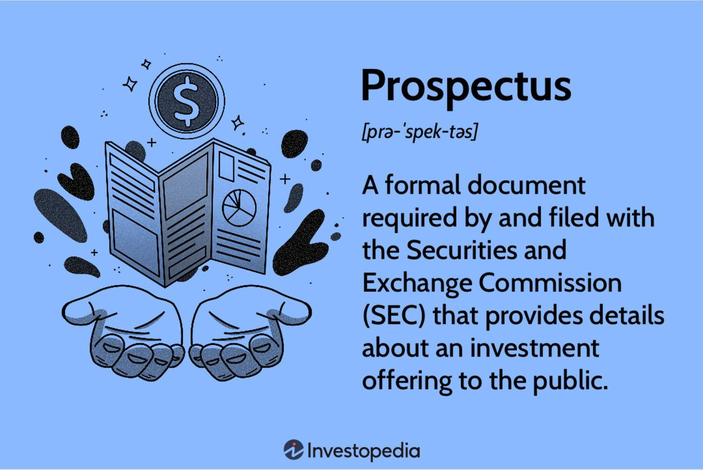

## Table of Contents

## What is a corporate bond?

A corporate bond is like a loan that a company takes from investors. Instead of borrowing money from a bank, the company borrows it from people who buy their bonds. In return, the company promises to pay back the money with interest over a certain period of time. This interest is usually paid to the bondholders every six months until the bond reaches its maturity date, which is when the company pays back the full amount of the loan.

Corporate bonds are a way for companies to raise money to grow their business or pay for big projects. They can be safer than stocks because bondholders get paid before shareholders if the company has financial trouble. However, they are riskier than government bonds because companies can go bankrupt. Because of this, corporate bonds usually offer higher interest rates to attract investors.

## What is a prospectus in the context of corporate bonds?

A prospectus is like a detailed guide that a company gives to people who might want to buy their corporate bonds. It's a big document that explains everything about the bond, like how much money the company wants to borrow, the interest rate they will pay, and when they will pay back the money. It also tells you about the company itself, like what they do, how they are doing financially, and any risks that might affect their ability to pay back the bond.

The prospectus is really important because it helps investors make smart choices. It's like a map that shows you all the important details so you can decide if buying the bond is a good idea for you. By law, companies have to be honest in their prospectus and include all the important information that could affect an investor's decision. This way, everyone has a fair chance to understand what they are getting into before they buy the bond.

## Why is a prospectus important for investors?

A prospectus is important for investors because it gives them all the information they need to make a good decision about buying a corporate bond. It tells them about the bond itself, like how much money the company wants to borrow, the [interest rate](/wiki/interest-rate-trading-strategies) they will pay, and when they will pay back the money. This helps investors understand exactly what they are getting into and what they can expect to earn from the bond.

The prospectus also tells investors about the company issuing the bond. It explains what the company does, how well it is doing financially, and any risks that might affect its ability to pay back the bond. This is really helpful because it lets investors see if the company is stable and trustworthy. By reading the prospectus, investors can decide if the bond is a safe and smart investment for them.

## What are the key components of a corporate bond prospectus?

A corporate bond prospectus has several important parts that help investors understand the bond and the company. One key part is the description of the bond itself. This includes how much money the company wants to borrow, the interest rate they will pay, and when they will pay back the money. It also tells you how often the company will pay interest, usually every six months, and the date when the bond will mature, which is when the company has to pay back the full amount.

Another important part is information about the company issuing the bond. This section explains what the company does, how it is doing financially, and any big risks that might affect its ability to pay back the bond. It's like a report card that shows if the company is doing well or if there are problems that could make it hard for them to keep their promise to pay back the bond.

The prospectus also includes legal and financial details that are important for investors. This can include things like the terms and conditions of the bond, any special rights that bondholders have, and how the bond can be bought or sold. There might also be information about the underwriters, who help the company sell the bonds, and any fees or costs that come with the bond. All these parts together give investors a clear picture of what they are getting into when they buy the bond.

## How does the prospectus describe the issuer's financial health?

The prospectus describes the issuer's financial health by giving a detailed look at the company's financial statements. These statements include things like the balance sheet, which shows what the company owns and owes, the income statement, which shows how much money the company made and spent, and the cash flow statement, which shows how money moves in and out of the company. By looking at these, investors can see if the company is making money, if it has enough cash to pay its bills, and if it is growing or shrinking.

The prospectus also talks about any financial risks that could affect the company's ability to pay back the bond. This might include things like debts the company already has, how much money it needs to keep running, and any big changes happening in the industry that could hurt the company's business. By explaining these risks, the prospectus helps investors understand if the company is in a good position to keep its promise to pay back the bond, or if there are problems that could make it hard for them to do so.

## What information about the bond terms is included in the prospectus?

The prospectus tells you all about the bond terms in a way that's easy to understand. It explains how much money the company wants to borrow with the bond, which is called the principal. It also tells you the interest rate the company will pay, which is how much extra money you'll get for lending them your money. The prospectus also says when the company will start paying interest and how often they'll do it, usually every six months. Plus, it tells you the maturity date, which is when the company promises to pay back all the money they borrowed.

The prospectus also includes other important details about the bond. It explains if the bond can be paid back early, called a call option, or if you can get your money back before the maturity date, called a put option. It also tells you about any special rights you have as a bondholder, like if you get paid before other people if the company has money problems. The prospectus might also talk about how the bond can be bought or sold, and any fees or costs that come with it. All this information helps you know exactly what you're getting into when you buy the bond.

## How does the prospectus address the risks associated with the bond?

The prospectus talks about the risks of the bond in a way that's easy to understand. It explains that there are things that could make it hard for the company to pay back the bond. These risks might be about the company itself, like if it has a lot of debt or if it's not making enough money. The prospectus also talks about risks that come from outside the company, like changes in the economy or new laws that could hurt the company's business. By explaining these risks, the prospectus helps you see if the bond is a safe investment or if there are problems that could make it risky.

The prospectus also tells you about specific risks that come with the bond itself. For example, if the bond can be paid back early, it might affect how much money you make. Or if the bond's interest rate can change, it could mean you get more or less money than you expected. The prospectus explains all these details so you know what could go wrong and how it might affect your investment. This way, you can decide if the bond is worth the risk for you.

## What legal and regulatory disclosures are required in a prospectus?

A prospectus has to follow certain rules set by the government to make sure it tells the truth and gives all the important information to investors. It needs to include things like the company's financial statements, which show how much money the company has and owes. It also has to explain any risks that could affect the company's ability to pay back the bond, like if the company has a lot of debt or if there are changes in the economy. The prospectus also needs to tell you about the bond itself, like the interest rate and when the company will pay back the money. This helps investors make smart choices based on all the facts.

The prospectus also has to talk about any special rights that bondholders have, like if they get paid before other people if the company has money problems. It needs to explain if the bond can be paid back early or if you can get your money back before the bond matures. The prospectus also has to mention any fees or costs that come with the bond, and who is helping the company sell the bonds, called underwriters. By including all these details, the prospectus makes sure that investors have all the information they need to understand the bond and the risks that come with it.

## How can investors use the information in a prospectus to make investment decisions?

Investors can use the information in a prospectus to make smart choices about buying a corporate bond. The prospectus tells them how much money the company wants to borrow, the interest rate they will get, and when the company will pay back the money. By looking at these details, investors can figure out if the bond will give them a good return on their investment. They can also see if the bond's terms, like when interest is paid and if the bond can be paid back early, fit with their own plans and needs.

The prospectus also gives investors a clear picture of the company's financial health. It shows the company's financial statements, like how much money they make and spend, and any big risks that could affect their ability to pay back the bond. By understanding these risks, investors can decide if the bond is a safe investment or if there are too many problems that could make it risky. This helps them weigh the potential rewards against the risks and make a decision that's right for them.

## What are the differences between a preliminary and a final prospectus?

A preliminary prospectus, also known as a red herring prospectus, is like a first draft that a company gives to investors before the bond is officially sold. It gives a lot of important information about the bond and the company, but some details might still change. For example, it might not have the final interest rate or the exact amount of money the company wants to borrow. The preliminary prospectus helps investors get a good idea of what the bond will be like, but they can't buy the bond yet. It's a way for the company to show what they're planning and for investors to start thinking about if they want to invest.

A final prospectus, on the other hand, is the complete and official document that a company gives to investors when the bond is ready to be sold. It has all the final details, like the exact interest rate and the total amount of money the company is borrowing. Once the final prospectus is out, investors can use it to make their final decision about buying the bond. The final prospectus is very important because it's the last chance for investors to get all the information they need before they invest their money.

## How have digital technologies impacted the distribution and accessibility of prospectuses?

Digital technologies have made it a lot easier for companies to share prospectuses with investors. Before, companies had to print and mail out big paper documents, which took a lot of time and money. Now, they can just put the prospectus on their website or send it out by email. This means investors can get the information much faster and it's easier for companies to reach more people. Plus, digital prospectuses can be updated quickly if anything changes, so investors always have the latest information.

Digital tools also make it simpler for investors to find and read prospectuses. They can search online for the prospectus they need and read it on their computer or phone, no matter where they are. This makes it easier for people to learn about different investment options and compare them. Digital prospectuses often have features like search functions and links that help investors find the information they need quickly. This can make the whole process of choosing an investment easier and more convenient.

## What advanced analytical techniques can be applied to the data in a prospectus for expert-level investment analysis?

Expert investors can use advanced analytical techniques to dig deeper into the data in a prospectus. One way is to use financial modeling to predict how the bond will perform in different situations. They can create models that look at things like interest rates, economic conditions, and the company's financial health to see how these factors might affect the bond's value. Another technique is to use data analytics to spot patterns and trends in the company's financial statements. By looking at these patterns, investors can better understand the company's past performance and make guesses about its future.

Another useful technique is to apply risk analysis to understand the potential dangers of investing in the bond. This involves looking at the risks mentioned in the prospectus and using statistical methods to figure out how likely they are to happen and how bad they could be. Investors can also use scenario analysis to see how the bond would do in different situations, like if the economy gets worse or if the company faces new competition. By combining all these techniques, expert investors can get a clearer picture of the bond's potential rewards and risks, helping them make smarter investment decisions.

## What are the key financial documents for corporate bonds?

Financial documents such as balance sheets, income statements, and cash flow statements play a pivotal role in evaluating a company's financial health, particularly when assessing corporate bonds.

The **balance sheet** is integral for analyzing a company's financial stability. It provides a snapshot of the company's financial position at a specific point in time by detailing its assets, liabilities, and shareholders' equity. This document helps investors gauge how much a company owns (assets) versus how much it owes (liabilities), as well as the net worth attributable to shareholders. Using the basic accounting equation, Assets = Liabilities + Shareholders' Equity, investors can assess the leverage and equity cushion of the company, key indicators of financial soundness.

The **income statement** sheds light on a company's profitability over a specific accounting period by reporting revenue and expenses. This financial document reveals operating profits or losses, offering insights into the efficiency of the company's operations. For instance, the following formula succinctly captures the key elements of the income statement:

$$
\text{Net Income} = \text{Total Revenue} - \text{Total Expenses}
$$

This equation helps investors determine whether the company generates sufficient earnings relative to its operating costs, which is crucial for assessing its ability to meet bond obligations.

The **cash flow statement** is essential for understanding a company's [liquidity](/wiki/liquidity-risk-premium) and long-term solvency. It categorizes cash flows into three activities: operating, investing, and financing. By tracking the cash generated and used across these activities, investors can evaluate the company's ability to generate cash to meet debt servicing requirements and other obligations. For example, consistent positive cash flows from operating activities suggest robust core business performance, enhancing the company's bond repayment potential.

Together, these documents provide a comprehensive basis for assessing the risk and valuation of corporate bonds. Financial stability, profitability, and liquidity are critical factors in determining the likelihood of a company honoring its debt obligations. Consequently, investors analyze these documents to make informed decisions regarding bond investments, aligning selections with their risk tolerance and investment objectives.

## References & Further Reading

[1]: Harvard Business School. (2017). ["Bond Markets: Analysis and Strategies"](https://books.google.com/books/about/Bond_Markets_Analysis_and_Strategies_ten.html?id=bQpNEAAAQBAJ) by Frank J. Fabozzi

[2]: Northcott, C. (2002). ["Globalization and the Regulation of International Finance"](https://archive.org/details/globalizationits0002stig) Bank of Canada Review, Winter 2002-2003.

[3]: AlgoTrader. ["How Algorithmic Trading Is Changing The Financial Market."](https://medium.com/the-investors-handbook/the-rise-of-algorithmic-trading-how-tech-is-transforming-wall-street-d7667c6e0c1f)

[4]: ["Corporate Bonds: Structure and Analysis"](https://www.amazon.com/Corporate-Bonds-Structure-Richard-Wilson/dp/1883249074) by Richard C. Wilson and Frank J. Fabozzi

[5]: Treleaven, P., Galas, M., & Vidhi, C. (2013). ["Algorithmic Trading Review."](https://dl.acm.org/doi/10.1145/2500117) Communications of the ACM, 56(11).