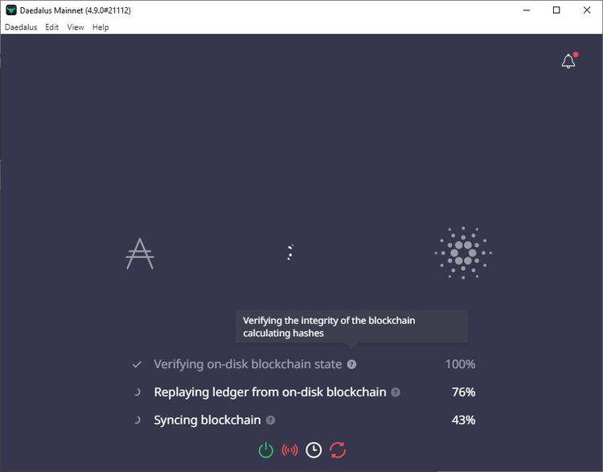

In cryptocurrency, Cardano has emerged as a significant player with its unique blockchain architecture. As a proof-of-stake blockchain platform, Cardano distinguishes itself by prioritizing security, scalability, and sustainability. Its innovative approach integrates peer-reviewed academic research into its design practices, presenting a robust framework for decentralized applications and financial services. Cardano's native cryptocurrency, ADA, has become a focal point for many investors who seek secure and efficient storage solutions.

The Daedalus Wallet steps in as an open-source wallet specifically designed for ADA. Created by Input Output Global, Daedalus is a full-node wallet, meaning it downloads the entire Cardano blockchain to the user's computer, thus ensuring a trustless operation. This feature provides maximum security by independently validating all transactions, offering an unmatched level of transparency and reliability. The wallet supports various functionalities such as multiple account management, customizable user interface themes, and comprehensive desktop compatibility, appealing to a wide range of Cardano enthusiasts.



This article examines the key features, advantages, and limitations of the Daedalus Wallet, and looks into algorithmic trading strategies that could benefit ADA enthusiasts. Algorithmic trading in cryptocurrencies involves using mathematical models and computer algorithms to make trading decisions, leveraging market patterns and volatility. This approach can optimize trading efficiency and execution, providing investors with tools to enhance their trading strategies.

Understanding the functionalities provided by a robust wallet like Daedalus, alongside the potential that algorithmic trading offers, equips investors with the necessary knowledge to make informed decisions in their crypto journey. This combination of secure storage and efficient trading practices can significantly enhance an investor's experience, allowing them to navigate the complexities of the cryptocurrency market with confidence.

## Table of Contents

## What is Daedalus Wallet?

Daedalus is an open-source, full-node wallet developed by Input Output Global (IOG) specifically for use within the Cardano blockchain ecosystem. Its design prioritizes heightened security and trustless operation by downloading and storing the complete history of the Cardano blockchain on the user's device. This extensive data synchronization distinguishes Daedalus from light wallets, which rely on third-party servers for blockchain data, thus enhancing security by enabling the wallet to independently verify all transactions within the network.

The wallet supports multiple accounts, offering users the flexibility to manage different wallets and addresses under a single interface. Daedalus stands out with its customizable user interface themes, allowing users to tailor the visual appearance to their preferences, which enhances user experience. The software is compatible with various desktop operating systems, including Windows, macOS, and Linux, ensuring broad accessibility for users.

As an open-source software, Daedalus allows the community to contribute to its development, fostering an environment of transparency and continuous improvement. The availability of its source code ensures that it can be independently reviewed, verifying security and functionality. Users and developers are encouraged to participate in its ongoing enhancement, thereby benefiting from collective innovation and robust oversight. 

The open nature of Daedalus also means that users can audit the software's code, which enhances confidence in its security protocols and provides insight into future updates and functionality. Furthermore, as a full-node wallet, Daedalus contributes to the decentralization of the Cardano network by enabling users to participate as nodes, further embedding the principles of blockchain technology in its architecture.

## Key Features of Daedalus Wallet

Daedalus Wallet is known for its comprehensive set of features that cater to Cardano users, ensuring security, flexibility, and user customization. One of the most prominent features of Daedalus is its full node functionality. Unlike light wallets, Daedalus downloads the entire Cardano blockchain and independently validates each transaction. This process ensures maximal security since the user's trust isn't reliant on third-party servers or services. By hosting a complete blockchain node, users contribute to the network's decentralization and integrity, reinforcing Cardano's foundational principles.

Another core feature is Daedalus' staking capabilities. The wallet allows users to stake their Cardano-native [cryptocurrency](/wiki/cryptocurrency), ADA, directly within the wallet interface. Staking is a process where ADA holders participate in the network's proof-of-stake consensus by delegating their ADA to a stake pool, thereby [earning](/wiki/earning-announcement) rewards. This not only provides a potential yield for users but also secures the network. The ease of staking within Daedalus makes it an attractive option for users looking to passively increase their holdings.

Daedalus also supports Hierarchical Deterministic (HD) wallets, which facilitate the management of multiple wallets through a single seed phrase. This structure aids users in maintaining efficient backups and restorations, thereby preventing loss of access to funds in case of software or hardware mishaps. The HD wallet feature allows users to manage various addresses and accounts within the same interface, offering a streamlined approach to cryptocurrency management.

Personalization of the user interface is another feature Daedalus offers, catering to user preferences with multiple themes. This ability to customize the look and feel of the wallet interface enhances the user experience, ensuring that users can interact with the software in a visually appealing and comfortable manner. Such personalization features are significant in user interface design, fostering engagement and satisfaction by enabling users to tailor their environment according to their aesthetic preferences.

These features collectively make Daedalus Wallet a robust choice for ADA holders, combining high-level security measures with user-friendly design and functionality.

## Challenges of Using Daedalus Wallet

Daedalus Wallet, while offering substantial security and functionality for Cardano users, presents certain challenges that potential and current users should be aware of. One of the primary challenges is its resource-intensive nature. As a full-node wallet, Daedalus requires downloading and storing a complete copy of the Cardano blockchain. This feature ensures high security by validating transactions independently, but it also demands considerable storage space on users' devices. Consequently, this can result in long synchronization times, which can be inconvenient for users who need swift access to their funds or frequent updates on the blockchain status.

Another limitation of Daedalus Wallet is its support exclusively for the Cardano blockchain. This exclusivity means that users who engage with multiple cryptocurrencies must rely on additional wallets to manage their diverse holdings. For investors who prefer a more streamlined approach, maintaining separate wallets for different cryptocurrencies could be less than ideal and might deter those seeking an all-in-one wallet solution.

Additionally, Daedalus currently lacks a mobile application, which could significantly hinder users who require access to their wallets while on the move. The absence of mobile support implies that users must have access to a desktop computer to manage their ADA holdings, which may not always be convenient or feasible. In a rapidly evolving digital age where mobile accessibility is crucial, this limitation could pose a considerable drawback, particularly for users who prioritize flexibility and easy access to their digital assets.

## Algorithmic Trading in Cryptocurrency

Algorithmic trading in cryptocurrency refers to the use of advanced algorithms to execute trading orders automatically based on predefined criteria. This method enhances trading efficiency, enabling investors to execute trades with speed and precision unattainable through manual processes.

### Benefits of Algorithmic Trading

The rise of [algorithmic trading](/wiki/algorithmic-trading) in the cryptocurrency space is primarily due to the market's inherent [volatility](/wiki/volatility-trading-strategies). Cryptocurrencies experience rapid price changes, often providing opportunities for profit through timely market entry and [exit](/wiki/exit-strategy). By automating this process, algorithmic trading allows investors to capitalize on these fluctuations, executing trades at optimal prices with minimal human intervention.

### How it Works

Algorithmic trading systems employ mathematical models and statistical techniques to analyze market data and recognize trading signals. When these signals meet specific criteria, the algorithm triggers a buy or sell order. These criteria can range from simple conditions, such as moving average crossovers, to complex strategies incorporating [machine learning](/wiki/machine-learning) and [artificial intelligence](/wiki/ai-artificial-intelligence). 

For instance, a basic algorithmic trading strategy might involve:

```python
def moving_average(prices, window_size):
    return sum(prices[-window_size:]) / window_size

prices = [ ... ]  # Example cryptocurrency price data
short_window = 5
long_window = 20

if moving_average(prices, short_window) > moving_average(prices, long_window):
    print("Buy Signal")
else:
    print("Sell Signal")
```

### API Integrations and Trading Bots

API integrations play a crucial role in enabling algorithmic trading in cryptocurrencies. They allow trading algorithms to communicate with exchanges, executing trades automatically based on real-time data. Trading bots, which are scripts or applications that perform autonomous trading operations, are commonly used to implement these strategies, leveraging APIs to interact directly with various cryptocurrency exchanges.

Platforms such as Binance and Coinbase Pro offer comprehensive API documentation, allowing developers to build sophisticated trading systems tailored to their strategies. Additionally, there are numerous pre-built trading bots available in the market, such as 3Commas and HaasOnline, that offer user-friendly interfaces for managing automated trading strategies.

### Conclusion

Algorithmic trading represents a significant advancement in how cryptocurrency markets are navigated. By employing automated strategies through powerful algorithms and leveraging API integrations, investors can enhance their trading efficiency and potentially increase profitability in the dynamic crypto market.

## Combining Daedalus Wallet and Algo Trading

While Daedalus Wallet doesn't directly facilitate trading operations, it serves as a robust and secure storage solution for ADA, enabling users to safeguard their assets acquired through various trading strategies. For investors keen on algorithmic trading for ADA, this presents a strategic advantage.

Algorithmic trading leverages computer programs to execute trades based on predefined criteria swiftly and efficiently. In the context of ADA, investors can employ trading platforms that support API connections, enabling these automated strategies to interact seamlessly with the exchange's [order book](/wiki/order-book-trading-strategies). Such platforms can identify patterns, trends, and signals, executing trades at optimal times, often beyond the capacity of manual trading efforts.

Daedalus Wallet plays a vital role in this setup by providing a secure repository for ADA tokens. After ADA is acquired through algorithmic trading, it can be transferred to Daedalus for enhanced security. This reduces the risk associated with leaving assets on exchanges, which can be vulnerable to hacking and other security threats.

For technical setup, investors could consider utilizing popular algo trading frameworks and libraries that support cryptocurrency trading. Python, with its extensive financial libraries and APIs, is commonly used. An illustration of such implementation might look as follows:

```python
import ccxt  # A popular library for cryptocurrency trading

# Initialize exchange - replace 'binance' with preferred exchange
exchange = ccxt.binance({
    'apiKey': 'YOUR_API_KEY',
    'secret': 'YOUR_SECRET',
})

# Fetch balance
balance = exchange.fetch_balance()
print('ADA Balance:', balance['ADA'])

# Example of placing a market order
symbol = 'ADA/USDT'
order = exchange.create_market_buy_order(symbol, 10)  # Buying 10 ADA
print('Market Order:', order)
```

Upon executing trading strategies, ADA can be consolidated into a secure address managed by Daedalus Wallet. This dual setup allows investors to maintain an efficient trading operation while ensuring the utmost security in asset storage. By combining the security of Daedalus with the precision and speed of algorithmic trading, investors can enhance their trading activities, align their strategies with market movements, and preserve their holdings with confidence.

## Conclusion

Daedalus Wallet stands out as a highly secure and effective wallet option for Cardano users, despite some limitations. Its full-node setup provides unparalleled security by validating all transactions independently. This advantage is particularly relevant in the ever-evolving landscape of cryptocurrency, where security concerns are paramount. However, the wallet's resource-intensive nature and exclusive focus on Cardano may limit its appeal to users who engage with multiple cryptocurrencies and require more versatile solutions. Additionally, the absence of a mobile application can hinder accessibility.

As Cardano continues to gain [momentum](/wiki/momentum), understanding and leveraging tools like Daedalus, in conjunction with exploring algorithmic trading, could significantly enhance the overall investor experience. Algorithmic trading offers the potential to capitalize on market movements with precision and speed, which can be pivotal for trading success in the volatile crypto market. Although Daedalus does not directly support trading functionalities, its role as a secure storage solution for ADA remains crucial. Investors can store ADA securely in Daedalus while using algorithmic trading platforms capable of API integration to execute trades.

Careful consideration of one's trading goals and storage preferences is essential in the dynamic cryptocurrency environment. Selecting the appropriate tools that align with individual strategies and security needs ensures a more streamlined and effective trading experience. Whether focusing solely on storage security with Daedalus or integrating algorithmic trading, the choices made will impact the success of one's cryptocurrency endeavors.

## References & Further Reading

[1]: ["Cardano: Secure Blockchain Protocols Underlying the Ouroboros Consensus"](https://cardano.org/ouroboros/) - IOHK Technical Papers.

[2]: ["Daedalus Wallet Overview"](https://daedaluswallet.io/) by Input Output Global.

[3]: Marcos Lopez de Prado. ["Advances in Financial Machine Learning,"](https://www.amazon.com/Advances-Financial-Machine-Learning-Marcos/dp/1119482089) Wiley.

[4]: David Aronson. ["Evidence-Based Technical Analysis: Applying the Scientific Method and Statistical Inference to Trading Signals,"](https://www.amazon.com/Evidence-Based-Technical-Analysis-Scientific-Statistical/dp/0470008741) Wiley.

[5]: Stefan Jansen. ["Machine Learning for Algorithmic Trading: Predictive Models to Extract Signals from Market and Alternative Data for Systematic Trading Strategies with Python,"](https://www.amazon.com/Machine-Learning-Algorithmic-Trading-alternative/dp/1839217715) Packt Publishing.

[6]: ["Algorithmic Trading & DMA: An Introduction to Direct Access Trading Strategies"](https://archive.org/details/algorithmictradi0000john) by Barry Johnson.