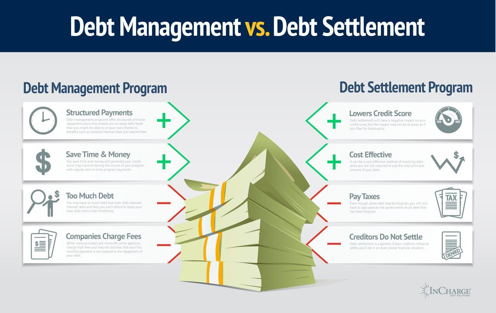

In the rapidly evolving financial landscape, effective debt management, sound financial solutions, and the strategic utilization of algorithmic trading have become essential components for ensuring financial stability. These elements, individually and collectively, hold the potential to enhance not only the financial health of individuals but also the overall economic resilience of businesses. Traditional financial strategies, when integrated with cutting-edge technologies like algorithmic trading, pave the way for innovative approaches to financial planning and management.

Debt management is crucial in handling existing financial obligations effectively. It encompasses a range of strategies aimed at minimizing the risk of insolvency, thereby safeguarding both personal and corporate financial health. Financial stability can be further reinforced by exploring comprehensive financial solutions that include savings and investment strategies tailored to prepare for future uncertainties and opportunities. Leveraging a diversified investment portfolio helps in spreading risk and ensuring a steady return over time, thereby contributing to long-term financial security.



Simultaneously, the emergence of algorithmic trading as a key player in modern finance offers unprecedented opportunities for growth. By using sophisticated algorithms, this technology allows for the automation of trading processes, enhancing efficiency and speed while removing emotional biases from trading decisions. This paradigm shift towards technology-driven finance reflects a broader trend of integrating innovative tools into traditional financial frameworks.

This article will provide insights into how individuals and businesses can optimize their financial strategies by combining the essentials of debt management, exploring varied financial solutions, and embracing algorithmic trading. By aligning traditional and contemporary approaches, a robust framework for achieving financial stability and growth can be established. Through a detailed examination, we aim to equip readers with the knowledge necessary to navigate the complexities of modern finance successfully.

## Table of Contents

## Understanding Debt Management

Debt management encompasses a range of strategies designed to manage debt effectively, both for individuals and businesses, in order to minimize the risk of insolvency. Effective debt management is crucial in maintaining financial stability and opening up opportunities for growth and investment.

One fundamental strategy in debt management is budgeting. Budgeting involves creating a detailed plan that outlines income and expenses, helping individuals and organizations allocate resources efficiently. By tracking spending and ensuring that expenses do not exceed income, budgeting helps prevent the accumulation of excessive debt and makes it easier to manage existing debts.

Another important strategy is debt consolidation. Debt consolidation involves merging multiple debts into a single loan, often with a lower [interest rate](/wiki/interest-rate-trading-strategies). This can simplify repayment schedules and reduce the overall cost of borrowing. For instance, consider multiple credit card debts aggregated into a single personal loan that offers a lower interest rate. By doing so, debt consolidation not only streamlines debt management but also potentially lowers monthly payments.

Negotiating better terms with creditors is also a key aspect of debt management. This strategy may involve working with creditors to lower interest rates, extend payment terms, or settle debts for less than the full amount owed. Negotiation requires communication and the presentation of a clear financial plan, which demonstrates to creditors the viability of adjusted repayment terms. Such negotiations can ease financial burdens and facilitate debt repayment.

Effective debt management lays the groundwork for improved financial health. By reducing debt and reorganizing repayment structures, individuals and businesses can improve cash flow and financial flexibility. This foundation is essential for pursuing new opportunities, such as investing in assets or starting new projects. 

Overall, debt management is not merely about reducing liabilities; it provides a structured approach to financial stability, allowing for strategic planning and growth.

## Exploring Debt Options

Various debt options, such as personal loans, credit cards, and mortgages, offer different ways to manage financial obligations, each with its unique characteristics, advantages, and potential drawbacks. Understanding these options is crucial for individuals and businesses to make informed financial decisions.

**Personal Loans**

Personal loans are unsecured loans provided by financial institutions that allow individuals to borrow a fixed amount over a specified period. These loans are often used for consolidating debt, covering unexpected expenses, or funding large purchases. Personal loans typically have higher interest rates than secured loans due to the lack of collateral but offer the flexibility of fixed interest rates and predictable monthly payments.

**Credit Cards**

Credit cards provide access to a revolving line of credit, allowing cardholders to borrow up to a certain limit. They offer convenience and the opportunity to earn rewards, such as cashback or travel points. However, credit cards often come with high-interest rates, especially if the balance is not paid in full each month. They may lead to high debt levels if not managed carefully. Paying only the minimum balance may result in prolonged debt due to accumulating interest.

**Mortgages**

Mortgages are loans secured by real estate properties, typically used to finance the purchase of a home. Mortgages usually feature lower interest rates compared to unsecured loans since the property serves as collateral. The repayment period is often long-term, ranging from 15 to 30 years, allowing for lower monthly payments. One primary consideration with mortgages is the requirement for a down payment, usually a percentage of the property's purchase price.

**Government Bonds**

Government bonds represent a low-risk debt instrument where investors loan money to a government entity in exchange for periodic interest payments and the return of the bond's face value upon maturity. These bonds are highly secure and favored by conservative investors aiming for stable, long-term returns. Government bonds can serve as a hedge against the [volatility](/wiki/volatility-trading-strategies) of higher-risk investments, providing a reliable source of income.

**Pros and Cons**

- **Personal Loans**: Pros include fixed interest rates and predictable repayment schedules, while cons are higher interest rates and qualification requirements.
- **Credit Cards**: Ease of use and reward programs are benefits, but high-interest rates and potential for accruing debt represent significant drawbacks.
- **Mortgages**: Provide the opportunity to own property with lower interest rates, but require good credit and substantial down payments.
- **Government Bonds**: Pros are low risk and consistent returns, while cons include relatively lower yields compared to riskier investments.

Each debt instrument's suitability varies based on individual circumstances, financial goals, and risk tolerance. Evaluating these factors helps ensure the chosen debt option aligns with long-term financial objectives.

## Financial Solutions for Stability

Financial solutions aimed at ensuring stability encompass a range of tools, including savings accounts, investment accounts, and insurance, each playing a distinct role in enhancing financial security.

Savings accounts represent one of the most straightforward financial solutions for individuals seeking a secure way to store and grow their money. They offer [liquidity](/wiki/liquidity-risk-premium) and often generate interest, albeit at lower rates compared to other investment vehicles. A strategic approach to saving includes maintaining an emergency fund to cover unexpected expenses, which reinforces financial resilience.

Investment accounts, on the other hand, provide a more dynamic vehicle for financial growth, offering opportunities to invest in various assets such as stocks, bonds, and mutual funds. The primary goal of investing is to generate returns that outpace inflation, thus preserving and enhancing purchasing power over time. By adopting a systematic investment plan, individuals can prepare for future financial needs, such as buying a home or funding education, thereby capitalizing on market opportunities.

Insurance is another critical component of a stable financial strategy. It mitigates risk by providing a safety net against unforeseen events like illness, accidents, or property damage. Whether it is health insurance, life insurance, or property insurance, these solutions allocate financial burdens to institutions, thereby protecting personal or business finances from significant losses.

Diversifying investments is a pivotal strategy for spreading risk across different asset classes and ensuring consistent returns over time. By not putting all resources in a single investment, individuals reduce the impact of any one asset's poor performance on their overall portfolio. The following Python snippet demonstrates a basic approach to portfolio diversification using a weighted allocation model:

```python
# Example of a simple portfolio diversification
# Assumed returns are hypothetical and for illustrative purposes

# Portfolio assets and their respective weights
portfolio = {
    'stocks': 0.5,   # 50% of the portfolio
    'bonds': 0.3,    # 30% of the portfolio
    'real_estate': 0.2  # 20% of the portfolio
}

# Hypothetical annual return rates for each asset class
annual_returns = {
    'stocks': 0.08,    # 8% return from stocks
    'bonds': 0.04,     # 4% return from bonds
    'real_estate': 0.06  # 6% return from real estate
}

# Calculate expected portfolio return
expected_portfolio_return = sum(
    portfolio[asset] * annual_returns[asset] for asset in portfolio
)

print(f"Expected Portfolio Return: {expected_portfolio_return:.2%}")
```

This script calculates the weighted expected return of a diversified portfolio, emphasizing the advantages of a balanced investment approach. The synergy of combining different asset classes, each with its risk-return profile, aligns with the objective of achieving a sustainable financial future.

Overall, financial solutions for stability not only safeguard current holdings but also empower individuals and businesses to face future financial challenges with confidence. Implementing well-thought-out saving strategies, making informed investment choices, and securing insurance solutions form the backbone of sound financial planning.

 to Algorithmic Trading

Algorithmic trading, commonly referred to as algo trading, leverages computer algorithms to automate the process of trading. These algorithms execute pre-defined instructions related to trading variables such as timing, price, and [volume](/wiki/volume-trading-strategy), which allows for systematic and efficient trading without human intervention. Over time, algo trading has become a cornerstone of modern financial markets, significantly influencing the way trades are conducted.

The working mechanism of [algorithmic trading](/wiki/algorithmic-trading) involves the use of high-speed computational technology and advanced programming. A typical algorithmic trading system consists of three core components: data feeds, the algorithm itself, and an execution mechanism.

1. **Data Feeds**: Algorithms consume vast amounts of market data, including real-time price quotes, historical data, and news feeds. This data serves as the foundation upon which trading decisions are based.

2. **Algorithm**: At the heart of the system lies the algorithm, which is a set of mathematical models and statistical analyses that defines trading strategies. These strategies can range from simple moving averages to complex machine learning models. For example, a simple mean-reversion strategy might look like:

   ```python
   def mean_reversion_strategy(prices, window_size, threshold):
       moving_average = prices.rolling(window=window_size).mean()
       deviation = prices - moving_average
       positions = (deviation > threshold) * -1 + (deviation < -threshold) * 1
       return positions
   ```

   In this code, the `mean_reversion_strategy` calculates the moving average of prices over a specified window size, identifies deviations, and executes trades when deviations exceed a specified threshold.

3. **Execution Mechanism**: Once a trade is signaled by the algorithm, the execution mechanism handles aspects such as order sizing, order types (e.g., market or limit orders), and risk management protocols to ensure effective trade execution.

The benefits of algorithmic trading are wide-ranging. Its primary advantage is the **efficiency** of operations, as algorithms can process vast datasets at speeds impossible for a human trader. This efficiency translates to cost savings and improved market liquidity.

Moreover, algorithmic trading offers unparalleled **speed of execution**. Trades can be executed within milliseconds, which is vital in dynamic market environments where prices can fluctuate rapidly. This speed advantage not only ensures that algo traders can capitalize on fleeting market opportunities but also contributes to reduced transaction costs and enhanced pricing accuracy.

Finally, **elimination of emotional biases** is another crucial benefit. Traditional trading is often impacted by human emotions such as fear and greed, which can lead to suboptimal decision-making. Algorithms operate based strictly on logic and predefined parameters, thereby minimizing emotional influence and increasing the likelihood of adhering to a disciplined strategy.

In conclusion, algorithmic trading is not only revolutionizing how trading is conducted but also enhancing the strategic advantage traders can achieve in financial markets through automation, speed, and precision.

## Integrating Debt Management with Algo Trading

In the pursuit of financial optimization, integrating debt management with algorithmic trading offers a strategic approach to enhancing financial stability and growth. This integration allows individuals and businesses to utilize efficient trading mechanisms while simultaneously managing existing debt obligations. 

Algorithmic trading, which involves using complex algorithms to automate trading decisions, enhances trading efficiency by allowing for the rapid execution of trades, exploiting market opportunities instantaneously, and minimizing human-related biases. In this context, the speed and precision of algo trading can be leveraged to achieve cost savings and generate additional revenue, which can then be redirected towards reducing debt burdens. By optimizing trade entry and [exit](/wiki/exit-strategy) points, algo trading strategies can maximize returns from investments, making additional funds available for debt repayment.

One way to visualize the integration of debt management with algo trading is through a strategic framework that marries the cash flow benefits of algo trading with structured debt repayment plans. For instance, a business might use profits generated via algorithmic trading strategies to pay off high-interest debt more quickly, thereby reducing overall interest expenses and improving financial liquidity. This symbiotic relationship not only accelerates debt reduction but also fortifies the business’s financial standing by minimizing high-cost liabilities.

Case studies highlight the successful integration of these strategies. One example is a mid-sized enterprise that developed a custom algorithmic trading system tailored to its revenue cycle. By aligning trading profits with debt repayment schedules, the enterprise effectively reduced its debt-to-equity ratio, which improved its creditworthiness and lowered borrowing costs. This was achieved by setting specific algorithmic triggers that allocated a percentage of profitable trades directly towards debt payments, ensuring a disciplined and systematic approach to debt reduction without sacrificing trading opportunities.

In another notable case, an individual investor applied [machine learning](/wiki/machine-learning) models within their algorithmic trading system to predict market trends, enabling them to optimize their portfolio returns. The additional revenue generated was systematically applied to a debt snowball method, tackling smaller debt balances first to build [momentum](/wiki/momentum) towards larger obligations. This approach not only realized monetary savings but also instilled financial discipline by creating a direct channel where trading profits were immediately utilized for debt alleviation.

The integration of debt management with algo trading represents a powerful convergence of tactical and operational strategies. By harnessing the computational prowess of algo trading and pairing it with informed debt reduction approaches, individuals and businesses can strategically streamline their financial endeavors, fostering a robust pathway towards financial health and growth.

## Conclusion

In today's dynamic financial environment, the effective combination of debt management, financial solutions, and algorithmic trading forms the cornerstone of sustainable financial stability and growth. Managing debt effectively serves as the bedrock upon which financial stability is built, mitigating the risks associated with insolvency and enabling individuals and businesses to pursue new opportunities confidently. By strategically shaping financial solutions such as savings, investment portfolios, and insurance, stakeholders can fortify their financial security and prepare for potential challenges and opportunities.

Algorithmic trading adds a new dimension to these traditional strategies by providing enhanced efficiency, rapid execution, and removing emotional biases from trading operations. Such innovation complements strategic financial planning by optimizing trading efficiency and, in turn, enabling more effective debt management and financial risk mitigation. The synergy between traditional financial techniques and cutting-edge technological platforms creates a comprehensive financial strategy that encourages both stability and growth.

Looking forward, the continuous progression in technology and finance promises to redefine strategies for debt and investment management. Innovations in fintech, including advanced algorithmic trading systems and AI-driven financial analysis, will offer more precise, efficient, and versatile tools for managing finances. Stakeholders who leverage these advancements alongside proven financial methods will position themselves to not only navigate but thrive in the evolving economic landscape.

In essence, the amalgamation of innovative technologies with traditional financial tools is not just beneficial but essential for comprehensive financial planning. This integrated approach will empower individuals and businesses to optimize their financial strategies, ensuring lasting growth and stability amidst the ever-changing global market dynamics.

## References & Further Reading

### Suggested Readings and Resources

1. **Debt Management**:
   - "The Total Money Makeover" by Dave Ramsey provides comprehensive insights into budgeting and debt reduction strategies that can empower individuals to manage their financial obligations effectively.
   - Investopedia's Debt Management page offers a plethora of articles and resources to understand various debt management techniques and tools. [Link to Investopedia](https://www.investopedia.com)

2. **Financial Solutions**:
   - "Rich Dad Poor Dad" by Robert T. Kiyosaki explores strategic approaches to saving and investing, presenting valuable lessons in financial literacy.
   - The Personal Finance section on the Consumer Financial Protection Bureau (CFPB) website provides a wide range of resources and tools for smart financial planning. [Link to CFPB](https://www.consumerfinance.gov/)

3. **Algorithmic Trading**:
   - "Algorithmic Trading: Winning Strategies and Their Rationale" by Ernest P. Chan offers an in-depth exploration of the strategies, technology, and math behind algo trading.
   - The QuantConnect platform provides a robust framework for developing and testing algorithmic trading strategies using Python. [Link to QuantConnect](https://www.quantconnect.com/)

### Financial Tools and Platforms

1. **For Debt Management**:
   - **Mint.com**: A personal finance app that helps in budgeting and tracking expenses, making it easier to manage debts effectively. [Link to Mint](https://www.mint.com/)
   - **Debt Payoff Planner**: An app designed to create effective payment plans and track progress to achieve debt-free status.

2. **For Financial Solutions**:
   - **Vanguard**: Offers a range of investment accounts and options to facilitate diversified investment strategies. [Link to Vanguard](https://investor.vanguard.com/)
   - **Acorns**: An investment platform that helps beginners by rounding up purchases and investing the spare change.

3. **For Algorithmic Trading**:
   - **MetaTrader 5**: A multi-functional trading platform that provides the tools needed for automated trading, market analysis, and trading signals. [Link to MetaTrader](https://www.metatrader5.com/)
   - **Alpaca**: A commission-free trading platform providing APIs for trading automation and financial data analysis. [Link to Alpaca](https://alpaca.markets/)

These resources and platforms offer comprehensive tools and knowledge to manage debt effectively, establish financial stability, and harness the power of algorithmic trading for sustained financial growth.

