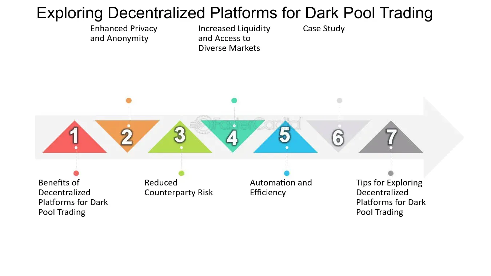

## Table of Contents

## What is a decentralized dark pool trading platform?

A decentralized dark pool trading platform is a type of trading system where people can buy and sell things like stocks or cryptocurrencies without other people knowing about it right away. It's called "dark" because the trades are hidden from the public until they are done. It's also "decentralized" because it doesn't have one big company or group in charge. Instead, it uses technology like blockchain to let everyone involved help run the system.

These platforms are useful for big investors who want to make large trades without affecting the market price. If everyone knows a big trade is happening, it can change the price before the trade is finished. By keeping the trade secret until it's done, dark pools help these investors get a better price. However, because these trades are hidden, it can be harder to make sure everything is fair and honest.

## How does a decentralized dark pool differ from traditional trading platforms?

A decentralized dark pool trading platform is different from traditional trading platforms because it keeps trades secret until they are finished. On a traditional platform, when someone wants to buy or sell something, everyone can see the order right away. This can make the price go up or down before the trade is done. But in a dark pool, the trade is hidden, so it doesn't affect the price as much. This is helpful for big investors who want to make large trades without everyone knowing about it.

Another big difference is that decentralized dark pools don't have one big company or group in charge. Traditional trading platforms are usually run by a central authority, like a stock exchange. But a decentralized dark pool uses technology like blockchain, which lets everyone involved help run the system. This can make it more fair and less likely to be controlled by one group, but it can also be harder to make sure everything is done correctly and honestly.

## What are the main benefits of using decentralized dark pool trading platforms?

One main benefit of using decentralized dark pool trading platforms is that they help big investors make large trades without affecting the market price. When someone wants to buy or sell a lot of something, like stocks or cryptocurrencies, it can change the price if everyone knows about it. But in a dark pool, the trade is hidden until it's done, so the price stays more stable. This means investors can get a better price for their trades.

Another benefit is that decentralized dark pools don't have one big company or group in charge. Instead, they use technology like blockchain, which lets everyone involved help run the system. This can make the platform more fair and less likely to be controlled by one group. It gives more power to the people using the platform and can help prevent any one person or company from making all the rules.

## What are the potential risks associated with decentralized dark pool trading?

One big risk with decentralized dark pool trading is that the trades are hidden until they're done. This can make it hard for everyone to know what's really going on in the market. If a lot of trades are happening in secret, it can be tough to understand if the prices are fair or if someone is trying to cheat. This lack of transparency can lead to problems and make it harder for regulators to keep things honest.

Another risk is that because decentralized dark pools don't have one big company in charge, it can be harder to make sure everything is done right. Without a central authority, it's more challenging to catch and stop bad behavior. If something goes wrong, like a hack or a scam, it might be harder to fix the problem and get people's money back. This can make people less trusting of these platforms and more worried about losing their investments.

## How does the technology behind decentralized dark pools ensure privacy and security?

Decentralized dark pools use blockchain technology to keep trades private and secure. Blockchain is like a special book that records all the trades, but it's spread out across many computers instead of being kept in one place. This means no single person or company can control it or see all the trades at once. Each trade is hidden until it's done, which helps keep it a secret and stops other people from changing the price before the trade is finished.

To make sure the system stays safe, decentralized dark pools use something called cryptography. This is like a special code that keeps the information about the trades locked up tight. Only the people who are part of the trade can see the details, and it's very hard for anyone else to break in and steal the information. This helps keep everything secure and makes sure that the trades are done honestly, even though they're happening in secret.

## Can you explain the process of executing a trade on a decentralized dark pool?

When someone wants to make a trade on a decentralized dark pool, they start by sending their trade order to the platform. This order says what they want to buy or sell and how much. The platform then matches this order with another order from someone else who wants to do the opposite trade. Because it's a dark pool, these orders are kept secret from everyone else until the trade is done. This means that nobody else knows about the trade until it's finished, which helps keep the price from changing too much.

Once the platform finds a matching order, it uses blockchain technology to make sure the trade happens securely and privately. The details of the trade are locked up with special codes called cryptography, so only the people involved in the trade can see them. The blockchain records the trade in a way that can't be changed or messed with by anyone else. After the trade is done, it gets shown to everyone, but until then, it stays hidden. This way, the trade is kept safe and secret, and the price stays stable.

## What are the regulatory challenges faced by decentralized dark pool trading platforms?

Decentralized dark pool trading platforms face big challenges when it comes to rules and regulations. Because these platforms keep trades secret until they are done, it's hard for people who make the rules to see what's happening. They can't easily check if everything is fair and honest. This makes it tough for them to stop bad behavior or protect people from losing money. Without a central group in charge, it's also harder to make sure everyone follows the rules.

Another challenge is that these platforms use new technology like blockchain, which is not easy for everyone to understand. This makes it hard for rule-makers to create good laws that keep things safe but still let the platforms work well. They have to find a balance between letting people use these new ways of trading and making sure no one gets hurt. It's a tricky problem, and it's something that a lot of people are still trying to figure out.

## How do decentralized dark pools impact market liquidity and price discovery?

Decentralized dark pools can change how much money is available to buy and sell things in the market. When big trades happen in secret, it means less money is showing up on the regular trading platforms. This can make it harder for people to buy or sell things quickly because there's less money to work with. If a lot of trading happens in dark pools, it can make the whole market less liquid, which means it's harder for everyone to trade.

These secret trades also affect how people find out what things are worth. Usually, people look at all the trades happening to figure out the price of something. But if a lot of trades are hidden in dark pools, it's harder to know the real price. This can make the prices on regular platforms less accurate because they're missing information about what's happening in the dark pools. So, while dark pools can help big investors get better prices, they can also make it harder for everyone else to understand what things are really worth.

## What are some examples of existing decentralized dark pool trading platforms?

One example of a decentralized dark pool trading platform is Uniswap. Uniswap is a popular platform for trading cryptocurrencies. It uses a special kind of technology called a decentralized exchange (DEX) to let people trade without a central group in charge. Because it's decentralized, it keeps trades private until they're done, which can help keep prices stable.

Another example is SushiSwap. SushiSwap is also a decentralized exchange that lets people trade cryptocurrencies in a way that's similar to Uniswap. It uses the same kind of technology to keep trades secret until they're finished. Both Uniswap and SushiSwap are part of the DeFi, or decentralized finance, world, where people can trade and do other financial things without a big company controlling everything.

## How can one evaluate the performance and reliability of a decentralized dark pool platform?

To evaluate the performance and reliability of a decentralized dark pool platform, you need to look at how well it works and how safe it is. One way to do this is by checking how fast the platform can match and complete trades. If it takes too long, it might not be very useful for people who need to trade quickly. You can also look at how often the platform is up and running without any problems. If it goes down a lot, it might not be reliable. Another important thing is to see how much money is being traded on the platform. If a lot of people are using it, it might be a good sign that it's working well.

Another way to check the reliability is by looking at the security of the platform. Since decentralized dark pools use blockchain technology, you want to make sure the platform is using strong cryptography to keep trades private and safe. You can also read about any past security problems or hacks the platform has had. If it has a good track record of keeping things secure, that's a good sign. Finally, it's helpful to see what other people are saying about the platform. If a lot of people trust it and have good things to say, it might be a reliable choice.

## What future developments are expected in the field of decentralized dark pool trading?

In the future, we might see decentralized dark pool trading platforms becoming even more advanced. They could use new technology to make trading faster and safer. For example, they might use smarter ways to match trades so that big investors can get even better prices without affecting the market. Also, these platforms might start using [artificial intelligence](/wiki/ai-artificial-intelligence) to help find the best trades and keep everything running smoothly. This could make them more popular and useful for more people.

Another thing that might happen is that rules and regulations could change to make these platforms safer and more fair. Right now, it's hard for people who make the rules to keep an eye on decentralized dark pools because they are so secret. But in the future, new laws might be made to help watch over these platforms better. This could make people trust them more and feel safer using them. Overall, the future of decentralized dark pool trading could be very exciting, with new technology and better rules making it easier and safer for everyone to trade.

## How do decentralized dark pools integrate with other blockchain technologies and DeFi applications?

Decentralized dark pools work well with other blockchain technologies and DeFi applications because they all use the same kind of technology. For example, a dark pool might use a blockchain to keep trades private and safe. This is the same technology that other DeFi apps use to let people do things like borrow money or earn interest. By using the same technology, dark pools can easily connect with these other apps. This means someone can trade on a dark pool and then use another DeFi app to do something else with their money, all without leaving the blockchain world.

This connection can make trading on dark pools even more useful. For instance, someone might trade on a dark pool and then use a DeFi app to turn their money into a different kind of [cryptocurrency](/wiki/cryptocurrency). Or they might use a DeFi app to get a loan and then use that money to trade on a dark pool. Because everything is on the blockchain, these actions can happen quickly and safely. As more DeFi apps are created, dark pools could become even more important, helping people do more with their money in new and interesting ways.

## What is Algorithmic Trading in Cryptocurrency?

Algorithmic trading in cryptocurrency leverages automated software systems to execute trades based on predefined criteria. This approach harnesses computational efficiency and is particularly useful in the fast-paced cryptocurrency markets due to its ability to exploit price discrepancies and market inefficiencies. The automated nature of [algorithmic trading](/wiki/algorithmic-trading) allows for rapid decision-making and order execution, often at speeds unattainable by human traders.

The primary advantage of algorithmic trading lies in its capacity to process a vast amount of market data and execute trades within milliseconds. Traders develop algorithms that are designed to [carry](/wiki/carry-trading) out high-frequency trading ([HFT](/wiki/high-frequency-trading-strategies)), [scalping](/wiki/gamma-scalping), or implement intricate trading strategies. High-frequency trading involves executing a large number of trades in fractions of a second to capture small price movements, contributing to increased market [liquidity](/wiki/liquidity-risk-premium) and tighter spreads. Scalping, on the other hand, focuses on profiting from small price gaps created by order flows or spreads.

Algorithmic trading systems are typically designed with key components: data analysis, signal generation, and execution. Data analysis involves collecting real-time and historical market data to find patterns or anomalies indicating potential trading opportunities. Signal generation uses these patterns to trigger buy or sell signals based on predetermined criteria. Finally, execution algorithms carry out these trades, often using smart order routing systems to minimize costs and ensure optimal execution prices.

For instance, consider an algorithm designed to exploit price inefficiencies between different cryptocurrency exchanges. Such an algorithm would continuously monitor the price of a specific asset across multiple platforms. If it detects an [arbitrage](/wiki/arbitrage) opportunity—where the price of an asset differs significantly between exchanges—it could execute simultaneous buy and sell orders to capitalize on the price difference, thereby locking in a profit. This process can be conceptualized as:

$$
\text{Profit} = (\text{Sell Price on Exchange A} - \text{Buy Price on Exchange B}) - \text{Transaction Costs}
$$

The development of a successful algorithmic trading strategy requires a deep understanding of trading principles, programming skills (particularly in languages like Python or C++), and a robust [backtesting](/wiki/backtesting) environment to simulate the algorithm's performance on historical data before deploying it in live markets. 

Overall, algorithmic trading symbolizes a significant evolution in how traders interact with financial markets, especially in the volatile world of cryptocurrencies, where rapid changes and opportunities can be efficiently exploited with the right algorithms.

## References & Further Reading

[1]: Zarembka, P. (2018). ["Decentralized Markets Versus Dark Pools and Other Alternative Trading Systems."](http://www.borpub.com/British%20Open%20Journal%20of%20Finance%20&%20Banking/BOJFB_Vol.%201,%20No.%201,%20January%202019/Dark%20Pools.pdf) Research in International Business and Finance.

[2]: Buterin, V. (2014). ["A Next-Generation Smart Contract and Decentralized Application Platform."](https://ethereum.org/content/whitepaper/whitepaper-pdf/Ethereum_Whitepaper_-_Buterin_2014.pdf) Ethereum White Paper.

[3]: Lopez de Prado, M. (2018). ["Advances in Financial Machine Learning."](https://www.amazon.com/Advances-Financial-Machine-Learning-Marcos/dp/1119482089) John Wiley & Sons.

[4]: Gandal, N., & Halaburda, H. (2016). ["Can We Trust Blockchain-Based Platforms?"](https://papers.ssrn.com/sol3/papers.cfm?abstract_id=2832836) Harvard Business Review.

[5]: Jansen, S. (2020). ["Machine Learning for Algorithmic Trading."](https://github.com/stefan-jansen/machine-learning-for-trading) Packt Publishing.

[6]: Parsons, T., & Fingleton, H. (2014). ["The Dark Trading Mechanism: Explaining the Nature, Benefits, and Risks of Dark Pools."](https://www.scribd.com/document/486963518/Gill-2014-the-Benefits-of-Children-s-Engagement-with-Nature-A-Systematic-Literature-Review) SSRN Electronic Journal.

[7]: Chan, E. (2008). ["Quantitative Trading: How to Build Your Own Algorithmic Trading Business."](https://github.com/ftvision/quant_trading_echan_book) John Wiley & Sons.