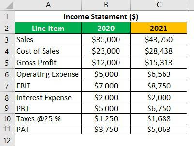

Trading in the financial markets is intricate, influenced by numerous economic and psychological factors. In recent years, the rapid influx of information has significantly impacted profitability in trading, necessitating the deployment of artificial intelligence (AI) to aid in making informed trading decisions. AI systems excel at swiftly analyzing vast quantities of data sourced from diverse platforms, thereby facilitating high-frequency trading (HFT). HFT involves executing a large number of trades at extreme speeds, capitalizing on minute price fluctuations that a human trader might overlook.

This article examines recent advancements in AI-based algorithmic trading and discusses the potential trajectory of its evolution. Through the application of sophisticated algorithms, AI enhances the ability to predict market movements by evaluating large datasets, including historical market data, current transaction volumes, as well as socio-economic news. The introduction of AI in trading not only expedites decision-making processes but also refines the accuracy of outputs, driving efficiency in markets.



Furthermore, integrating multiple methodologies and diverse datasets into a cohesive framework offers promising improvements in financial asset price predictions. This integrated approach leverages machine learning models, which include techniques such as supervised learning, unsupervised learning, and reinforced learning. By utilizing a combination of quantitative financial models and qualitative data analysis, AI systems can deliver a more holistic prediction of market trends.

The ongoing evolution of AI technologies promises to extend the capabilities of algorithmic trading, positioning it as a pivotal component of financial markets. As the financial landscape continues to evolve, the interplay between AI and traditional analytical methods is anticipated to further enhance market predictability, leading to more informed and effective investment strategies.

## Table of Contents

## Understanding Forecasts and Earnings

Consensus earnings estimates are central figures in the financial industry, reflecting the average predictions made by financial analysts regarding the future performance of a company. These projections are pivotal because they offer a benchmark against which actual company performance can be measured. Investors and financial media closely scrutinize these estimates, as they directly influence stock valuation and investor sentiment.

The process of formulating consensus earnings estimates involves aggregating the individual forecasts from various analysts who scrutinize a company’s financial statements and market conditions. These analysts employ a wide array of methods which include examining company growth strategies, economic indicators, and utilizing complex financial models to predict future revenues and costs. By analyzing historical performance data along with future growth projections and economic factors, analysts attempt to derive an accurate estimate of a company’s earnings potential.

Earnings performance is a critical determinant in the investment decision-making process because it significantly impacts a company’s intrinsic value. When a company reports earnings that exceed consensus estimates, it often results in a positive reassessment of its stock price, leading to increased investor interest and upward price movement. Conversely, when earnings fall short of expectations, it can precipitate a negative market reaction, diminishing the perceived value of the stock.

Forecasts are built on multifaceted analyses which consider not only the internal dynamics of a company, such as its operational efficiency and product pipeline, but also external macroeconomic factors. For instance, an improving economic environment may enhance consumer spending power, positively affecting the revenue potential of consumer-oriented companies. Financial models, often utilizing techniques from econometrics and statistical analysis, are employed to integrate these varied inputs into a cohesive forecast that seeks to reliably predict future financial performance.

In summary, consensus earnings estimates serve as crucial barometers in financial markets, informing investment strategies and stock price evaluations. They are the product of comprehensive analyses that merge company-specific insights with broader economic forecasts to gauge the likely future earnings of a business.

## Role of Financial Analysis in Forecasting

Financial analysis is a critical component in evaluating a company's financial health and making informed investment decisions. It involves examining a range of financial data, both historical and current, to predict future performance. This analysis is grounded in two primary methodologies: [fundamental analysis](/wiki/fundamental-analysis) and technical analysis.

### Fundamental Analysis

Fundamental analysis is focused on understanding a company's intrinsic value by examining various economic, financial, and qualitative factors. Analysts look at a company's earnings and revenue forecasts, past performance, and broader economic indicators to estimate its true value. Fundamental analysis involves evaluating elements such as:

- **Earnings per Share (EPS):** A primary measure of a company's profitability. It is calculated by dividing the company's net profit by the number of outstanding shares. 
$$
  \text{EPS} = \frac{\text{Net Income} - \text{Dividends on Preferred Stock}}{\text{Average Outstanding Shares}}

$$

- **Price to Earnings Ratio (P/E Ratio):** A key indicator used to compare a company's current share price relative to its per-share earnings. It helps assess whether a stock is over or undervalued.
$$
  \text{P/E Ratio} = \frac{\text{Market Value per Share}}{\text{Earnings per Share (EPS)}}

$$

- **Economic Indicators:** These include GDP growth rates, inflation figures, and employment statistics, which provide insights into the economic environment in which a company operates.

### Technical Analysis

Technical analysis is distinct from fundamental analysis as it mainly involves studying past market data, such as price and [volume](/wiki/volume-trading-strategy), to identify patterns and trends that might predict future market behavior. This analysis technique uses charting tools and indicators to evaluate securities and make trading decisions based on market sentiment and behavioral economics rather than a company's intrinsic value. Key components of technical analysis include:

- **Moving Averages:** These are commonly used to smooth out short-term fluctuations and highlight longer-term trends. The simple moving average can be calculated as follows:
$$
  \text{SMA} = \frac{\sum_{i=1}^{N} P_i}{N}

$$
  where $P_i$ is the price at each time interval, and $N$ is the number of intervals.

- **Relative Strength Index (RSI):** This momentum oscillator provides insight into whether a stock is overbought or oversold by evaluating the magnitude of recent price changes.

- **Candlestick Patterns:** These are used to predict price direction by considering the formation of price bars relative to past performance.

Together, fundamental and technical analysis offer comprehensive insights into market dynamics and a company's financial health, enabling investors to make well-informed decisions. These tools can complement each other, with fundamental analysis providing a longer-term view and technical analysis offering short-term trading signals.

## Algorithmic Trading and its Impact

Algorithmic trading employs computer programs to execute trades automatically based on predetermined criteria. This technique enables rapid execution of transactions, allowing traders to capitalize on minor price fluctuations within the financial markets. The algorithms utilized are designed to analyze vast arrays of market variables and make decisions in fractions of a second, often outpacing human capabilities significantly. This speed and efficiency of execution have made [algorithmic trading](/wiki/algorithmic-trading) a popular strategy, particularly in high-frequency trading ([HFT](/wiki/high-frequency-trading-strategies)), where split-second decision making is crucial.

One of the primary advantages of algorithmic trading is its capacity to increase market efficiency. By automating the trading process, these algorithms can process and react to market information in real time, potentially reducing the bid-ask spread and increasing market [liquidity](/wiki/liquidity-risk-premium). This heightened efficiency benefits not only traders but also the market as a whole, leading to more accurate pricing of financial instruments.

Despite its benefits, algorithmic trading carries inherent risks. Execution errors can occur due to malfunctioning algorithms, leading to significant financial losses. Technical malfunctions, such as network outages or software glitches, may disrupt trading, especially when combined with the sheer volume of trades executed in HFT. Moreover, improper algorithm design can lead to unintended market impacts, such as significant price swings or exacerbated [volatility](/wiki/volatility-trading-strategies).

The integration of Artificial Intelligence (AI) in algorithmic trading has further refined predictive accuracy and execution speed. AI technologies, particularly [machine learning](/wiki/machine-learning), analyze substantial datasets to discern patterns and predict market movements more precisely. These AI-based models consider a variety of factors—from investor sentiment to macroeconomic indicators—incorporating real-time data to refine their predictive capabilities continuously.

Python has become a prevalent language for developing and implementing algorithmic trading strategies due to its extensive libraries and community support. Below is a simple Python script using the `pandas` and `numpy` libraries that demonstrates a basic moving average crossover strategy:

```python
import pandas as pd
import numpy as np

# Simple moving average (SMA) function
def calculate_sma(data, window):
    return data.rolling(window=window).mean()

# Load historical market data
data = pd.read_csv('market_data.csv')  # Replace with your data source
prices = data['Close']

# Calculate short-term and long-term SMAs
short_window = 40
long_window = 100
short_sma = calculate_sma(prices, short_window)
long_sma = calculate_sma(prices, long_window)

# Generate trading signals
data['Signal'] = 0.0
data['Signal'][short_window:] = np.where(short_sma[short_window:] > long_sma[short_window:], 1.0, 0.0)
data['Position'] = data['Signal'].diff()

# Output results
print(data)

```

This script calculates short-term and long-term simple moving averages (SMA) on market data and generates buy and sell signals accordingly. Strategies like this form the basis for more complex algorithmic trading models that incorporate AI to enhance decision-making processes. As the technology advances, further integration and sophistication in AI models will likely expand their capability in the trading ecosystem, reducing risk and improving market stability.

## Integrating AI in Financial Forecasting and Trading

AI technologies, specifically machine learning and [deep learning](/wiki/deep-learning), are significantly enhancing financial forecasting and trading by automating and refining the process of data analysis and prediction. These technologies analyze vast amounts of structured and unstructured data much faster than a human trader can, enabling more precise and timely trading decisions.

Machine learning algorithms, such as supervised learning models, can be trained on historical financial data to recognize patterns and forecast future market movements. These algorithms are adept at processing structured data like stock prices and volumes, as well as unstructured data, such as news articles and social media sentiment. For example, Natural Language Processing (NLP) techniques allow AI models to comprehend investor sentiment from text data, providing valuable insights that can influence market forecasts.

Deep learning, a subset of machine learning, utilizes neural networks with multiple layers to identify complex patterns in data. Convolutional Neural Networks (CNNs) and Recurrent Neural Networks (RNNs), including Long Short-Term Memory (LSTM) networks, are particularly effective in recognizing intricate patterns and temporal dependencies in time-series data, respectively. These models are crucial for predicting asset prices in environments characterized by high volatility and unpredictability.

AI-based models are also increasingly integrating a variety of external variables, such as macroeconomic factors, geopolitical events, and real-time market feeds. By synthesizing these diverse data sources, AI systems can generate more comprehensive forecasts. This capability is instrumental in high-frequency trading (HFT), where the speed of execution and accuracy of predictions are paramount.

One of the greatest advantages of AI in trading and forecasting is its adaptability. As the market changes, AI models can be continuously retrained on new data, improving their ability to make accurate predictions. This aspect is especially important in volatile markets, where conditions can shift rapidly and unpredictably.

Overall, the integration of AI into financial forecasting and trading significantly improves the accuracy and reliability of market predictions. It allows traders to better anticipate market swings, optimize investment strategies, and manage risks more effectively. As AI technologies continue to evolve, their role in transforming the financial landscape will become even more pronounced.

## Challenges and Future Directions

The incorporation of AI into algorithmic trading presents several advantages, yet it also introduces a set of challenges that need to be addressed effectively. One primary challenge is the complexity of data. Financial markets generate vast amounts of data every second, including real-time stock prices, trading volumes, news articles, social media sentiment, and economic indicators. AI systems must be adept at processing and analyzing these heterogeneous data sources within fractions of a second. This demands sophisticated algorithms capable of handling structured and unstructured data while mitigating noise, which can otherwise lead to erroneous signals.

Regulatory issues also pose significant challenges. The rapid pace of AI development often outstrips the speed at which regulatory frameworks are established or adapted. The potential for algorithms to exacerbate market volatility or even contribute to "flash crashes" necessitates stringent oversight. Regulators must strike a balance between fostering innovation and ensuring market stability, which involves setting guidelines for AI transparency, testing, and monitoring without stifling technological advancements.

Technical errors remain a concern, as the complexity of AI models increases the risk of unforeseen faults or malfunctions. These errors can be triggered by anomalous data or faulty assumptions embedded within the algorithms. Robust testing and validation processes are essential to minimize such risk, especially given the pace at which decisions in high-frequency trading environments are made. 

AI systems must be carefully designed to avoid overreliance on historical data, as this can introduce systemic biases. Historical data can encode biases present in past markets, such as those related to geopolitical developments or unexpected economic disruptions. While past performance can provide insights, it may not always predict future trends accurately, especially in rapidly evolving markets. Developers of AI models must integrate mechanisms to identify and mitigate bias, ensuring that predictions remain objective and relevant.

Future advancements are likely to involve the further integration of AI with diverse data sources to enhance predictive accuracy. For instance, leveraging [alternative data](/wiki/best-alternative-data) such as satellite imagery for agricultural forecasts or IoT data from smart grids can provide novel insights. By combining traditional financial data with unconventional sources, AI systems can develop a more comprehensive understanding of market dynamics. 

Ongoing research is crucial to adapt to changing market conditions and optimize algorithmic trading systems. This research focuses on refining AI models, improving data processing techniques, and developing adaptive learning algorithms that can adjust to new information without manual intervention. Collaboration between academia, financial institutions, and technology firms will be key to driving these innovations forward, ensuring that algorithmic trading continues to evolve and meet the complex demands of modern financial markets.

## Conclusion

Financial forecasts, earnings analysis, and algorithmic trading are indispensable tools for investors, each playing a crucial role in navigating the complexities of financial markets. The strategic use of these tools can offer significant advantages, particularly when traditional financial analysis methods are augmented with cutting-edge AI technologies. The integration of AI into financial forecasting and trading opens new avenues for enhancing the precision and effectiveness of market predictions. By leveraging machine learning algorithms and deep learning methods, investors can analyze vast datasets, identify patterns, and make informed decisions with increased confidence. This synergy between AI and conventional analysis not only boosts predictive capabilities but also helps in managing risks more efficiently.

Staying current with technological advancements is essential for those who want to maximize the potential of these tools. As AI technologies evolve, they bring about continuous improvements in data processing, pattern recognition, and real-time decision-making. This rapid progress necessitates a proactive approach from investors and financial professionals who must continually update their skills and knowledge to maintain a competitive edge. Familiarity with emerging AI applications and an understanding of how they can be integrated with traditional methodologies form a critical part of this ongoing learning process.

The evolution of AI is poised to fundamentally reshape financial markets, assuming an increasingly central role in the coming years. AI's ability to process complex information swiftly and accurately makes it an invaluable asset in predicting market trends and opportunities. As AI systems become more sophisticated, they will likely offer unprecedented levels of insight and foresight, facilitating more informed decision-making and potentially reshaping market dynamics. This transformative impact underscores the importance of adopting a forward-thinking approach to AI in finance, ensuring that stakeholders are well-equipped to harness its full potential. In summary, the convergence of AI with traditional financial methodologies represents a powerful shift towards more precise and dynamic market engagement, setting the stage for a more informed and adaptive financial ecosystem.

## References & Further Reading

[1]: Bergstra, J., Bardenet, R., Bengio, Y., & Kégl, B. (2011). ["Algorithms for Hyper-Parameter Optimization."](https://dl.acm.org/doi/10.5555/2986459.2986743) Advances in Neural Information Processing Systems 24.

[2]: Lopez de Prado, M. (2018). ["Advances in Financial Machine Learning."](https://www.amazon.com/Advances-Financial-Machine-Learning-Marcos/dp/1119482089) Wiley.

[3]: Aronson, D. R. (2007). ["Evidence-Based Technical Analysis: Applying the Scientific Method and Statistical Inference to Trading Signals."](https://onlinelibrary.wiley.com/doi/book/10.1002/9781118268315) Wiley.

[4]: Jansen, S. (2020). ["Machine Learning for Algorithmic Trading."](https://github.com/stefan-jansen/machine-learning-for-trading) Packt Publishing.

[5]: Chan, E. (2008). ["Quantitative Trading: How to Build Your Own Algorithmic Trading Business."](https://github.com/ftvision/quant_trading_echan_book) Wiley.