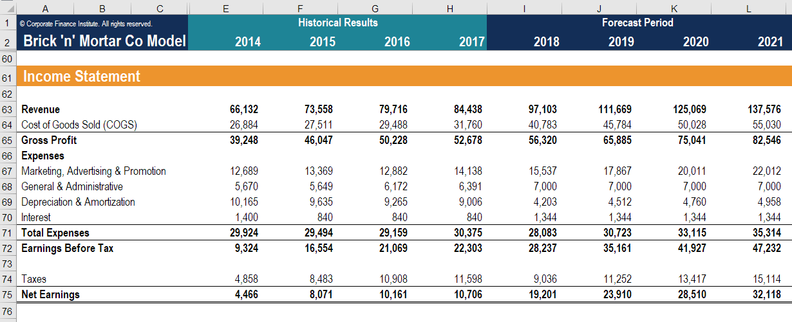

## Table of Contents

## What is an earnings forecast?

An earnings forecast is a prediction about how much money a company will make in the future. It's like guessing how much a business will earn in a certain time, like a quarter or a year. Companies and financial experts use past information, current trends, and other data to make these guesses. This helps investors and the company itself plan for the future.

These forecasts are important because they help people decide if they should buy or sell a company's stock. If a company is expected to make a lot of money, its stock price might go up. On the other hand, if the forecast shows the company might not do well, the stock price could go down. Earnings forecasts are not always right, but they give a good idea of what might happen.

## Why are earnings forecasts important for investors?

Earnings forecasts are important for investors because they help them make decisions about buying or selling stocks. If a company's earnings forecast shows that it will make a lot of money in the future, investors might want to buy its stock. They think the stock price will go up because the company is doing well. On the other hand, if the forecast shows the company might not make much money, investors might sell the stock or not buy it, thinking the stock price will go down.

These forecasts also help investors understand a company's health and future plans. By looking at the earnings forecast, investors can see if a company is growing, staying the same, or shrinking. This information can help them decide if the company is a good place to put their money. Even though forecasts are not always right, they give investors a useful guide to make smarter choices about their investments.

## How are earnings forecasts typically generated?

Earnings forecasts are usually made by looking at a lot of different information. Companies and financial experts start by checking the company's past earnings. They look at how much money the company made last year, last quarter, or even last month. They also think about what's happening in the world and the industry the company is in. For example, if there's a new law or a big change in the economy, it might affect how much money the company can make. They also talk to people who work at the company to get more details about what the company plans to do in the future.

After gathering all this information, experts use special math formulas and computer programs to make their guesses. These formulas help them turn all the data into a number that shows how much money the company might make. Sometimes, different experts might have different forecasts because they might use different information or formulas. But, by putting all these forecasts together, they can come up with a good guess about the company's future earnings. This helps investors and the company plan for what might happen next.

## What are the main sources of earnings forecasts?

Earnings forecasts come from different places. Companies often make their own forecasts. They use information about their past earnings, current business plans, and what's happening in their industry. They might also talk to people inside the company to get a better idea of what might happen. These forecasts help companies plan for the future and show investors what they expect.

Financial experts and analysts also make earnings forecasts. They work for banks, investment firms, or research companies. These experts gather a lot of information, like a company's past earnings, what's going on in the economy, and any new laws that might affect the company. They use special math and computer programs to turn all this information into a guess about how much money the company might make. Investors use these forecasts to decide if they should buy or sell a company's stock.

Sometimes, big groups of analysts come together to make a forecast. They share their guesses and put them all together to make one big forecast. This is called a consensus forecast. It's like taking the average of everyone's guesses to get a good overall idea of what might happen. This helps investors get a clearer picture of a company's future earnings.

## How often are earnings forecasts updated?

Earnings forecasts are usually updated every three months, which is called a quarterly update. This is because most companies report their earnings every quarter, and analysts use this new information to make new guesses about the future. Sometimes, forecasts can be updated more often if there's big news or changes that might affect a company's earnings, like a new product launch or a big change in the economy.

Besides quarterly updates, some analysts might change their forecasts if they get new information or if something important happens. For example, if a company says it's going to buy another company or if there's a big change in the law, analysts might update their forecasts right away. This helps investors have the most up-to-date information to make their decisions.

## What is the difference between a short-term and a long-term earnings forecast?

A short-term earnings forecast is a guess about how much money a company will make in the near future, usually for the next quarter or the next year. Analysts and companies use the most recent information to make these guesses. They look at things like the company's last earnings report, what's happening in the economy right now, and any new news that might affect the company soon. Short-term forecasts are important because they help investors make quick decisions about buying or selling stocks based on what might happen very soon.

A long-term earnings forecast, on the other hand, is a prediction about a company's earnings over a longer period, like three to five years or even more. These forecasts are trickier to make because they have to guess what might happen in the future, which can be hard to predict. Long-term forecasts look at bigger trends, like how the industry might change or what new technologies might come out. They help investors think about where a company might be in the future and decide if it's a good place to keep their money for a long time.

## How can one evaluate the accuracy of an earnings forecast?

To evaluate the accuracy of an earnings forecast, you can compare the forecast to the actual earnings the company reports. After a company releases its earnings for a quarter or a year, you can see if the forecast was close to what really happened. If the forecast was pretty close to the actual earnings, it was accurate. If it was way off, then it wasn't very accurate. You can also look at how often a certain analyst or company gets their forecasts right. If they usually make good guesses, you can trust their forecasts more.

Another way to check the accuracy is to look at how the forecast was made. Did the person making the forecast use a lot of different information and good math? Did they think about what was happening in the world and the company's industry? If they did all these things well, their forecast is more likely to be accurate. But, even the best forecasts can be wrong because the future is hard to predict. So, it's good to use many different forecasts and look at them together to get a better idea of what might happen.

## What are common methodologies used in creating earnings forecasts?

When creating earnings forecasts, people often use a method called the top-down approach. This means they start by looking at the big picture, like what's happening in the economy and the industry. They think about things like how fast the economy is growing, if people are spending more money, and if there are any new laws that might affect businesses. Then, they use this information to guess how much money a company might make. They also look at the company's past earnings and what the company says about its future plans. This helps them make a forecast that takes into account a lot of different things.

Another common method is the bottom-up approach. This method starts with the company itself and looks at its specific details. Analysts look at things like how much the company is selling, how much it costs to make those things, and if the company is planning to grow or change anything. They might talk to people who work at the company to get more details. Then, they use math and computer programs to turn all this information into a forecast. Both the top-down and bottom-up approaches help make good guesses about a company's future earnings, but they look at different kinds of information to do it.

## How do external economic factors influence earnings forecasts?

External economic factors can have a big impact on earnings forecasts. These factors include things like how fast the economy is growing, whether people are spending more or less money, and if there are any new laws or regulations. For example, if the economy is doing well and people are buying a lot of things, companies might make more money. This would make analysts think that the company's future earnings will be higher. On the other hand, if the economy is not doing well, people might not spend as much, and companies could make less money. This would lead to lower earnings forecasts.

Another important external factor is what's happening in the industry the company is in. If there are big changes, like new technology or new competitors, it can change how much money a company might make. For instance, if a new law makes it harder for a company to do business, its earnings might go down. Analysts have to think about all these things when they make their forecasts. They use this information to guess how much money a company will make in the future, even though it's hard to predict exactly what will happen.

## What role do earnings forecasts play in stock valuation models?

Earnings forecasts are very important in stock valuation models because they help people guess what a company's stock might be worth in the future. When people want to know if a stock is a good buy, they look at how much money the company might make. They use earnings forecasts to do this. If a company is expected to make a lot of money, its stock might be worth more. This is because investors think the company will do well and the stock price will go up. Earnings forecasts help people use math and special models to figure out if a stock is a good deal or if it's too expensive.

These forecasts are used in different kinds of stock valuation models, like the discounted cash flow (DCF) model. In a DCF model, people guess how much money a company will make in the future and then use a special formula to figure out what that money is worth right now. The earnings forecast is a big part of this because it helps people make those guesses about future money. Even though earnings forecasts are not always right, they give a good starting point for these models. This helps investors make smarter choices about which stocks to buy or sell.

## How do analysts revise their earnings forecasts based on new data?

When analysts get new information, they often change their earnings forecasts to make them more accurate. This new information can come from the company's latest earnings report, news about the economy, or changes in the industry. For example, if a company says it's going to launch a new product, analysts might think the company will make more money and update their forecast to show that. They use math and computer programs to turn this new information into a new guess about how much money the company will make.

Analysts also look at what other people are saying about the company. If other analysts change their forecasts, it might make them think about changing theirs too. Sometimes, big news like a change in the law or a big event in the world can make them update their forecasts quickly. They want to make sure their guesses are as good as they can be, so they keep an eye on everything that might affect the company's earnings. By doing this, they help investors make better decisions about buying or selling stocks.

## What advanced statistical techniques can enhance the precision of earnings forecasts?

To make earnings forecasts more accurate, analysts can use advanced statistical techniques like regression analysis. This method helps them see how different things, like the economy or what's happening in the industry, affect a company's earnings. By looking at a lot of data from the past, they can find patterns and use those patterns to make better guesses about the future. Another technique is time series analysis, which looks at how a company's earnings have changed over time. This can help predict what might happen next by understanding the ups and downs in the company's earnings history.

Machine learning is another powerful tool that can improve earnings forecasts. It uses computers to learn from a lot of data and find things that might be hard for people to see. For example, machine learning can look at many different pieces of information at the same time, like news articles, social media posts, and financial reports, to make more accurate forecasts. By using these advanced techniques, analysts can make better guesses about how much money a company will make, which helps investors make smarter choices about buying or selling stocks.

## What is the role of financial analysis in forecasting?

Financial analysis is a critical component in evaluating a company's financial health and making informed investment decisions. It involves examining a range of financial data, both historical and current, to predict future performance. This analysis is grounded in two primary methodologies: [fundamental analysis](/wiki/fundamental-analysis) and technical analysis.

### Fundamental Analysis

Fundamental analysis is focused on understanding a company's intrinsic value by examining various economic, financial, and qualitative factors. Analysts look at a company's earnings and revenue forecasts, past performance, and broader economic indicators to estimate its true value. Fundamental analysis involves evaluating elements such as:

- **Earnings per Share (EPS):** A primary measure of a company's profitability. It is calculated by dividing the company's net profit by the number of outstanding shares. 
$$
  \text{EPS} = \frac{\text{Net Income} - \text{Dividends on Preferred Stock}}{\text{Average Outstanding Shares}}

$$

- **Price to Earnings Ratio (P/E Ratio):** A key indicator used to compare a company's current share price relative to its per-share earnings. It helps assess whether a stock is over or undervalued.
$$
  \text{P/E Ratio} = \frac{\text{Market Value per Share}}{\text{Earnings per Share (EPS)}}

$$

- **Economic Indicators:** These include GDP growth rates, inflation figures, and employment statistics, which provide insights into the economic environment in which a company operates.

### Technical Analysis

Technical analysis is distinct from fundamental analysis as it mainly involves studying past market data, such as price and [volume](/wiki/volume-trading-strategy), to identify patterns and trends that might predict future market behavior. This analysis technique uses charting tools and indicators to evaluate securities and make trading decisions based on market sentiment and behavioral economics rather than a company's intrinsic value. Key components of technical analysis include:

- **Moving Averages:** These are commonly used to smooth out short-term fluctuations and highlight longer-term trends. The simple moving average can be calculated as follows:
$$
  \text{SMA} = \frac{\sum_{i=1}^{N} P_i}{N}

$$
  where $P_i$ is the price at each time interval, and $N$ is the number of intervals.

- **Relative Strength Index (RSI):** This momentum oscillator provides insight into whether a stock is overbought or oversold by evaluating the magnitude of recent price changes.

- **Candlestick Patterns:** These are used to predict price direction by considering the formation of price bars relative to past performance.

Together, fundamental and technical analysis offer comprehensive insights into market dynamics and a company's financial health, enabling investors to make well-informed decisions. These tools can complement each other, with fundamental analysis providing a longer-term view and technical analysis offering short-term trading signals.

## References & Further Reading

[1]: Bergstra, J., Bardenet, R., Bengio, Y., & Kégl, B. (2011). ["Algorithms for Hyper-Parameter Optimization."](https://dl.acm.org/doi/10.5555/2986459.2986743) Advances in Neural Information Processing Systems 24.

[2]: Lopez de Prado, M. (2018). ["Advances in Financial Machine Learning."](https://www.amazon.com/Advances-Financial-Machine-Learning-Marcos/dp/1119482089) Wiley.

[3]: Aronson, D. R. (2007). ["Evidence-Based Technical Analysis: Applying the Scientific Method and Statistical Inference to Trading Signals."](https://onlinelibrary.wiley.com/doi/book/10.1002/9781118268315) Wiley.

[4]: Jansen, S. (2020). ["Machine Learning for Algorithmic Trading."](https://github.com/stefan-jansen/machine-learning-for-trading) Packt Publishing.

[5]: Chan, E. (2008). ["Quantitative Trading: How to Build Your Own Algorithmic Trading Business."](https://github.com/ftvision/quant_trading_echan_book) Wiley.