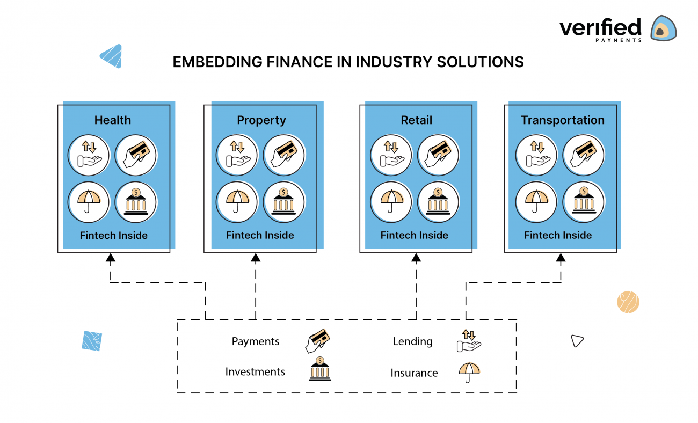

## Table of Contents

## What is embedded finance?

Embedded finance is when financial services are added into non-financial products or services. Imagine you're shopping online and you can get a loan to buy something right there on the shopping website. That's embedded finance. It makes things easier for customers because they don't have to go to a bank or another financial service to get what they need.

Companies like retailers, tech firms, and others use embedded finance to make their services better. For example, a ride-sharing app might let you pay for your ride with a digital wallet that's part of the app. This can help the company make more money and keep customers happy by making everything simpler and quicker. Embedded finance is becoming more popular as more businesses see how it can help them grow.

## How does embedded finance differ from traditional banking?

Embedded finance and traditional banking are different in how they deliver financial services. Traditional banking means going to a bank or using a bank's website or app to do things like saving money, getting a loan, or paying bills. It's separate from other services you might use every day. With traditional banking, you have to go to the bank or use their specific services to handle your money.

On the other hand, embedded finance brings financial services right into the apps or websites you already use for other things. For example, if you're buying something online, you might be able to get a loan or use a digital wallet without leaving the shopping site. This makes things easier because you don't have to switch between different services. Embedded finance is all about making financial services part of your everyday activities, so it's more convenient and often quicker than traditional banking.

## What are the key components of an embedded finance system?

The key components of an embedded finance system include a platform or app where the financial services are added, a way to connect to financial service providers, and tools to make the financial services work smoothly. The platform could be a shopping website, a ride-sharing app, or any other service where people do things every day. The connection to financial service providers is important because it lets the platform offer things like loans, payments, or insurance without having to build all those services from scratch. The tools help make sure everything works well together, like software that handles payments or checks if someone can get a loan.

Another important part is the user experience, which needs to be easy and smooth so people want to use the financial services. This means the financial services should fit naturally into what people are already doing on the platform. For example, if someone is buying something, they should be able to get a loan or pay with a digital wallet without leaving the shopping site. The last key component is security and compliance, which means making sure the financial services are safe to use and follow the rules. This includes things like protecting people's data and making sure the financial services meet legal standards.

## What industries can benefit from embedded finance?

Many industries can benefit from embedded finance. Retail is a big one. When people shop online, they can get a loan right there on the shopping website. This makes it easier for them to buy things they want, and it can help the retailer sell more. Another industry is transportation. Ride-sharing apps can let people pay with a digital wallet that's part of the app. This makes paying for rides quick and easy, and it can help the ride-sharing company make more money.

Healthcare is another industry that can use embedded finance. For example, a healthcare app might let people pay for their medical bills or get insurance right in the app. This can make things simpler for patients and help healthcare providers get paid faster. Technology companies can also benefit. They can add financial services to their apps or platforms, making them more useful and keeping users coming back. This can help tech companies grow and make more money.

Overall, any industry that wants to make things easier for customers and offer more services can use embedded finance. It's all about making financial services part of everyday activities, so people don't have to go to a bank or another financial service to get what they need. This can help businesses in many different industries grow and keep their customers happy.

## How does embedded finance enhance customer experience?

Embedded finance makes things easier for customers by adding financial services right into the apps or websites they use every day. Imagine you're shopping online and you can get a loan to buy something without leaving the shopping site. This saves time and makes the whole process smoother. You don't have to go to a bank or use a separate financial service, which can be a hassle. Instead, everything is right there where you're already doing your shopping or using other services.

This convenience can make customers happier and more likely to keep using the app or website. When financial services are part of everyday activities, it feels more natural and less like a separate task. For example, if you're using a ride-sharing app and you can pay with a digital wallet that's part of the app, it's quick and easy. This can make the whole experience better and keep customers coming back. Embedded finance is all about making things simpler and more enjoyable for customers.

## What are the regulatory considerations for implementing embedded finance?

When a company wants to add embedded finance to its services, it needs to think about the rules and laws that apply. These rules can be different in each country or even in different parts of the same country. The company needs to make sure it follows all the rules about things like protecting people's data, making sure the financial services are safe to use, and following the laws about money and banking. If the company doesn't follow these rules, it could get in trouble with the government or lose the trust of its customers.

One big part of these rules is making sure the financial services are safe and fair for everyone who uses them. This means the company has to check that people can afford the loans they're getting and that the financial services are not taking advantage of anyone. The company also needs to work with banks or other financial service providers that follow the rules. By doing all this, the company can make sure its embedded finance services are good for customers and follow the law.

## What technologies are essential for developing embedded finance solutions?

To develop embedded finance solutions, you need a few key technologies. One important technology is APIs, which are like bridges that let different software systems talk to each other. APIs help connect the platform where the financial services are added, like a shopping website, to the banks or other financial service providers that actually offer the services. Another essential technology is secure payment processing systems. These systems make sure that when people use the financial services, their money and personal information are safe. They handle things like payments, loans, and digital wallets in a way that protects everyone involved.

Another technology that's really important is data analytics. This helps companies understand how people are using the financial services and make them better. Data analytics can show things like which services are popular, who is using them, and how to make them easier to use. Finally, you need good user interface and user experience (UI/UX) design tools. These tools help make the financial services easy to use and fit naturally into the platform. Good UI/UX design makes sure that people can use the financial services without any trouble, which is a big part of what makes embedded finance work well.

## How can businesses integrate embedded finance into their existing systems?

To integrate embedded finance into their existing systems, businesses need to start by choosing the right financial services that fit well with what they already offer. For example, a shopping website might want to add a way for customers to get loans right on the site. The business would then need to find a bank or financial service provider that can offer these loans and work with them. This usually involves using APIs, which are like bridges that let different software systems talk to each other. The business would use these APIs to connect their website to the bank's systems, so customers can get loans without leaving the site.

Once the connection is set up, the business needs to make sure the financial services are easy to use and fit naturally into the website or app. This means using good design tools to make the user experience smooth and simple. The business also needs to make sure everything is safe and follows the rules. This includes using secure payment processing systems to protect customers' money and personal information. By doing all this, the business can add financial services to its existing systems in a way that helps customers and follows the law.

## What are the security concerns associated with embedded finance?

When businesses add financial services to their apps or websites, they need to think about keeping everything safe. One big worry is protecting people's personal information, like their names, addresses, and bank details. If this information gets stolen, it can cause a lot of trouble for customers. Businesses need to use strong security measures, like encryption, to keep this information safe. They also need to make sure their systems are protected against hackers who might try to break in and steal data.

Another concern is making sure the money part of the financial services is safe. When people use these services to pay for things or get loans, the business needs to make sure the money goes where it's supposed to go and doesn't get stolen along the way. This means using secure payment processing systems and following rules about how to handle money. If something goes wrong and money gets lost or stolen, it can hurt the business's reputation and make customers lose trust. So, it's really important for businesses to take these security concerns seriously and do everything they can to keep things safe.

## How does embedded finance impact financial inclusion?

Embedded finance helps more people use financial services by making them easier to access. When financial services are added to apps or websites people already use every day, like shopping sites or ride-sharing apps, it means people don't have to go to a bank to get what they need. This can be really helpful for people who live far from a bank or who don't have time to go there. It's also good for people who might not feel comfortable using traditional banks, because they can use financial services in a way that feels more familiar and easy.

By making financial services part of everyday activities, embedded finance can help more people save money, get loans, or pay for things in a way that works for them. This can make a big difference for people who might not have been able to use these services before. When more people can use financial services, it can help them do things like start a business, buy a home, or just manage their money better. This is why embedded finance is seen as a way to make financial services more inclusive and help more people improve their lives.

## What are the future trends in embedded finance?

In the future, embedded finance is going to become even more common and easier to use. More and more businesses will add financial services to their apps and websites because it helps them make more money and keep customers happy. For example, you might see more shopping sites offering loans or digital wallets right on their pages. Technology will get better too, making it simpler for businesses to connect with banks and other financial service providers. This means people will be able to use financial services in more places and in more ways, like getting insurance through a healthcare app or paying for things with a digital wallet in a ride-sharing app.

Another trend will be using data to make embedded finance even better. Businesses will use information about how people use their services to make them more personal and helpful. For example, if a shopping site knows what you like to buy, it might offer you a loan that's just right for those purchases. This can make things easier and more useful for customers. Also, as more people use embedded finance, the rules about how to do it safely and fairly will get clearer. This will help make sure that everyone can use these services without worrying about their money or personal information being at risk.

## What case studies demonstrate successful implementations of embedded finance?

One successful case of embedded finance is Klarna, a company that lets people buy things online and pay for them later. They work with lots of shopping websites, so when you're buying something, you can choose to pay with Klarna right on the site. This makes it easier for people to buy things they want without having to pay all at once. Klarna has become very popular because it's simple to use and helps people manage their money better. This has helped shopping websites sell more things and keep their customers happy.

Another good example is Uber, the ride-sharing app. Uber added a way for people to pay for their rides with a digital wallet that's part of the app. This makes paying for rides quick and easy, so people don't have to use cash or a credit card every time. It's also helped Uber make more money because people can pay without leaving the app. This has made the whole experience better for customers and helped Uber grow its business. These examples show how embedded finance can make things easier for people and help businesses do better.

## References & Further Reading

[1]: Marous, J. (2020). ["The Explosion of Embedded Finance."](https://digitalbankingtrends.com/jim-marous/) The Financial Brand.

[2]: Bank of International Settlements. (2020). ["Embedded Supervision: How To Build Regulation into Blockchain Finance."](https://www.bis.org/publ/work811.htm)

[3]: Guo, Y., & Liang, C. (2016). ["Blockchain application and outlook in the banking industry."](https://jfin-swufe.springeropen.com/articles/10.1186/s40854-016-0034-9) Financial Innovation Journal.

[4]: Markus, A. (2021). ["Harnessing the Power of Algorithmic Trading."](https://www.researchgate.net/publication/378287610_Machine_learning_in_financial_markets_A_critical_review_of_algorithmic_trading_and_risk_management) Forbes.

[5]: McKinsey & Company. (2021). ["Fintech's Growing Influence on Algorithmic Trading."](https://fr.linkedin.com/in/albericchopelin/en)