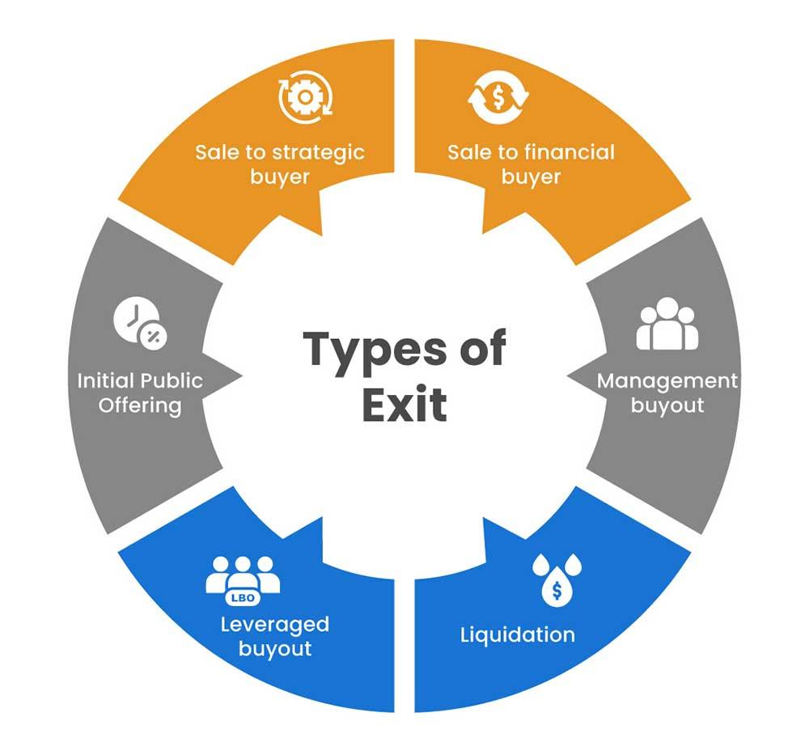

## Table of Contents

## What is an exit strategy in business?

An exit strategy in business is a plan that an owner or investor makes to sell their company or their share in it. It's like a roadmap for leaving the business in a way that helps them get the most money or achieve other goals. People might want an exit strategy if they want to retire, start a new business, or just move on to something else.

Having an exit strategy is important because it helps business owners think about the future. It makes them plan how to make their business more valuable and attractive to buyers. This can mean growing the business, making more profit, or building a strong team that can keep the business running well without the owner. By planning ahead, owners can make sure they leave their business in good shape and get the best possible outcome when they decide to exit.

## Why is it important to have an exit strategy?

Having an exit strategy is important because it helps business owners plan for the future. It's like having a map that shows you how to leave your business in a good way. When you have an exit strategy, you think about what you want to happen when you decide to leave your business. This could be selling it, passing it on to someone else, or closing it down. By planning ahead, you can make sure that you get the best possible outcome when you exit.

An [exit](/wiki/exit-strategy) strategy also helps make your business more valuable. When you know you might sell your business one day, you work on making it better. This means growing the business, making more money, and building a strong team that can run the business without you. When your business is in good shape, it's more attractive to buyers, and you can get a better price for it. So, having an exit strategy not only helps you leave on your terms but also makes your business worth more.

## What are the common types of exit strategies for business owners?

There are several common types of exit strategies that business owners can consider. One popular way is selling the business to another company or an individual. This can happen through a merger, where two companies join together, or an acquisition, where one company buys another. Another way is to sell the business to the employees through an employee stock ownership plan (ESOP). This lets the employees own part or all of the company.

Another exit strategy is passing the business on to family members. This is called succession planning. It's a good choice if you want to keep the business in the family. Some owners also choose to go public, which means selling shares of the company to the public through an initial public offering (IPO). This can bring in a lot of money, but it also means following strict rules and sharing control of the company.

Lastly, some owners decide to liquidate the business. This means selling off all the assets and closing down the business. It's often chosen when the business isn't doing well or when the owner just wants to stop. Each of these strategies has its own pros and cons, and the best choice depends on what the owner wants and the situation of the business.

## How does a business valuation impact the choice of an exit strategy?

A business valuation helps you figure out how much your business is worth. This number is really important when you're choosing an exit strategy because it affects what you can do next. If your business is worth a lot, you might decide to sell it to another company or go public with an IPO. A high valuation can attract more buyers and get you a better price. On the other hand, if your business isn't worth as much as you hoped, you might need to work on making it more valuable before you can sell it or pass it on.

Knowing your business's value also helps you decide if it's the right time to exit. If the valuation is lower than you need, you might choose to keep running the business and try to increase its value. You could do this by growing the business, making more profit, or improving how things are run. If the valuation is good enough, you might feel ready to move forward with your exit plan, whether that means selling, passing it to family, or closing down. In the end, the business valuation guides you in [picking](/wiki/asset-class-picking) the best exit strategy for your situation.

## What are the steps to prepare for an exit strategy?

Preparing for an exit strategy starts with understanding your business's value. You need to get a business valuation done by a professional. This tells you how much your business is worth right now. Once you know this, you can see if you need to work on making your business more valuable. You might need to grow your business, make more profit, or build a strong team that can run things without you. This step is important because it helps you decide if you're ready to exit or if you need more time.

Next, you should think about what kind of exit you want. Do you want to sell your business to another company, pass it on to your family, or maybe close it down? Each choice has different steps to follow. If you want to sell, you'll need to find buyers and maybe hire a broker to help. If you're passing it to family, you'll need to train them and make sure they're ready to take over. No matter what you choose, you'll need to get your financial records in order. This means making sure all your taxes are paid, and your [books](/wiki/algo-trading-books) are clear and up-to-date. Good records make your business look more attractive to buyers or easier to pass on.

Finally, it's a good idea to talk to your advisors, like your accountant or lawyer, to make sure everything is set up correctly. They can help you with legal documents and make sure you're following all the rules. Planning your exit strategy takes time, but it helps you leave your business on your terms and get the best possible outcome.

## How can timing affect the success of an exit strategy?

Timing can really change how well your exit strategy works. If you choose to leave your business at the right time, you can get a better price for it. For example, if the economy is doing well and people are buying businesses, you might get more money for yours. Also, if your business is growing and making more profit, it's a good time to sell because it looks more attractive to buyers. Waiting for the right moment can make a big difference in how much money you get and how smoothly everything goes.

On the other hand, bad timing can make things harder. If you try to exit when the economy is struggling or your business isn't doing well, it might be tough to find buyers. You might have to sell for less money than you wanted. Sometimes, personal reasons like health issues or family changes can force you to exit at a bad time. That's why it's important to plan ahead and be ready to wait for the right moment if you can. Good timing helps you leave your business in the best way possible.

## What are the tax implications of different exit strategies?

When you choose an exit strategy for your business, you need to think about taxes. If you sell your business, you might have to pay capital gains tax on the profit you make from the sale. The tax rate can be different depending on how long you owned the business and how much money you made. If you pass your business to your family, there might be gift or estate taxes to think about. These taxes can be high, so it's good to plan ahead and maybe talk to a tax advisor to see how you can lower them.

Another exit strategy is to go public with an IPO. This can bring in a lot of money, but it also means you'll have to pay taxes on the money you make from selling shares. The tax rules for IPOs can be complicated, so it's important to understand them well. If you decide to liquidate your business, you'll need to think about taxes on the money you get from selling your assets. Each type of asset might be taxed differently, so it's a good idea to know what to expect. No matter which exit strategy you choose, taxes will play a big role, so planning carefully can help you keep more of your money.

## How do legal considerations influence the choice of an exit strategy?

Legal considerations can really affect which exit strategy you pick for your business. If you want to sell your business, you need to make sure all your legal documents are in order. This includes contracts, leases, and any agreements with employees or partners. You might need to get a lawyer to help you with the sale agreement to make sure everything is fair and legal. If you're thinking about passing your business to your family, you'll need to think about estate planning and maybe set up a trust or will. This can help you avoid legal problems and make sure your family gets the business smoothly.

Also, if you're considering an IPO, there are a lot of legal rules you have to follow. You'll need to file a lot of paperwork with the government and make sure you're following all the rules for public companies. This can be a lot of work, so it's important to have good legal advice. If you decide to liquidate your business, you'll need to follow the legal steps for closing down a business, like paying off debts and notifying the right people. Legal issues can make your exit strategy more complicated, so it's a good idea to plan ahead and get help from a lawyer to make sure everything goes smoothly.

## What role does succession planning play in an exit strategy?

Succession planning is a big part of an exit strategy, especially if you want to pass your business to someone else, like family or employees. It's all about getting ready for the day you leave the business. You need to find the right person to take over and make sure they know how to run things. This means training them and helping them understand the business. If you do this well, your business can keep going strong even after you're gone. It's like making sure the next person can keep the business running smoothly.

If you don't plan for succession, it can be hard for your business to keep going. Without a good plan, the business might struggle, and the people taking over might not know what to do. This can make the business less valuable and harder to sell. By planning ahead, you make sure the business stays strong and valuable. This helps you leave on your terms and makes sure the business keeps doing well after you're gone.

## How can an exit strategy be adjusted in response to market changes?

An exit strategy can be changed if the market changes. If the economy is doing well and businesses are selling for more money, you might decide to sell your business sooner than you planned. On the other hand, if the market is not doing well, you might want to wait until things get better. You can also make your business more valuable by growing it or making more profit, so it's more attractive to buyers when the market improves.

Sometimes, you might need to switch your exit strategy completely. For example, if you were planning to sell your business but the market is bad, you might decide to pass it to your family instead. Or, if you were going to go public with an IPO but the stock market is down, you might choose to wait or look at other options like selling to another company. Being flexible and ready to change your plan can help you get the best outcome, no matter what the market is doing.

## What are the potential pitfalls to avoid when implementing an exit strategy?

When you're putting your exit strategy into action, one big mistake to avoid is not planning early enough. If you wait until the last minute, you might not have time to make your business more valuable or find the right buyer. It's important to start planning your exit a few years before you want to leave. This gives you time to fix any problems, grow your business, and make it ready for someone else to take over. Rushing can lead to selling for less money or leaving the business in a bad state.

Another pitfall is not getting good advice. You need to talk to experts like lawyers, accountants, and business brokers. They can help you understand the legal and tax issues, and make sure you're following all the rules. Without their help, you might miss important steps or make costly mistakes. Also, don't forget about your emotions. Leaving your business can be hard, and sometimes feelings can get in the way of making smart choices. It's good to stay calm and think clearly about what's best for you and your business.

## How can advanced financial modeling enhance the effectiveness of an exit strategy?

Advanced financial modeling can really help make your exit strategy work better. It's like having a detailed map that shows you how much your business might be worth in the future. With this kind of modeling, you can see how different choices might change the value of your business. For example, if you want to sell your business, you can use the model to see how growing your business or making more profit could make it worth more money. This helps you make smart decisions about when to sell and how to make your business more attractive to buyers.

Also, financial modeling can help you plan for different situations. The market can change, and your business might face new challenges. By using a financial model, you can see how these changes might affect your exit strategy. This way, you can be ready to adjust your plan if needed. Whether you're thinking about selling, passing the business to your family, or closing it down, good financial modeling gives you the information you need to make the best choices and get the most out of your exit.

## References & Further Reading

[1]: Bergstra, J., Bardenet, R., Bengio, Y., & Kégl, B. (2011). ["Algorithms for Hyper-Parameter Optimization."](https://dl.acm.org/doi/10.5555/2986459.2986743) Advances in Neural Information Processing Systems 24.

[2]: ["Advances in Financial Machine Learning"](https://www.amazon.com/Advances-Financial-Machine-Learning-Marcos/dp/1119482089) by Marcos Lopez de Prado

[3]: ["Evidence-Based Technical Analysis: Applying the Scientific Method and Statistical Inference to Trading Signals"](https://www.amazon.com/Evidence-Based-Technical-Analysis-Scientific-Statistical/dp/0470008741) by David Aronson

[4]: ["Machine Learning for Algorithmic Trading"](https://github.com/stefan-jansen/machine-learning-for-trading) by Stefan Jansen

[5]: ["Quantitative Trading: How to Build Your Own Algorithmic Trading Business"](https://www.amazon.com/Quantitative-Trading-Build-Algorithmic-Business/dp/1119800064) by Ernest P. Chan