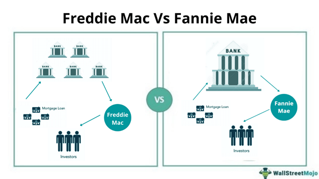

## Table of Contents

## What are Fannie Mae and Freddie Mac?

Fannie Mae and Freddie Mac are two big companies in the United States that help people buy homes. They do this by buying mortgages from banks and other lenders. This means that banks can lend more money to more people because they get their money back quickly from Fannie Mae and Freddie Mac. Both companies are very important because they make it easier for people to get loans to buy houses.

Fannie Mae, which stands for the Federal National Mortgage Association, was created by the government in 1938. Freddie Mac, or the Federal Home Loan Mortgage Corporation, was started in 1970. Even though they were created by the government, they are now run more like private companies. However, the government still keeps a close eye on them to make sure they are doing their job well.

These companies also help to keep mortgage interest rates stable. By buying and selling mortgages, they can control how much it costs for people to borrow money to buy a home. This is good for the economy because it helps more people afford to buy houses, which can make neighborhoods and communities stronger.

## When were Fannie Mae and Freddie Mac established?

Fannie Mae was set up in 1938. It is short for the Federal National Mortgage Association. The government made it to help people buy homes by buying mortgages from banks. This way, banks could lend more money to more people.

Freddie Mac was created in 1970. Its full name is the Federal Home Loan Mortgage Corporation. Like Fannie Mae, it was started by the government to buy mortgages from lenders. This helps keep the flow of money going so more people can get loans to buy houses.

## What is the primary function of Fannie Mae and Freddie Mac?

Fannie Mae and Freddie Mac help people buy homes by buying mortgages from banks and other lenders. When a bank gives someone a loan to buy a house, Fannie Mae or Freddie Mac can buy that loan from the bank. This means the bank gets its money back quickly and can then use that money to give out more loans to other people who want to buy homes.

By doing this, Fannie Mae and Freddie Mac make it easier for banks to lend money. This helps more people get loans to buy houses. They also help keep the cost of borrowing money stable, which is good for the economy. When more people can afford to buy homes, it can make neighborhoods and communities stronger.

## How do Fannie Mae and Freddie Mac differ from each other?

Fannie Mae and Freddie Mac are similar because they both help people buy homes by buying mortgages from banks. But they were created at different times and for slightly different reasons. Fannie Mae, which stands for the Federal National Mortgage Association, was started in 1938 by the government to help people get loans to buy houses. Freddie Mac, or the Federal Home Loan Mortgage Corporation, was set up in 1970 to add more competition to the mortgage market and give banks another place to sell their loans.

Even though they do similar things, Fannie Mae and Freddie Mac have some differences in how they work. Fannie Mae focuses more on buying mortgages directly from banks and then holding onto them or selling them to investors. Freddie Mac, on the other hand, often packages these mortgages into securities and sells them to investors. This means Freddie Mac plays a bigger role in the secondary mortgage market. Both companies are important for keeping the housing market stable, but they use different methods to do so.

## What role do Fannie Mae and Freddie Mac play in the U.S. housing market?

Fannie Mae and Freddie Mac are really important in the U.S. housing market. They help people buy homes by buying mortgages from banks. When a bank gives someone a loan to buy a house, Fannie Mae or Freddie Mac can buy that loan. This means the bank gets its money back fast and can then give out more loans to other people who want to buy homes. This makes it easier for banks to lend money, so more people can get loans to buy houses.

Both companies also help keep the cost of borrowing money stable. By buying and selling mortgages, they can control how much it costs for people to borrow money to buy a home. This is good for the economy because it helps more people afford to buy houses. When more people can buy homes, it can make neighborhoods and communities stronger. So, Fannie Mae and Freddie Mac play a big role in making sure the housing market works well for everyone.

## How are Fannie Mae and Freddie Mac funded?

Fannie Mae and Freddie Mac get their money from selling bonds and other securities to investors. When they buy mortgages from banks, they need money to do that. So, they sell bonds to people and big investors who want to make money. These bonds are like IOUs where investors lend money to Fannie Mae or Freddie Mac, and in return, they get interest payments over time.

They also make money by charging fees. When they buy a mortgage from a bank, they charge a small fee for doing that. This fee helps them cover their costs and make a profit. So, they use the money from selling bonds and the fees they charge to keep buying more mortgages and helping more people buy homes.

## What is the government's relationship with Fannie Mae and Freddie Mac?

Fannie Mae and Freddie Mac were both created by the U.S. government. Fannie Mae started in 1938, and Freddie Mac began in 1970. Even though they were set up by the government, they now work more like private companies. This means they have their own leaders and make their own decisions, but the government still watches over them to make sure they are doing a good job.

During the 2008 financial crisis, the government had to step in to help Fannie Mae and Freddie Mac. They were struggling and needed money to keep going. So, the government put them under something called conservatorship. This means the government took control to fix them and make sure they could keep helping people buy homes. The government still has a big say in how they run, but they are slowly working to get back to being more independent.

## What happened to Fannie Mae and Freddie Mac during the 2008 financial crisis?

During the 2008 financial crisis, Fannie Mae and Freddie Mac got into big trouble. They had bought a lot of mortgages that people couldn't pay back. This made them lose a lot of money. Because they were so important to the housing market, the government had to step in to help them. The government put them under something called conservatorship. This means the government took control to fix them and make sure they could keep helping people buy homes.

The conservatorship meant that the government gave Fannie Mae and Freddie Mac a lot of money to keep them going. They also made sure that they were run in a way that would help them get better. Even though they are slowly working to get back to being more independent, the government still has a big say in how they run. This was all done to make sure that the housing market didn't fall apart and that people could still get loans to buy homes.

## How have Fannie Mae and Freddie Mac been regulated post-2008?

After the 2008 financial crisis, the government put Fannie Mae and Freddie Mac under conservatorship. This meant the government took control to fix them and make sure they could keep helping people buy homes. The Federal Housing Finance Agency (FHFA) was put in charge of watching over them. The FHFA made new rules to make sure Fannie Mae and Freddie Mac were safer and more stable. They had to follow stricter rules about the kinds of mortgages they could buy and how much risk they could take.

The government also made sure that Fannie Mae and Freddie Mac had enough money to keep going. They got money from the government to help them stay afloat. Over time, the FHFA has been working to help them get back to being more independent. But the government still keeps a close eye on them to make sure they are doing their job well and not taking too many risks. This helps keep the housing market stable and helps more people buy homes.

## What are the current challenges facing Fannie Mae and Freddie Mac?

Fannie Mae and Freddie Mac face some big challenges right now. One main challenge is figuring out how to become more independent again after being under government control since the 2008 financial crisis. They need to find ways to make money and grow on their own, but it's hard because the government still has a big say in how they run. They also need to make sure they don't take too many risks with the mortgages they buy, so they don't get into trouble like they did before.

Another challenge is keeping up with changes in the housing market. Interest rates, home prices, and how many people want to buy homes can all change quickly. Fannie Mae and Freddie Mac have to adjust to these changes while still helping people get loans to buy houses. They also need to deal with new rules and regulations from the government that can make their job harder. All these challenges make it tough for them to do their important work of helping people buy homes and keeping the housing market stable.

## How do Fannie Mae and Freddie Mac impact mortgage rates?

Fannie Mae and Freddie Mac help keep mortgage rates steady. They do this by buying mortgages from banks and then selling them to investors. When they buy a lot of mortgages, it means banks have more money to lend out, which can help keep interest rates lower. If they buy fewer mortgages, it can make rates go up because banks might not have as much money to lend.

They also help by setting standards for the mortgages they will buy. If a mortgage meets their rules, it's called a "conforming" loan, and it usually has a lower [interest rate](/wiki/interest-rate-trading-strategies). This is because investors feel safer buying these loans. So, by setting these standards, Fannie Mae and Freddie Mac help make sure that many people can get loans with good rates, which makes buying a home more affordable for a lot of families.

## What are the future prospects for Fannie Mae and Freddie Mac in the housing finance system?

The future of Fannie Mae and Freddie Mac in the housing finance system is a bit uncertain but important. They are still under government control, which started after the 2008 financial crisis. People are talking about how they can become more independent again. The government wants them to be strong and stable but also to take less risk. This means they need to find a good balance between helping people buy homes and making sure they don't get into trouble like they did before.

Changes in the housing market and new rules from the government will also affect their future. They need to keep up with things like interest rates and home prices, which can change a lot. Fannie Mae and Freddie Mac will need to keep working to make sure they can help as many people as possible get loans to buy homes. If they can do this well, they will continue to play a big role in making the housing market stable and helping families achieve their dream of homeownership.

## References & Further Reading

[1]: ["Mortgage-Backed Securities: Developments and Considerations"](https://finbold.com/guide/mortgage-backed-securities/) by John L. Krainer - Federal Reserve Bank of San Francisco

[2]: ["The Hidden Cost of Fannie Mae and Freddie Mac"](https://www.investopedia.com/articles/economics/08/fannie-mae-freddie-mac-credit-crisis.asp) by David Reiss - National Bureau of Economic Research 

[3]: ["Algorithmic Trading and Market Dynamics"](https://www.cmegroup.com/education/files/Algo_and_HFT_Trading_0610.pdf) by Giuseppe Di Piazza and Emilio Barucci - World Scientific Publishing

[4]: ["Advances in Financial Machine Learning"](https://www.amazon.com/Advances-Financial-Machine-Learning-Marcos/dp/1119482089) by Marcos Lopez de Prado

[5]: ["Artificial Intelligence in Finance and Industry"](https://www.ibm.com/topics/artificial-intelligence-finance) by Lee, Thomas B. - Journal of Financial Economics

[6]: ["Quantitative Trading: How to Build Your Own Algorithmic Trading Business"](https://github.com/LucindaYa/quant-resources/blob/master/Quantitative%20Trading%20How%20to%20Build%20Your%20Own%20Algorithmic%20Trading%20Business.pdf) by Ernest P. Chan