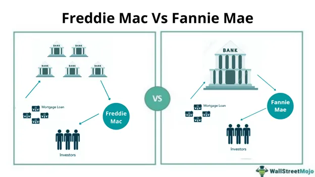

The landscape of mortgage finance has evolved significantly with the advent of advanced technologies. Over the decades, Fannie Mae and Freddie Mac have become pillars of the U.S. housing market by ensuring liquidity and stability. These government-sponsored enterprises (GSEs) achieve this by purchasing and guaranteeing mortgages, thus enabling lenders to offer more accessible and varied lending options to homebuyers. This ecosystem provides a steady flow of capital, which is crucial for a resilient housing finance market.

In recent years, algorithmic trading has started to play a transformative role in mortgage finance. Originally popularized within stock, commodity, and forex markets, algorithmic trading utilizes complex mathematical models for making rapid trading decisions. The incorporation of such technologies promises to revolutionize how mortgages are traded, managed, and perceived. Algorithms can process vast amounts of data at high speeds, offering potentially significant improvements in pricing precision, risk management, and operational efficiency for Fannie Mae and Freddie Mac, as well as private market participants.

This article examines the intersection of these critical players—Fannie Mae, Freddie Mac, and algorithmic trading—and their combined effect on the future of housing markets. As we explore these elements, it becomes clear that the integration of advanced technologies in mortgage finance is not just a fleeting trend but a fundamental shift that promises to redefine the landscape of the U.S. housing market.

## Table of Contents

## Understanding Fannie Mae and Freddie Mac

Fannie Mae (Federal National Mortgage Association) and Freddie Mac (Federal Home Loan Mortgage Corporation) are two pivotal government-sponsored enterprises (GSEs) that bolster the U.S. housing market by purchasing and guaranteeing mortgages from lenders. These institutions were established to enhance the flow of credit to the housing sector and to promote access to mortgage financing for homebuyers.

**Background and Establishment**

Fannie Mae was created in 1938 during the Great Depression as part of the New Deal to revitalize the housing market by ensuring liquidity, stability, and affordability. Initially a government agency, it transitioned into a privately-held corporation in 1968. Freddie Mac was established in 1970 to provide competition and promote a more robust market for mortgage financing.

Both entities share a common mission: to facilitate the flow of capital into the mortgage market by purchasing mortgages from lenders. This practice allows lenders to replenish their funds and extend new loans to aspiring homeowners. By doing so, Fannie Mae and Freddie Mac effectively maintain a stable and affordable supply of mortgage credit.

**Impact on Mortgage Interest Rates**

Fannie Mae and Freddie Mac significantly influence mortgage interest rates and the overall housing market. By guaranteeing a large [volume](/wiki/volume-trading-strategy) of mortgages, they contribute to setting benchmarks that other lenders follow. This is because the securities they issue, known as mortgage-backed securities (MBS), are typically low-risk and attract a wide range of investors. As a result, they have a pivotal role in dictating the terms and availability of mortgages throughout the nation.

The ability of these GSEs to pool and securitize mortgages creates [liquidity](/wiki/liquidity-risk-premium) by allowing the risk associated with individual loans to be spread across many investors. Moreover, their buying power helps standardize lending practices, leading to more predictable and generally lower interest rates for borrowers.

Over the years, both institutions have evolved in their operations and policies to adapt to the changing economic landscape and regulatory environment. The 2008 financial crisis was a significant turning point, leading to both entities being placed into conservatorship under the Federal Housing Finance Agency (FHFA) due to their critical nature and the risks they posed to the financial system.

While Fannie Mae and Freddie Mac have become integral to the mortgage finance mechanism, continuing dialogue around their future structure and role in the housing market reflects their significant impact and the complexities involved in their operations. These GSEs remain foundational in supporting homeownership and stabilizing the housing finance system.

## The Rise of Algorithmic Trading in Financial Markets

Algorithmic trading has revolutionized financial markets by utilizing complex mathematical models to execute trades at speeds and frequencies beyond the capabilities of human traders. This approach has become a cornerstone in stock, commodity, and [forex](/wiki/forex-system) markets, facilitating more efficient trading.

At its core, [algorithmic trading](/wiki/algorithmic-trading) involves using algorithms—automated sets of rules—to make trading decisions based on pre-defined criteria. These algorithms analyze market data, such as price, volume, and time, and execute trades at optimal times to maximize profit or minimize cost. 

Historically, algorithmic trading's emergence can be traced back to the 1970s when simple models were used for portfolio selection and market-making. However, its rise to prominence occurred in the late 20th century with the advancement of computer processing power and the explosion of high-frequency trading ([HFT](/wiki/high-frequency-trading-strategies)) in the early 2000s. This development was catalyzed by improvements in electronic trading systems and regulatory changes, such as the publication of Regulation National Market System (Reg NMS) by the U.S. Securities and Exchange Commission in 2005, which promoted equal access to market data.

Algorithmic trading has had a profound impact on market liquidity and [volatility](/wiki/volatility-trading-strategies). By providing continuous buy and sell orders, algorithms contribute to market depth, thereby enhancing liquidity. Nonetheless, the rapid execution of trades can also lead to increased market volatility. Events like the "Flash Crash" of May 6, 2010, where the Dow Jones Industrial Average dropped nearly 1,000 points in minutes before recovering, highlight the potential for algorithms to exacerbate market swings.

Several key players drive innovation in algorithmic trading, including financial institutions, hedge funds, and technology companies specializing in [quantitative trading](/wiki/quantitative-trading) strategies. Renowned organizations like Renaissance Technologies, Two Sigma, and Citadel are instrumental in advancements within the field, continuously developing sophisticated algorithms that leverage [artificial intelligence](/wiki/ai-artificial-intelligence) and [machine learning](/wiki/machine-learning). These entities invest heavily in research and development to stay ahead in an increasingly competitive market landscape.

Algorithmic trading's complexity and speed have become indispensable in modern finance, enabling traders to manage vast amounts of data and execute strategies that were once unimaginable. The ongoing evolution of technology promises further advancements, with algorithms evolving to become more adaptive and autonomous, marking a significant shift in how markets operate.

## Integration of Algo Trading in Mortgage Finance

The integration of algorithmic trading into mortgage finance has introduced a new paradigm to the operations of Fannie Mae and Freddie Mac. These government-sponsored enterprises (GSEs) increasingly rely on algorithmic models to manage and analyze large datasets, ultimately transforming their approach to mortgage data processing and trading.

Algorithmic models use sophisticated algorithms to interpret and manage extensive volumes of mortgage data efficiently. These algorithms are designed to identify patterns and predict market trends, enabling GSEs to make informed decisions when purchasing and guaranteeing mortgages from lenders. The models utilize techniques such as machine learning to enhance predictive accuracy, thereby improving the quality of mortgage-backed securities (MBS) that Fannie Mae and Freddie Mac issue.

The benefits of employing algorithmic trading in mortgage finance are substantial, particularly concerning pricing, risk management, and loan processing. Algorithms can automatically adjust pricing models based on real-time market data, thereby optimizing the valuation of mortgage securities. In terms of risk management, algorithmic models provide a rigorous analysis of credit risk, enabling GSEs to mitigate potential losses from mortgage defaults. Additionally, algorithms streamline loan processing by automating repetitive tasks, reducing human error and increasing overall processing speed.

Efficiency gains and reduced transaction costs are notable advantages of algorithmic trading in mortgage markets. By automating trading operations, GSEs can execute trades at optimal times, ensuring timely execution that manual processes could not match. This automation reduces transaction costs, leading to higher returns on investments in the secondary mortgage market. Furthermore, the rapid execution capabilities associated with algorithmic trading improve market liquidity, making it easier to buy and sell mortgage-backed securities.

Nevertheless, incorporating algorithmic trading into mortgage finance presents challenges and potential risks. One significant challenge is ensuring the accuracy of algorithmic models, as erroneous predictions can lead to significant financial losses. There is also the risk of over-reliance on technology, which can expose GSEs to cybersecurity threats and technical failures. Moreover, the complexity of algorithms may lead to unintended market distortions, particularly if large volumes of trades are executed simultaneously based on similar triggers.

In conclusion, while the adoption of algorithmic trading in mortgage finance offers numerous advantages, it also requires careful management of associated risks. By refining their models and implementing robust risk management strategies, Fannie Mae and Freddie Mac can leverage algorithmic trading to enhance their operational efficiency and market competitiveness.

## Case Studies and Recent Developments

Algorithmic trading has made significant inroads into mortgage finance, transforming how market participants approach mortgage-backed securities (MBS) and related assets. Traditionally dominated by human traders, the sector has seen a growing trend towards leveraging algorithms to enhance efficiency, risk management, and pricing strategies.

### Real-World Examples

One prominent application of algorithmic trading in mortgage finance involves predictive analytics for mortgage prepayment risk. Algorithms analyze borrower data, market conditions, and economic indicators to forecast prepayment speeds—critical for pricing MBS. Such precision aids in reducing price discrepancies and optimizing trade execution.

Further, algorithmic models assist in the secondary mortgage market. For instance, algorithms evaluate millions of data points to predict default probabilities, enabling more accurate loan pricing. This application has been instrumental for investors in assessing the credit quality of mortgage pools and structuring investment strategies accordingly.

### Digital Transformation at Fannie Mae and Freddie Mac

Fannie Mae and Freddie Mac have taken notable steps towards digital transformation, implementing advanced technologies to streamline operations. They are integrating algorithmic trading into their risk management and loan processing strategies. By adopting digital platforms, these GSEs are enhancing data handling capabilities, crucial for executing complex algorithms efficiently.

For example, both GSEs are investing in cloud computing and big data analytics to better manage mortgage data. This infrastructure supports the sophisticated algorithmic models necessary for evaluating loan portfolios and pricing MBS with heightened accuracy.

### Successful Algo Trading Strategies

In recent years, hedging strategies in mortgage finance have increasingly relied on algorithms. Algorithms can dynamically adjust hedge ratios in response to [interest rate](/wiki/interest-rate-trading-strategies) fluctuations and market volatility, minimizing potential losses for mortgage portfolios. These strategies combine statistical [arbitrage](/wiki/arbitrage) techniques and machine learning models to refine execution and reduce transaction costs.

### Market Trends

The mortgage market is experiencing a significant shift towards automation, with algorithmic trading volumes steadily increasing. This growth reflects a broader market trend favoring data-driven decision-making over traditional methods. The adoption of algorithms in pricing and risk management is enhancing market liquidity, making it easier for participants to enter and [exit](/wiki/exit-strategy) positions at favorable prices.

### Future Prospects and Innovations

The integration of machine learning and artificial intelligence represents the next frontier in algorithmic trading for mortgage finance. Predictive models are expected to become even more accurate, providing real-time insights into market movements and borrower behavior. This evolution could revolutionize the investment strategies of GSEs like Fannie Mae and Freddie Mac, making them more adaptable to market changes.

Moreover, innovations such as quantum computing hold the potential to further accelerate algo trading capabilities. With enhanced computational power, algorithms could process more complex datasets faster, unlocking new levels of precision in mortgage valuation and risk assessment.

Overall, the fusion of technology and mortgage finance promises significant advancements, heralding a more automated, efficient, and responsive market landscape. The sustainable integration of these technologies will be crucial in maintaining market stability and fostering continued innovation.

## The Future of Mortgage Finance with AI and Algo Trading

Artificial Intelligence (AI) and machine learning have the potential to revolutionize mortgage finance by optimizing numerous aspects of the industry. These technologies are poised to enhance efficiencies in underwriting, risk assessment, and customer interaction, ultimately transforming the mortgage landscape.

### Revolutionizing Mortgage Finance with AI and Machine Learning

AI and machine learning can dramatically improve data analysis, enabling lenders to assess borrower creditworthiness more accurately. Unlike traditional methods, AI can process vast datasets and identify patterns that humans might miss. Machine learning algorithms can predict default risks by analyzing historical data and borrower behavior, thereby reducing the incidence of bad loans. This predictive capability allows lenders to tailor loan offerings to individuals, improving customer satisfaction and minimizing risk.

AI can also automate underwriting processes, expediting loan approvals by reducing manual intervention. Algorithms can evaluate numerous parameters simultaneously, including income, credit history, and property value, to make informed lending decisions. This automation not only speeds up the process but also reduces costs for lenders.

### Technological Adoption Forecasts

Over the next decade, the adoption of AI and machine learning in mortgage finance is expected to increase exponentially. As these technologies become more sophisticated, their integration into credit scoring systems and loan origination processes will grow. According to industry forecasts, AI-driven mortgage applications could account for a significant portion of market activities, driven by increasing demand for personalized financial products.

### Impact on Homebuyers, Lenders, and the Economy

The adoption of AI in mortgage finance can significantly benefit homebuyers. For borrowers, AI offers more personalized mortgage solutions, potentially leading to better interest rates and terms tailored to individual financial situations. For lenders, the enhanced risk assessment capabilities reduce default rates, leading to a more stable financial portfolio.

On a broader scale, the efficiency gains from AI integration can reduce costs for lenders, which could be passed on to consumers, fostering affordability in the housing market. Moreover, as lenders can process applications faster, housing market liquidity could improve, benefiting the broader economy.

### Regulatory Considerations and Frameworks

Regulatory bodies will face challenges in keeping pace with the rapid advancements in AI and machine learning. Ensuring transparency and accountability in AI-driven decision-making processes will be essential. Regulators may need to establish new frameworks to address potential biases in AI algorithms and ensure that lending practices remain fair and equitable.

Property technology (PropTech) regulations will likely evolve, with an emphasis on data protection and privacy. As AI systems increasingly rely on personal data, robust frameworks will be necessary to protect consumer information and maintain trust in AI-powered finance systems.

### Sustainable Integration of Technology

The sustainable integration of AI and machine learning into mortgage finance necessitates a balance between innovation and risk management. Financial institutions will need to focus on developing algorithms that prioritize accuracy and fairness. Continuous monitoring and updating of models will be crucial in maintaining their efficacy over time.

The future of mortgage finance in a tech-driven world hinges on the industry's ability to harness AI's potential while managing the inherent risks. This balance will enable the development of a more resilient, efficient, and customer-centric mortgage finance system that adapitates to changing market dynamics and consumer expectations.

## Conclusion

Fannie Mae and Freddie Mac continue to be pivotal in bolstering the U.S. housing market by ensuring liquidity and stability through their purchase and guarantee of mortgages. These government-sponsored enterprises (GSEs) have historically facilitated the accessibility of home loans, playing a substantial role in influencing mortgage interest rates and overall market stability. As such, these entities remain essential to the fabric of the American economic landscape.

The advent of algorithmic trading has ushered in transformative changes in mortgage finance. By leveraging complex mathematical models and high-speed computational capabilities, algorithmic trading enhances market efficiency, offering significant improvements in pricing, risk management, and transaction processing. These technological advancements bring about increased market liquidity and reduced transaction costs, paving the way for a more streamlined mortgage finance system.

However, the integration of advanced technologies like algorithmic trading necessitates careful risk management to maintain market stability. As these innovations continue to evolve, it is critical to strike a balance between technology and risk oversight, ensuring that the benefits do not overshadow potential system vulnerabilities. Regulatory frameworks and governance structures must adapt to include these technological elements, safeguarding the financial system against unforeseen disruptions.

Innovation and adaptability are crucial in the ever-evolving financial markets. The role of AI and machine learning is expected to deepen further, offering new solutions and enhancing the decision-making processes within mortgage finance. These technologies hold the promise of revolutionizing the industry, providing enhanced insights, operational efficiencies, and improved consumer experiences.

In the future, the mortgage finance landscape will increasingly be characterized by a synergy between traditional operational models and cutting-edge technological strategies. This tech-driven world presents vast opportunities for growth and innovation, promising a robust and resilient housing finance sector that continues to cater to the needs of homebuyers, lenders, and the broader economy while keeping pace with technological advancements.

## References & Further Reading

[1]: ["Mortgage-Backed Securities: Developments and Considerations"](https://finbold.com/guide/mortgage-backed-securities/) by John L. Krainer - Federal Reserve Bank of San Francisco

[2]: ["The Hidden Cost of Fannie Mae and Freddie Mac"](https://www.investopedia.com/articles/economics/08/fannie-mae-freddie-mac-credit-crisis.asp) by David Reiss - National Bureau of Economic Research 

[3]: ["Algorithmic Trading and Market Dynamics"](https://www.cmegroup.com/education/files/Algo_and_HFT_Trading_0610.pdf) by Giuseppe Di Piazza and Emilio Barucci - World Scientific Publishing

[4]: ["Advances in Financial Machine Learning"](https://www.amazon.com/Advances-Financial-Machine-Learning-Marcos/dp/1119482089) by Marcos Lopez de Prado

[5]: ["Artificial Intelligence in Finance and Industry"](https://www.ibm.com/topics/artificial-intelligence-finance) by Lee, Thomas B. - Journal of Financial Economics

[6]: ["Quantitative Trading: How to Build Your Own Algorithmic Trading Business"](https://github.com/LucindaYa/quant-resources/blob/master/Quantitative%20Trading%20How%20to%20Build%20Your%20Own%20Algorithmic%20Trading%20Business.pdf) by Ernest P. Chan