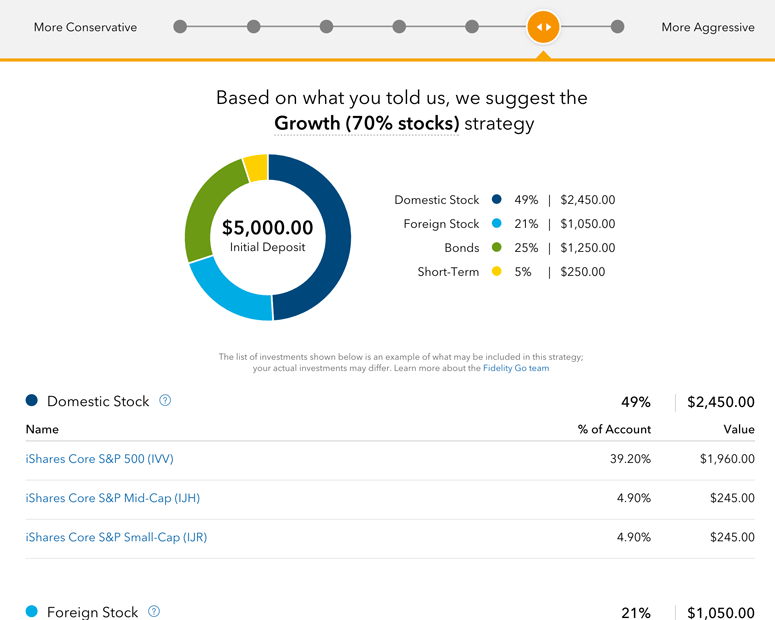

## Table of Contents

## What is Fidelity Go and who is it designed for?

Fidelity Go is a robo-advisor service offered by Fidelity Investments. It helps people invest their money without needing to pick individual stocks or manage their investments themselves. The service uses computer algorithms to create and manage a diversified portfolio based on the user's goals, time horizon, and risk tolerance. Users can start investing with as little as $10, making it accessible for people who don't have a lot of money to invest right away.

Fidelity Go is designed for people who want a simple and low-cost way to invest. It's great for beginners who might feel overwhelmed by the stock market or for anyone who doesn't have the time or interest to manage their investments actively. The service is especially useful for those looking to save for long-term goals like retirement or buying a home, as it offers a hands-off approach to growing their money over time.

## How does Fidelity Go work as a robo-advisor?

Fidelity Go works by using computer programs to help you invest your money. When you sign up, you answer some questions about your goals, how long you want to invest, and how much risk you're okay with. Based on your answers, Fidelity Go picks a mix of investments like stocks and bonds that fit your needs. You can start investing with just $10, and the service takes care of everything, so you don't have to worry about picking individual stocks or keeping track of the market.

As your money grows, Fidelity Go keeps an eye on your investments and makes changes if needed. This means it might buy or sell parts of your portfolio to keep it balanced and in line with your goals. You can check your account anytime online or through the Fidelity app. Plus, if you have any questions, you can talk to a real person at Fidelity for help. It's a simple way to invest without having to do much work yourself.

## What are the fees associated with using Fidelity Go?

Using Fidelity Go is pretty affordable. If you have less than $25,000 in your account, you won't have to pay any fees at all. This makes it easy for people starting out with smaller amounts of money to invest without worrying about extra costs.

Once your account grows and you have $25,000 or more, you'll start paying a small fee. This fee is 0.35% of your account balance each year. So, if you have $30,000 in your account, you'll pay about $105 a year. But remember, this fee helps cover the cost of managing your investments and keeping your portfolio on track.

## What investment options are available through Fidelity Go?

Fidelity Go keeps things simple by focusing on a mix of investments that are easy to understand. They use something called exchange-traded funds (ETFs) for your portfolio. These ETFs are like baskets of different investments, including stocks and bonds. This way, your money is spread out across many different companies and types of investments, which can help reduce risk.

The exact mix of ETFs in your portfolio depends on your answers to their questions about your goals and how much risk you're okay with. If you're more cautious, your portfolio might have more bonds, which are usually safer but grow slower. If you're okay with more risk, you might have more stocks, which can grow faster but are also more up and down. Fidelity Go takes care of [picking](/wiki/asset-class-picking) the right ETFs for you and keeps everything balanced over time.

## How does Fidelity Go determine an investor's risk tolerance and investment strategy?

Fidelity Go figures out your risk tolerance and investment strategy by asking you some questions when you sign up. They want to know about your goals, like if you're saving for retirement or a house, and how long you plan to invest. They also ask how you feel about risk. Do you want to play it safe, or are you okay with the chance of losing some money for the possibility of bigger gains? Your answers help them understand how much risk you're comfortable with.

Based on your answers, Fidelity Go creates a plan that matches your goals and risk level. If you're more cautious, they'll put more of your money into safer investments like bonds. If you're okay with more risk, they'll include more stocks, which can go up and down a lot but might grow your money faster. They use this information to pick the right mix of ETFs for you and keep adjusting your investments over time to stay on track with your plan.

## Can you explain the tax strategy features of Fidelity Go?

Fidelity Go helps you with taxes by using a strategy called tax-loss harvesting. This means if some of your investments lose value, they might sell those investments to use the losses to lower your taxes. It's like finding a silver lining in a bad situation. They do this automatically, so you don't have to worry about it.

The service also keeps your investments in a way that can help you save on taxes. For example, they might put certain investments in accounts that have tax benefits, like retirement accounts. This can help you keep more of your money over time. Fidelity Go takes care of these details for you, making it easier to grow your savings without getting bogged down by tax rules.

## What is the minimum investment required to start using Fidelity Go?

You can start using Fidelity Go with just $10. This low minimum makes it easy for anyone to begin investing, even if you don't have a lot of money to start with. It's a great way to get into the habit of saving and investing without needing a big chunk of cash upfront.

Once you've set up your account and added your $10, Fidelity Go will take care of the rest. They'll use that money to build a portfolio of investments that match your goals and how much risk you're okay with. It's a simple way to start growing your money over time, no matter how small your initial investment is.

## How does Fidelity Go compare to other robo-advisors in the market?

Fidelity Go is a good choice if you want to start investing with just $10. It's free if you have less than $25,000 in your account, which is great for people starting out. Once you have more than $25,000, you'll pay a small fee of 0.35% a year. Fidelity Go uses ETFs to build your portfolio, and they adjust it to match your goals and how much risk you're okay with. They also help with taxes by using something called tax-loss harvesting, which can save you money.

Compared to other robo-advisors, Fidelity Go is pretty simple and affordable. Some other robo-advisors might charge more, like Betterment which has a fee of 0.25% for their basic plan, or Wealthfront which charges 0.25% too. But they might offer more features, like more investment options or tools to help you plan for things like buying a house. If you want a no-fuss way to invest with low costs and the backing of a big company like Fidelity, then Fidelity Go could be a good fit for you.

## What kind of customer support does Fidelity Go offer?

Fidelity Go offers good customer support to help you with your investments. If you have questions or need help, you can call them or chat online. They have real people who can answer your questions and guide you through using the service. This is helpful if you're new to investing and want some extra support.

You can also find a lot of helpful information on their website. They have articles, videos, and guides that explain how investing works and how to use Fidelity Go. This way, you can learn at your own pace and get the information you need without having to call or chat with someone.

## How can users monitor and adjust their portfolios within Fidelity Go?

Users can easily keep an eye on their portfolios with Fidelity Go by logging into their account online or using the Fidelity app on their phone. Once logged in, they can see how their investments are doing, check their account balance, and look at the mix of ETFs in their portfolio. If they want to see how things have changed over time, they can look at performance charts and reports. This makes it simple to stay updated without having to do a lot of work.

If users want to make changes to their portfolio, they can do that too. They can adjust their risk level or investment goals by answering a few questions again. Fidelity Go will then update their portfolio to match the new settings. But remember, the service is designed to be hands-off, so most of the time, Fidelity Go will take care of any needed adjustments automatically. This way, users can focus on their goals without worrying about the day-to-day management of their investments.

## What are the performance metrics and historical returns of Fidelity Go?

Fidelity Go's performance can change a lot depending on what's happening in the market and the mix of investments in your portfolio. They don't give out exact numbers for past returns because everyone's portfolio can be different. But they do say that the ETFs they use are picked to match what the overall market is doing. So, if the market goes up, your portfolio should go up too, and if it goes down, your portfolio might go down as well. The key is to think about the long term and not worry too much about short-term ups and downs.

To get an idea of how well Fidelity Go might do, you can look at the performance of the ETFs they use. These ETFs are usually a mix of stocks and bonds, and their past performance can give you a rough idea of what to expect. But remember, past results don't promise what will happen in the future. It's always a good idea to keep your goals in mind and stay patient, letting Fidelity Go handle the details of your investments over time.

## What advanced features does Fidelity Go offer for experienced investors?

Fidelity Go is mainly designed to be simple and easy to use, but it does have some features that can be helpful for experienced investors. One of these is tax-loss harvesting, which can help you save on taxes by selling investments that have lost value and using those losses to offset gains. This is something that more experienced investors might appreciate because it can make a big difference in how much you pay in taxes each year.

Another feature is the ability to adjust your risk level and investment goals. If you're an experienced investor, you might want to change your portfolio to match changes in your life or the market. Fidelity Go lets you do this by answering a few questions, and they'll update your portfolio to fit your new settings. While it's not as hands-on as managing your own investments, these features can give you some control and flexibility, which can be important for those who know a bit more about investing.

## References & Further Reading

[1]: ["Robo-Advisors: A Portfolio Management Perspective"](https://economics.yale.edu/sites/default/files/2023-01/Jonathan_Lam_Senior%20Essay%20Revised.pdf) by Tobias J. Moskowitz, CFA Institute Financial Analysts Journal, 2017.

[2]: ["Digital Wealth Management: Robo-Advisors - New Developments in Investment Advisory"](https://www.sciencedirect.com/science/article/pii/S0304405X24000527) in Handbook of Blockchain, Digital Finance, and Inclusion, Vol. 2.

[3]: ["The Rise of Robo-Advisors: Changing the Concept of Wealth Management"](https://davidstreltsoff.medium.com/the-rise-of-robo-advisors-in-wealth-management-4193918daed8), Deloitte Insights, 2016.

[4]: Uhl, M. W., & Rohner, P. (2018). ["Robo-Advisors and Investors: Enhanced Information and Disintermediation"](https://papers.ssrn.com/sol3/papers.cfm?abstract_id=3131895). ECIS 2018 Proceedings.

[5]: ["Algorithmic Trading and Stocks"](https://www.investopedia.com/articles/active-trading/101014/basics-algorithmic-trading-concepts-and-examples.asp) by Adam Hayes, Investopedia. 

[6]: ["Fidelity Digital Assets: Building the Future of Financial Infrastructure"](https://institutional.fidelity.com/advisors/investment-solutions/strategies/digital-assets) by Fidelity Digital Assets. 

[7]: Ben-David, L., Franzoni, F., & Moussawi, R. (2019). ["The Characteristics of Mutual Fund Portfolios"](https://onlinelibrary.wiley.com/doi/abs/10.1111/jofi.12727) in Journal of Finance.