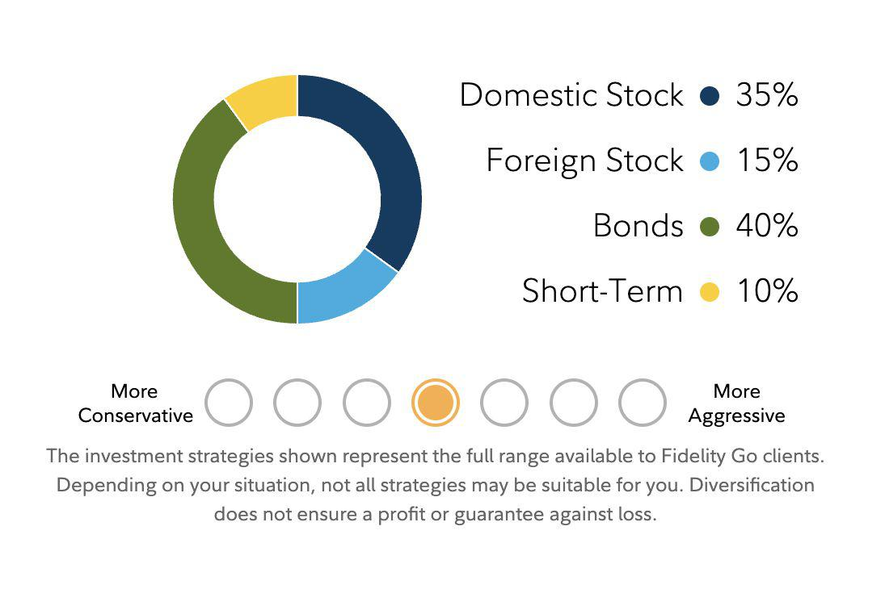

In the evolving landscape of investment management, robo-advisors have rapidly gained traction as an automated, algorithm-driven financial management solution. These digital platforms leverage technology to offer a hands-off investment approach, which appeals to both novice and seasoned investors. Fidelity Go stands out among these platforms by providing an intuitive, streamlined interface designed to simplify the investment process for users.

Fidelity Go offers a unique combination of robust features, including low-cost investment solutions and the expertise of Fidelity Investments, a trusted name in the financial services industry. This article examines Fidelity Go's features and benefits, its role in algorithmic trading, and how it contributes to the wider sphere of automated investing. By evaluating the pros and cons of using Fidelity Go, alongside comparisons with other robo-advisors, we aim to assess whether it aligns with your investment goals.

Our ultimate objective is to furnish a comprehensive overview to aid in making informed investment decisions. Whether you are considering Fidelity Go for its user-friendly interface, low fees, or its synergy with Fidelity's broader financial resources, understanding its strengths and limitations will help determine its suitability for your investment portfolio.

## Table of Contents

## What is Fidelity Go?

Fidelity Go is an automated investment service introduced in 2016 by Fidelity Investments, one of the largest and most respected financial firms globally. This innovative service is designed specifically for investors who prefer a hands-off approach to managing their financial portfolios. Fidelity Go provides a digital platform that simplifies the investment process, allowing users to manage their investments with ease and efficiency. By utilizing proprietary algorithms, the platform constructs and administrates investment portfolios, incorporating the deep resources and financial acumen of Fidelity Investments.

The service excels in offering cost-effective investment solutions, making it accessible to a wide audience. Notably, Fidelity Go imposes no requirement for a minimum account balance to start. For accounts with balances exceeding $25,000, a competitive fee structure begins at 0.35% annually, positioned as a low-cost alternative in the automated investing market. This makes it appealing for those seeking to minimize costs while still benefiting from expert-guided portfolio management.

Fidelity Go represents a significant component of the broadening landscape of robo-advisors, which are continually gaining traction in the financial industry. These platforms effectively democratize access to sophisticated investment management, traditionally available only through human advisors at higher costs. By leveraging technology and data-driven strategies, Fidelity Go provides an efficient, automated investment service designed to cater to the diverse needs of modern-day investors.

## Features and Benefits of Fidelity Go

Fidelity Go offers a range of features designed to streamline the investment process, making it an attractive option for investors seeking a straightforward and efficient platform. One of the primary benefits of Fidelity Go is the absence of management fees for accounts with balances under $25,000, allowing new investors to start building their portfolios without incurring additional costs. This low-cost structure is complemented by the platform's integration with other Fidelity products, which provides users with a cohesive and comprehensive investment experience.

The portfolios within Fidelity Go are constructed using Fidelity Flex mutual funds, which are tailored to provide cost-effective investment solutions. These mutual funds [carry](/wiki/carry-trading) no expense ratios, meaning that investors can maximize the potential of their investments without the burden of additional fees. This feature ensures that more of the investors' capital is actively working towards their financial growth.

Fidelity Go also offers a customizable approach to investment, allowing users to select from 14 different risk levels. This enables investors to tailor their portfolios according to their individual risk tolerance and financial objectives. By offering such a range of risk options, Fidelity Go facilitates a personalized investment strategy that aligns with each investor's specific needs and goals.

The service's integration with the broader Fidelity platform further enhances its appeal. This integration provides users with easy access to a wide range of financial tools and resources, which can be instrumental in making informed investment decisions. By leveraging Fidelity's extensive expertise and resources, Fidelity Go ensures a seamless and supportive investing experience for its users.

## Algo Trading and Automated Investing

Automated investing, also known as [algorithmic trading](/wiki/algorithmic-trading) or algo trading, leverages sophisticated computer algorithms to manage investment portfolios without requiring human intervention. These algorithms are designed to execute trades and strategies in a manner that aims to optimize asset allocation and manage risk levels effectively. This form of investing facilitates a streamlined, hands-off approach, which significantly reduces the necessity for human decision-making and helps in curbing emotional biases that often influence investment choices.

Fidelity Go, in particular, employs algorithmic strategies to ensure that portfolios are continuously adjusted to maintain an optimal asset allocation. This process is known as rebalancing, wherein the platform realigns the asset distribution within a portfolio to adhere to the investor's predefined investment goals and risk tolerance. By automating this aspect of portfolio management, Fidelity Go offers a degree of both efficiency and reliability, allowing investors to benefit from data-driven insights generated by advanced algorithms.

These smart algorithms analyze market trends and execute decisions based on quantitative data, which helps ensure that the investment process remains both efficient and agile. This methodical approach is particularly beneficial for new investors and those preferring a passive investment strategy, as it simplifies the complexities often associated with managing investment portfolios. 

Despite its advantages, Fidelity Go has certain limitations, such as the lack of more sophisticated options like tax-loss harvesting. Tax-loss harvesting is a strategy used by some investors to offset taxable gains by selling securities at a loss. While this feature is not available in Fidelity Go, the overall simplicity and efficiency of its automated processes still present a strong option for many new and passive investors seeking a hassle-free investment experience.

## Pros and Cons of Fidelity Go

Fidelity Go offers a variety of advantages that make it an appealing option for certain investors, particularly those with smaller balances or those already within the Fidelity ecosystem. One of its key benefits is the low management fees on small balances. For accounts under $25,000, Fidelity Go charges no management fees, making it a cost-effective choice for entry-level investors. This low-cost approach extends further as the platform employs Fidelity Flex mutual funds, which carry no additional expense ratios. Consequently, more of your capital is working directly towards your investment goals without being eroded by high fees.

Integration with existing Fidelity accounts is seamless, allowing users to easily manage and track their investments alongside other financial products offered by Fidelity. This ease of integration is coupled with a design prioritizing user experience, offering a straightforward and intuitive interface across both desktop and mobile platforms. This focus on simplicity is beneficial for users who prefer a hands-off approach to investment management while still wanting to keep an eye on their portfolio's performance.

Another advantage of Fidelity Go is the human oversight provided alongside its automated services. Although primarily driven by algorithms, the platform incorporates human supervision in its investment management process, providing an additional layer of professional expertise and reassurance for users who prefer some human involvement in decision-making.

However, Fidelity Go also presents certain limitations. One of the main drawbacks is its restriction to using only proprietary mutual funds. Investors do not have access to individual stocks or exchange-traded funds (ETFs), which could be a disadvantage for those wishing to customize their portfolios with a broader array of assets. This constraint may deter more experienced investors seeking greater diversification options.

Additionally, the platform does not offer tax-loss harvesting, a feature commonly found in many competitive robo-advisor services. Tax-loss harvesting can be an effective strategy for reducing taxable income by offsetting gains with losses, making its absence a notable limitation for investors with larger, taxable accounts who might benefit from such tax optimization strategies.

Overall, while Fidelity Go provides an accessible and reliable option within the Fidelity ecosystem, potential users should carefully consider these benefits and limitations in the context of their personal investment goals and preferences.

## Comparison with Other Robo-Advisors

Fidelity Go is a significant player in the robo-advisor market, going head-to-head with well-known platforms such as Betterment, Wealthfront, and SoFi Invest. Each of these platforms offers unique features that cater to varying investor needs, thereby making it essential to assess their differences carefully.

One of the primary advantages of Fidelity Go lies in its competitive pricing structure, particularly for accounts with under $25,000, which are managed without any fees. This can be highly appealing to new or small-scale investors. In contrast, Betterment and Wealthfront typically charge annual fees ranging from 0.25% to 0.40% depending on account size and service level.

In terms of integration, Fidelity Go seamlessly interacts with the broader Fidelity ecosystem, giving users access to a variety of tools and resources that support informed investment decision-making. This contrasts with platforms like Betterment and Wealthfront, which, while offering substantial resources, may not integrate as deeply with other financial services from a single provider.

Fidelity Go is also tailored for investors who are comfortable with an all-digital interface, offering a straightforward approach to portfolio management. However, platforms such as Betterment and Wealthfront provide advanced features that Fidelity Go does not, such as tax-loss harvesting, which can be beneficial for optimizing tax liabilities. Moreover, these competitors also offer a wider array of asset classes, appealing to investors seeking a more diversified investment strategy.

For SoFi Invest users, the attraction may lie in certain additional offerings such as access to human advisors without extra cost in certain account types, which might be beneficial for those preferring some degree of personalized advice alongside algorithm-driven management.

Ultimately, when selecting a robo-advisor, potential users must evaluate the specific features, fees, and integration capabilities of each platform to ensure alignment with their financial needs and goals. Fidelity Go's versatile and cost-effective structure offers a compelling choice for investors particularly interested in leveraging the resources of one of the largest investment firms.

## Is Fidelity Go Right for You?

Fidelity Go serves as an attractive choice for investors who prioritize a straightforward and low-cost investment solution that requires minimal involvement. For those who are already part of the Fidelity ecosystem, the service offers the added convenience of seamless integration with existing accounts, facilitating a smooth transition between various financial services offered by Fidelity Investments.

Investors who value a comprehensive investment solution with competitive fees and professional oversight will find Fidelity Go's offerings particularly appealing. The platform is designed with user experience in mind, featuring an intuitive interface that caters to both novice and experienced investors seeking a hands-off approach to portfolio management.

However, Fidelity Go might not meet the needs of investors who require advanced features such as tax-loss harvesting, which is a strategy used to offset capital gains by selling securities at a loss to reduce taxable income. Additionally, Fidelity Go's investment options are limited to Fidelity's proprietary mutual funds, which may not suit those looking for a more diverse portfolio that includes individual stocks or exchange-traded funds (ETFs).

Ultimately, deciding whether Fidelity Go is the right choice depends on personal investment preferences, objectives, and the investor's specific financial situation. Those who prioritize simplicity, cost-effectiveness, and integration within the Fidelity ecosystem will likely find Fidelity Go to be a suitable option. Conversely, investors with more complex needs or those seeking a broader range of investment choices may want to consider other robo-advisors that offer additional features and a wider selection of assets.

## Conclusion

Fidelity Go provides a compelling option for investors looking for a trusted, user-friendly robo-advisor backed by one of the largest financial firms. While it lacks certain advanced features offered by competitors, its low fees, integration with Fidelity’s tools, and emphasis on simplicity make it a strong contender in the robo-advisor market. Fidelity Go offers cost-effective management with no additional charges for accounts under $25,000 and uses Fidelity Flex mutual funds, ensuring that more of the investor's money is actively working in the market.

The robo-advisor landscape is evolving, with platforms focusing on delivering automated solutions that cater to diverse investment needs. Fidelity Go is positioned to meet these demands by providing a straightforward approach, devoid of complexities that might intimidate novice investors. Its automated portfolio management, guided by Fidelity’s extensive expertise, enables investors to pursue financial goals without the intricacies involved in manual trade executions and constant portfolio monitoring.

Investors should evaluate their individual needs and explore multiple platforms to ensure they choose a service that aligns with their investment strategy and objectives. It's crucial for investors to conduct thorough comparisons, considering factors such as fee structures, available features, and platform capabilities, before deciding on the appropriate robo-advisor.

Fidelity Go stands out for its balance of cost, ease of use, and connectivity to Fidelity's broader financial resources, making it an excellent choice for investors, especially beginners and those seeking simplicity. It provides a reliable pathway for those who prefer minimal involvement in portfolio management, ensuring a seamless investment experience.

## References & Further Reading

[1]: ["Robo-Advisors: A Portfolio Management Perspective"](https://economics.yale.edu/sites/default/files/2023-01/Jonathan_Lam_Senior%20Essay%20Revised.pdf) by Tobias J. Moskowitz, CFA Institute Financial Analysts Journal, 2017.

[2]: ["Digital Wealth Management: Robo-Advisors - New Developments in Investment Advisory"](https://www.sciencedirect.com/science/article/pii/S0304405X24000527) in Handbook of Blockchain, Digital Finance, and Inclusion, Vol. 2.

[3]: ["The Rise of Robo-Advisors: Changing the Concept of Wealth Management"](https://davidstreltsoff.medium.com/the-rise-of-robo-advisors-in-wealth-management-4193918daed8), Deloitte Insights, 2016.

[4]: Uhl, M. W., & Rohner, P. (2018). ["Robo-Advisors and Investors: Enhanced Information and Disintermediation"](https://papers.ssrn.com/sol3/papers.cfm?abstract_id=3131895). ECIS 2018 Proceedings.

[5]: ["Algorithmic Trading and Stocks"](https://www.investopedia.com/articles/active-trading/101014/basics-algorithmic-trading-concepts-and-examples.asp) by Adam Hayes, Investopedia. 

[6]: ["Fidelity Digital Assets: Building the Future of Financial Infrastructure"](https://institutional.fidelity.com/advisors/investment-solutions/strategies/digital-assets) by Fidelity Digital Assets. 

[7]: Ben-David, L., Franzoni, F., & Moussawi, R. (2019). ["The Characteristics of Mutual Fund Portfolios"](https://onlinelibrary.wiley.com/doi/abs/10.1111/jofi.12727) in Journal of Finance.