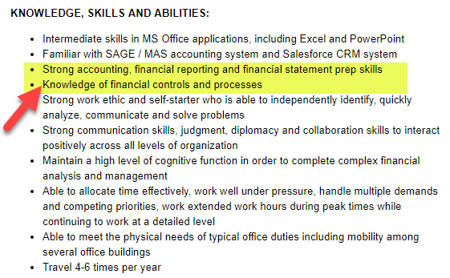

Finance careers offer diverse paths, but few are as dynamic and rewarding as investment analysis and financial analysis. These careers are integral to the modern financial landscape, providing invaluable insights and strategies that drive economic growth and stability. Investment analysts and financial analysts are at the forefront of these sectors, their roles becoming increasingly pivotal as global markets expand and evolve.

This article explores the roles and opportunities within these career paths, including the burgeoning field of algorithmic (algo) trading. Algorithmic trading is reshaping traditional financial practices by utilizing sophisticated computer algorithms to make high-speed trade decisions, thereby enhancing efficiency and accuracy in the financial markets. 



We'll cover essential skills, necessary qualifications, and insights into the various positions associated with these disciplines. Key roles include financial analysts and algo trading specialists, each requiring a unique blend of analytical prowess and technical expertise. Financial analysts provide critical analysis on investment opportunities, while algo trading specialists develop algorithms that optimize trading strategies.

Whether you are a recent graduate or a seasoned professional seeking a career change, understanding these financial sectors can lead to a fulfilling career. The dynamic nature of the financial industry offers a plethora of opportunities for those who are prepared to adapt and innovate. As technology continues to advance, it is reshaping finance careers, presenting new avenues for growth and success. Adaptation to these technological advancements is crucial for those aiming to thrive in these ever-evolving fields. 

In conclusion, the finance sector, particularly in investment analysis and algorithmic trading, offers promising prospects for individuals ready to embrace change and seek career advancements.

## Table of Contents

## Understanding Investment Analysis and Financial Analysts

Investment analysts are pivotal in the financial sector, providing essential information that drives informed decisions on securities. They specialize in evaluating financial data and trends, assessing the performance of stocks, bonds, and other financial instruments. Their work is vital for both individual investors and institutional stakeholders seeking to make prudent investment choices.

The core responsibilities of investment analysts involve extensive research and thorough analysis. They scrutinize financial statements, market data, and economic indicators to forecast the future performance of securities. This analysis is often synthesized into detailed reports and presentations, offering insights and recommendations for investment opportunities.

Financial analysts can be classified into three primary categories: buy-side analysts, sell-side analysts, and independent analysts. Buy-side analysts typically work for mutual funds, pension funds, or other investment firms where they develop strategies to increase the portfolio's value. Their main goal is to identify undervalued securities that may yield high returns for investors. Conversely, sell-side analysts are employed by brokerage firms, where their main role is to produce research and recommendations to aid clients in buying or selling securities. They often specialize in a particular sector, providing forecasts and ratings that can influence stock market behaviors. Independent analysts, as the name suggests, operate autonomously, providing unbiased research and advice to a range of clients without the influence or conflicts that might come from being tied to a particular firm.

Despite their importance, the role of financial analysts is not without controversy. The potential for conflicts of interest, particularly with sell-side analysts, can lead to skepticism about the objectivity of their advice. For example, analysts working for a brokerage firm might face pressure to issue favorable reports on clients that provide other services to their firm, potentially compromising their independence.

Nonetheless, financial analysts are fundamental to investment strategy and market movement. The insights they provide can significantly impact stock prices and investor behavior. Stock markets often react swiftly to analysts’ ratings and evaluations, underscoring the weight their assessments [carry](/wiki/carry-trading).

In conclusion, investment analysts contribute significantly to the financial ecosystem, where their expertise and insights are crucial in facilitating sound investment decisions. Their ability to interpret complex data and forecast market trends remains invaluable, despite ongoing debates about the inherent challenges in maintaining objectivity.

## The Rise of Algorithmic Trading

Algorithmic trading, commonly known as algo trading, revolutionizes the financial markets by utilizing computer algorithms to execute trading orders. This approach automates trading strategies that capitalize on speed and precision, offering significant advantages over traditional methods. One primary benefit of [algorithmic trading](/wiki/algorithmic-trading) is its ability to minimize human error, which can result from emotional influences or fatigue. By relying on predefined rules and calculations, algorithms execute trades devoid of human biases.

Speed is another critical advantage of algorithmic trading. Computers can process and analyze large datasets at incredible speeds, allowing for the execution of trades in fractions of a second. This speed is crucial in financial markets where opportunities can appear and disappear in moments. Algorithmic systems can make timely decisions that human traders might miss due to slower reaction times.

Moreover, algorithmic trading's capacity to handle vast volumes of data surpasses human ability. This capability is particularly beneficial in high-frequency trading environments, where large quantities of trades are executed at rapid speeds. Algorithms can explore multiple markets, analyze multiple trading instruments simultaneously, and process a multitude of inputs to identify profitable opportunities.

Various strategies are employed within algorithmic trading systems. One popular strategy is [trend following](/wiki/trend-following), which involves algorithms identifying and exploiting [momentum](/wiki/momentum) in market prices. By recognizing patterns, these algorithms can make trades in the direction of prevailing trends, optimizing gains or minimizing losses.

Mean reversion is another common strategy in algo trading. This approach is based on the statistical concept that asset prices will revert to their historical mean over time. Algorithmic systems that implement mean reversion strategies identify deviations from historical averages and execute trades accordingly, aiming to profit from the correction.

Market-making strategies also thrive within algorithmic trading platforms. These algorithms provide [liquidity](/wiki/liquidity-risk-premium) to the market by simultaneously posting buy and sell orders for a particular asset. By [earning](/wiki/earning-announcement) the bid-ask spread, market-making algorithms facilitate efficient trading operations with minimal risk.

The Python programming language and libraries such as NumPy and pandas are often used to develop and implement these algorithmic strategies. They offer robust data manipulation and analysis capabilities, making them ideal for quantitative finance tasks.

```python
import numpy as np

# Example mean reversion strategy in Python
def mean_reversion(prices, window_size):
    moving_averages = np.convolve(prices, np.ones(window_size)/window_size, mode='valid')
    signals = []

    for price, average in zip(prices[len(prices) - len(moving_averages):], moving_averages):
        if price < average:
            signals.append("Buy")
        elif price > average:
            signals.append("Sell")
        else:
            signals.append("Hold")

    return signals

prices = [100, 102, 101, 98, 97, 99, 100, 101, 103, 104]
signals = mean_reversion(prices, 3)
print(signals)
```

In sum, algorithmic trading leverages technology and computational power to optimize trading strategies, enhancing efficiency and effectiveness in financial markets. As technology continues to advance, the potential for more sophisticated and successful algorithmic strategies will likely grow, reshaping the landscape of trading.

## Skills and Educational Requirements for Financial Careers

Finance careers demand a diverse set of skills encompassing analytical, technical, and interpersonal proficiencies. These skills are essential for roles such as investment analysts and algo trading specialists, two dynamic avenues within the financial sector.

Investment analysts play a critical role in assessing market environments and providing insights for investment strategies. Their work hinges on robust research capabilities, enabling them to gather and interpret significant amounts of data. Financial acumen is indispensable for these professionals, as they need to evaluate financial statements, understand market trends, and predict future financial conditions. Furthermore, critical thinking is crucial for synthesizing data, anticipating potential market shifts, and recommending optimal investment opportunities.

Algorithmic trading professionals, including quantitative analysts and developers, focus on creating computer algorithms that execute trading strategies with precision and at high speeds. A profound understanding of programming languages, particularly Python and C++, is vital. For instance, Python is favored for its simplicity and vast library support, which can be utilized to write complex trading algorithms:

```python
import numpy as np
import pandas as pd

def moving_average_strategy(data, short_window, long_window):
    signals = pd.DataFrame(index=data.index)
    signals['price'] = data
    signals['short_mavg'] = data.rolling(window=short_window, min_periods=1, center=False).mean()
    signals['long_mavg'] = data.rolling(window=long_window, min_periods=1, center=False).mean()
    signals['signal'] = 0.0  
    signals['signal'][short_window:] = np.where(signals['short_mavg'][short_window:] > signals['long_mavg'][short_window:], 1.0, 0.0)  
    signals['positions'] = signals['signal'].diff()
    return signals
```

Statistical and mathematical proficiency is equally crucial for algorithmic trading professionals to develop and refine strategies such as mean reversion, arbitraging, and [market making](/wiki/market-making). These strategies often require complex statistical models and data analysis.

In addition to specific technical skills, finance professionals benefit considerably from formal education. A degree in finance, economics, mathematics, or related fields frequently enhances career opportunities. These educational backgrounds provide a solid theoretical foundation, teaching fundamental concepts such as microeconomics, econometrics, quantitative analysis, and risk management.

Overall, success in finance careers is driven by a harmonious combination of sound analytical skills, technical know-how, and a persistent willingness to learn and adapt. As the industry evolves with technological developments, especially in algorithmic trading, professionals must continually update their skills and knowledge to stay competitive.

## Career Opportunities and Future Outlook

Finance careers offer a myriad of opportunities, with quantitative analysts, trading strategists, and algo trading developers playing pivotal roles. These positions demand a unique synthesis of skills, presenting challenges and rewards in equal measure. Quantitative analysts, often referred to as "quants," employ statistical methods and mathematical models to assess financial risks and develop trading strategies. Their work is fundamental to the design of algorithms that optimize trading performance and manage risk more effectively.

Trading strategists are responsible for creating and implementing strategies that capitalize on market inefficiencies. They require a deep understanding of market dynamics and exceptional analytical skills to predict market trends and devise profitable trading opportunities. Algo trading developers, on the other hand, focus on the technical implementation of these strategies. They design and code sophisticated algorithms using languages like Python or C++, ensuring that they operate efficiently and integrate seamlessly with trading platforms.

As technology continues to advance, the demand for these roles is increasing, particularly within algorithmic trading. The incorporation of [machine learning](/wiki/machine-learning) and [artificial intelligence](/wiki/ai-artificial-intelligence) is transforming the financial sector, paving the way for innovative trading strategies and solutions. This adoption is leading to the creation of new job roles that combine ICT skills with financial expertise, such as AI specialists in finance or machine learning engineers focused on trading systems.

Professionals who are adept at adapting to these technological advancements and who continuously upskill are well-positioned to capitalize on the growing opportunities within the financial industry. For instance, staying updated with machine learning techniques or enhancing coding proficiency can significantly boost career prospects. Educational courses and certifications focused on data science, machine learning, and financial technologies are particularly beneficial. By embracing the shift towards automation and intelligent systems, finance professionals can secure a competitive edge in this rapidly evolving landscape, ensuring a bright future filled with dynamic career possibilities.

## Conclusion

Finance careers in investment analysis and algorithmic trading are at the forefront of transformation, offering considerable potential for growth and advancement. These dynamic fields require professionals to remain adaptable, consistently updating their skills and knowledge to keep pace with industry changes. The ongoing evolution in finance is largely driven by technological innovations, particularly in algorithmic trading, where proficiency in programming and data analysis is increasingly vital.

To excel in these competitive sectors, individuals must blend technical expertise with a solid understanding of financial markets and strategic thinking. For instance, algorithmic trading requires a confluence of skills including coding proficiency, often in Python, as well as a deep understanding of statistical models to develop and deploy effective trading strategies. This technical foundation enables the design of sophisticated algorithms capable of analyzing data patterns and executing trades with precision and speed.

Moreover, the financial industry is undergoing a paradigm shift with the integration of machine learning and artificial intelligence, expanding the horizons for finance professionals. Roles such as quantitative analysts and trading strategists are increasingly embracing these technologies to enhance performance and efficiency, signifying that continuous learning and adaptation are essential for sustained career success.

The future of finance is promising, offering a wealth of opportunities for professionals who are eager to embrace innovation and change. As the industry moves toward automation and data-driven decision-making, those who equip themselves with the requisite skills and knowledge will find themselves at an advantage, ready to seize emerging opportunities and navigate the complexities of modern finance. The fields of investment analysis and algorithmic trading not only offer rewarding career paths but also the potential for significant contributions to the evolving financial landscape.

## References & Further Reading

[1]: ["Advances in Financial Machine Learning"](https://www.amazon.com/Advances-Financial-Machine-Learning-Marcos/dp/1119482089) by Marcos Lopez de Prado

[2]: ["Evidence-Based Technical Analysis: Applying the Scientific Method and Statistical Inference to Trading Signals"](https://www.amazon.com/Evidence-Based-Technical-Analysis-Scientific-Statistical/dp/0470008741) by David Aronson

[3]: ["Machine Learning for Algorithmic Trading"](https://github.com/stefan-jansen/machine-learning-for-trading) by Stefan Jansen

[4]: ["Quantitative Trading: How to Build Your Own Algorithmic Trading Business"](https://www.amazon.com/Quantitative-Trading-Build-Algorithmic-Business/dp/1119800064) by Ernest P. Chan

[5]: Bergstra, J., Bardenet, R., Bengio, Y., & Kégl, B. (2011). ["Algorithms for Hyper-Parameter Optimization."](https://dl.acm.org/doi/10.5555/2986459.2986743) Advances in Neural Information Processing Systems 24.