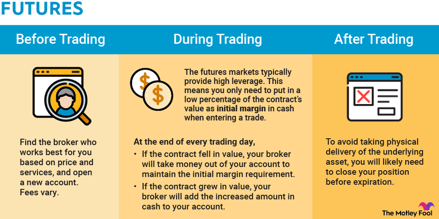

## Table of Contents

## What is futures trading and how does it work?

Futures trading is when people agree to buy or sell something at a future date for a price they set now. This "something" can be anything from corn to gold, or even financial products like stock indexes. The main idea is to lock in a price today to avoid risks from price changes later. People who trade futures can be farmers wanting to know how much they'll get for their crops, or investors trying to make money from price movements.

Here's how it works: Let's say a farmer wants to sell his wheat in six months. He can enter into a futures contract with a buyer, agreeing to sell his wheat at a set price on that future date. If the price of wheat goes up, the buyer benefits because they're getting wheat cheaper than the market price. If the price goes down, the farmer benefits because they're selling at a higher price than the market. Traders can also buy and sell these contracts before the delivery date, trying to profit from price changes. This is called speculating, and it's a big part of futures trading.

## What are the key differences between futures and other financial instruments like stocks and options?

Futures are different from stocks and options in a few big ways. When you buy a stock, you're buying a piece of a company. The price of the stock can go up or down based on how well the company is doing or what people think about it. With futures, you're agreeing to buy or sell something at a set price in the future, like wheat or oil. You don't own the thing itself, just the contract. This means futures are more about betting on what the price will do in the future, not owning a part of a company.

Options are a bit like futures but with a key difference: with an option, you have the right, but not the obligation, to buy or sell something at a set price. If you buy a call option on a stock, you can choose to buy the stock at the set price if you want to, but you don't have to. Futures, on the other hand, are binding contracts. If you agree to buy wheat at a certain price in the future, you have to do it, no matter what the market price is at that time. This makes futures riskier but also potentially more rewarding if you guess the price movement right.

## What are the main types of futures contracts available in the market?

There are many types of futures contracts, but they mainly fall into two big groups: commodity futures and financial futures. Commodity futures are for things you can touch, like food, energy, and metals. For example, you can trade futures on corn, oil, or gold. These are popular because they help farmers, miners, and energy companies lock in prices for what they produce or need to buy. On the other hand, financial futures are for things you can't touch, like stock indexes, interest rates, and currencies. For instance, you can trade futures on the S&P 500 index or on the value of the U.S. dollar compared to other currencies. These are used by investors and companies to manage risks related to their investments or business operations.

Another type of futures contract is called single stock futures. These are futures on the price of one specific company's stock. They're less common than commodity or financial futures but can be useful for investors who want to bet on the future price of a particular stock without actually owning it. Overall, the variety of futures contracts available means that there's something for almost everyone, whether you're a farmer, an investor, or a company looking to manage risk.

## How can someone start trading futures, including account setup and choosing a broker?

To start trading futures, the first step is to choose a broker that offers futures trading. Look for a broker that is well-regulated, has good customer service, and offers the tools and resources you need. Once you've picked a broker, you'll need to open an account with them. This usually involves filling out an application form online, providing some personal information, and maybe even talking to someone from the broker's team. You'll also need to fund your account, which means putting money into it so you can start trading. The amount you need to start can vary, so check with your broker.

After setting up your account, you'll need to learn how to use the trading platform. Most brokers have online platforms where you can buy and sell futures. Take some time to get familiar with how it works, maybe even using a demo account if one is available. Once you're comfortable, you can start trading. You'll pick the futures contract you want to trade, decide if you want to buy or sell, and then place your order. Remember, trading futures can be risky, so it's a good idea to start small and learn as you go.

## What are the risks involved in futures trading and how can they be managed?

Futures trading can be risky because the prices of the things you're trading can go up and down a lot. If you guess wrong about which way the price will move, you could lose a lot of money. Another risk is something called leverage. This means you can control a big contract with just a small amount of money, but if the price moves against you, your losses can be much bigger than what you put in. Also, futures contracts have an expiration date, so if you're not careful, you might end up having to buy or sell the actual thing, which can be a problem if you don't want it.

To manage these risks, it's important to have a plan. Start by only risking money you can afford to lose. It's also a good idea to use stop-loss orders, which automatically close your trade if the price moves against you by a certain amount. This can help limit your losses. Another way to manage risk is to diversify, which means not putting all your money into one type of futures contract. Finally, keep learning and stay updated on what's happening in the markets. The more you know, the better you can make decisions and manage your risks.

## What are the basic strategies for trading futures, including hedging and speculation?

One basic strategy for trading futures is called hedging. This is when someone uses futures to protect themselves from price changes. For example, a farmer might sell wheat futures to lock in a price for their crop. If the price of wheat goes down, the farmer still gets the higher price they locked in with the futures contract. Companies that need to buy things like oil or metals might buy futures to make sure they don't have to pay more if prices go up. Hedging is all about reducing risk and making sure you know what you're going to pay or get paid.

Another strategy is speculation. This is when traders try to make money by guessing which way the price of a futures contract will move. If they think the price will go up, they buy the contract, hoping to sell it later at a higher price. If they think the price will go down, they sell the contract, hoping to buy it back later at a lower price. Speculation can be risky because if you guess wrong, you can lose money. But if you guess right, you can make a lot of money. Many traders use charts and other tools to try to predict price movements, but it's never a sure thing.

Both hedging and speculation are important parts of futures trading. Hedging helps people and companies manage their risks, while speculation can bring more money into the market and help make prices more accurate. No matter which strategy you use, it's important to understand the risks and have a plan for managing them.

## How do leverage and margin work in futures trading?

In futures trading, leverage lets you control a big contract with just a small amount of money. This is like using a lever to lift something heavy with less effort. When you trade futures, you only need to put down a small part of the total value of the contract, which is called the margin. For example, if you want to trade a futures contract worth $100,000, you might only need to put down $5,000 as margin. This means you can trade a lot more than you could if you had to pay the full amount upfront. But, leverage can make your gains bigger if the price moves your way, but it can also make your losses bigger if the price moves against you.

Margin is the money you need to put down to open a futures position. It's like a deposit that shows you're serious about the trade. There are two types of margin: initial margin and maintenance margin. The initial margin is what you need to start the trade, and the maintenance margin is the minimum amount you need to keep in your account while the trade is open. If the value of your position goes down and your account balance falls below the maintenance margin, you'll get a margin call. This means you need to add more money to your account to keep the trade open. If you can't meet the margin call, your broker might close your position to limit their risk.

## What are the key factors that influence futures prices?

Futures prices are influenced by a lot of things. One big [factor](/wiki/factor-investing) is supply and demand. If there's a lot of something, like corn, the price might go down because there's more than people need. But if there's not enough, the price might go up because everyone wants it. Another thing that can change futures prices is what people think will happen in the future. If people think there will be a big harvest next year, the price of corn futures might go down now because they expect more corn later. News and events can also make a big difference. If there's a drought or a war that affects how much of something is produced, the price of futures for that thing can change a lot.

Another important factor is interest rates. When interest rates go up, it can make it more expensive to hold onto futures contracts, which might push prices down. On the other hand, if interest rates go down, it can be cheaper to hold onto futures, which might push prices up. The value of the dollar also matters. If the dollar gets stronger, it can make things that are priced in dollars, like oil or gold, cheaper for people using other currencies, which might affect futures prices. Finally, the overall mood of the market can influence futures prices. If everyone is feeling good about the economy, they might be willing to pay more for futures. But if they're worried, they might not want to take as many risks, which can push prices down.

## How do futures markets impact the broader economy?

Futures markets play a big role in the broader economy because they help people and companies manage risk. When farmers or businesses use futures to lock in prices for things they need to buy or sell, it makes their planning easier. They know what they're going to pay or get paid, so they can make better decisions about planting crops, building factories, or setting prices for their products. This stability helps the economy run more smoothly because it reduces uncertainty and helps everyone plan for the future.

Futures markets also help set prices for a lot of important things, like food, energy, and financial products. When traders buy and sell futures, they're trying to guess where prices are going, and all these guesses help create a price that reflects what people think will happen. This can guide businesses and governments in making decisions about how much to produce or invest. Plus, futures markets bring in a lot of money from investors and traders, which can help keep financial markets active and healthy. All these things together make the economy more stable and efficient.

## What advanced trading techniques can be used to enhance profitability in futures trading?

One advanced trading technique in futures trading is called spread trading. This involves buying one futures contract and selling another at the same time. The idea is to profit from the difference in price between the two contracts. For example, you might buy a corn futures contract for delivery in March and sell a corn futures contract for delivery in June. If the price difference between these two contracts changes in your favor, you can make money. Spread trading can be less risky than trading a single futures contract because it's based on the relationship between two prices, not just one, which can make it easier to predict.

Another technique is using technical analysis to find patterns in price charts. Traders look at things like moving averages, support and resistance levels, and other indicators to guess where prices might go next. By spotting these patterns, traders can make better decisions about when to buy or sell. For example, if a price chart shows that a futures contract often bounces back up when it hits a certain low price, a trader might buy the contract when it gets close to that low, hoping to sell it later at a higher price. Technical analysis takes a lot of practice and study, but it can help traders make more informed trades and increase their chances of making money.

A third technique is [algorithmic trading](/wiki/algorithmic-trading), where traders use computer programs to buy and sell futures automatically. These programs can analyze a lot of data very quickly and make trades based on rules set by the trader. For example, a program might be set to buy a futures contract if its price goes above a certain level and sell it if the price goes below another level. Algorithmic trading can help traders take advantage of small price movements that happen very quickly, which can add up to big profits over time. However, it requires a good understanding of both trading and programming, and it can be risky if the market behaves in unexpected ways.

## How can one use technical analysis in futures trading?

Technical analysis in futures trading involves looking at past price movements and other data to try to predict where prices might go next. Traders use charts and special tools called indicators to spot patterns. For example, they might look at moving averages, which are lines on a chart that show the average price over a certain time. If the price of a futures contract goes above its moving average, it might be a sign that the price will keep going up. Traders also look for support and resistance levels, which are prices where the futures contract often stops going down or up. By understanding these patterns, traders can make better decisions about when to buy or sell.

Using technical analysis takes practice and study, but it can help traders make more informed trades and increase their chances of making money. For instance, if a trader sees that a futures contract often bounces back up when it hits a certain low price, they might buy the contract when it gets close to that low, hoping to sell it later at a higher price. Technical analysis isn't perfect, and it doesn't always work, but many traders find it helpful. By combining technical analysis with other information, like news and economic reports, traders can get a better overall picture of what might happen to futures prices.

## What are the regulatory considerations and compliance requirements for futures trading?

When you trade futures, there are rules you need to follow to make sure everything is fair and safe. In the United States, the main group that makes these rules is called the Commodity Futures Trading Commission (CFTC). They work to stop fraud and make sure the markets are honest. They also work with another group called the National Futures Association (NFA), which makes sure brokers and traders follow the rules. If you want to trade futures, you need to use a broker that is registered with these groups. This helps keep your money safe and makes sure you're trading in a fair market.

There are also rules about how much money you need to have in your account to trade futures. This is called margin, and it's like a deposit to show you're serious about the trade. The rules say how much margin you need to start a trade and how much you need to keep in your account while the trade is open. If your account balance goes below a certain level, you'll get a margin call, which means you need to add more money to your account. If you don't, your broker might close your trade to limit their risk. These rules are there to protect both you and the market, so it's important to understand them before you start trading.

## References & Further Reading

[1]: Bergstra, J., Bardenet, R., Bengio, Y., & Kégl, B. (2011). ["Algorithms for Hyper-Parameter Optimization."](https://papers.nips.cc/paper/4443-algorithms-for-hyper-parameter-optimization) Advances in Neural Information Processing Systems 24.

[2]: ["Advances in Financial Machine Learning"](https://www.amazon.com/Advances-Financial-Machine-Learning-Marcos/dp/1119482089) by Marcos Lopez de Prado

[3]: ["Evidence-Based Technical Analysis: Applying the Scientific Method and Statistical Inference to Trading Signals"](https://www.amazon.com/Evidence-Based-Technical-Analysis-Scientific-Statistical/dp/0470008741) by David Aronson

[4]: ["Machine Learning for Algorithmic Trading"](https://github.com/stefan-jansen/machine-learning-for-trading) by Stefan Jansen

[5]: ["Quantitative Trading: How to Build Your Own Algorithmic Trading Business"](https://www.amazon.com/Quantitative-Trading-Build-Algorithmic-Business/dp/1119800064) by Ernest P. Chan