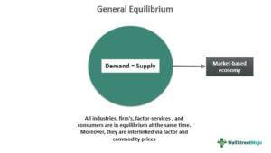

In the modern economy, equilibrium analysis through general equilibrium economic theory offers comprehensive insights into how interconnected markets function. This analytical framework is crucial for understanding the complex interactions among various economic agents, such as households and firms, which operate across multiple markets. General Equilibrium Theory (GET) provides a structured approach to assess how resources are allocated in an economy, allowing economists to identify conditions under which markets reach equilibrium prices and quantities simultaneously.

This article examines the core concepts of general equilibrium theory and its relevance in algorithmic trading, one of the most dynamic applications of economic theory in financial markets today. At its essence, GET serves as a foundational tool for modeling economic interactions, focusing on the efficient distribution of resources and the balancing of supply and demand across an interconnected market system. These insights not only benefit theoretical economic analyses but also inform practical applications, particularly in trading, where understanding market dynamics is pivotal.



The historical development of GET, primarily attributed to figures like Léon Walras in the 19th century, laid the groundwork for contemporary economic models. Walras's introduction of simultaneous equations to model market dependencies has evolved through contributions by successive economists and has significantly shaped modern economic thought. GET's mathematical formulation, characterized by equilibrium conditions, enables economists and traders to simulate market scenarios and predict shifts in supply and demand effectively.

In algorithmic trading, the principles of GET are integral for designing algorithms that respond adeptly to market conditions. By simulating economic environments, these algorithms can identify arbitrage opportunities and optimize trading strategies based on equilibrium concepts, ultimately enhancing decision-making in the financial sector.

The aim of this article is to bridge the complex theory of economics with practical applications in financial markets, providing insights into how general equilibrium analysis can be applied to improve market strategies and outcomes. This exploration will cover the historical background, key concepts, and mathematical foundations of GET, bringing a comprehensive understanding to its role in algorithmic trading and beyond.

## Table of Contents

## Historical Background of General Equilibrium Theory

General Equilibrium Theory (GET) has its roots in the late 19th century, primarily attributed to the pioneering work of Léon Walras. Walras' ambition was to develop a comprehensive framework that could describe how different markets within an economy interact and determine overall equilibrium prices and resource allocations. His seminal contribution involved the introduction of a system of simultaneous equations that mathematically modeled these market interdependencies. This was a significant advancement in analytical economics, offering a structured methodology to study complex economic systems as an interlinked whole.

Walras proposed that the economy could be represented as a network of equations capturing the supply and demand across multiple markets. The core idea is that in such a system, a set of equilibrium prices would exist where the quantity supplied equals the quantity demanded in every market. This theoretical construct is known as Walrasian Equilibrium. Mathematically, assume $n$ markets and let $p_i$ represent the price in market $i$, with supply and demand functions $S(p)$ and $D(p)$ respectively. The equilibrium condition in each market can be articulated as:

$$
S_i(p_1, p_2, \ldots, p_n) = D_i(p_1, p_2, \ldots, p_n)
$$

for $i = 1, 2, \ldots, n$.

Walras' abstract yet rigorous approach laid the foundation for modern economic analysis, establishing a vital framework for subsequent economic models and theories. His work demonstrated the feasibility of predicting equilibrium states in an economy by defining a comprehensive set of market-specific parameters and constraints based on rational agent behavior.

During the 20th century, Walras' concepts were further refined and expanded by economists like Vilfredo Pareto, who introduced the notion of optimality within this framework, and later by Kenneth Arrow and Gerard Debreu, who conducted significant work proving the existence and stability of an equilibrium under certain conditions. These advancements underlined the robustness of general equilibrium models but also highlighted the complexity involved in applying them to real-world market scenarios, where assumptions such as perfect competition and complete information often do not hold.

Understanding the historical evolution of General Equilibrium Theory is crucial for its modern application, particularly in economic policy formulation and financial market analysis. The foundational principles set forth by Walras continue to inform how economists and financial analysts model the interconnectedness of markets and the delicate balance of supply and demand across economic systems. Despite its abstract nature, GET provides essential insights into the theoretical underpinnings of today’s dynamic and intertwined economies.

## Core Concepts of General Equilibrium Theory

General Equilibrium Theory (GET) provides a comprehensive framework to analyze the interactions between multiple markets within an economy. At its core, GET examines how various markets and economic [agents](/wiki/agents), such as households and firms, interact and reach a state of balance, known as equilibrium. This section elaborates on the key concepts underpinning GET, highlighting its role in illustrating market interdependence, determining resource allocation, and establishing equilibrium prices.

A fundamental aspect of GET is market interdependence, where the condition and performance of one market can significantly affect others. This interconnectedness requires simultaneous consideration of multiple markets to understand the overall economic equilibrium. In this scenario, each economic agent aims to maximize its utility or profit given its constraints, leading to interactions across markets as they strive for the best possible outcomes.

Resource allocation in GET refers to the optimal distribution of resources among various economic agents, ensuring that the resources are used efficiently to meet the needs and preferences of all participants. The theory posits that under certain conditions, markets naturally lead to an allocation of resources that maximizes societal welfare. This is achieved through the interaction of supply and demand across interconnected markets, where equilibrium prices serve as signals that guide the allocation of resources.

The determination of equilibrium prices is central to GET. In this context, the Walrasian Equilibrium concept, named after the economist Léon Walras, plays a pivotal role. Walrasian Equilibrium occurs when all markets in an economy are in balance simultaneously, meaning the quantity supplied equals the quantity demanded in each market. This equilibrium is characterized by a set of prices at which economic agents can achieve their respective goals without any excess supply or demand in the markets.

Mathematically, the equilibrium state can be described using a system of equations that represent the supply and demand conditions in each market. These equations consider the preferences and constraints of economic agents, as well as the technological possibilities available to firms. The solution to this system—the equilibrium prices and allocations—ensures that no agent has the incentive to alter their consumption or production decisions, thus maintaining the balance across markets.

In summary, General Equilibrium Theory offers vital insights into how economic agents interact across multiple markets, leading to an efficient allocation of resources. By analyzing market interdependence and equilibrium prices, GET helps understand the conditions needed for maximizing societal welfare under ideal settings, providing a robust theoretical framework for examining economic systems.

## Mathematical Formulation and Assumptions

General Equilibrium Theory (GET) is formalized through systems of equations that depict the interrelations of supply and demand across multiple markets. The objective of these equations is to determine a state of equilibrium where supply equals demand in all markets simultaneously. The mathematical articulation of GET typically involves the specification of a competitive equilibrium, which can be represented by a set of prices and allocations for goods that clear the markets.

Pioneers like Kenneth Arrow and Gerard Debreu made significant contributions by formalizing and proving the existence of such equilibria under specified conditions. In their seminal work, Arrow and Debreu utilized fixed-point theorems to establish the existence of an equilibrium. The key result hinges on the application of a fixed-point theorem, such as the Kakutani fixed-point theorem, to the excess demand function, ensuring that there is at least one price vector at which aggregate demand matches aggregate supply across all markets.

The mathematical framework of GET is built on several fundamental assumptions:

1. **Perfect Competition**: All agents are price takers; no single agent can influence the market price. This assumes a large number of buyers and sellers in the market.

2. **Constant Consumer Income**: The income of consumers remains constant, leading to predictable consumption patterns based on price changes.

3. **Unchanging Production Techniques**: The technology and methods used for production are static, implying that the production possibilities are fixed over time.

Despite its mathematical elegance, the practical implementation of GET is constrained by these idealistic assumptions. For instance, real-world markets often experience changing technologies, consumer income fluctuations, and deviations from perfect competition, such as monopolistic behavior or market power exertion by a few large firms. These factors introduce complexities that cannot be entirely captured by the traditional GET model.

However, the mathematical rigor of GET provides critical insights into economic behavior and resource allocation. It offers a foundational framework that can be adjusted for more realistic scenarios through extensions that relax some of the underlying assumptions. Understanding these concepts can aid in developing more sophisticated models that align more closely with empirical observations in economic research and policy design.

## Algorithmic Trading and Equilibrium Theory

Algorithmic trading, a key component of modern financial markets, utilizes advanced algorithms to automate the execution of trading orders. These algorithms often draw upon the principles of General Equilibrium Theory (GET) to understand and predict market behavior. GET, which describes how supply and demand interact to reach an equilibrium price across multiple interconnected markets, offers valuable insights into developing optimized trading strategies.

In [algorithmic trading](/wiki/algorithmic-trading), understanding market equilibrium is crucial for enhancing strategies aimed at predicting price shifts and identifying [arbitrage](/wiki/arbitrage) opportunities. Market equilibrium occurs when market supply and demand balance each other, resulting in stable prices. By leveraging equilibrium conditions, trading algorithms can better anticipate how prices will adjust to new information or changes in supply and demand, capitalizing on temporary imbalances to make profitable trades.

To simulate economic conditions modeled by GET, trading algorithms often incorporate computational simulations that mimic real-world market dynamics. These simulations can involve complex mathematical models and econometric techniques to capture the interactions among various financial instruments and economic variables. For instance, an algorithm might use a series of linear or non-linear equations to model the relationship between different asset prices and macroeconomic indicators, allowing it to forecast changes in market conditions.

Consider a simplified Python example where a trading algorithm simulates market conditions using a basic supply and demand model:

```python
# A simple simulation of market equilibrium using supply and demand functions

import numpy as np

def supply(price):
    return 100 + 3 * price

def demand(price):
    return 400 - 2 * price

def find_equilibrium():
    price_range = np.linspace(0, 100, 500)
    for price in price_range:
        if supply(price) == demand(price):
            return price, supply(price), demand(price)
    return None, None, None

equilibrium_price, equilibrium_supply, equilibrium_demand = find_equilibrium()
print(f"Equilibrium Price: {equilibrium_price}, Supply: {equilibrium_supply}, Demand: {equilibrium_demand}")
```

In this example, the algorithm calculates the equilibrium price where supply equals demand. Such models, though basic, serve as foundations for more sophisticated algorithms that incorporate GET to manage large-scale, high-frequency trading operations.

As financial markets become increasingly complex, integrating GET concepts into algorithmic trading models enhances their precision and effectiveness. By refining their understanding of interdependent market structures and equilibrium conditions, traders can develop algorithms that not only execute trades efficiently but also adapt dynamically to a rapidly changing market environment. This improved adaptability is crucial for maintaining competitive advantage in high-frequency trading and other algorithm-driven strategies. As such, GET continues to provide the theoretical underpinning necessary for advancing the field of algorithmic trading.

## Criticisms and Limitations

General Equilibrium Theory (GET) is often criticized for its reliance on idealistic assumptions that may not align with real-world market behaviors. One of the most significant critiques of GET is its assumption of perfect competition, wherein all participants are price takers, and no individual entity has the power to influence market prices. This assumption simplifies the mathematical modeling of markets but often fails to capture the intricacies present in actual economies, where monopolies, oligopolies, and other forms of imperfect competition prevail.

Furthermore, GET assumes complete markets with no transaction costs and that all economic agents have perfect information. However, real-world markets frequently exhibit complexities such as asymmetric information, where different agents possess varying levels of knowledge about the market. This discrepancy can lead to market failures, which are not addressed within the traditional framework of GET. Additionally, issues like non-convexities in preferences and production technologies further complicate the ability of GET to model real phenomena accurately.

The theory also assumes constant consumer income and static production techniques, ignoring how economic factors evolve over time and interact with technological and institutional changes. This static nature limits the relevance of GET when dynamic market changes occur, such as those induced by economic policies or external shocks.

Despite these limitations, GET continues to be a valuable tool for economic analysis and policy-making. It provides a foundational framework for understanding how markets might operate under simplified conditions, offering insights into the potential efficiencies that can be achieved through resource allocation. However, to enhance its practical applicability, economists often integrate other theoretical approaches and empirical observations, considering institutional, social, and technological changes that affect market dynamics. This allows for more comprehensive models that can better account for the imperfections and complexities observed in real-world economies.

## Conclusion

General Equilibrium Theory (GET) remains an essential framework in the analysis of market dynamics and resource allocation. By examining the interactions among various markets, GET provides critical insights into how resources are distributed effectively and how equilibrium prices are achieved under certain conditions. While its theoretical origins are deeply rooted in economics, the principles of GET have transcended traditional boundaries, finding applications in financial modeling and policy-making. This is notably seen in its influence on the development of algorithmic trading strategies, where the theory offers a structured methodology for anticipating market changes and optimizing asset allocation.

In the context of algorithmic trading, GET aids in creating models that replicate the supply and demand balance, thus enhancing the precision of trading decisions. Algorithms designed with GET principles can simulate market conditions, predict price changes, and identify potential arbitrage opportunities. Such computational models capitalize on the foundations of GET to achieve more efficient trading outcomes and maintain equilibrium across financial systems.

Despite its theoretical strength, GET is often critiqued for some idealistic assumptions, such as perfect competition, which do not always hold in real-world scenarios. However, ongoing research endeavors to integrate additional real-world factors—such as market imperfections, institutional forces, and behavioral insights—into the framework of GET. This continued evolution ensures that GET remains not only relevant but increasingly practical in addressing contemporary economic and financial challenges. By enhancing its models with these complexities, GET can further improve its applicability across broader areas in economics and finance, creating a more robust tool for economic analysis and financial decision-making.

## References & Further Reading

[1]: Debreu, G. (1959). ["Theory of Value: An Axiomatic Analysis of Economic Equilibrium"](https://archive.org/details/theoryofvalueaxi0000debr). Cowles Foundation Monograph Series 17.

[2]: Arrow, K. J., & Debreu, G. (1954). ["Existence of an Equilibrium for a Competitive Economy."](https://www.semanticscholar.org/paper/EXISTENCE-OF-AN-EQUILIBRIUM-FOR-A-COMPETITIVE-Arrow-Debreu/e937fc6b51ab16bfdb3d7cde90a13c7e12e2c641) Econometrica, 22(3), 265-290.

[3]: Varian, H. R. (1992). ["Microeconomic Analysis"](https://archive.org/details/microeconomicana00vari_0). Norton.

[4]: Walras, L. (1954). ["Elements of Pure Economics, or the Theory of Social Wealth"](https://archive.org/details/elements-of-pure-economics_Leon-Walras) (Translated by William Jaffé). 

[5]: Shleifer, A. (2000). ["Inefficient Markets: An Introduction to Behavioral Finance"](https://academic.oup.com/book/27761). Oxford University Press. 

[6]: LeRoy, S. F., & Werner, J. (2014). ["Principles of Financial Economics"](https://assets.cambridge.org/97811070/24120/frontmatter/9781107024120_frontmatter.pdf). Cambridge University Press.