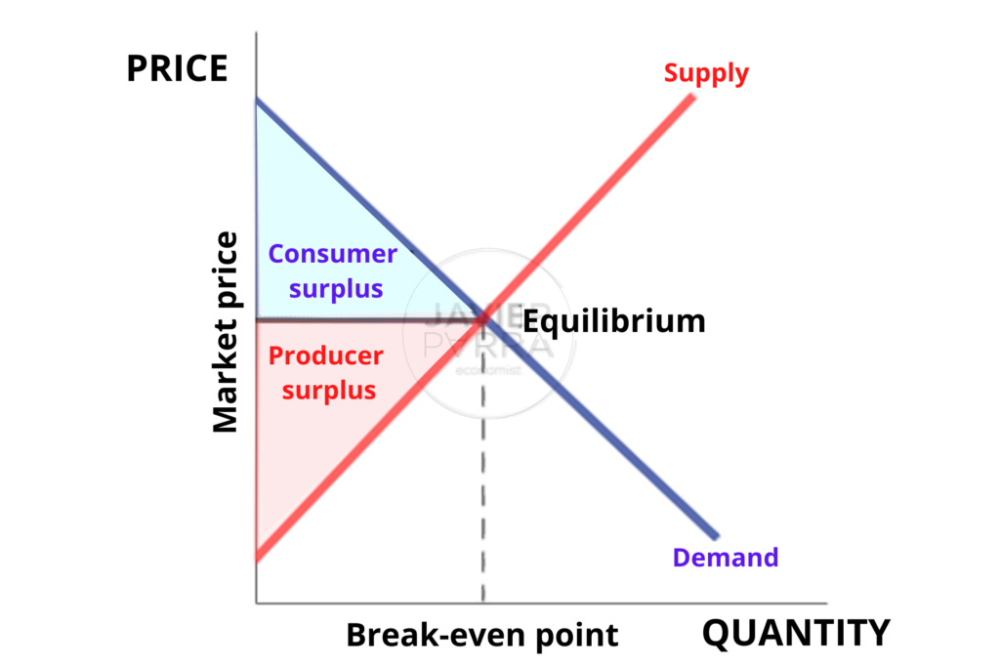

## Table of Contents

## What is General Equilibrium Theory?

General Equilibrium Theory is a way economists understand how different parts of an economy work together. Imagine an economy like a big puzzle with many pieces, like markets for goods, services, and labor. This theory looks at how all these pieces fit together and affect each other. It tries to figure out how prices and quantities of everything in the economy can balance out so that everyone's needs and wants are met as best as possible.

In simple terms, General Equilibrium Theory says that if all markets in an economy are in balance, then the whole economy is in balance too. This balance, or equilibrium, happens when the supply of goods and services equals the demand for them. Economists use math and models to study this, but the main idea is to see how changes in one part of the economy, like a rise in the price of oil, can affect everything else, from the cost of goods to people's jobs and incomes.

## Who are the key economists associated with the development of General Equilibrium Theory?

The main person behind General Equilibrium Theory is Leon Walras. He was a French economist who lived in the 1800s. Walras came up with the idea of looking at the whole economy at once, instead of just one market at a time. He used math to show how prices could adjust until everything in the economy was in balance. His big book, "Elements of Pure Economics," is where he explained all this.

Another important economist is Kenneth Arrow. He worked with Gerard Debreu in the 1950s to make Walras's ideas even stronger. They used fancy math to prove that, under certain conditions, a general equilibrium could really exist. Their work helped make General Equilibrium Theory a big part of economics. Arrow and Debreu's ideas are in a famous book called "Theory of Value."

## What are the basic assumptions of General Equilibrium Theory?

General Equilibrium Theory has some basic ideas it starts with. First, it assumes that everyone in the economy is trying to make the best choices they can. This means people and businesses are trying to get the most out of what they have, whether it's spending money wisely or making profits. It also assumes that everyone knows everything they need to know about prices and goods. This is called perfect information. Another big idea is that there are lots of buyers and sellers in each market, so no single one can control prices. This is called perfect competition.

Another assumption is that all goods and services can move freely around the economy. This means there are no barriers stopping things from being bought and sold wherever they're needed. The theory also thinks that prices can change easily to help the economy find balance. If there's too much of something, the price goes down until people want to buy it all. If there's not enough, the price goes up until people want less. Lastly, General Equilibrium Theory assumes that the economy is always trying to get back to a state where everything is balanced, even if things change.

## How does General Equilibrium Theory differ from Partial Equilibrium Theory?

General Equilibrium Theory and Partial Equilibrium Theory are two ways economists look at how markets work, but they focus on different things. General Equilibrium Theory looks at the whole economy all at once. It tries to understand how changes in one market, like the price of oil going up, affect everything else, like the cost of goods and people's jobs. This theory is like looking at a big puzzle where every piece affects the others. It assumes that all markets are connected and that changes in one part can ripple through the whole economy until everything finds a new balance.

On the other hand, Partial Equilibrium Theory focuses on just one market at a time. It's simpler because it only looks at how supply and demand work in a single market, without worrying about what's happening in the rest of the economy. For example, if you're studying the market for apples, you'd look at how the price of apples affects how many people want to buy them and how many farmers want to grow them. This theory is useful for understanding specific markets but doesn't show the bigger picture of how markets are linked together.

## What is the role of supply and demand in General Equilibrium Theory?

In General Equilibrium Theory, supply and demand are super important because they help the whole economy find balance. Imagine you have lots of different markets, like for apples, cars, and jobs. In each market, the price changes until the amount of stuff people want to buy (demand) matches the amount that's available (supply). If there's too much of something, the price goes down until people want to buy it all. If there's not enough, the price goes up until people want less. This balance in each market is called equilibrium.

Now, because all these markets are connected, what happens in one market can affect others. For example, if the price of oil goes up, it might make cars more expensive because they need oil to run. This could make fewer people want to buy cars, which affects the car market. General Equilibrium Theory looks at how all these changes in supply and demand across different markets work together until the whole economy finds a new balance. It's like a big puzzle where every piece needs to fit just right.

## Can you explain the concept of Walrasian equilibrium?

Walrasian equilibrium is a big idea in economics named after Leon Walras. It's all about how the whole economy can be in balance at the same time. Imagine you have lots of different markets, like for apples, cars, and jobs. In a Walrasian equilibrium, the price of everything is just right so that the amount of stuff people want to buy is exactly the same as the amount that's available. This means that if you want to buy an apple, there's an apple for you to buy, and if you want to sell an apple, someone wants to buy it at the price you're selling it for. It's like everything in the economy fits together perfectly.

To get to this balance, prices need to change. If there's too much of something, like too many apples, the price goes down until people want to buy all the apples. If there's not enough of something, like not enough cars, the price goes up until people want fewer cars. Walrasian equilibrium says that if you keep changing prices like this in every market, eventually, all markets will be in balance at the same time. It's a bit like a big puzzle where every piece needs to fit just right, and the prices are the keys to making everything fit together.

## How does the Arrow-Debreu model contribute to General Equilibrium Theory?

The Arrow-Debreu model, named after economists Kenneth Arrow and Gerard Debreu, made General Equilibrium Theory stronger and more clear. They used math to show that, under certain conditions, it's possible for the whole economy to find a balance where everyone's needs and wants are met as best as possible. This model says that if you have lots of different markets for goods, services, and jobs, and if everyone knows everything they need to know about prices and goods, then prices can change until everything fits together perfectly. This is called a Walrasian equilibrium, where the amount of stuff people want to buy is exactly the same as the amount that's available.

Arrow and Debreu's work helped economists see that a general equilibrium could really exist, not just in theory but in a way that could be proven with math. Their model showed that if markets are free and competitive, and if people can make the best choices they can, then the economy can find a balance where everyone is happy. This idea is important because it helps us understand how the economy works as a whole, and how changes in one part can affect everything else. Their work is in a famous book called "Theory of Value," which is a big deal in economics.

## What are the mathematical tools used in analyzing general equilibrium models?

In analyzing general equilibrium models, economists use a lot of math to understand how the whole economy works together. One big tool they use is linear algebra. Linear algebra helps them solve big systems of equations that show how prices and quantities in different markets are connected. It's like solving a big puzzle where each piece is an equation, and they all need to fit together perfectly. Another important tool is calculus, which helps economists understand how small changes in one part of the economy can affect everything else. Calculus is great for figuring out how prices need to change until the whole economy is in balance.

Besides linear algebra and calculus, economists also use something called fixed point theorems. These theorems help them prove that a general equilibrium can really exist. It's like showing that there's a spot where all the markets can be in balance at the same time. Fixed point theorems are a bit tricky, but they're really important for making sure the math behind general equilibrium models is solid. All these math tools help economists build models that show how the economy works as a big, connected system, and how changes in one market can ripple through the whole economy until everything finds a new balance.

## How do externalities and public goods affect general equilibrium?

Externalities and public goods can mess up the balance that general equilibrium tries to find. An externality is when someone's actions affect others without them getting paid or charged for it. For example, if a factory pollutes the air, it might make people sick, but the factory doesn't pay for that. This can make the prices in the economy not match up with what's really going on, so the balance gets thrown off. Public goods are things everyone can use, like parks or clean air, but they can be hard to pay for because people might not want to pay if they can use them for free. This can also make it tough for the economy to find a balance where everyone's needs are met.

In general equilibrium, we usually assume that everyone pays for what they use and gets paid for what they provide. But with externalities and public goods, this doesn't always happen. So, economists have to think about how to fix these problems to help the economy get back to balance. They might suggest taxes on things that cause negative externalities, like pollution, or ways to fund public goods so everyone can enjoy them without messing up the economy's balance. Understanding how these things affect general equilibrium helps us make better rules and policies to keep the economy working well for everyone.

## What are some criticisms and limitations of General Equilibrium Theory?

General Equilibrium Theory has some big ideas about how the whole economy can be in balance, but it also has some problems. One big criticism is that it assumes everyone knows everything about prices and goods, which isn't true in real life. People often don't have all the information they need to make the best choices. Another problem is that the theory assumes markets are always free and competitive, but in the real world, some companies can be so big they control prices. Also, the math used in the theory can be really hard to solve, so it's not always easy to use it to understand what's happening in the real economy.

Another limitation is that General Equilibrium Theory doesn't deal well with things like externalities and public goods. Externalities are when someone's actions affect others without them getting paid or charged for it, like pollution. Public goods are things everyone can use, like parks, but they can be hard to pay for. These things can throw off the balance the theory tries to find. Also, the theory can be too simple because it doesn't always show how things like time and uncertainty affect the economy. So, while General Equilibrium Theory helps us understand how the economy works as a big puzzle, it's not perfect and has to be used carefully to make sense of the real world.

## How has General Equilibrium Theory evolved to incorporate dynamic and stochastic elements?

General Equilibrium Theory has changed over time to include more real-life stuff like time and uncertainty. At first, the theory looked at the economy as if everything happened all at once, but that's not how it works in real life. So, economists started adding time into their models. This is called dynamic general equilibrium. It helps them see how the economy changes over time, like how people save money now to spend later or how businesses plan for the future. By adding time, the models can show how things like interest rates and investments affect the economy over many years, not just right now.

Another big change was adding uncertainty, which is called stochastic general equilibrium. In real life, people and businesses don't know what's going to happen next, so they have to guess. This can affect their choices, like whether to buy a house or start a new project. By putting uncertainty into the models, economists can see how things like unexpected events or changes in the economy can shake things up. These new models, called DSGE (Dynamic Stochastic General Equilibrium) models, are used a lot today to help understand and predict how the economy might change over time with all its ups and downs.

## What are the current research trends and future directions in General Equilibrium Theory?

Right now, economists are working on making General Equilibrium Theory more realistic by adding more details about how people and businesses behave. They're looking at things like how people make choices when they don't know everything, or how businesses might change their plans if they think the economy will be different in the future. They're also trying to understand how things like technology and climate change can affect the whole economy. By adding these new ideas, economists hope to make their models better at explaining what's happening in the real world and helping to make better policies.

Another big trend is using computers to help with the math in General Equilibrium Theory. The old models were hard to solve because they had so many equations, but now, with powerful computers, economists can solve these models much faster and look at more complicated situations. This means they can study things like how different policies might affect the economy over time or how shocks like a financial crisis can spread through different markets. In the future, economists will keep working on these new models and using computers to make them even better, so they can keep up with the changing world and help make the economy work better for everyone.

## What is the Historical Background of General Equilibrium Theory?

General Equilibrium Theory (GET) has its roots in the late 19th century, primarily attributed to the pioneering work of Léon Walras. Walras' ambition was to develop a comprehensive framework that could describe how different markets within an economy interact and determine overall equilibrium prices and resource allocations. His seminal contribution involved the introduction of a system of simultaneous equations that mathematically modeled these market interdependencies. This was a significant advancement in analytical economics, offering a structured methodology to study complex economic systems as an interlinked whole.

Walras proposed that the economy could be represented as a network of equations capturing the supply and demand across multiple markets. The core idea is that in such a system, a set of equilibrium prices would exist where the quantity supplied equals the quantity demanded in every market. This theoretical construct is known as Walrasian Equilibrium. Mathematically, assume $n$ markets and let $p_i$ represent the price in market $i$, with supply and demand functions $S(p)$ and $D(p)$ respectively. The equilibrium condition in each market can be articulated as:

$$
S_i(p_1, p_2, \ldots, p_n) = D_i(p_1, p_2, \ldots, p_n)
$$

for $i = 1, 2, \ldots, n$.

Walras' abstract yet rigorous approach laid the foundation for modern economic analysis, establishing a vital framework for subsequent economic models and theories. His work demonstrated the feasibility of predicting equilibrium states in an economy by defining a comprehensive set of market-specific parameters and constraints based on rational agent behavior.

During the 20th century, Walras' concepts were further refined and expanded by economists like Vilfredo Pareto, who introduced the notion of optimality within this framework, and later by Kenneth Arrow and Gerard Debreu, who conducted significant work proving the existence and stability of an equilibrium under certain conditions. These advancements underlined the robustness of general equilibrium models but also highlighted the complexity involved in applying them to real-world market scenarios, where assumptions such as perfect competition and complete information often do not hold.

Understanding the historical evolution of General Equilibrium Theory is crucial for its modern application, particularly in economic policy formulation and financial market analysis. The foundational principles set forth by Walras continue to inform how economists and financial analysts model the interconnectedness of markets and the delicate balance of supply and demand across economic systems. Despite its abstract nature, GET provides essential insights into the theoretical underpinnings of today’s dynamic and intertwined economies.

## References & Further Reading

[1]: Debreu, G. (1959). ["Theory of Value: An Axiomatic Analysis of Economic Equilibrium"](https://archive.org/details/theoryofvalueaxi0000debr). Cowles Foundation Monograph Series 17.

[2]: Arrow, K. J., & Debreu, G. (1954). ["Existence of an Equilibrium for a Competitive Economy."](https://www.semanticscholar.org/paper/EXISTENCE-OF-AN-EQUILIBRIUM-FOR-A-COMPETITIVE-Arrow-Debreu/e937fc6b51ab16bfdb3d7cde90a13c7e12e2c641) Econometrica, 22(3), 265-290.

[3]: Varian, H. R. (1992). ["Microeconomic Analysis"](https://archive.org/details/microeconomicana00vari_0). Norton.

[4]: Walras, L. (1954). ["Elements of Pure Economics, or the Theory of Social Wealth"](https://archive.org/details/elements-of-pure-economics_Leon-Walras) (Translated by William Jaffé). 

[5]: Shleifer, A. (2000). ["Inefficient Markets: An Introduction to Behavioral Finance"](https://academic.oup.com/book/27761). Oxford University Press. 

[6]: LeRoy, S. F., & Werner, J. (2014). ["Principles of Financial Economics"](https://assets.cambridge.org/97811070/24120/frontmatter/9781107024120_frontmatter.pdf). Cambridge University Press.