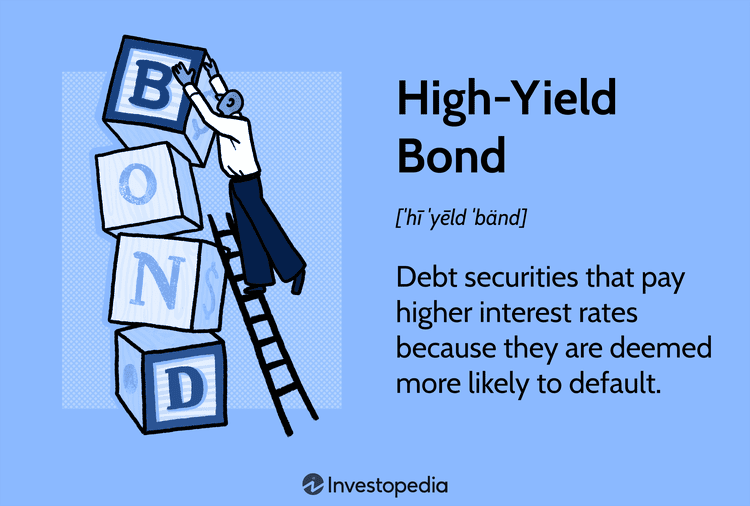

## Table of Contents

## What are high-yield bonds?

High-yield bonds, also known as junk bonds, are bonds that offer higher interest rates because they are riskier investments. These bonds are issued by companies that might have a lower credit rating, which means there's a higher chance they might not be able to pay back the money they borrowed. Investors are willing to take on this extra risk because the higher interest rates can lead to bigger returns on their investment.

Even though high-yield bonds can be a good way to earn more money, they also come with more risk. If the company that issued the bond runs into financial trouble, it might not be able to make the interest payments or return the money when the bond matures. This means investors could lose some or all of their investment. Because of this, high-yield bonds are often seen as a more suitable investment for those who are willing to take on more risk in hopes of higher rewards.

## How do high-yield bonds differ from investment-grade bonds?

High-yield bonds and investment-grade bonds are different mainly because of their risk and the interest they offer. High-yield bonds, also called junk bonds, come from companies that might not be as financially stable. This makes them riskier. Because they are riskier, these bonds offer higher interest rates to attract investors. On the other hand, investment-grade bonds are from companies that are seen as more financially stable and reliable. They have a lower risk of not paying back the money they borrowed, so they offer lower interest rates.

The main difference between these two types of bonds is how safe they are and how much money they can make for investors. High-yield bonds might give you more money because of their higher interest rates, but there's a bigger chance you could lose your investment if the company runs into trouble. Investment-grade bonds are safer, but they won't give you as much money because their interest rates are lower. So, if you want to play it safe, you might choose investment-grade bonds. If you're okay with more risk for the chance of higher rewards, high-yield bonds could be the way to go.

## What are the typical yields offered by high-yield bonds?

High-yield bonds usually offer higher interest rates than other types of bonds. The exact yield can change a lot depending on things like the economy, how risky the bond is, and how long it will take to get your money back. On average, high-yield bonds might give you a yield of around 5% to 8%. But remember, these numbers can go up or down.

If the economy is doing well, high-yield bonds might offer lower yields because people feel safer about investing in riskier things. But if the economy is not doing well, the yields might go up because investors want more money to take on the extra risk. So, it's a good idea to keep an eye on what's happening in the economy if you're thinking about investing in high-yield bonds.

## Who are the typical issuers of high-yield bonds?

High-yield bonds are usually issued by companies that are seen as riskier because they might have more debt or less stable finances. These companies might not have a high credit rating, which means they have to offer higher interest rates to get people to buy their bonds. Some examples of these companies are newer businesses that need money to grow, companies in industries that go up and down a lot, or companies that are trying to fix their money problems.

These bonds can also come from companies that are going through big changes, like being bought out or restructured. Sometimes, even big companies can issue high-yield bonds if they are in a tough spot financially. The main thing is that these issuers are seen as having a higher chance of not being able to pay back the money they borrowed, which is why they have to offer more interest to attract investors.

## What are the risks associated with investing in high-yield bonds?

Investing in high-yield bonds can be risky because these bonds come from companies that might not be very financially stable. If the company gets into money trouble, it might not be able to pay back the interest or the money you lent them. This means you could lose some or all of your investment. High-yield bonds are also affected a lot by what's happening in the economy. If the economy is doing badly, these bonds can lose value quickly, which means you might not get as much money back as you hoped.

Another risk is that high-yield bonds can be hard to sell quickly. If you need your money back and want to sell your bond, you might have to sell it for less than what it's worth. This is called [liquidity](/wiki/liquidity-risk-premium) risk. Also, the prices of high-yield bonds can go up and down a lot, which means they are more volatile. This can make it hard to know what your investment will be worth from one day to the next. So, while high-yield bonds can offer bigger rewards, they also come with bigger risks.

## How can high-yield bonds be used in a diversified investment portfolio?

High-yield bonds can be a good addition to a diversified investment portfolio because they can help you earn more money. These bonds offer higher interest rates than other types of bonds, which means they can increase the overall return on your investments. When you mix high-yield bonds with other investments like stocks, investment-grade bonds, and cash, you spread out your risk. If one type of investment does badly, the others might do well and help balance things out.

But it's important to remember that high-yield bonds are riskier. They come from companies that might not be as financially stable, so there's a bigger chance you could lose money. That's why you should only put a small part of your portfolio into high-yield bonds. This way, you can enjoy the higher returns without putting too much of your money at risk. By carefully choosing how much of your portfolio goes into high-yield bonds, you can make your investments stronger and more balanced.

## What is the historical performance of high-yield bonds compared to other fixed-income securities?

High-yield bonds have generally offered better returns than other fixed-income securities like investment-grade bonds and government bonds. Over the long term, high-yield bonds have given investors higher interest rates because they are riskier. For example, if you look at the past 20 or 30 years, high-yield bonds might have given an average return of around 6% to 8%, while investment-grade bonds might have given around 4% to 5%. This extra return can make a big difference over time, but it comes with more risk.

The performance of high-yield bonds can go up and down a lot more than other fixed-income securities. During good economic times, high-yield bonds can do very well because investors are more willing to take risks. But during bad economic times, like a recession, high-yield bonds can lose a lot of value quickly. This is because the companies that issue these bonds might have trouble paying back their debts. So, while high-yield bonds can help you earn more money, they also come with the chance of losing money if things go wrong.

## What are the key factors to consider when analyzing a high-yield bond?

When you're thinking about buying a high-yield bond, one of the first things to look at is the company that's issuing the bond. You want to know if the company is doing well financially or if it's having money problems. This can tell you how likely it is that the company will be able to pay back the money they borrowed from you. Another thing to check is the bond's credit rating. Agencies like Moody's or Standard & Poor's give ratings to bonds, and a lower rating means the bond is riskier. You should also look at the interest rate the bond is offering. High-yield bonds give higher interest rates because they're riskier, so you want to make sure the extra interest is worth the extra risk.

Another important thing to think about is how long it will take to get your money back. This is called the bond's maturity. If the bond takes a long time to mature, you have to wait longer to get your money back, which can be riskier if the company's financial situation changes. You should also consider how easy it would be to sell the bond if you need your money back before it matures. Some high-yield bonds can be hard to sell quickly, which is called liquidity risk. Finally, think about what's happening in the economy. If the economy is doing well, high-yield bonds might do better, but if it's doing badly, these bonds can lose value quickly.

## How do credit ratings affect the pricing and yield of high-yield bonds?

Credit ratings play a big role in how much a high-yield bond costs and how much interest it gives you. When a bond has a low credit rating, it means the company that issued the bond is seen as riskier. Because of this, investors want more money to take on the extra risk. So, the bond has to offer a higher interest rate to attract people to buy it. This higher interest rate is what makes the bond a high-yield bond. The price of the bond also goes down because fewer people want to buy it when it's riskier.

On the other hand, if a high-yield bond gets a better credit rating, it becomes less risky. When this happens, the bond's price can go up because more people want to buy it. The interest rate might also go down because the bond doesn't need to offer as much to attract investors. So, credit ratings can change how much a high-yield bond is worth and how much money it can make for you. It's important to keep an eye on these ratings if you're thinking about investing in high-yield bonds.

## What are the strategies for managing a portfolio of high-yield bonds?

When managing a portfolio of high-yield bonds, one important strategy is to spread your money across different bonds from different companies and industries. This is called diversification. By doing this, you lower the risk that one company's problems will hurt your whole portfolio. Another strategy is to keep an eye on the economy and the bond market. If the economy is doing well, high-yield bonds might be a good choice because they can give you higher returns. But if the economy is doing badly, you might want to be more careful because high-yield bonds can lose value quickly.

Another strategy is to regularly check the credit ratings of the bonds in your portfolio. If a bond's rating goes down, it might be riskier, and you might want to sell it before it loses more value. On the other hand, if a bond's rating goes up, it might be a good time to hold onto it or even buy more. It's also a good idea to have a mix of short-term and long-term bonds. Short-term bonds can give you more flexibility because you get your money back sooner, but long-term bonds can offer higher interest rates. By balancing these different types of bonds, you can manage the risks and rewards of your high-yield bond portfolio more effectively.

## How do macroeconomic conditions influence the high-yield bond market?

Macroeconomic conditions can really change how well high-yield bonds do. When the economy is doing well, people feel more confident and are more likely to invest in riskier things like high-yield bonds. This means the prices of these bonds can go up and the interest rates might go down a bit because more people want to buy them. But if the economy starts to do badly, like during a recession, things can change quickly. Companies that issue high-yield bonds might have a harder time paying back their debts, so investors get worried and want more money to take on the extra risk. This makes the prices of high-yield bonds go down and the interest rates go up.

Interest rates set by the central bank also play a big role. When the central bank raises interest rates, it can make borrowing money more expensive for companies. This can be bad for high-yield bonds because the companies that issue them might already be struggling with debt. On the other hand, if the central bank lowers interest rates, it can make borrowing cheaper and help these companies. This can make high-yield bonds more attractive to investors because the companies are in a better position to pay back their debts. So, keeping an eye on what's happening with the economy and interest rates can help you understand how high-yield bonds might do in the future.

## What are the advanced techniques for valuing high-yield bonds, including the use of financial models?

Valuing high-yield bonds can be tricky because they come with more risk than other types of bonds. One advanced technique is to use a discounted cash flow (DCF) model. This model helps you figure out what the bond is worth by looking at all the future interest payments and the money you get back when the bond matures. You then "discount" these future payments to today's value using a discount rate that reflects the bond's risk. The higher the risk, the higher the discount rate, which means the bond's value goes down. This method is useful because it takes into account both the bond's cash flows and the risk of the company not being able to pay.

Another technique is to use option-adjusted spread (OAS) models. These models are helpful because they consider the fact that some high-yield bonds can be paid off early by the company. This early payoff is like an option for the company, and it can change the bond's value. The OAS model looks at the bond's yield and compares it to a risk-free bond, adjusting for this option to give a clearer picture of the bond's true value. This can be especially important for high-yield bonds because the risk of early payoff can be higher if the company's financial situation improves.

Lastly, some investors use credit default swap (CDS) spreads to help value high-yield bonds. A CDS is like insurance against the company defaulting on its bond. By looking at the cost of this insurance, you can get an idea of how risky the bond is. If the CDS spread is high, it means the market thinks there's a higher chance the company will have trouble paying back its debt, which can lower the bond's value. Using CDS spreads can give you another way to understand and value the risks of high-yield bonds.

## What are high-yield bonds?

High-yield bonds, commonly referred to as junk bonds, are financial instruments characterized by their issuance from companies that do not possess high credit ratings. These bonds represent a segment of the bond market distinct from investment-grade bonds, which are typically issued by corporations or governments with robust credit ratings. The high-yield designation arises because these bonds are issued by entities perceived to [carry](/wiki/carry-trading) a higher risk of default. As a compensation for this heightened risk, high-yield bonds offer investors the prospect of higher interest rates, thereby appealing to those seeking greater returns on their investments.

The rebranding of junk bonds to high-yield bonds was motivated by the need to recognize their potential for significant returns rather than focusing solely on their risk aspect. This transition reflects an evolving understanding of their risk-return profile. Fundamentally, the yield of a bond is inversely related to its perceived risk; thus, as the risk increases, so does the potential rate of return. This is mathematically represented in the formula for the yield of a bond, which involves the coupon payment relative to the bond's market price:

$$
\text{Yield} = \frac{\text{Coupon Payment}}{\text{Market Price}}
$$

Understanding high-yield bonds necessitates knowledge of the credit rating system, which serves as a vital indicator of the issuer's creditworthiness and financial stability. Agencies such as Standard & Poor’s, Moody’s, and Fitch Ratings evaluate the credit quality of bond issuers and assign ratings that reflect the issuer's ability to meet its debt obligations. High-yield bonds typically fall below the BBB/Baa threshold, categorizing them as non-investment grade. These ratings influence not only investor perception but also the cost at which companies can raise capital.

Investors evaluating high-yield bonds must consider both the yield offered and the inherent risks, with credit ratings playing a pivotal role in assessing the potential for default. The higher yields can contribute to more substantial returns, but they come with the caveat of elevated risk, necessitating careful assessment and strategic allocation within an investment portfolio.

## What are the cons of investing in high-yield bonds?

High-yield bonds, often sought for their promising returns, present an array of challenges that investors must navigate cautiously. These challenges could outweigh the potential benefits for certain investors, particularly when the economic environment is unstable.

**Higher Default Risk**  
High-yield bonds, by definition, are issued by entities with credit ratings below investment grade. This classification indicates a higher likelihood of default, as the issuers are often companies with weaker financial standings. Credit ratings provided by agencies such as Moody's and Standard & Poor's reflect the issuer's ability to meet financial obligations, and a lower rating signals greater default risk. Historically, the default rate for high-yield bonds tends to be significantly higher than that of investment-grade bonds. According to S&P Global Ratings, the average default rate for speculative-grade issuers was about 3.6% over the long term, compared to a mere 0.1% for investment-grade issuers.

**Interest Rate Sensitivity**  
High-yield bonds are also susceptible to [interest rate](/wiki/interest-rate-trading-strategies) fluctuations. As interest rates rise, the market value of existing bonds typically decreases, given that newer issues offer higher returns. For high-yield bonds, this sensitivity can be particularly pronounced. The yield spread, which is the difference between yields on high-yield bonds and safer government bonds, often fluctuates with interest rate changes, impacting market prices. This sensitivity can be modeled using the bond duration formula, which approximates the percentage change in bond price for a 1% change in interest rates:

$$
\text{Duration} = \frac{\text{Price Change}}{\text{Interest Rate Change}}
$$

**Liquidity Concerns**  
Liquidity, which refers to the ease of buying or selling an asset without affecting its price, can be problematic for high-yield bonds. These bonds are generally traded less frequently than investment-grade bonds, partly due to the niche market and higher complexity in valuation. Consequently, during periods of market stress, finding a buyer at a desirable price can be challenging, potentially leading to larger bid-ask spreads and lost opportunities.

**Economic Sensitivity**  
High-yield bonds tend to be highly sensitive to economic cycles. During a recession or economic downturn, companies with lower credit ratings face increased risks, including reduced revenue and cash flow challenges, heightening the possibility of default. During these times, investors often seek safer havens, which can lead to a sharp decline in demand for high-yield bonds and further pressure on their prices. This economic sensitivity is compounded by the fact that during periods of strong economic growth, the demand and performance for these bonds can vastly differ, adding [volatility](/wiki/volatility-trading-strategies) to an investor's portfolio.

In conclusion, while high-yield bonds can offer attractively high returns, the associated risks necessitate a comprehensive understanding and careful consideration within one's investment strategy.

## References & Further Reading

[1]: Altman, E. I., & Hotchkiss, E. (2005). ["Corporate Financial Distress and Bankruptcy: Predict and Avoid Bankruptcy, Analyze and Invest in Distressed Debt."](https://onlinelibrary.wiley.com/doi/book/10.1002/9781118267806) Wiley Finance.

[2]: Fabozzi, F. J. (2000). ["The Handbook of Fixed Income Securities."](https://www.amazon.com/Handbook-Fixed-Income-Securities-Ninth/dp/1260473899) McGraw-Hill.

[3]: Minton, B. A., & Schrand, C. (1999). ["The impact of cash flow volatility on discretionary investment and the costs of debt and equity financing."](https://www.sciencedirect.com/science/article/abs/pii/S0304405X99000422) Journal of Financial Economics, 54(3), 423-460.

[4]: ["Understanding High-Yield Bonds."](https://www.investopedia.com/terms/h/high_yield_bond.asp) J.P. Morgan Global High Yield Insights.

[5]: ["Moody's Default and Recovery Rates of Corporate Bond Issuers."](https://www.moodys.com/sites/products/DefaultResearch/2006200000425249.pdf) Moody's Investors Service, Global Credit Research.

[6]: ["Algorithmic Trading in the High-Yield Bond Market."](https://www.axios.com/2021/09/03/bond-market-trading-algorithms) Greenwich Associates Research Note.

[7]: PwC's Global Economic Crime and Fraud Survey (2018). ["Fraud in Financial Services Industry."](https://www.pwc.com/gx/en/news-room/docs/pwc-global-economic-crime-survey-report.pdf) PwC Publications.

[8]: Lhabitant, F. S. (2004). ["Hedge Funds: Quantitative Insights."](https://www.wiley.com/en-us/Hedge+Funds%3A+Quantitative+Insights-p-9780470687772) Wiley Finance.