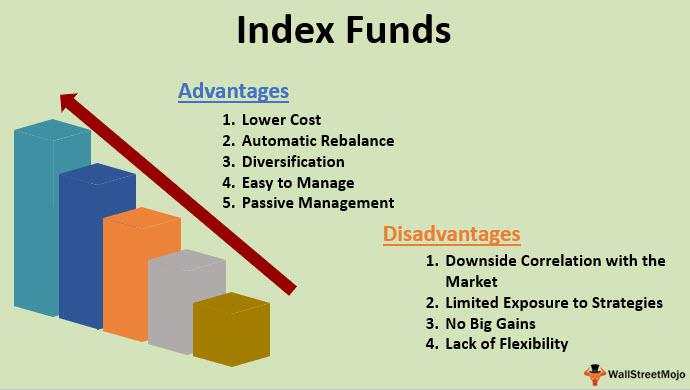

Financial markets are vast ecosystems where various securities, including stocks, bonds, and commodities, are exchanged. These platforms play a crucial role in the global economy by facilitating capital formation and promoting liquidity. Investment options within these markets are diverse, ranging from individual stock picking and mutual funds to more structured vehicles such as exchange-traded funds (ETFs) and index funds.

Index funds are a type of mutual fund or ETF designed to replicate the performance of a specific market index. These funds are passively managed, meaning they aim to mirror the composition and performance of the index they track. By investing in an index fund, investors gain exposure to a broad market segment or the entire market itself, depending on the index being tracked. The benefits of index funds include diversification, as they typically hold a wide range of securities, and cost efficiency due to lower management fees compared to actively managed funds.

Algorithmic trading, often referred to as algo trading, employs computer algorithms to execute trading orders systematically and rapidly. This approach has revolutionized the financial markets by enhancing the speed and precision of trade execution. Algorithmic trading is employed across various strategies, including high-frequency trading, arbitrage, and market-making, to capitalize on market inefficiencies and volatility.

Both index funds and algorithmic trading are integral to modern investment strategies. Index funds provide investors with a diversified portfolio at a lower cost, making them attractive for those seeking to minimize risk while achieving market-level returns. Conversely, algorithmic trading offers a sophisticated means to optimize trading strategies, allowing for more consistent and efficient execution. For investors, combining these strategies can yield substantial benefits by aligning diversification with technological efficiency in trading practices.

The purpose of this article is to explore how index funds and algorithmic trading intersect within financial markets. With a focus on how these strategies can be synergistically employed, the discussion will offer insights into optimizing investment management and expanding the horizons of modern trading practices. Through this exploration, investors can evaluate potential opportunities and challenges associated with these evolving investment tools.

## Table of Contents

## Understanding Index Funds

Index funds are a type of investment vehicle designed to replicate the performance of a specific financial market index, such as the S&P 500, by holding a portfolio of assets that mirror the components of that index. The primary function of index funds is to provide investors with a way to achieve broad market exposure at a relatively low cost, without the need for active management. By investing in an index fund, investors can gain access to a diversified portfolio that represents a particular segment of the financial markets, aiding in the reduction of risk associated with individual stock [picking](/wiki/asset-class-picking).

Index funds are typically classified into various categories based on the assets they track. These include stock index funds, which mirror equity benchmarks like the S&P 500 or the Dow Jones Industrial Average; bond index funds, which follow fixed-income indices like the Bloomberg Barclays U.S. Aggregate Bond Index; international index funds, tracking indices from markets outside of the United States such as the MSCI EAFE; and sector-specific index funds, which concentrate on particular sectors like technology, healthcare, or energy.

The advantages of investing in index funds are numerous. One of the primary benefits is their low cost relative to actively managed mutual funds, largely due to lower management fees and transaction costs. This cost efficiency stems from the passive management approach, which requires less frequent buying and selling of securities. Additionally, index funds offer diversification by investing across a wide array of securities, reducing the impact of poor performance by any single asset. They are also tax-efficient, as they incur lower capital gains taxes due to the minimal turnover in the fund’s portfolio.

Despite these advantages, index funds have potential drawbacks and risks. One notable limitation is their inability to outperform the market since their goal is merely to replicate the performance of a given index. This means that during periods when the market is underperforming, the funds will follow suit, offering no buffer against downturns. Furthermore, because index funds are inherently tied to market indices, they are subject to market [volatility](/wiki/volatility-trading-strategies), which can lead to fluctuations in value that reflect broader economic changes.

In conclusion, while index funds offer a range of benefits including cost efficiency, diversification, and tax advantages, investors should also consider the potential drawbacks such as limited returns and vulnerability to market volatility. This balanced understanding is crucial for making informed investment decisions aligned with individual financial goals.

## Algorithmic Trading in Financial Markets

Algorithmic trading, often referred to as "algo trading," is the use of computer systems to execute trades automatically based on pre-defined criteria and algorithms. These algorithms are designed to analyze variables such as price, timing, and [volume](/wiki/volume-trading-strategy), enabling traders to execute orders with minimal human intervention. The significance of [algorithmic trading](/wiki/algorithmic-trading) in modern finance is profound, driven by its ability to enhance the speed, efficiency, and accuracy of trading processes.

The history of algorithmic trading traces back to the 1970s with the advent of electronic trading platforms. This period marked the transition from manual order execution to computer-assisted trading systems. The New York Stock Exchange first implemented designated order turnaround (DOT) systems in 1969, which paved the way for more sophisticated trading technologies. By the 1980s, program trading became prevalent, allowing the execution of large volumes of stock orders tied to specific market indices.

Fast-forward to the 21st century, algorithmic trading has become an integral part of financial markets. It occupies a substantial portion of the trading volume on stock exchanges worldwide. High-frequency trading ([HFT](/wiki/high-frequency-trading-strategies)), a subset of algorithmic trading, plays a pivotal role in current market dynamics. It capitalizes on slight discrepancies in price movements, executing trades within fractions of a second. HFT firms leverage low-latency infrastructure to gain competitive advantages, generating considerable [liquidity](/wiki/liquidity-risk-premium) and tightening spreads.

Several algorithmic trading strategies prevail in financial markets. Trend-following, for instance, involves algorithms identifying and capitalizing on the [momentum](/wiki/momentum) of asset prices. These strategies adapt to market fluctuations using historical data and statistical models. Arbitrage is another strategy, seeking profit from price inefficiencies between correlated assets or markets. It ensures that prices converge to their fair value across markets. Market-making algorithms, on the other hand, provide liquidity by continuously offering buy and sell quotes, profiting from the bid-ask spread while managing inventory risk.

The rise of high-frequency trading has undeniably altered market dynamics. HFT contributes to increased market liquidity but has also raised concerns regarding market stability and fairness. The "flash crash" of May 6, 2010, when major stock indices plummeted and recovered within minutes, highlighted the potential risks associated with HFT. Regulatory bodies have since scrutinized these practices, advocating for greater transparency and control.

In conclusion, algorithmic trading has revolutionized the structure of financial markets. As technology advances, the sophistication and capabilities of trading algorithms continue to grow, shaping the environment for all market participants. Understanding these mechanisms is crucial for evaluating their implications on market behavior and investment strategies.

## The Synergy Between Index Funds and Algorithmic Trading

Algorithmic trading significantly enhances the management of index funds by leveraging computational algorithms to make swift trading decisions. These algorithms are designed to optimize various facets such as asset selection, trade execution, and portfolio rebalancing, thus improving operational efficiency and consistency in fund management.

**Optimizing Index Fund Management with Algorithms**

One of the primary applications of algorithmic trading in index fund management is the automation of portfolio rebalancing. Index funds need to maintain a portfolio that accurately reflects a specific index. This requires periodic buying and selling of assets, which can be efficiently managed through algorithmic strategies. Algorithms evaluate market conditions, assess asset weights, and execute necessary trades with precision and speed, minimizing deviation from the index.

**Examples of Successful Integration**

A notable example of successful algorithm integration in index fund management can be observed in Vanguard’s use of algorithms to optimize trade execution. Vanguard employs proprietary algorithms to minimize the impact of large trades on market prices. These algorithms analyze liquidity conditions and dynamically adjust trading strategies to reduce cost, thereby enhancing fund performance.

Another example is BlackRock, which utilizes sophisticated [machine learning](/wiki/machine-learning) algorithms for market analysis and trend detection. BlackRock’s algorithms predict market movements and adjust index fund positions accordingly, ensuring that the funds maintain performance levels in line with evolving market dynamics.

**Benefits of Algorithmic Trading**

The benefits of using algorithmic trading for index funds are manifold. First, algorithms ensure high levels of efficiency by executing trades faster than any human trader can, reducing the time assets remain out of the market. This speed decreases tracking error, the difference between the index and the fund’s performance. Secondly, algorithms provide consistency in trading decisions, adhering strictly to predefined rules, devoid of human emotion, thus improving reliability in achieving investment objectives.

**Challenges and Solutions**

Despite its advantages, algorithmic trading in index fund management faces challenges. One major issue is algorithmic risk, where programming errors or unforeseen market conditions could lead to suboptimal trading decisions. Mitigating this risk involves rigorous [backtesting](/wiki/backtesting) and real-time monitoring of algorithms to ensure they perform as expected under varied market conditions.

Another challenge is market impact, where large trades executed by algorithms could affect asset prices. Addressing this involves implementing algorithms that break large orders into smaller, market-friendly parts, executed over time to minimize price impact. 

Moreover, regulatory challenges necessitate adherence to financial regulations to prevent issues such as market manipulation. Ensuring compliance through constant updates based on regulatory changes and incorporating regulatory conditions into algorithmic models is essential for sustainable algorithmic trading in this sector. 

In conclusion, algorithmic trading aligns with the objectives of index fund management by offering increased efficiency, consistency, and accuracy. However, addressing the inherent challenges through robust algorithm design and continuous monitoring is critical to leveraging its full potential.

## Considerations for Investors

When investing in index funds through algorithmic trading, investors must carefully evaluate several key factors to ensure their strategies are sound and their goals attainable. 

### Understanding the Costs, Risks, and Expected Returns

The costs involved in algorithmic trading of index funds primarily consist of management fees, trading fees, and potential costs related to slippage and market impact. Index fund fees are typically low compared to actively managed funds, but algorithmic strategies might add transaction costs. Investors should analyze the total expense ratio (TER) to gauge the cost-effectiveness of their investments.

Risks associated with algorithmic trading include market risk, liquidity risk, and model risk. The latter arises when algorithms fail to predict market movements due to incorrect assumptions or data inputs. It's crucial for investors to conduct rigorous backtesting and stress testing of algorithms to anticipate and mitigate these risks. 

Expected returns from algorithmic trading should harmonize with the investor's risk tolerance and time horizon. Historical performance, while indicative, is not a guarantee of future results. Using tools like the Sharpe Ratio can help investors assess the risk-adjusted performance of their strategies:

$$
\text{Sharpe Ratio} = \frac{R_p - R_f}{\sigma_p}
$$

Where:
- $R_p$ = Expected portfolio return
- $R_f$ = Risk-free rate
- $\sigma_p$ = Standard deviation of portfolio returns

### Aligning Investment Strategies with Personal Financial Goals

Investment strategies should be aligned with individual financial goals, whether they are wealth accumulation, income generation, or preservation of capital. This alignment helps maintain a coherent approach to risk and return expectations, influencing the selection and management of index funds and algorithmic strategies.

Investors should continuously reassess their financial objectives and adapt their strategies accordingly, considering factors like age, income, and liquidity needs. Diversification across various indices and asset classes can also provide a stable path to achieving these goals while minimizing unsystematic risk.

### Regulatory and Ethical Considerations

Regulatory and ethical considerations are paramount in algorithmic trading and fund management. Investors need to be aware of regulations governing trading practices, which vary by jurisdiction but often include best execution requirements, market manipulation prohibitions, and transparency obligations. Regulatory frameworks such as the U.S. Securities and Exchange Commission's (SEC) regulations and the European Union's Markets in Financial Instruments Directive II (MiFID II) play critical roles in shaping these practices.

Ethical considerations involve ensuring the integrity and fairness of the markets. Investors should seek fund managers who adhere to ethical guidelines, promoting transparent operations and avoiding conflicts of interest. Moreover, as algorithmic trading can lead to market instability, it is imperative to implement robust risk management frameworks to minimize adverse market effects.

In summary, when investing in index funds through algorithmic trading, investors must deftly navigate the complexities of cost analysis, risk management, and anticipated return alignment with personal financial aspirations, all within a framework of regulatory compliance and ethical responsibility.

## Future Trends and Developments

Emerging trends in algorithmic trading for index funds are increasingly defining the trajectory of modern financial markets. A significant trend is the integration of [artificial intelligence](/wiki/ai-artificial-intelligence) (AI) and machine learning (ML) algorithms, which enable more sophisticated analysis and prediction models. These technologies allow for the processing of vast amounts of data to identify trading opportunities, optimize portfolios, and enhance risk management strategies. For example, AI-driven algorithms are capable of analyzing macroeconomic indicators, sentiment analysis from news and social media, and even unexpected geopolitical events that could impact markets, thereby increasing the efficacy of trading strategies for index funds.

Technological advancements continue to reshape financial markets, with blockchain technology being another key area of development. Decentralized finance (DeFi) platforms are emerging, providing new opportunities for liquidity and execution of trades without traditional intermediaries. These platforms can reduce transaction costs and increase transparency, which is particularly beneficial for managing index funds efficiently. Moreover, the rise of quantum computing, promising exponential increases in processing power, is anticipated to further revolutionize algorithmic models, enabling real-time data analysis and decision-making processes that were previously unimaginable.

Regulatory changes are a prominent consideration as they can significantly impact trading practices. Financial authorities globally are increasingly scrutinizing algorithmic trading to ensure market stability and prevent manipulative practices. Regulations may impose limits on high-frequency trading to mitigate systemic risks and ensure fair market access. Additionally, the need for comprehensive data privacy laws could affect how financial data is harvested and utilized by algorithms. Investors and fund managers must stay informed of these regulatory landscapes to adjust their strategies accordingly and remain compliant.

Preparing for and capitalizing on these changes requires strategic foresight and adaptability. Investors should focus on continuous education regarding technological advancements and regulatory updates. Collaborating with fintech firms that specialize in algorithmic trading could offer competitive advantages and insights into new trading solutions. Furthermore, allocating resources to integrate and test new technologies within existing frameworks ensures that investors are not only prepared but also positioned to leverage these developments for optimized returns and diversified risk management.

Investors should also consider portfolio diversification, not only through varied asset classes but also by incorporating innovations such as [ESG](/wiki/esg-investing) (Environmental, Social, and Governance) metrics, which are increasingly being integrated into algorithmic models. This approach aligns with evolving market preferences and regulatory incentives for sustainable investing. By understanding and embracing these shifts, investors can enhance their portfolios' resilience against volatility and tap into the evolving dynamics of global financial markets.

## Conclusion

The integration of index funds and algorithmic trading has become a cornerstone in the landscape of contemporary financial markets. Index funds offer investors a structured, diversified, and cost-effective manner to partake in the growth of entire sectors or economies. Meanwhile, algorithmic trading introduces a level of precision, speed, and efficiency that manual trading lacks, optimizing the management and trading of these funds. Together, they represent a robust approach to achieving consistent returns while mitigating risks associated with market volatility.

Investors stand to benefit immensely from these strategies. Index funds provide a straightforward investment vehicle that aligns with the principles of diversification and passive investment. Concurrently, utilizing algorithmic trading can enhance portfolio performance through strategic rebalancing and exploitation of market inefficiencies, potentially leading to better alignment with an investor’s financial objectives.

However, the landscape of financial investing is continuously evolving. As financial technologies advance, staying educated and aware is imperative for investors. Education not only encompasses understanding current market dynamics but also being aware of emerging tools and strategies that can enhance investment outcomes. As algorithmic trading and index funds continue to evolve, investors must remain vigilant and informed to leverage these advancements effectively.

In conclusion, as these investment modalities become more sophisticated, there is a pressing need for investors to evaluate their current strategies. This involves a thorough analysis of existing portfolios, considering the integration of algorithmic strategies, and adjusting investment approaches to align with personal and market trends. By doing so, investors are equipped to navigate the complexities of modern financial markets successfully.

## References & Further Reading

[1]: Bogle, J.C. (2017). ["The Little Book of Common Sense Investing: The Only Way to Guarantee Your Fair Share of Stock Market Returns."](https://www.amazon.com/Little-Book-Common-Sense-Investing/dp/1119404509) John Wiley & Sons.

[2]: Malkiel, B.G. (2019). ["A Random Walk Down Wall Street: The Time-Tested Strategy for Successful Investing."](https://yourknowledgedigest.org/wp-content/uploads/2020/04/a-random-walk-down-wall-street.pdf) W.W. Norton & Company.

[3]: Aldridge, I. (2013). ["High-Frequency Trading: A Practical Guide to Algorithmic Strategies and Trading Systems."](https://www.amazon.com/High-Frequency-Trading-Practical-Algorithmic-Strategies/dp/1118343506) John Wiley & Sons.

[4]: Hasbrouck, J. (2007). ["Empirical Market Microstructure: The Institutions, Economics, and Practice of Securities Trading."](https://archive.org/details/empiricalmarketm0000hasb) Oxford University Press.

[5]: ["Vanguard's Principles for Investing Success"](https://corporate.vanguard.com/content/corporatesite/us/en/corp/how-we-invest/principles-for-investing-success.html) Vanguard.

[6]: BlackRock. (2021). ["Sustainable Investing: Building a Resilient and Sustainable Portfolio."](https://www.blackrock.com/sg/en/investment-strategies/sustainable-transition-investing) BlackRock Insights.

[7]: Chincarini, L.B. (2012). ["Quantitative Equity Portfolio Management: Modern Techniques and Applications."](https://ludwigbc.com/books/qepm-2/) McGraw-Hill.

[8]: Federal Reserve Bank of Chicago (2012). ["How High Frequency Trading Affects Markets."](https://www.chicagofed.org/publications/policy-discussion-papers/2012/pdp-2) Chicago Fed Letter, No. 301.

[9]: ["MiFID II: A New Framework for European Financial Markets"](https://www.lexisnexis.co.uk/store/products/mifid-ii-a-new-framework-for-european-financial-markets.html) European Commission.