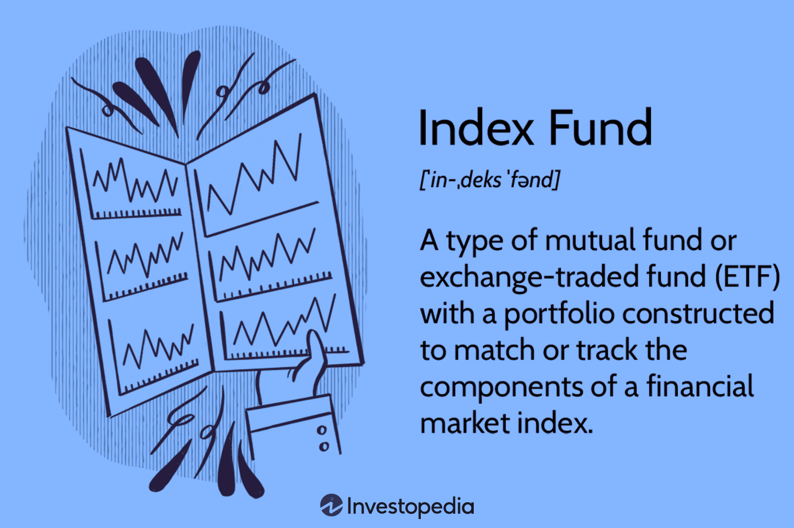

## Table of Contents

## What is an index fund?

An index fund is a type of investment that tries to match the performance of a specific market index, like the S&P 500. Instead of picking individual stocks, the fund buys all the stocks in the index. This makes it easier for people to invest in the market without having to choose which stocks to buy.

Index funds are popular because they are simple and usually have lower fees than other types of funds. They are a good choice for people who want to invest in the market but don't want to spend a lot of time or money on managing their investments. By investing in an index fund, you can own a small piece of many different companies, which can help spread out your risk.

## How do index funds work?

Index funds work by trying to copy the performance of a specific market index, like the S&P 500. They do this by buying all the stocks that are in that index. For example, if the S&P 500 has 500 different companies, the index fund will buy a little bit of each one. This way, the fund's value goes up and down with the overall market, instead of betting on just a few stocks.

When you invest in an index fund, you are basically buying a small piece of all the companies in the index. This is good because it spreads out your risk. If one company does poorly, it won't hurt your investment as much because you also own parts of many other companies. Plus, index funds usually have lower fees than other types of funds because they don't need a lot of people to manage them. They just follow the index, which makes them a simple and affordable way to invest in the market.

## What are the benefits of investing in index funds?

One big benefit of investing in index funds is that they are simple and easy to manage. You don't need to spend a lot of time [picking](/wiki/asset-class-picking) which stocks to buy because the fund does that for you. It just follows the market index, like the S&P 500. This means you can invest in a lot of different companies without having to do a lot of work. Plus, index funds usually have lower fees than other types of funds because they don't need a lot of people to manage them.

Another benefit is that index funds help spread out your risk. When you invest in an index fund, you own a little bit of all the companies in the index. This means if one company does badly, it won't hurt your investment too much because you also own parts of many other companies. This can make your investment safer than if you put all your money into just one or a few stocks. Overall, index funds are a good way to invest in the market without taking on too much risk or spending a lot of time and money.

## What are the common indices that index funds track?

Index funds often track well-known market indices like the S&P 500. The S&P 500 is a popular choice because it includes 500 of the biggest companies in the United States. When you invest in an S&P 500 index fund, you're basically buying a small piece of these big companies. This makes it a good way to invest in the overall U.S. stock market without having to pick individual stocks.

Another common index is the Dow Jones Industrial Average, which tracks 30 large companies in the U.S. While it's smaller than the S&P 500, it's still a good way to get a sense of how the market is doing. There's also the Nasdaq Composite, which focuses on technology and internet companies. This can be a good choice if you want to invest in the tech sector specifically.

Other indices that index funds might track include the Russell 2000, which follows smaller companies, and international indices like the MSCI EAFE, which covers developed markets outside of North America. Each of these indices offers a different way to invest in the market, depending on what you're looking for.

## How do index funds differ from actively managed funds?

Index funds and actively managed funds are two different ways to invest in the stock market. Index funds try to match the performance of a specific market index, like the S&P 500. They do this by buying all the stocks in that index. This makes them simple and easy to manage because they just follow the market. On the other hand, actively managed funds are run by people who pick which stocks to buy and sell. They try to beat the market by choosing stocks they think will do well. This means they need more work and usually cost more in fees.

Another big difference is the cost. Index funds usually have lower fees because they don't need a lot of people to manage them. They just need to keep the fund in line with the index. Actively managed funds, however, have higher fees because they need people to research and pick stocks. This can eat into your returns over time. Also, index funds are good for spreading out your risk because you own a little bit of many different companies. Actively managed funds can be riskier because they might focus on just a few stocks, and if those stocks do badly, it can hurt your investment more.

## What are the risks associated with index funds?

Index funds are generally seen as a safe way to invest, but they still come with some risks. One risk is that the whole market can go down. If the index that the fund tracks, like the S&P 500, goes down, then your investment will go down too. This means you could lose money if the market has a bad year. Another risk is that index funds don't try to beat the market, they just try to match it. So, if the market does well, you'll do well, but you won't do better than the market.

Another risk to think about is that index funds are not as flexible as other types of funds. They have to follow the index, so they can't change their investments based on what's happening in the market. If one part of the market is doing really badly, the fund can't sell those stocks and buy others that might do better. This can be a problem if the market changes a lot. Also, while index funds usually have lower fees, those fees can still add up over time and affect your returns. So, it's good to keep an eye on the fees and make sure they're not too high.

## How can one start investing in index funds?

To start investing in index funds, the first thing you need to do is open a brokerage account. This is like a bank account, but for buying and selling investments. You can do this online with many big companies like Vanguard, Fidelity, or Charles Schwab. Once your account is set up, you'll need to put some money into it. This money is what you'll use to buy the index fund.

After you have money in your account, you can choose which index fund you want to invest in. There are many to pick from, but a good place to start is with an S&P 500 index fund. This fund tracks the 500 biggest companies in the U.S. and is a good way to invest in the overall market. Once you've picked your fund, you can buy shares of it through your brokerage account. It's a good idea to keep adding money to your investment over time, which can help your money grow more.

## What are the costs involved in investing in index funds?

When you invest in index funds, you need to think about the costs. One big cost is the expense ratio. This is a small percentage of your investment that the fund company takes each year to cover their costs. For example, if a fund has an expense ratio of 0.10%, that means they take $10 out of every $10,000 you invest each year. Index funds usually have lower expense ratios than other types of funds because they don't need a lot of people to manage them. They just follow the market.

Another cost to think about is the trading fees or commissions. Some brokerages might charge you a fee every time you buy or sell shares of an index fund. But a lot of big brokerages now offer free trading, so you might not have to pay this fee. It's a good idea to check with your brokerage to see what their fees are. Over time, these costs can add up, so it's important to keep them as low as you can to help your investment grow more.

## How does diversification work in index funds?

Diversification in index funds means spreading your money across many different companies. When you invest in an index fund, like one that follows the S&P 500, you're buying a little bit of all the companies in that index. This helps lower your risk because if one company does badly, it won't hurt your whole investment too much. Instead of betting on just one or a few stocks, you're investing in a big group of companies. This makes your investment safer because you're not relying on just one company to do well.

By owning a piece of many companies, index funds help you avoid the risk of putting all your eggs in one basket. If the stock market goes up, your index fund will likely go up too, because it's made up of a lot of different stocks. And if some companies in the index do badly, the good performance of other companies can help balance it out. This is why index funds are a good way to invest in the market without taking on too much risk.

## What are the tax implications of investing in index funds?

When you invest in index funds, you need to think about taxes. One thing to know is that index funds can create capital gains taxes. This happens when the fund sells stocks for a profit. If the fund makes money from selling stocks, you might have to pay taxes on that money, even if you haven't sold your shares of the fund. But, index funds usually have lower turnover than other types of funds, which means they buy and sell stocks less often. This can help keep your taxes lower because there are fewer chances for the fund to create capital gains.

Another tax to think about is the dividend tax. Index funds often pay out dividends, which are payments from the companies in the fund. These dividends are usually taxed as regular income, but if you hold the fund in a tax-advantaged account like an IRA or 401(k), you might not have to pay taxes on them right away. It's a good idea to talk to a tax advisor to understand how index funds might affect your taxes and how you can use tax-advantaged accounts to help your investments grow more.

## How do you evaluate the performance of an index fund?

To evaluate the performance of an index fund, you should first look at how well it matches the index it's supposed to track. For example, if it's an S&P 500 index fund, you want to see if its returns are close to the S&P 500's returns. A good way to do this is by checking the fund's tracking error. This tells you how much the fund's performance differs from the index. A smaller tracking error means the fund is doing a better job of following the index.

Another thing to look at is the fund's expense ratio. This is the fee the fund charges you each year to manage your money. A lower expense ratio means more of your money stays invested and can grow over time. You should also compare the fund's performance over different time periods, like one year, three years, and five years. This helps you see if the fund is doing well over the long term, which is important for most investors. By looking at these things, you can get a good idea of how well an index fund is performing and if it's a good choice for your investment goals.

## What advanced strategies can be used with index funds for expert investors?

Expert investors can use a strategy called tax-loss harvesting with index funds. This means selling an index fund that has gone down in value to get a tax break, and then buying a similar but different index fund. For example, if you own an S&P 500 fund that's lost value, you could sell it and buy a total stock market fund. This way, you still stay invested in the market, but you can use the loss to lower your taxes. It's a smart move because it helps you keep more of your money while still being invested in a broad range of stocks.

Another advanced strategy is using index funds for tactical asset allocation. This means changing how much you invest in different types of index funds based on what's happening in the market. For example, if you think the economy is going to do well, you might put more money into stock index funds. If you think there's going to be a downturn, you might move some money into bond index funds, which are usually safer. By shifting your investments like this, you can try to get better returns and lower your risk. But remember, trying to time the market can be tricky, so it's important to do a lot of research and maybe talk to a financial advisor.

## What are the considerations for investors?

When investing in index funds through [algorithmic trading](/wiki/algorithmic-trading), investors must carefully evaluate several key factors to ensure their strategies are sound and their goals attainable. 

### Understanding the Costs, Risks, and Expected Returns

The costs involved in algorithmic trading of index funds primarily consist of management fees, trading fees, and potential costs related to slippage and market impact. Index fund fees are typically low compared to actively managed funds, but algorithmic strategies might add transaction costs. Investors should analyze the total expense ratio (TER) to gauge the cost-effectiveness of their investments.

Risks associated with algorithmic trading include market risk, [liquidity](/wiki/liquidity-risk-premium) risk, and model risk. The latter arises when algorithms fail to predict market movements due to incorrect assumptions or data inputs. It's crucial for investors to conduct rigorous [backtesting](/wiki/backtesting) and stress testing of algorithms to anticipate and mitigate these risks. 

Expected returns from algorithmic trading should harmonize with the investor's risk tolerance and time horizon. Historical performance, while indicative, is not a guarantee of future results. Using tools like the Sharpe Ratio can help investors assess the risk-adjusted performance of their strategies:

$$
\text{Sharpe Ratio} = \frac{R_p - R_f}{\sigma_p}
$$

Where:
- $R_p$ = Expected portfolio return
- $R_f$ = Risk-free rate
- $\sigma_p$ = Standard deviation of portfolio returns

### Aligning Investment Strategies with Personal Financial Goals

Investment strategies should be aligned with individual financial goals, whether they are wealth accumulation, income generation, or preservation of capital. This alignment helps maintain a coherent approach to risk and return expectations, influencing the selection and management of index funds and algorithmic strategies.

Investors should continuously reassess their financial objectives and adapt their strategies accordingly, considering factors like age, income, and liquidity needs. Diversification across various indices and asset classes can also provide a stable path to achieving these goals while minimizing unsystematic risk.

### Regulatory and Ethical Considerations

Regulatory and ethical considerations are paramount in algorithmic trading and fund management. Investors need to be aware of regulations governing trading practices, which vary by jurisdiction but often include best execution requirements, market manipulation prohibitions, and transparency obligations. Regulatory frameworks such as the U.S. Securities and Exchange Commission's (SEC) regulations and the European Union's Markets in Financial Instruments Directive II (MiFID II) play critical roles in shaping these practices.

Ethical considerations involve ensuring the integrity and fairness of the markets. Investors should seek fund managers who adhere to ethical guidelines, promoting transparent operations and avoiding conflicts of interest. Moreover, as algorithmic trading can lead to market instability, it is imperative to implement robust risk management frameworks to minimize adverse market effects.

In summary, when investing in index funds through algorithmic trading, investors must deftly navigate the complexities of cost analysis, risk management, and anticipated return alignment with personal financial aspirations, all within a framework of regulatory compliance and ethical responsibility.

## References & Further Reading

[1]: Bogle, J.C. (2017). ["The Little Book of Common Sense Investing: The Only Way to Guarantee Your Fair Share of Stock Market Returns."](https://www.amazon.com/Little-Book-Common-Sense-Investing/dp/1119404509) John Wiley & Sons.

[2]: Malkiel, B.G. (2019). ["A Random Walk Down Wall Street: The Time-Tested Strategy for Successful Investing."](https://yourknowledgedigest.org/wp-content/uploads/2020/04/a-random-walk-down-wall-street.pdf) W.W. Norton & Company.

[3]: Aldridge, I. (2013). ["High-Frequency Trading: A Practical Guide to Algorithmic Strategies and Trading Systems."](https://www.amazon.com/High-Frequency-Trading-Practical-Algorithmic-Strategies/dp/1118343506) John Wiley & Sons.

[4]: Hasbrouck, J. (2007). ["Empirical Market Microstructure: The Institutions, Economics, and Practice of Securities Trading."](https://archive.org/details/empiricalmarketm0000hasb) Oxford University Press.

[5]: ["Vanguard's Principles for Investing Success"](https://corporate.vanguard.com/content/corporatesite/us/en/corp/how-we-invest/principles-for-investing-success.html) Vanguard.

[6]: BlackRock. (2021). ["Sustainable Investing: Building a Resilient and Sustainable Portfolio."](https://www.blackrock.com/sg/en/investment-strategies/sustainable-transition-investing) BlackRock Insights.

[7]: Chincarini, L.B. (2012). ["Quantitative Equity Portfolio Management: Modern Techniques and Applications."](https://ludwigbc.com/books/qepm-2/) McGraw-Hill.

[8]: Federal Reserve Bank of Chicago (2012). ["How High Frequency Trading Affects Markets."](https://www.chicagofed.org/publications/policy-discussion-papers/2012/pdp-2) Chicago Fed Letter, No. 301.

[9]: ["MiFID II: A New Framework for European Financial Markets"](https://www.lexisnexis.co.uk/store/products/mifid-ii-a-new-framework-for-european-financial-markets.html) European Commission.