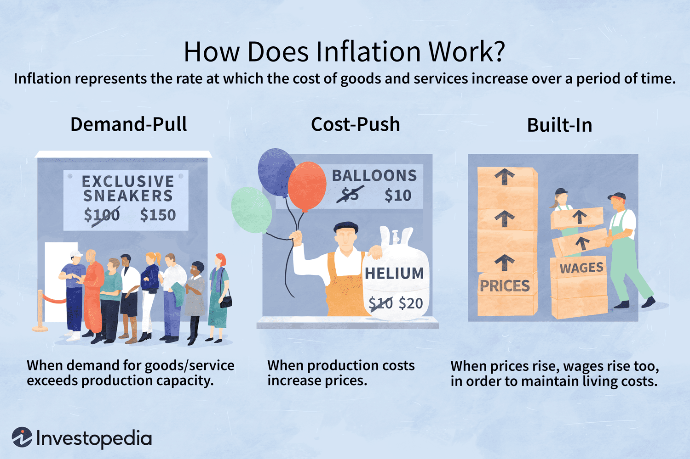

In today's rapidly evolving financial landscape, understanding the interplay between economic concepts such as inflation, price increases, and algorithmic trading is crucial. These elements are not isolated phenomena but are interconnected, influencing the dynamics of financial markets and dictating economic strategies worldwide. As inflation reflects the sustained rise in the overall price level of goods and services, it inherently affects purchasing power, consumer behavior, and ultimately, economic decisions both at the macro and microeconomic levels.

Algorithmic trading, on the other hand, utilizes pre-programmed instructions and sophisticated algorithms to execute trades at speeds and frequencies that are impossible for a human trader. It capitalizes on these economic indicators, including inflation and price changes, to identify and exploit market inefficiencies. Through the integration of vast datasets, algorithmic trading systems analyze economic trends, market sentiment, and financial data, enabling investors to make rapid decisions that could mean the difference between profit and loss in volatile market conditions.



This article aims to explore the intricate relationships between these key elements, demonstrating their impact on financial markets and strategic economic planning. We will investigate how inflation and price changes catalyze shifts in algorithmic trading strategies and investment decisions. Moreover, as economic volatility presents both challenges and opportunities, understanding these relationships becomes essential for investors and policymakers who strive to formulate informed and adaptive strategies. Ultimately, the goal is to provide insights that help stakeholders in the financial ecosystem optimize their approaches and enhance their decision-making processes in response to ever-changing economic conditions.

## Table of Contents

## Understanding Economic Factors

Economic factors are pivotal to the analysis and functioning of an economy. These factors provide insights into the broader economic environment and inform a multitude of strategic decisions in financial markets. Key economic indicators directly influencing economic performance include Gross Domestic Product (GDP), Unemployment Rate, Consumer Price Index (CPI), and Interest Rates. 

GDP is the total market value of all goods and services produced within a country over a specified period. It serves as a comprehensive measure of a nation’s overall economic activity and an indicator of economic health. Changes in GDP reflect the pace at which an economy is growing or contracting, influencing investor confidence and market valuations.

The Unemployment Rate reflects the percentage of the labor force that is jobless and actively seeking employment. It is a crucial indicator of economic stability and labor market conditions. High unemployment rates typically signal economic distress, while lower rates are generally associated with economic expansion.

The Consumer Price Index (CPI) measures the average change over time in the prices paid by urban consumers for a market basket of consumer goods and services. As a primary measure of inflation, the CPI helps evaluate purchasing power and cost-of-living adjustments.

Interest Rates, determined by central banks, have significant implications for economic activities. They influence borrowing costs, consumer spending, and business investment. Lower interest rates tend to stimulate economic growth by making borrowing cheaper, whereas higher rates may slow inflation but can also dampen economic activities.

Understanding these metrics is essential for predicting market trends and crafting effective trading strategies. In the context of [algorithmic trading](/wiki/algorithmic-trading), these economic indicators play a critical role. Algorithmic trading involves the use of computer programs to execute trades based on predefined criteria at speeds faster than human capabilities. Algorithms analyze vast datasets, incorporating economic indicators to identify patterns and optimize trading decisions. 

For example, if a trading algorithm identifies a trend of rising GDP and decreasing unemployment rates, it might infer positive economic growth, thus favoring bullish investment strategies. Conversely, if CPI data suggests rising inflation, algorithms may adjust to mitigate risk by reallocating assets or altering trading frequency.

By leveraging these economic indicators, algorithmic trading strategies can enhance decision-making processes, reducing inefficiencies and exploiting market opportunities. As economic conditions fluctuate, the ability to interpret and respond to these changes in real-time is an invaluable asset within modern financial markets.

## The Dynamics of Inflation

Inflation is a fundamental economic concept characterized by a persistent rise in the general price level of goods and services in an economy over a period. It is a critical [factor](/wiki/factor-investing) influencing both economic policy and market behavior. Inflation is commonly measured through indices such as the Consumer Price Index (CPI) and the Producer Price Index (PPI). The CPI represents changes in the retail prices of a basket of goods and services, while the PPI reflects changes in the selling prices received by domestic producers for their output.

Several underlying factors contribute to inflation, broadly categorized into demand-pull, cost-push, and built-in inflation. Demand-pull inflation occurs when the aggregate demand in an economy outpaces aggregate supply. This scenario often transpires in a rapidly growing economy where increased consumer spending, investment, and government expenditure result in higher demand for goods and services, consequently leading to price increases.

Cost-push inflation is the result of rising costs of production inputs, such as raw materials and labor. When production costs increase, businesses may pass these costs onto consumers in the form of higher prices to maintain profit margins. This often occurs when there are supply chain disruptions, natural disasters affecting supply, or increased taxation on commodities.

Built-in inflation, also known as wage-price inflation, is driven by the expectation of future inflation. As prices increase, workers demand higher wages to maintain their purchasing power. Businesses, in turn, raise prices to accommodate the higher wage costs, creating a self-sustaining cycle of wage and price increases.

Understanding these dynamics is essential for investors, businesses, and policymakers. For investors, identifying inflationary trends is crucial for adjusting asset portfolios to hedge against inflation risk. Businesses must adapt pricing strategies to maintain competitiveness and profitability amidst changing input costs. Policymakers, particularly central banks, utilize monetary policy tools to manage inflation rates, aiming to balance economic growth with price stability. This balance is often targeted through [interest rate](/wiki/interest-rate-trading-strategies) adjustments and regulatory measures to control money supply and demand within the economy.

## Price Increases: Causes and Effects

Various factors contribute to price increases, extending beyond the traditional scope of inflationary pressures. Key among these are supply chain disruptions and demand surges, which can have significant effects on economic stability and business operations.

Supply chain disruptions can result from numerous causes, such as natural disasters, geopolitical tensions, or global pandemics, leading to a decrease in the availability of goods and services. The restricted supply often leads to higher prices as businesses struggle to meet consumer demand with limited resources. For example, the COVID-19 pandemic significantly disrupted global supply chains, resulting in notable price increases for numerous products.

Demand surges, on the other hand, occur when there is a sudden spike in consumer desire for a particular product or service. This heightened demand can push prices upward, especially when the supply does not increase at a corresponding rate. A classic example of demand-pull inflation, demand surges can stem from various sources, including shifts in consumer preferences, technological advancements that make new products desirable, or economic policies that increase consumer purchasing power.

The impact of these price increases can vary significantly across different sectors, influencing both consumer behavior and business strategies. For consumers, higher prices may result in reduced purchasing power, leading them to alter their spending habits by prioritizing essential items over non-essentials. This shift can have a ripple effect on businesses, necessitating adjustments in pricing strategies, inventory management, and long-term planning to maintain competitiveness and profitability.

The long-term implications of price increases also involve inflation expectations, which can influence wage demands and cost-of-living adjustments. If consumers and businesses begin to anticipate ongoing price hikes, this can lead to a self-fulfilling cycle where inflation expectations contribute to actual inflation, impacting economic stability.

Competitiveness issues are another crucial consideration. In an environment where prices are rising, businesses that can manage their supply chains efficiently or innovate to reduce costs may gain a competitive edge. Conversely, companies that are unable to adapt may lose market share to more agile competitors.

In summary, understanding the multifaceted causes and effects of price increases is vital for developing effective business strategies and economic policies. By recognizing the complexities beyond inflation, stakeholders can better prepare for potential adversities and leverage opportunities to sustain growth in a fluctuating market environment.

## The Role of Algorithmic Trading in Modern Markets

Algorithmic trading has become a vital component of modern financial markets, leveraging computer algorithms to execute trades at unprecedented speeds and volumes. The foundation of algorithmic trading lies in its ability to process vast amounts of data, analyze economic indicators, and execute trades with minimal human intervention. By relying on algorithms, traders can capitalize on market inefficiencies, ensuring optimal timing and pricing of trades.

The core advantage of algorithmic trading is its capacity to execute orders at high speed and accuracy. Algorithms can parse through real-time market data, identifying patterns and trends that are imperceptible to human traders. This speed enables traders to exploit short-lived opportunities, such as price discrepancies between different markets or assets. Additionally, algorithms can be programmed to adhere to pre-defined risk parameters, helping traders manage their exposure and optimize their portfolios.

Economic indicators like inflation play a crucial role in shaping algorithmic trading strategies. Inflation affects interest rates, currency value, and overall market sentiment, all of which influence trading opportunities. By integrating this data into their models, algorithmic traders can anticipate market movements and adjust their strategies accordingly. For instance, rising inflation may lead to an expectation of higher interest rates, prompting algorithms to adjust positions in bonds or equities sensitive to rate changes.

Despite its benefits, algorithmic trading is not without challenges. Market [volatility](/wiki/volatility-trading-strategies) can impact algorithmic strategies, leading to potential losses if algorithms are not designed to handle sudden price swings. Moreover, the reliance on historical data means that algorithms may not always predict future market movements accurately, especially in times of economic uncertainty or unprecedented events.

Regulatory considerations also pose significant challenges. Financial markets are subject to stringent regulations aimed at maintaining market integrity and protecting investors. Algorithmic traders must ensure their strategies comply with these regulations, which vary across jurisdictions. Failure to do so can result in legal consequences and damage to reputation.

In conclusion, while algorithmic trading offers numerous advantages such as speed and precision, it also requires careful consideration of market dynamics, economic indicators, and regulatory frameworks. By effectively navigating these challenges, traders can harness the power of algorithmic trading to enhance their market performance.

## Impact of Inflation and Price on Algorithmic Trading Strategies

As inflationary trends emerge, algorithmic trading strategies must adapt to the shifting economic climate to maintain effectiveness. The core of this adaptation involves integrating predictive analytics and [machine learning](/wiki/machine-learning) models to process and analyze large data sets reflective of inflationary patterns. By doing so, algorithms can predict potential market movements and adjust trading strategies accordingly.

Machine learning algorithms utilize historical inflation data combined with current indicators to recognize patterns and predict future trends. For instance, supervised learning techniques can be employed to train models on past inflation scenarios, allowing them to identify similar patterns in real-time data. The models can then predict how inflation may impact various asset classes and guide trading decisions. 

Python, a favored language for implementing such strategies, provides various libraries like `scikit-learn` for machine learning and `pandas` for data analysis, which assist in developing these predictive models. Here is a simple example demonstrating the use of `scikit-learn` to predict inflation impact:

```python
import pandas as pd
from sklearn.model_selection import train_test_split
from sklearn.linear_model import LinearRegression
from sklearn.metrics import mean_squared_error

# Sample dataset: historical inflation rates and corresponding asset prices
data = pd.read_csv('historical_inflation_data.csv')
X = data[['InflationRate', 'CPI', 'InterestRate']]  # Features
y = data['AssetPrice']  # Target variable

# Split data into training and testing sets
X_train, X_test, y_train, y_test = train_test_split(X, y, test_size=0.2, random_state=42)

# Train model
model = LinearRegression()
model.fit(X_train, y_train)

# Predict and evaluate
predictions = model.predict(X_test)
mse = mean_squared_error(y_test, predictions)
print(f"Mean Squared Error: {mse}")
```

These strategies are not purely theoretical; they have practical applications. For instance, during periods of rising inflation, algorithmic traders may shift their focus toward commodities and inflation-protected securities, which historically provide a hedge against inflation. As inflation data fluctuates, these algorithms recalibrate their strategies, enabling traders to capitalize on emerging opportunities and mitigate risks associated with volatile market conditions.

Adaptive algorithmic strategies are crucial in maintaining a competitive edge in the financial markets. As inflation dynamics evolve, continuous updates and refinements of algorithms, supported by robust data analytics, ensure that trading strategies align with the current economic environment, allowing investors and traders to navigate inflation's impact effectively.

## Future Outlook: Economic Trends and Algorithmic Trading

Predicting future inflation trends stands as a pivotal concern for investors and policymakers aiming to navigate economic uncertainties and devise sound financial strategies. Inflation, impacting purchasing power and cost structures, demands accurate forecasting to mitigate risks and capitalize on potential opportunities. Advanced technological tools, notably in algorithmic trading, offer promising solutions by enhancing predictive accuracy and responsiveness to market dynamics.

Algorithmic trading technologies have evolved significantly with the incorporation of [artificial intelligence](/wiki/ai-artificial-intelligence) (AI) and machine learning (ML). These advancements enable algorithms to process and analyze vast datasets far more efficiently than traditional methods. By leveraging AI, algorithms can identify patterns within historical data, model complex interactions, and extrapolate potential future scenarios with higher precision. The use of machine learning allows these models to continuously learn from new data, thus refining their predictive power over time.

Future algorithmic trading systems are expected to move beyond conventional data sources, integrating non-traditional datasets to achieve a more holistic market view. These data sources might include social media sentiment, news headlines, geopolitical events, and climate data. By incorporating diverse inputs, algorithms can derive nuanced insights into economic conditions and market sentiment, improving the robustness and adaptability of trading strategies.

The integration of non-traditional data sources can be illustrated through sentiment analysis, where AI models process textual data to gauge public sentiment and anticipate market shifts. For instance, Python libraries such as `TextBlob` or `NLTK` can be utilized for natural language processing tasks. An example code snippet for sentiment analysis could be:

```python
from textblob import TextBlob

# Sample text
text = "The recent economic policies are likely to spur inflation, impacting purchasing power negatively."

# Analyzing sentiment
blob = TextBlob(text)
sentiment = blob.sentiment

print(f"Polarity: {sentiment.polarity}, Subjectivity: {sentiment.subjectivity}")
```

This example demonstrates how algorithms might analyze the sentiment of news articles or social media posts to anticipate financial market reactions.

Moreover, advancements in AI facilitate the development of predictive models that incorporate scenario analysis, allowing traders to simulate different market conditions and their potential impacts on inflation and economic trends. This capability is instrumental in developing robust trading strategies that can withstand economic volatility.

In conclusion, the future of algorithmic trading lies in the seamless integration of advanced AI techniques and diverse data sources. This integration aims to enhance the prediction and management of inflationary trends, empowering investors and policymakers to make informed decisions in an ever-evolving financial landscape.

## Conclusion

In today's financial markets, characterized by volatile economic conditions and rapid technological advancements, a thorough understanding of economic factors, inflation trends, price dynamics, and their influence on algorithmic trading is crucial. Inflation, typically measured by the Consumer Price Index (CPI) or Producer Price Index (PPI), has a profound impact on financial strategies. It creates shifts in interest rates and alters purchasing power, forcing investors and traders to adapt their strategies accordingly to maintain profitability and manage risks.

The use of adaptive, data-driven trading strategies, especially those powered by artificial intelligence and machine learning, offers a promising pathway to enhance resilience against economic challenges. These technologies can process vast amounts of data to predict market conditions, enabling algorithms to adjust to inflationary pressures in real-time. This capability is crucial for maintaining competitive advantage and optimizing trading operations in an environment prone to inflation-induced volatility.

As financial markets continue to evolve, integrating advanced technologies with traditional economic analysis becomes indispensable. By leveraging both historical economic data and real-time analytics, investors and traders can cultivate an agile approach to navigate the complexities of modern financial ecosystems successfully. This understanding not only aids in formulating robust trading strategies but also supports informed decision-making that aligns with evolving economic landscapes.

## References & Further Reading

1. **Books and Academic Papers on Inflation and Economic Strategies**:
   - **"Macroeconomics" by N. Gregory Mankiw**: This textbook offers a comprehensive understanding of macroeconomic principles, including inflation and other key economic indicators. It is widely used in academic courses and provides foundational knowledge suitable for both students and professionals.
   - **"Inflation Dynamics and Monetary Policy" by Jordi Galí**: This paper discusses various models of inflation and their implications for monetary policy, offering insights into how central banks manage inflationary pressures.
   - **"Advanced Macroeconomics" by David Romer**: This book provides an advanced analysis of macroeconomic theories, including in-depth discussions on inflation, economic growth, and policy-making strategies.

2. **Research on Algorithmic Trading**:
   - **"Algorithmic Trading: Winning Strategies and Their Rationale" by Ernie Chan**: A practical guide that explains different algorithmic trading systems. The book covers quantitative trading strategies and provides an understanding of the rationale behind them.
   - **"High-Frequency Trading: A Practical Guide to Algorithmic Strategies and Trading Systems" by Irene Aldridge**: This book presents insights into high-frequency trading and the strategies that inform the design of algorithmic trading systems.
   - **"Quantitative Trading: How to Build Your Own Algorithmic Trading Business" by Ernie Chan**: Focuses on the mechanics of creating algorithmic trading strategies and offers guidance on building an effective trading business.

3. **Articles and Working Papers on Economic Trends and Market Analysis**:
   - **"The Role of Central Bank Communication in Inflation Targeting" by Michael Woodford** (available on the National Bureau of Economic Research): This paper explores how central bank communications affect expectations and monetary policy, particularly in controlling inflation.
   - **"The Impact of Algorithmic Trading on Market Dynamics" published in the Journal of Financial Markets**: Analyzes the effects of algorithmic trading on market stability, liquidity, and volatility, providing an empirical examination of its benefits and challenges.

4. **Online Resources and Publications**:
   - **Investopedia** (www.investopedia.com): Offers numerous articles on inflation, economic indicators, and algorithmic trading, providing accessible explanations and current market trends.
   - **The Federal Reserve Economic Data (FRED)**: A comprehensive database that provides access to key economic data, including inflation rates, GDP, and other significant indicators used by traders and policymakers to make informed decisions.

These resources collectively offer valuable knowledge for understanding the complex relationships between economic factors and algorithmic trading strategies, providing a strong foundation for further study and application in real-world scenarios.

