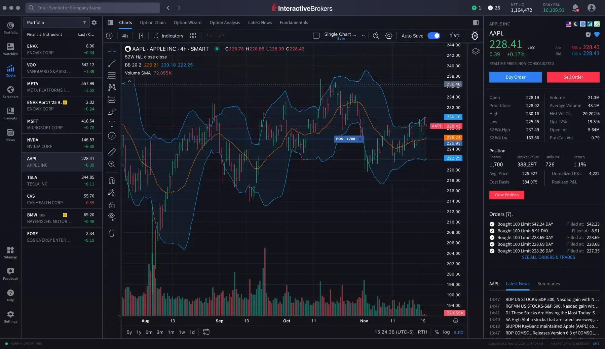

## Table of Contents

## What is Interactive Brokers and what services do they offer?

Interactive Brokers is a company that helps people buy and sell things like stocks, bonds, and other investments. They are known for having low fees, which means you don't have to pay a lot of money to use their services. They also have a lot of tools and information that can help you make smart choices about what to buy and sell.

They offer a lot of different services. You can trade stocks, options, futures, forex, and even cryptocurrencies. They also have accounts for people who want to invest for the long term, like retirement accounts. Plus, they have services for businesses and big investors, so they can help a lot of different kinds of people with their money.

## How can someone open an account with Interactive Brokers?

To open an account with Interactive Brokers, you first need to go to their website. Look for the button that says "Open Account" and click on it. You'll need to fill out some forms with your personal information, like your name, address, and social security number. Make sure you have all this information ready before you start. After you fill out the forms, you'll need to agree to their terms and conditions.

Once you've submitted your application, [Interactive Brokers](/wiki/interactive-brokers-api) will review it. This might take a few days. If everything looks good, they'll send you an email to let you know your account is open. You'll then need to fund your account, which means putting money into it so you can start trading. You can do this by transferring money from your bank account. After your account is funded, you can start using Interactive Brokers to buy and sell investments.

## What are the different types of accounts available at Interactive Brokers?

Interactive Brokers offers several types of accounts to meet different needs. They have individual accounts for people who want to trade on their own. These can be cash accounts, where you use your own money to buy things, or margin accounts, where you can borrow money from Interactive Brokers to make bigger trades. They also have retirement accounts like IRAs, which help you save for the future with tax benefits.

For businesses, Interactive Brokers provides accounts like joint accounts for couples or partners, and corporate accounts for companies. They also have special accounts for financial advisors and institutions, which are designed to handle bigger and more complex investments. This way, no matter if you're a single person, a couple, or a big company, Interactive Brokers has an account that can work for you.

## What are the fees and commissions associated with using Interactive Brokers?

Interactive Brokers has different fees and commissions depending on what you're trading and how much you're trading. For stocks and ETFs, they charge a minimum of $1 per trade, but if you trade a lot, the fee can go down to as low as 0.08 cents per share. For options, the fee is $0.65 per contract, but it can be less if you trade a lot. If you're trading futures, the fee is $0.25 to $0.85 per contract. For [forex](/wiki/forex-system), they charge a small fee based on how much you're trading, and it can be as low as 0.2 pips.

They also have some other fees you should know about. If you don't trade much, you might have to pay an inactivity fee of $20 every three months. There's also a fee for transferring money out of your account, which can be around $10. If you need to talk to someone at Interactive Brokers for help, there might be a fee for that too, but it depends on what kind of help you need. Overall, Interactive Brokers tries to keep their fees low, especially if you trade a lot.

## How does Interactive Brokers' trading platform work and what features does it include?

Interactive Brokers' trading platform is called Trader Workstation (TWS). It's a powerful tool that helps you buy and sell things like stocks, options, and more. You can use it on your computer or through a web browser. TWS has a lot of charts and graphs that show you how prices are moving, so you can make smart choices about what to buy or sell. It also lets you set up different kinds of orders, like limit orders or stop orders, which help you control when and how you trade.

The platform also has a lot of other features to help you. You can use the OptionTrader tool to look at and trade options easily. There's also a Risk Navigator that shows you how much risk you're taking with your trades. If you want to practice trading without using real money, you can use the paper trading feature. Plus, TWS has tools for people who speak different languages, so it's easy to use no matter where you're from. All these features make Interactive Brokers' trading platform a great choice for people who want to trade a lot and need a lot of tools to help them.

## What kind of customer support does Interactive Brokers provide?

Interactive Brokers offers customer support to help you with any questions or problems you might have. You can reach them by phone, email, or through their website. They have a help center with a lot of information and guides that can answer many common questions. If you need to talk to someone, you can call them, but keep in mind there might be a fee for this service, depending on what kind of help you need.

They also have a chat feature on their website where you can talk to someone in real time. This can be really helpful if you need quick answers. Interactive Brokers tries to make sure their support team knows a lot about trading and investing, so they can give you good advice. Overall, they want to make sure you have the help you need to use their services well.

## How does Interactive Brokers handle security and protect user data?

Interactive Brokers takes security very seriously to keep your information safe. They use strong encryption to protect your data when you're using their website or trading platform. This means that your personal information and trading details are turned into a code that's hard for anyone else to read. They also have firewalls and other security systems to stop hackers from getting into their systems. Plus, they keep an eye on their systems all the time to catch any problems quickly.

They also have rules to make sure only you can access your account. You'll need to use a strong password and might have to answer security questions or use two-[factor](/wiki/factor-investing) authentication, which means you need a code sent to your phone to log in. Interactive Brokers follows strict rules and laws about keeping your data safe, so you can feel good knowing they're doing a lot to protect you.

## What are the margin requirements and leverage options at Interactive Brokers?

Interactive Brokers has rules about how much money you need to have in your account to trade on margin. This is called the margin requirement. For stocks, you usually need at least 25% of the total value of the stocks you want to buy. But this can change depending on how risky the stocks are. If you want to trade options or futures, the margin requirement might be different. Interactive Brokers will tell you exactly how much you need before you start trading.

They also let you use leverage, which means you can borrow money from them to make bigger trades. The amount of leverage you can use depends on what you're trading. For stocks, you can usually borrow up to 4 times the amount of money you have in your account. For forex, you might be able to use even more leverage, sometimes up to 50 times your money. But remember, using leverage can be risky because if your trades don't go well, you could lose more money than you started with.

## How can users access advanced trading tools and algorithms on Interactive Brokers?

Interactive Brokers offers advanced trading tools and algorithms through their Trader Workstation (TWS) platform. To access these tools, you need to log into your account and use TWS on your computer or through their web-based version. Once you're in, you can find tools like the OptionTrader, which helps you trade options easily, and the Risk Navigator, which shows you how much risk you're taking with your trades. These tools are designed to help you make smarter trading decisions by giving you a lot of information and options.

If you want to use algorithms, Interactive Brokers has something called the API (Application Programming Interface). This lets you write your own trading programs or use ones that other people have made. You can set up these algorithms to trade automatically based on rules you create. This can be really helpful if you want to trade a lot or if you want to try out different trading strategies without having to watch the market all the time. Just remember, using algorithms can be complex, so it's good to learn about them before you start.

## What are the tax implications of trading through Interactive Brokers?

When you trade through Interactive Brokers, you need to think about taxes. The money you make from trading can be taxed as capital gains. If you hold onto your investments for less than a year before selling them, you'll pay short-term capital gains tax, which is usually the same as your regular income tax rate. If you hold them for more than a year, you'll pay long-term capital gains tax, which is often lower. Also, if you trade a lot, you might be considered a day trader, and that can change how your taxes work. It's a good idea to talk to a tax professional to make sure you're doing everything right.

Interactive Brokers will send you a form called a 1099 at the end of the year. This form shows how much money you made or lost from trading. You'll need to use this information when you do your taxes. Remember, different types of investments can have different tax rules. For example, trading options or futures might have different tax treatments than trading stocks. It's important to keep good records of all your trades so you can report everything correctly on your tax return.

## How does Interactive Brokers compare to other brokerage firms in terms of offerings and performance?

Interactive Brokers stands out from other brokerage firms because it offers a wide range of investment options and has very low fees. You can trade stocks, options, futures, forex, and even cryptocurrencies all in one place. Their fees are often lower than what you'd pay at other brokerages, especially if you trade a lot. For example, their stock trading fee can be as low as 0.08 cents per share, which is much less than what many other firms charge. They also have a powerful trading platform called Trader Workstation (TWS) that gives you a lot of tools and information to help you make smart trading choices.

Compared to other firms, Interactive Brokers is known for being good for people who trade a lot and need advanced tools. Some other brokerages might be easier to use if you're just starting out and don't need all the fancy features. For example, firms like Robinhood or E*TRADE might be simpler and have no fees for trading stocks, but they don't offer as many investment options or advanced tools as Interactive Brokers. If you're looking for a place to trade a lot of different things and want to keep your costs low, Interactive Brokers is a great choice. But if you're new to trading and want something simple, you might want to look at other options.

## What are some advanced strategies that expert traders can implement using Interactive Brokers' platform?

Expert traders can use Interactive Brokers' platform to implement advanced strategies like [algorithmic trading](/wiki/algorithmic-trading). This means they can write computer programs that automatically buy and sell investments based on rules they set up. For example, they might create an algorithm that buys a stock when its price goes below a certain level and sells it when the price goes up by a certain amount. This can help them trade more often and take advantage of small price changes without having to watch the market all the time. Interactive Brokers' API makes it easy to connect these programs to their trading platform, so expert traders can use their own custom strategies.

Another advanced strategy is options trading, where traders can use tools like the OptionTrader on Interactive Brokers' platform. They can set up complex options strategies like spreads, straddles, and iron condors to make money from different market conditions. For example, a trader might use a straddle to bet on a big move in a stock's price without knowing which way it will go. The Risk Navigator tool helps them see how much risk they're taking with these strategies, so they can adjust their trades to manage that risk. These tools make it easier for expert traders to try out different options strategies and see how they might work out.

## References & Further Reading

[1]: Bergstra, J., Bardenet, R., Bengio, Y., & Kégl, B. (2011). ["Algorithms for Hyper-Parameter Optimization."](https://proceedings.neurips.cc/paper/2011/file/86e8f7ab32cfd12577bc2619bc635690-Paper.pdf) Advances in Neural Information Processing Systems 24.

[2]: Marcos Lopez de Prado. ["Advances in Financial Machine Learning."](https://www.amazon.com/Advances-Financial-Machine-Learning-Marcos/dp/1119482089) Wiley, 2018.

[3]: David Aronson. ["Evidence-Based Technical Analysis: Applying the Scientific Method and Statistical Inference to Trading Signals."](https://www.amazon.com/Evidence-Based-Technical-Analysis-Scientific-Statistical/dp/0470008741) Wiley, 2006.

[4]: Stefan Jansen. ["Machine Learning for Algorithmic Trading."](https://github.com/stefan-jansen/machine-learning-for-trading) Packt Publishing, 2020.

[5]: Ernest P. Chan. ["Quantitative Trading: How to Build Your Own Algorithmic Trading Business."](https://books.google.com/books/about/Quantitative_Trading.html?id=j70yEAAAQBAJ) Wiley, 2008.