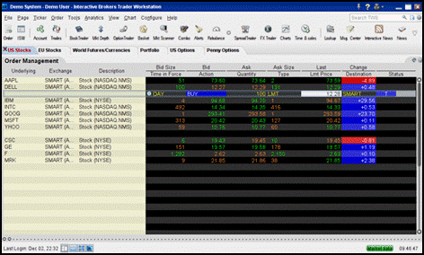

Interactive Brokers, established in 1978, has emerged as a leading brokerage firm within the financial services sector. The firm’s longstanding presence and its commitment to advanced technology have positioned it at the forefront of innovation in trading services. Interactive Brokers serves a diverse clientele, accounting for the needs of both individual retail investors and large-scale institutional clients.

Algorithmic trading, defined as the use of computer algorithms to execute trades at speeds and frequencies far exceeding human capability, has transformed the investment landscape. Its significance has grown exponentially as traders and investors alike seek to capitalize on the precision and efficiency offered by algorithmic systems. Leveraging advanced algorithms, traders can analyze vast datasets and execute complex strategies, often resulting in improved market entry and reduced transaction costs.



This article aims to provide a comprehensive review of Interactive Brokers, with particular emphasis on its algorithmic trading features. Readers will gain insights into the range of services offered by Interactive Brokers, delve into the specifics of their algorithmic trading tools, and understand the associated costs and fees. Moreover, the article discusses user experience aspects, considering both the intuitive design of trading platforms and the quality of customer support.

Interactive Brokers has become a popular choice among retail and institutional investors due to its robust technology infrastructure, extensive product offerings, and competitive pricing strategies. By understanding these key aspects, prospective users can make informed decisions regarding their trading needs, especially those centered on algorithmic trading approaches. Through this exploration, the article underscores how Interactive Brokers continues to play a significant role in the future of trading and investment strategies.

## Table of Contents

## Overview of Interactive Brokers

Interactive Brokers, founded in 1978 by Thomas Peterffy, has established itself as a pioneer in the brokerage industry. The company's journey began as a market maker at the American Stock Exchange, eventually evolving into one of the world's most respected electronic brokerage firms. Interactive Brokers' emphasis on technology and automation has played a crucial role in its development, enabling it to offer a comprehensive suite of services to a diverse clientele.

Over the years, Interactive Brokers has achieved several significant milestones that have cemented its standing in the financial sector. In 1983, it introduced the first handheld computers used for trading. This innovation laid the groundwork for the advanced trading platforms the company offers today. In 1987, Interactive Brokers further revolutionized the industry with its automated trading system, and by 1993, electronic trading was in full swing under its banner.

The company's global presence is substantial, with operations in over 150 markets in numerous countries. It serves a wide range of clients, including institutional investors and individual traders. [Interactive Brokers](/wiki/interactive-brokers-api)' reach is notable, with offices in the United States, Europe, and Asia, facilitating a comprehensive network that caters to a worldwide customer base.

Interactive Brokers offers a broad array of services beyond traditional brokerage. These include access to stocks, options, futures, [forex](/wiki/forex-system), bonds, and funds from a single integrated account. The company prides itself on providing direct market access and ensuring the lowest possible execution costs for its clients. Moreover, Interactive Brokers offers advanced tools for trading analysis and decision-making, making it a preferred choice for sophisticated traders.

A commitment to technological innovation and customer service underlies Interactive Brokers' operational philosophy. The company consistently invests in upgrading its trading platforms, such as the Trader Workstation (TWS), which boasts robust analytics and customization features. This dedication to technology extends to its Application Programming Interface (API) offerings, which facilitate [algorithmic trading](/wiki/algorithmic-trading), a crucial aspect of the modern investment landscape.

Interactive Brokers also emphasizes customer service, providing various support channels and educational resources to assist clients in navigating its platforms effectively. Its commitment to ensuring an excellent user experience, coupled with technological advancements, positions Interactive Brokers as a leader in the competitive brokerage industry.

## Trading Platforms and Technology

Interactive Brokers offers a proprietary trading platform known as Trader Workstation (TWS), which is a comprehensive tool designed to meet the needs of both retail and institutional traders. TWS provides a suite of sophisticated features, including advanced charting capabilities, customizable interface elements, and analytic tools, making it a versatile choice for various trading strategies.

The platform is characterized by its extensive customization options. Users can tailor the interface to suit their trading preferences, rearranging windows and toolbars for optimal workflow. The analytic tools available in TWS are robust, offering features such as market scanners, risk analysis modules, and real-time risk management data. These allow traders to conduct thorough technical analysis and implement trading strategies with precision. 

In addition to its desktop platform, Interactive Brokers provides a mobile trading app that extends the functionality of TWS to smartphones and tablets. The mobile app maintains most of the core features found on the desktop version, including comprehensive order types, real-time streaming data, and instant access to market news and research. This enables traders to monitor and execute trades on-the-go, ensuring they remain connected to the markets without compromising functionality.

When comparing Interactive Brokers' platforms to those offered by competitors, such as thinkorswim by TD Ameritrade and MetaTrader, TWS is noted for its array of professional-grade tools and competitive pricing. However, it might pose a steeper learning curve for beginners due to its advanced features and interface complexity. In terms of usability, while some platforms focus on simplicity, TWS is geared towards traders who require deeper tools for analysis and execution.

The technological infrastructure underpinning TWS is designed to facilitate fast and reliable trading. Interactive Brokers utilizes a robust network of data centers and direct market access routing, which minimizes latency and enhances order execution speed. The system's architecture is built to handle high volumes of trades and data, thereby supporting a seamless trading experience. This infrastructure is vital for traders deploying sophisticated strategies, particularly those reliant on algorithmic trading, where execution speed and data accuracy can significantly impact performance.

In conclusion, Interactive Brokers' Trader Workstation is a powerful platform tailored for professional traders seeking in-depth analytical tools and customization. Its mobile app complements this by providing functionality and access away from the desk, ensuring traders have comprehensive resources at their disposal to make informed decisions.

## Algorithmic Trading with Interactive Brokers

Algorithmic trading involves the use of computer programs to automatically execute trades based on predetermined criteria and advanced statistical models. This method leverages complex algorithms that analyze various market variables, including price, [volume](/wiki/volume-trading-strategy), and timing, to identify trading opportunities. By automating the trading process, algorithmic trading helps minimize human emotion and error, allowing traders to execute high-frequency strategies with precision and efficiency.

Interactive Brokers (IB) provides robust support for algorithmic trading through its comprehensive API offerings. Developers and traders can access a suite of APIs that facilitate the creation, testing, and execution of custom trading algorithms. Interactive Brokers offers several API solutions, including their well-known Trader Workstation (TWS) API, which supports Java, C++, Python, and other programming languages. These APIs allow users to connect their systems directly to Interactive Brokers' platform, send real-time market data, and execute trades programmatically.

For traders interested in developing and executing algorithms, Interactive Brokers supports a range of tools. The TWS API, in particular, provides extensive documentation and example scripts to aid the development process. Traders can use Python, a popular language for algorithmic trading due to its ease of use and extensive libraries for data analysis. A simple Python script for executing a buy order might look like this:

```python
from ibapi.client import EClient
from ibapi.wrapper import EWrapper
from ibapi.contract import Contract
from ibapi.order import *

class IBapi(EWrapper, EClient):
    def __init__(self):
        EClient.__init__(self, self)

def run_loop():
    app.run()

app = IBapi()
app.connect('127.0.0.1', 7496, 123)

contract = Contract()
contract.symbol = "AAPL"
contract.secType = "STK"
contract.exchange = "SMART"
contract.currency = "USD"

order = Order()
order.action = "BUY"
order.orderType = "MKT"
order.totalQuantity = 10

app.placeOrder(1, contract, order)
```

Algorithmic trading appeals to a diverse range of investors, from institutional players to individual retail traders. For institutions, the ability to execute large orders efficiently without impacting market prices is a significant advantage. Retail traders, meanwhile, benefit from the potential to implement complex strategies automatically, allowing them to trade around the clock and take advantage of fleeting market opportunities.

Interactive Brokers has been the platform of choice for numerous successful algorithmic trading strategies. For example, a quantitative [hedge fund](/wiki/hedge-fund-trading-strategies) might deploy mean reversion strategies, capitalizing on the tendency of asset prices to revert to their mean over time. Such a strategy can be coded to automatically buy assets when prices are below the mean and sell when they are above.

Overall, Interactive Brokers provides a powerful infrastructure for algo traders needing a sophisticated yet accessible interface to execute complex strategies, backed by a suite of real-time data and analytic tools. This capability empowers traders to harness the full potential of algorithmic trading, making it an attractive option for both new and seasoned traders seeking a competitive edge in the financial markets.

## Costs and Fees Associated with Interactive Brokers

Interactive Brokers offers a detailed fee structure designed to provide cost-effective solutions for various types of investors, including those engaged in algorithmic trading. A significant aspect of its pricing model is the distinction between tiered pricing and fixed pricing. 

**Fee Structure Overview**

Interactive Brokers charges competitive commissions that vary based on the market and type of instrument traded. For U.S. stocks, the tiered pricing system charges 0.0035 USD per share with a minimum commission of 0.35 USD per trade. This structure is beneficial for high-volume traders as the per-share cost decreases with higher trade volumes. Fixed pricing, alternatively, charges 0.005 USD per share with a 1 USD minimum per trade, appealing to traders with smaller volumes or less complex trading needs.

Account fees are generally low at Interactive Brokers. The broker requires a minimum balance of 2,000 USD for a margin account, and inactivity fees are only applied if monthly commissions fall below 10 USD for clients whose account balance is lower than 100,000 USD. This fee is reduced to 3 USD for clients under the age of 25, making Interactive Brokers accessible to younger investors.

**Comparison with Other Brokers**

Compared to competitors, Interactive Brokers' commission rates and account fees are often lower, particularly for active traders who prioritize algorithmic trading. Brokers such as Charles Schwab and TD Ameritrade may offer commission-free trades but can have higher margin rates and account fees, potentially increasing the overall cost for traders employing high-frequency strategies. Investors utilizing algorithmic trading could benefit financially from the tiered pricing model, especially when executing a large volume of trades.

**Impact on Returns**

The cost structure directly influences traders' net returns. Lower commissions and minimal account fees aid in retaining a higher percentage of profits. For example, using the tiered pricing model, a trader executing 10,000 trades at the rate of 0.0035 USD per share would incur a cost of 35 USD, which is substantially lower than other brokers that might charge higher fixed fees per trade or have less favorable pricing tiers.

**Cost Minimization Strategies**

To minimize costs, traders can leverage the tiered pricing structure by increasing trade volumes to reduce per-share costs. Additionally, maintaining an account balance of over 100,000 USD can eliminate inactivity fees. For algorithmic traders, efficient strategy design can reduce the frequency of trades that do not add significant value, thereby minimizing unnecessary transaction costs.

Utilizing Interactive Brokers' extensive APIs for automated trading allows traders to customize their strategies in a manner that could lower costs. Implementing optimization algorithms that focus on cost efficiency as a parameter can further increase profitability.

Overall, Interactive Brokers' comprehensive and flexible fee structure, combined with robust support for algorithmic trading, positions it as a cost-effective choice for both retail and institutional traders.

## User Experience and Customer Support

Interactive Brokers (IB) is widely recognized for its user experience and customer support, critical aspects that influence trader satisfaction and retention. Feedback from users highlights various elements of the platform’s performance, service, and support.

### User Feedback and Reviews

Interactive Brokers generally receives favorable reviews from its users, who appreciate its comprehensive features, robust technology, and competitive pricing. Many traders commend the platform's advanced tools and the wide array of trading options available. However, some users point out that the platform can be complex for beginners, requiring a steeper learning curve compared to other platforms.

### Customer Service and Support

Interactive Brokers offers multiple support channels including phone, email, and live chat. The quality of customer service is generally rated positively, with response times noted as efficient and helpful. The availability of 24/7 customer service is particularly beneficial for traders operating in global markets. Despite these advantages, some users report mixed experiences, especially during periods of high market activity, where response times may vary.

### Onboarding Process

The onboarding process at Interactive Brokers is thorough and comprehensive, designed to ensure users are well-equipped to utilize the platform's capabilities. New users are provided access to a wide range of resources, including detailed account setup guides and orientation materials. The account application process is digital and typically streamlined, although it may require additional time for international clients due to regulatory requirements.

### Educational Resources and Tools

Interactive Brokers provides an extensive suite of educational resources tailored for traders at all levels, with a particular emphasis on algorithmic trading. The IBKR Campus offers webinars, courses, and tutorials that cover a broad spectrum of trading topics. For algo traders, Interactive Brokers’ API platform is complemented by detailed documentation and examples, facilitating the development of custom trading strategies.

### Testimonials and Reputation

Overall, testimonials from Interactive Brokers users frequently highlight the platform’s reliability and efficiency. Many users express satisfaction with the technological infrastructure that supports fast order execution and data handling. The platform's capacity to support sophisticated trading strategies, including algorithmic trading, is often praised. However, some users emphasize the need for improved user interface design to cater to those less familiar with complex trading systems.

These elements collectively shape Interactive Brokers' reputation as a broker that prioritizes technological excellence and comprehensive support, making it a favored choice among both novice and experienced traders.

## Pros and Cons of Using Interactive Brokers for Algorithmic Trading

Interactive Brokers (IB) has established itself as a leading platform for algorithmic trading, offering various technological and pricing advantages that appeal to both retail and institutional traders. This section explores the pros and cons of using Interactive Brokers for algorithmic trading, highlighting its competitive strengths, potential drawbacks, and recent platform updates.

### Advantages of Using Interactive Brokers for Algo Trading

**Technological Advancements and API Offerings:**  
Interactive Brokers' API support is one of its prominent features that attracts algo traders. The platform provides APIs in multiple programming languages, such as Python, Java, and C++, allowing traders to develop and deploy custom trading algorithms with ease. This flexibility facilitates integration with traders' existing systems and supports complex strategies that benefit from IB's high-quality market data and execution services.

**Competitive Pricing:**  
Interactive Brokers offers a tiered pricing structure, which is particularly advantageous for high-frequency trading strategies often utilized in algorithmic trading. Traders pay lower commissions as their trading volume increases, reducing overall transaction costs. This structure makes IB a cost-effective choice for traders looking to optimize returns from their algorithmic strategies.

**Robust Infrastructure:**  
The reliability and speed of Interactive Brokers' trading infrastructure are critical components for successful algorithmic trading. IB's systems are designed to handle high transaction volumes with minimal latency, ensuring that algorithms perform efficiently in fast-moving markets.

### Potential Drawbacks or Limitations

**Complexity for Novice Traders:**  
While experienced traders may find IB's tools and APIs beneficial, the platform can be overwhelming for newcomers to algo trading. The technology requires a steep learning curve, particularly for those unfamiliar with coding and programming languages used in developing trading algorithms.

**Market Data Costs:**  
Although Interactive Brokers provides comprehensive market data, the cost of accessing real-time feeds can add up, impacting traders' profitability. Traders need to evaluate these costs in conjunction with their trading strategy to ensure profitability.

### Comparative Strengths Against Other Brokers

**Global Market Access:**  
Interactive Brokers stands out with its extensive global market reach, giving traders access to a wide variety of securities and exchanges worldwide. This access is a significant advantage for traders seeking to diversify their algorithmic strategies across different asset classes and regions.

**Lower Margin Rates:**  
Compared to many competitors, Interactive Brokers offers relatively low margin rates, providing a cost-effective option for traders leveraging their portfolio for enhanced returns. This aspect aligns well with algorithmic strategies that require high capital efficiency.

### Noteworthy Improvements in Recent Versions

Recent updates to Interactive Brokers' Trader Workstation (TWS) and its mobile application have continued to enhance user experience and functionality. Enhanced analytical tools and customizability in TWS now offer more powerful features for back-testing and optimizing trading algorithms. Mobile improvements have ensured that traders can manage their strategies on-the-go with increased reliability.

### Conclusive Insights for Potential Users

Interactive Brokers presents a compelling option for algo traders due to its technological robustness, competitive pricing, and extensive market access. However, potential users should consider the inherent complexity and potential costs associated with the platform. While beginners might face a steep learning curve, experienced traders can leverage Interactive Brokers' strengths to deploy sophisticated trading algorithms effectively.

Prospective users are encouraged to explore Interactive Brokers' offerings through trial accounts and leverage the wealth of educational resources available to maximize their trading strategies. Understanding the full range of services and identifying suitability with personal trading needs will ensure that traders make informed decisions when considering Interactive Brokers for algorithmic trading.

## Conclusion

Interactive Brokers has emerged as a formidable player in the sphere of algorithmic trading, offering a robust suite of tools and services tailored to cater to both retail and institutional investors. The comprehensive features of Interactive Brokers, primarily through its Trader Workstation (TWS) and API offerings, provide a conducive environment for traders to develop, test, and execute complex trading algorithms. 

Interactive Brokers stands out as a suitable platform for traders focused on algorithmic methods due to its emphasis on technological sophistication and extensive market access. The availability of a variety of analytical tools, combined with low-latency trading capabilities, enhances the efficacy of algorithmic strategies. Furthermore, the competitive fee structure, including tiered pricing, adds an economic edge for algorithmic traders who often execute a high volume of trades.

Prospective users considering Interactive Brokers should evaluate their specific trading needs against the platform's offerings. Factors such as the complexity of the trading algorithms, required market access, and budget constraints should be considered. Interactive Brokers' extensive educational resources and the supportive customer service infrastructure further smooth the onboarding process, making it easier for users to familiarize themselves with the algo trading environment.

As the landscape of trading continues to be reshaped by technological advances, Interactive Brokers is poised to hold a significant position. The increasing reliance on algorithmic trading strategies calls for platforms that can support intricate trade executions and data analyses, a niche where Interactive Brokers shows great promise and leadership. Traders are encouraged to explore and thoroughly test the platform to ensure it aligns with their strategic aims and offers the needed functionalities to optimize trading outcomes in an ever-evolving market.

## References & Further Reading

[1]: Bergstra, J., Bardenet, R., Bengio, Y., & Kégl, B. (2011). ["Algorithms for Hyper-Parameter Optimization."](https://proceedings.neurips.cc/paper/2011/file/86e8f7ab32cfd12577bc2619bc635690-Paper.pdf) Advances in Neural Information Processing Systems 24.

[2]: Marcos Lopez de Prado. ["Advances in Financial Machine Learning."](https://www.amazon.com/Advances-Financial-Machine-Learning-Marcos/dp/1119482089) Wiley, 2018.

[3]: David Aronson. ["Evidence-Based Technical Analysis: Applying the Scientific Method and Statistical Inference to Trading Signals."](https://www.amazon.com/Evidence-Based-Technical-Analysis-Scientific-Statistical/dp/0470008741) Wiley, 2006.

[4]: Stefan Jansen. ["Machine Learning for Algorithmic Trading."](https://github.com/stefan-jansen/machine-learning-for-trading) Packt Publishing, 2020.

[5]: Ernest P. Chan. ["Quantitative Trading: How to Build Your Own Algorithmic Trading Business."](https://books.google.com/books/about/Quantitative_Trading.html?id=j70yEAAAQBAJ) Wiley, 2008.