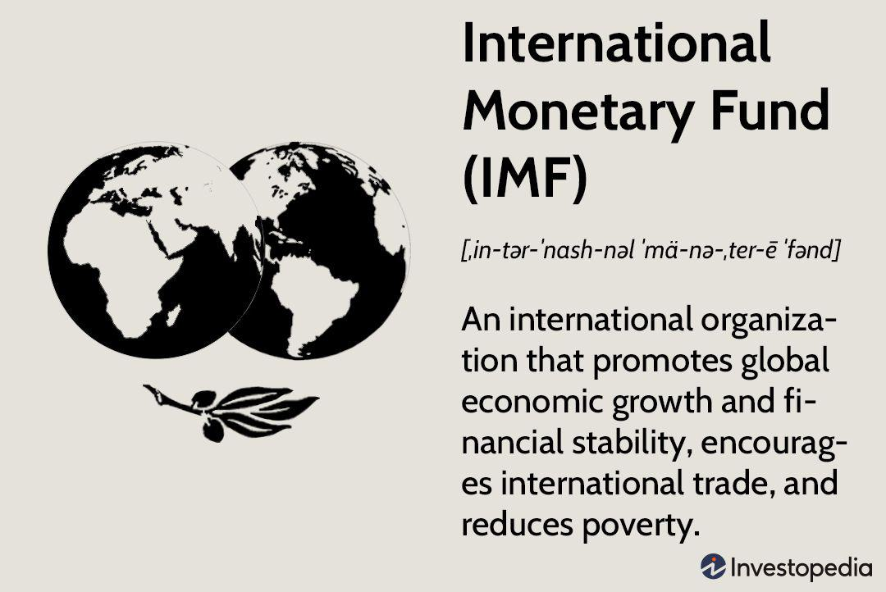

## Table of Contents

## What is the International Monetary Fund (IMF)?

The International Monetary Fund (IMF) is an organization that helps countries with their money problems. It was created after World War II to make sure countries could work together on their economies. The IMF gives advice and loans to countries that are having trouble with their money. It also keeps an eye on the world's economy to help prevent big problems.

Countries that join the IMF pay money into it, and this money is used to help other countries when they need it. The IMF works with governments to make plans that will help their economies grow stronger. It also helps countries that are in financial trouble by giving them loans, but these loans come with rules that the countries must follow to fix their money problems.

## When and why was the IMF established?

The International Monetary Fund (IMF) was set up in 1944. This happened at a meeting in Bretton Woods, New Hampshire, in the United States. The main reason for creating the IMF was to help countries work together on their money problems after World War II. Many countries were in bad shape after the war, and they needed help to rebuild their economies.

The IMF was created to make sure there would be a way to help countries when they had money troubles. It was meant to stop big economic problems from happening and to help countries trade with each other more easily. By working together, countries hoped to avoid the kind of economic disasters that had happened before the war.

## What are the main objectives of the IMF?

The main goal of the IMF is to help countries with their money problems. It does this by giving advice and loans to countries that are having trouble. The IMF also keeps an eye on the world's economy to make sure big problems don't happen. It works with countries to make plans that will help their economies grow stronger.

Another important objective of the IMF is to help countries trade with each other more easily. By giving countries a way to work together on their money problems, the IMF helps to make the world's economy more stable. This means countries can buy and sell things from each other without worrying too much about money problems getting in the way.

## How is the IMF structured and governed?

The IMF is run by its member countries, which are called member nations. Each member nation sends a representative to the IMF, and these representatives make up the Board of Governors. The Board of Governors is the highest authority in the IMF, but they meet once a year. Most of the time, the IMF is run by a smaller group called the Executive Board. The Executive Board is made up of 24 people, called Executive Directors, who are chosen by the member nations. Some big countries, like the United States, Japan, Germany, France, and the United Kingdom, have their own Executive Director. Other countries share an Executive Director.

The day-to-day work of the IMF is managed by the Managing Director, who is chosen by the Executive Board. The Managing Director is in charge of the IMF's staff and makes sure the organization's goals are met. The Managing Director also works with the Executive Board to make decisions about loans and other important issues. The IMF's structure is set up so that all member nations have a say in how it is run, but the countries that pay more money into the IMF have more power in making decisions.

## What is the role of the IMF in the global economy?

The IMF plays a big role in the global economy by helping countries when they have money problems. It gives advice and loans to countries that are struggling. This helps them fix their economies and get back on track. The IMF also keeps an eye on the world's economy to make sure big problems don't happen. By doing this, it helps to keep the global economy stable and prevents disasters like the ones that happened before World War II.

Another important job of the IMF is to help countries trade with each other more easily. When countries can buy and sell things without worrying about money problems, it's good for everyone. The IMF works with countries to make plans that will help their economies grow stronger. This way, countries can work together and help each other out. By doing all these things, the IMF makes the world's economy more stable and helps countries grow and develop.

## How does the IMF assist member countries?

The IMF helps member countries by giving them advice and loans when they have money problems. If a country is struggling, the IMF can lend them money to help them fix their economy. But these loans come with rules that the country must follow to make sure they use the money wisely and fix their problems. The IMF also gives advice on how to make their economy stronger and grow. They work with the country's government to make a plan that will help them get back on track.

Another way the IMF helps is by keeping an eye on the world's economy. They watch to make sure big problems don't happen. If they see a problem coming, they can warn countries and help them prepare. This helps to keep the global economy stable and prevents disasters. By doing this, the IMF makes it easier for countries to trade with each other and helps the whole world's economy to grow and develop.

## What are the key financial instruments used by the IMF?

The IMF uses several key financial instruments to help countries with their money problems. One of the main instruments is loans. When a country is having trouble, the IMF can give them a loan to help them fix their economy. These loans come with rules that the country must follow to make sure they use the money wisely and solve their problems. Another important instrument is the Special Drawing Rights (SDRs). SDRs are like a special kind of money that the IMF can give to countries. They can use these SDRs to help with their financial needs.

The IMF also uses other tools to help countries. One of these is technical assistance and training. The IMF gives advice and helps countries learn how to manage their money better. This can include training for government officials on how to make their economy stronger. Another tool is surveillance, where the IMF keeps an eye on the world's economy. They watch for problems and give warnings to countries so they can prepare and avoid big economic disasters. By using all these instruments, the IMF helps countries work together and keep the global economy stable.

## How does the IMF monitor global financial stability?

The IMF keeps an eye on the world's economy to make sure it stays stable. They do this by watching what's happening in different countries and around the world. The IMF looks at things like how much money countries are borrowing, how their economies are growing, and if there are any big problems coming up. They use this information to warn countries about possible dangers and help them prepare. This way, the IMF can help stop small problems from turning into big ones that could hurt the whole world's economy.

The IMF also talks to countries regularly to get a better understanding of their financial health. They meet with government officials and look at reports to see how things are going. If they see something that could cause trouble, they tell the country and suggest ways to fix it. By doing all this, the IMF helps keep the global economy stable and makes sure countries can work together to avoid big financial disasters.

## What is the IMF's approach to economic surveillance?

The IMF keeps an eye on the world's economy by watching what's happening in different countries. They look at things like how much money countries are borrowing, how their economies are growing, and if there are any big problems coming up. This helps them understand if the global economy is doing well or if there might be trouble ahead. The IMF uses this information to warn countries about possible dangers and help them prepare. By doing this, they can stop small problems from turning into big ones that could hurt the whole world's economy.

The IMF also talks to countries regularly to get a better understanding of their financial health. They meet with government officials and look at reports to see how things are going. If they see something that could cause trouble, they tell the country and suggest ways to fix it. This kind of talking and checking helps the IMF keep the global economy stable. It makes sure countries can work together to avoid big financial disasters and keep their economies strong.

## How does the IMF collaborate with other international organizations?

The IMF works together with other big groups around the world to help countries with their money problems. One important group they work with is the World Bank. The IMF and the World Bank both help countries that are struggling, but they do it in different ways. The IMF gives advice and loans to fix immediate money problems, while the World Bank focuses on long-term projects like building schools and hospitals. By working together, they can help countries in a more complete way.

Another group the IMF works with is the United Nations (UN). The IMF and the UN share information and work on projects that help countries develop their economies. For example, they might work together to help a country after a big disaster like an earthquake. The IMF can give quick loans to help with the emergency, and the UN can help with things like food and medicine. This teamwork makes sure that countries get the help they need from different angles.

The IMF also works with other groups like the World Trade Organization (WTO) and regional development banks. The WTO helps countries trade with each other more easily, and the IMF can help make sure that countries have the money they need to trade. Regional development banks, like the Asian Development Bank, work on projects in specific parts of the world. The IMF can give advice and loans to help these projects succeed. By working with all these groups, the IMF helps make the world's economy stronger and more stable.

## What are some major criticisms of the IMF's policies and operations?

Some people say the IMF's rules for loans are too strict. When a country gets a loan from the IMF, they have to follow certain rules to fix their money problems. These rules can be hard for countries to follow and can make life harder for people living there. For example, the IMF might tell a country to cut spending on things like schools and hospitals. This can make it tough for people who need these services. Critics say these rules can hurt the country's economy instead of helping it.

Another big criticism is that the IMF gives too much power to rich countries. The countries that pay more money into the IMF have more say in making decisions. This means that big, rich countries like the United States have more power than smaller, poorer countries. Some people think this is not fair and that all countries should have an equal say. They say the IMF should change how it makes decisions to be more fair to everyone.

## What reforms have been proposed or implemented to improve the effectiveness of the IMF?

People have suggested many changes to make the IMF work better. One big change is to give more power to poorer countries. Right now, rich countries have more say in the IMF because they pay more money into it. Some people think this is not fair and want the IMF to change how it makes decisions so that all countries have an equal voice. Another idea is to make the rules for loans less strict. Critics say the rules can be too hard on countries and make life harder for people. They want the IMF to be more flexible and help countries in a way that doesn't hurt their people so much.

The IMF has already made some changes to improve how it works. For example, they have started to give more money to poorer countries through a program called the Poverty Reduction and Growth Trust. This helps these countries grow their economies without having to follow such strict rules. The IMF has also tried to be more open about what it does. They share more information about their decisions and how they help countries. This way, people can see what the IMF is doing and understand it better. These changes are meant to make the IMF more fair and helpful to all countries.

## References & Further Reading

[1]: Bergstra, J., Bardenet, R., Bengio, Y., & Kégl, B. (2011). ["Algorithms for Hyper-Parameter Optimization."](https://dl.acm.org/doi/10.5555/2986459.2986743) Advances in Neural Information Processing Systems 24.

[2]: ["Advances in Financial Machine Learning"](https://www.amazon.com/Advances-Financial-Machine-Learning-Marcos/dp/1119482089) by Marcos Lopez de Prado

[3]: ["Evidence-Based Technical Analysis: Applying the Scientific Method and Statistical Inference to Trading Signals"](https://www.amazon.com/Evidence-Based-Technical-Analysis-Scientific-Statistical/dp/0470008741) by David Aronson

[4]: ["Machine Learning for Algorithmic Trading"](https://github.com/stefan-jansen/machine-learning-for-trading) by Stefan Jansen

[5]: ["Quantitative Trading: How to Build Your Own Algorithmic Trading Business"](https://github.com/LucindaYa/quant-resources/blob/master/Quantitative%20Trading%20How%20to%20Build%20Your%20Own%20Algorithmic%20Trading%20Business.pdf) by Ernest P. Chan