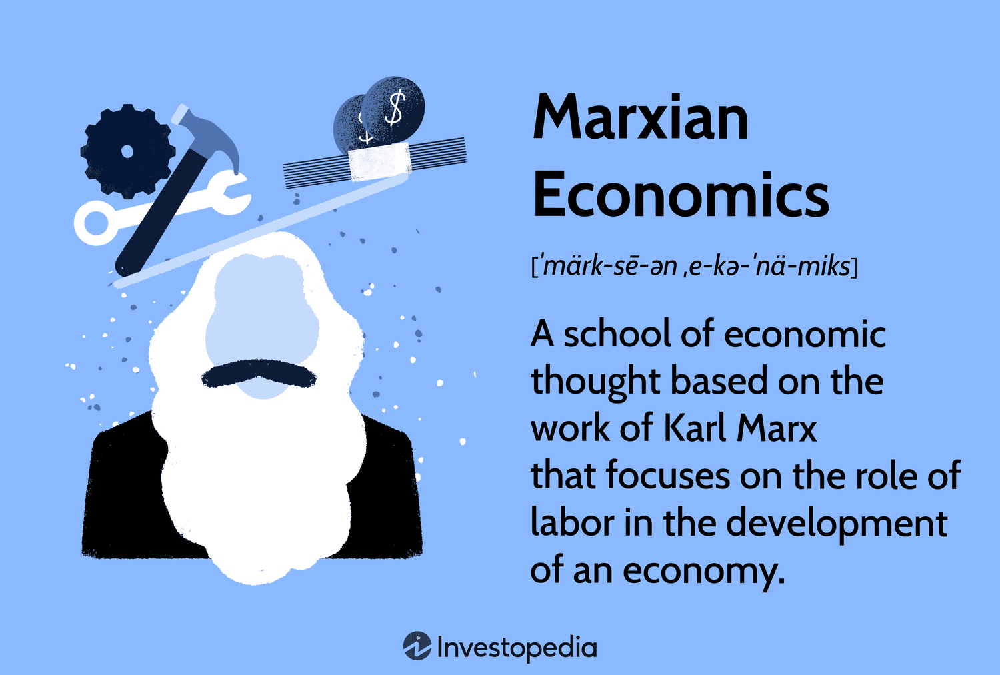

## Table of Contents

## What is Marxian economics?

Marxian economics is a way of understanding how economies work, based on the ideas of Karl Marx. Marx believed that the main thing that drives economies is the struggle between different groups of people, especially between the people who own businesses (capitalists) and the people who work for them (workers). He thought that capitalists make money by paying workers less than the value of what they produce, and this difference is called surplus value. Marxian economics looks at how this struggle affects things like wages, profits, and how the economy grows.

Marx also thought that capitalism, the system where businesses are owned by private people, has big problems. He said it leads to inequality, where some people get very rich and others stay poor. He believed that over time, these problems would get worse and worse until the workers would rise up and change the system. Marxian economists study these ideas and try to see if they explain what happens in real economies. They also think about how economies could be organized differently, maybe in a way that is fairer for everyone.

## Who was Karl Marx and what were his main contributions to economics?

Karl Marx was a thinker and writer who lived in the 1800s. He was born in Germany and spent time in different countries, including England. Marx is famous for his ideas about how society and the economy work. He worked with Friedrich Engels, and together they wrote important books like "The Communist Manifesto" and "Das Kapital." Marx's ideas have influenced many people and movements around the world.

One of Marx's main contributions to economics is the idea of surplus value. He said that workers create value when they work, but they are paid less than the value they create. The difference, or surplus value, goes to the business owners, or capitalists. Marx thought this was unfair and that it caused problems in society. He also talked about how the economy is always changing and how it can lead to big problems like inequality and economic crises. Marx believed that these problems would eventually cause workers to want to change the system, leading to a new kind of society where everyone shares the wealth more equally.

Marx's ideas also include the concept of class struggle, where different groups in society, like workers and capitalists, have different interests and often fight over them. He thought that this struggle was the main force driving history and change. Marx's work has led to many different ideas and movements, including communism and socialism, which try to create a fairer society based on his ideas. Even today, people study and debate Marx's ideas to understand and improve the economy and society.

## What are the key concepts of Marxian economics?

Marxian economics is based on the ideas of Karl Marx and focuses on how different groups in society, like workers and business owners, interact and struggle over money and power. One of the main ideas is surplus value, which means that workers create more value than they are paid for. The extra value goes to the business owners, or capitalists, which Marx thought was unfair. This idea helps explain why there can be big differences between rich and poor people. Marx also talked about class struggle, which is the conflict between these different groups in society. He believed that this struggle is what drives history and leads to changes in society.

Another important concept in Marxian economics is the idea that capitalism, the system where businesses are owned by private people, has big problems. Marx thought that capitalism leads to inequality, where some people get very rich while others stay poor. He also believed that capitalism can cause economic crises, where the economy can have big ups and downs. Marx thought that these problems would get worse over time and that eventually, workers would want to change the system. He hoped for a new kind of society, like communism or socialism, where everyone would share the wealth more equally and there would be less conflict between different groups.

Overall, Marxian economics looks at how the economy works by focusing on the relationships between people and the struggles between different groups. It tries to explain why some people are rich and others are poor, and it suggests ways to make society fairer. Even though Marx lived a long time ago, his ideas are still studied and discussed today because they help people understand and think about how to improve the economy and society.

## How does Marxian economics differ from classical and neoclassical economics?

Marxian economics looks at the economy in a different way than classical and neoclassical economics. Classical economics, which was popular in the 18th and 19th centuries, focuses on how markets work and how people can get rich by saving and investing. Neoclassical economics, which came later, builds on these ideas and uses math to study how people make choices and how markets reach a balance. Both of these approaches see the economy as a system where people can do well if they work hard and make smart choices. Marxian economics, on the other hand, says that the economy is driven by the struggle between different groups of people, especially between workers and business owners. Marx thought that business owners make money by paying workers less than the value of what they produce, and this difference is called surplus value.

Another big difference is how these theories see the role of the government and the fairness of the economy. Classical and neoclassical economists often believe that the government should not get too involved in the economy and that markets can fix themselves. They think that if people are free to make their own choices, the economy will work well for everyone. Marxian economists, however, believe that the government needs to step in to make things fairer. They see capitalism, the system where businesses are owned by private people, as causing big problems like inequality and economic crises. Marx thought that these problems would get worse over time and that workers would eventually want to change the system to something like communism or socialism, where everyone shares the wealth more equally.

## What is the labor theory of value and how is it central to Marxian economics?

The labor theory of value is an important idea in Marxian economics. It says that the value of a thing comes from the work that people put into making it. If something takes a lot of time and effort to make, it is more valuable. Karl Marx used this idea to explain how the economy works and why some people are rich while others are poor. He believed that workers create value when they work, but they are paid less than the value they create. The extra value, or surplus value, goes to the business owners, or capitalists. This difference between what workers are paid and the value they create is what Marx thought was unfair and caused problems in society.

This idea of surplus value is central to Marxian economics because it helps explain the struggle between workers and business owners. Marx thought that this struggle was the main force driving the economy and society. He believed that over time, the problems caused by this struggle, like inequality and economic crises, would get worse and worse. Eventually, he thought, workers would want to change the system to something fairer, like communism or socialism, where everyone shares the wealth more equally. So, the labor theory of value is not just about how things get their value, but also about how it shows the unfairness in the economy and why people might want to change it.

## Can you explain the concept of surplus value in Marxian economics?

Surplus value is a big idea in Marxian economics. It's about the difference between what workers get paid and the value they create when they work. Karl Marx thought that when workers make things, they create value. But the business owners, or capitalists, pay the workers less than the value of what they make. The extra value, which is called surplus value, goes to the business owners. Marx believed this was unfair because the workers are the ones doing the work, but the owners are the ones getting rich off of it.

This idea of surplus value helps explain why there can be big differences between rich and poor people. Marx thought that the struggle between workers and business owners over this surplus value was the main thing driving the economy. He believed that over time, this struggle would cause more and more problems, like inequality and economic crises. Eventually, Marx thought, workers would want to change the system to something like communism or socialism, where everyone shares the wealth more equally. So, surplus value is not just about money, but also about the big problems in society and how people might want to fix them.

## What is the role of class struggle in Marxian economic theory?

Class struggle is a big part of Marxian economics. It's about how different groups of people in society, like workers and business owners, have different goals and often fight over money and power. Karl Marx thought that this struggle was the main thing that drives history and change. He believed that workers create value when they work, but they get paid less than the value they make. The extra value, called surplus value, goes to the business owners. Marx thought this was unfair and that it caused big problems in society, like inequality and economic crises.

Marx believed that over time, these problems would get worse and worse. He thought that eventually, the workers would want to change the system because they would be tired of being treated unfairly. Marx hoped for a new kind of society, like communism or socialism, where everyone would share the wealth more equally and there would be less conflict between different groups. So, class struggle is not just about fighting over money, but also about trying to make society fairer for everyone.

## How does Marxian economics view the concept of capital accumulation?

In Marxian economics, capital accumulation is seen as a key part of how the economy works. It means that business owners, or capitalists, keep making more money and using it to grow their businesses. They do this by taking the extra value, or surplus value, that workers create but don't get paid for. Marx thought this was unfair because the workers are the ones doing the work, but the business owners are the ones getting richer. He believed that this process of capital accumulation helps explain why some people are rich and others are poor.

Marx also thought that capital accumulation causes big problems in society. As business owners keep making more money, they often try to pay workers even less and make them work harder. This can lead to more inequality and make workers feel unhappy and treated unfairly. Marx believed that over time, these problems would get worse and worse until the workers would want to change the system. He hoped for a new kind of society, like communism or socialism, where everyone would share the wealth more equally and there would be less conflict between different groups.

## What are the stages of economic development according to Marxian theory?

Marxian theory talks about how societies change over time through different stages of economic development. Marx believed that the main thing driving these changes is the struggle between different groups of people, like workers and business owners. He thought that societies start with primitive communism, where people live in small groups and share everything. Then, they move to ancient societies, where some people own slaves and others work for them. After that comes feudalism, where lords own land and peasants work on it. Marx said that the next stage is capitalism, where business owners, or capitalists, own businesses and workers work for them. In capitalism, the business owners make money by paying workers less than the value of what they produce, and this difference is called surplus value.

Marx thought that capitalism would lead to big problems like inequality and economic crises. He believed that these problems would get worse over time until the workers would want to change the system. Marx hoped that the next stage would be socialism, where the workers would take control of the businesses and share the wealth more equally. In socialism, the government would help make things fairer for everyone. The final stage, according to Marx, would be communism, where there would be no more classes or struggles between different groups. In communism, everyone would work together and share everything, and there would be no more need for money or government. Marx believed that these stages show how societies can move towards a fairer and more equal world.

## How does Marxian economics critique capitalism and what alternatives does it propose?

Marxian economics says that capitalism has big problems. It believes that capitalism makes some people very rich while others stay poor. This happens because business owners, or capitalists, pay workers less than the value of what they make. The extra value, called surplus value, goes to the business owners. Marx thought this was unfair and that it caused big problems like inequality and economic crises. He believed that over time, these problems would get worse until the workers would want to change the system. Marx also thought that capitalism leads to a lot of competition between businesses, which can make things unstable and cause big ups and downs in the economy.

Marx hoped for a new kind of society that would be fairer for everyone. He thought that the next stage after capitalism would be socialism. In socialism, the workers would take control of the businesses and share the wealth more equally. The government would help make things fairer for everyone. Marx believed that after socialism, society could move to communism. In communism, there would be no more classes or struggles between different groups. Everyone would work together and share everything, and there would be no more need for money or government. Marx thought that these stages show how societies can move towards a fairer and more equal world.

## What are some empirical criticisms and defenses of Marxian economic theories?

Some people criticize Marxian economics because they say it doesn't match what we see in the real world. They argue that Marx's ideas about how capitalism works and leads to big problems like inequality and economic crises aren't always true. For example, some say that workers in many countries are better off now than they were in the past, and that capitalism can create wealth and opportunities for many people. Critics also point out that Marx's predictions about workers rising up and changing the system to socialism or communism haven't happened in many places. They say that other factors, like technology and government policies, play a bigger role in the economy than Marx thought.

On the other hand, some people defend Marxian economics by saying that it helps explain a lot of what we see in the world. They argue that Marx was right about many things, like how capitalism can lead to big differences between rich and poor people. They point to examples of inequality and economic crises in many countries as proof that Marx's ideas are still relevant. Defenders also say that even though workers haven't always risen up to change the system, the struggle between different groups in society is still important. They believe that Marxian economics can help us understand these struggles and think about ways to make society fairer for everyone.

## How have modern economists expanded or critiqued Marxian economics?

Modern economists have both expanded and critiqued Marxian economics in different ways. Some economists have built on Marx's ideas by looking at how they apply to today's world. They study things like how big companies and new technology affect workers and the economy. They also look at how globalization and the way money moves around the world can lead to inequality and economic problems, just like Marx thought. These economists use Marx's ideas to understand and explain what's happening in the economy today and to think about ways to make things fairer for everyone.

Other economists have critiqued Marxian economics by saying that it doesn't always match what we see in the real world. They argue that Marx's ideas about how capitalism works and leads to big problems like inequality and economic crises aren't always true. They point out that many workers in different countries are better off now than they were in the past, and that capitalism can create wealth and opportunities for many people. These critics also say that Marx's predictions about workers rising up and changing the system to socialism or communism haven't happened in many places. They believe that other factors, like technology and government policies, play a bigger role in the economy than Marx thought.

## References & Further Reading

[1]: Marx, K. (1867). ["Das Kapital"](https://www.marxists.org/archive/marx/works/download/pdf/Capital-Volume-I.pdf) Volume I. Retrieved from Marxists Internet Archive.

[2]: Mehrling, P. G. (2005). ["Fischer Black and the Revolutionary Idea of Finance"](https://archive.org/details/fischerblackrevo00mehr). Wiley.

[3]: Brynjolfsson, E., & McAfee, A. (2014). ["The Second Machine Age: Work, Progress, and Prosperity in a Time of Brilliant Technologies"](https://psycnet.apa.org/record/2014-07087-000). W.W. Norton & Company.

[4]: Hunsader, E. (2010). ["The Flash Crash: Algorithmic Trading in Action"](https://www.sciencedirect.com/science/article/pii/S2214845013000082). Retrieved from National Vanguard.

[5]: Liddiard, T. (2014). ["A Marxist Critique of Financial Markets"](https://journals.sagepub.com/doi/full/10.1177/1468795X17693920). ResearchGate.

[6]: Duffy, J. (2006). ["Agent-Based Models and Human Subject Experiments"](https://sites.socsci.uci.edu/~duffy/papers/duffy2006.pdf). Handbook of Computational Economics. Vol. 2, Part 2, 949-1011.