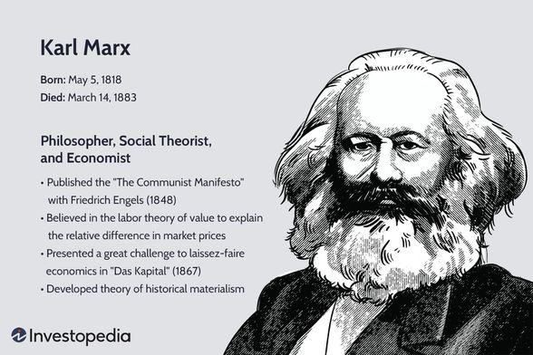

Marxian economics represents a school of economic thought rooted in the work of Karl Marx, focusing on the critique of capitalism and its inherent contradictions. Marx theorized that capitalism, driven by profit maximization and capital accumulation, exploits the working class by extracting surplus value from labor. This critique remains relevant today, especially with the advancements in financial technologies such as algorithmic trading.

Algorithmic trading uses sophisticated computer algorithms to execute trades at speeds and efficiencies far beyond human capabilities. This epitomizes the capitalist inclination toward maximizing efficiency and profit, echoing many of Marx's critiques about the dehumanizing aspects of capitalism. The integration of such technologies into modern markets raises questions about whether Marx's insights into labor exploitation and economic inequality hold lessons for current and future economic systems.

In this exploration, we will examine how Marxian economics can be related to contemporary trading practices and technologies, such as algorithmic trading. The aim is to assess if Marx's theories can inform ethical considerations and policy frameworks that address the disparities intensified by automated trading systems. Additionally, we will scrutinize the applicability of Marx's economic analysis to the functioning and regulation of today's financial markets, considering both historical and modern perspectives. By connecting Marx's 19th-century observations with 21st-century financial practices, the goal is to determine if there are pathways toward a more equitable economic system grounded in the insights of Marxian economics.

## Table of Contents

## Understanding Marxian Economics

Marxian economics fundamentally revolves around the analysis of labor as the driving force in the development of an economy. Karl Marx, in his critique of classical economic theories propounded by figures such as Adam Smith and David Ricardo, highlighted the exploitation of labor inherent in capitalist economies. This critique forms the cornerstone of Marxian economic theory, which posits that the capitalist system relies on the undercompensation of labor to generate surplus value.

Surplus value, according to Marx, is the additional value produced by workers over and above the wages they are paid, which is appropriated by the capitalist class. This concept is central to understanding the dynamics of capitalist economies, as outlined in Marx's seminal work, 'Das Kapital'. In this work, Marx painstakingly analyzes how this surplus value is extracted from labor and how it perpetuates the cycle of capital accumulation to the benefit of the ruling class.

Marx's theories on the inherent contradictions within capitalism predict an eventual collapse of the system. He argued that these contradictions arise primarily from the tension between the capitalists' need to maximize profit and the need to sustain the purchasing power of the working class. As technology and productivity increase, capital becomes more concentrated, leading to a reduction in labor demand. This scenario exacerbates inequality and can lead to crises of overproduction—situations where goods cannot be sold because the masses do not have sufficient income to buy them.

In Marxian economics, the accumulation of surplus value and the resulting imbalances are theorized to lead to systemic crises, sowing the seeds for capitalism's eventual downfall. Marx believed that the continual reinvestment of capital into production would lead to diminishing returns, as profit rates tend to fall over time. This dynamic underscores a fundamental instability within capitalist societies, one that might ultimately pave the way for alternative economic systems that prioritize equitable distribution of resources and labor compensation.

Overall, Marxian economics offers a critical lens through which to analyze and interpret the complexities of capitalist economies, providing insights that continue to be relevant in discussions of economic inequality and labor exploitation today.

## Marxian Economics vs. Classical Economics

Marxian economic theory significantly diverges from the classical economics espoused by Adam Smith and David Ricardo, primarily regarding their perceptions of the free market and the role of labor. Classical economics champions the invisible hand of the free market, suggesting it leads to efficient allocation of resources and wealth generation. Smith's famous metaphor emphasizes self-regulation, where individuals pursuing personal gain inadvertently contribute to societal economic benefit. Ricardo's theory of comparative advantage similarly underscores the productivity and wealth benefits of free markets, believing they promote international trade and specialization.

In stark contrast, Marxian economics critiques the purported efficiencies of free markets, highlighting their exploitative tendencies. Karl Marx offered a sharp critique of capitalism, focusing on the exploitation of labor by the capitalist class. He introduced the concept of surplus value, positing that capitalists earn profits by underpaying labor relative to the value of the goods and services produced by workers. This exploitation is central to Marx's theory, as he believed it leads to significant social inequalities and crises inherent within capitalist systems. 

Marx advocated for government intervention to mitigate the inequalities spawned by unfettered markets. Unlike the laissez-faire approach proposed by classical economists—who argue that minimal state intervention allows natural economic laws to generate societal benefits—Marx promoted active regulation. He believed that government intervention could correct market inequities, redistribute wealth, and address the power imbalances inherent in capitalist structures.

Current trends in capitalism present a compelling lens through which to evaluate Marx's predictions. The growing income and wealth disparities observed globally resonate with Marxian critiques. The concentration of capital among a small elite, coupled with the stagnation of wages for the working class, mirrors Marx's analysis of capital accumulation and labor exploitation. These trends raise questions about the sustainability of current capitalist practices, bringing renewed interest in Marxian critiques.

State intervention in modern economies often reflects an unconscious nod (or explicit adherence) to Marx's insights. Policies designed to redistribute wealth through taxation, social welfare programs, and labor protections are measures aimed at addressing inequalities that Marx highlighted. Keynesian economics, which emerged as a response to the Great Depression, further underscores this intersection. Though distinct from Marxian economics, Keynesianism acknowledges market failures and the necessity of government intervention to ensure economic stability—arguments that resonate with Marxian emphasis on correcting capitalism's excesses.

In summary, while classical economics lauds the efficiencies of a laissez-faire market system, Marxian economics exposes its disparities and calls for corrective intervention. The dialogue between these economic philosophies continues to shape contemporary debates on the role of government in economic markets and the pursuit of equitable growth.

## The Role of Algorithmic Trading in Modern Capitalism

Algorithmic trading, which utilizes pre-programmed computer algorithms to execute trades in financial markets, embodies the pinnacle of modern capitalism's pursuit of efficiency and maximization of profits. This technological advancement in trading allows for transactions to occur at speeds and volumes that far surpass human capability, fundamentally transforming the landscape of contemporary financial markets.

At its core, [algorithmic trading](/wiki/algorithmic-trading) is driven by mathematical models and complex formulas to decide the timing, price, and quantity of trades. Traders design these algorithms to exploit minute market inefficiencies or capitalize on specific market conditions, thereby increasing the potential for profit. This relentless quest for optimization and profitability aligns closely with one of the primary criticisms posed by Marxian economics: the propensity of capitalism to prioritize profit over equitable wealth distribution.

### Market Inequalities and Marxian Critique

Algorithmic trading, as a tool of financial capitalism, potentially exacerbates market inequalities. Large financial institutions that can afford advanced algorithms and access high-speed trading infrastructures gain significant advantages over smaller investors. This can lead to a concentration of wealth and power within a limited number of entities, reminiscent of the class disparities critiqued by Marx. The monopolistic tendencies seen in algorithmic trading mirror Marx's observations on the accumulation of capital and its consequences, as outlined in his seminal work, "Das Kapital."

Such disparities are manifested in phenomena like front-running, where high-frequency traders use their speed advantage to gain insight into price movements before others can act. This creates an uneven playing field, leading to a reinforcement of existing economic hierarchies—a fundamental concern of Marxian economics, which argues against the exploitative nature of capitalist systems.

### Potential Crises and Marx's Predictions

Marx predicted that capitalism would eventually face crises due to its internal contradictions, such as overproduction and accumulation of capital by a select few. Algorithmic trading has the potential to trigger financial crises due to its inherent design. Events like the "Flash Crash" of May 6, 2010, where the Dow Jones Industrial Average plummeted nearly 1,000 points within minutes, underscore the systemic risks associated with algorithmic trading. Such incidents can be linked to the cascading effect caused by algorithms reacting to each other without human intervention.

The automation and depersonalization of trading actions can lead to a disconnect from the broader economic realities that can exacerbate financial instability. Marx's prediction of capitalism's propensity towards crises finds resonance in the potential for algorithmic trading to induce market [volatility](/wiki/volatility-trading-strategies) and uncertainty when aligned with speculative behavior.

### Inefficiencies: Perpetuation or Elimination?

While algorithmic trading is designed to minimize inefficiencies, it can also perpetuate systemic inefficiencies critiqued by Marx. The focus on short-term gains over long-term stability may lead to artificial market conditions driven by algorithmic strategies. Nonetheless, there is potential for these algorithms to be employed in ways that resolve inefficiencies, if guided by ethical considerations and policies promoting economic equity. By embedding sustainability and ethical trading principles, algorithms could theoretically be used to foster market conditions that align better with equitable economic visions.

In conclusion, while algorithmic trading epitomizes the technological prowess of modern capitalism, it simultaneously reflects the exploitative mechanisms criticized by Marxian economics. Its dual capacity to enhance efficiencies and exacerbate inequalities highlights the importance of critically evaluating and potentially regulating its influence in financial markets.

## Integrating Marxian Thought into Financial Markets

Marxian economics, with its focus on labor and exploitation, provides a unique lens through which the practices of modern financial markets can be scrutinized, especially in the context of algorithmic trading. Integrating Marxian thought into contemporary trading systems calls for an examination of ethical trading practices, informed by Marx's insights on labor and capital. Contemporary markets often prioritize profit maximization, sometimes at the expense of fairness and equity. Marx's critique of capitalism highlighted the exploitation of labor as a core issue, and a similar critique can be extended to modern trading practices that may disproportionately benefit those with access to advanced technology and resources.

In proposing ethical trading practices, a Marxian perspective would challenge the prevailing norms that perpetuate inequalities in financial markets. Historical analysis shows that unchecked capital expansion often leads to a concentration of wealth and power. This notion can be applied to algorithmic trading, where large firms with access to sophisticated technology gain an upper hand over smaller players. An ethical approach informed by Marxian economics would advocate for regulations that level the playing field, ensuring that technological advantages do not exacerbate existing inequalities.

Furthermore, a Marxian lens could support the creation of more equitable financial market policies. This includes encouraging transparency in algorithmic decision-making processes and mandating audits to ensure fair play. By prioritizing policies that promote equitable access to market opportunities, the financial system could work towards reducing systemic inequalities, a goal central to Marxian thought.

Case studies of algorithmic trading systems that have successfully integrated responsible market behavior provide practical insights into harmonizing technology with ethical considerations. For instance, some financial institutions have developed algorithms with built-in checks that prevent market manipulation practices, such as spoofing or front-running. These practices align with a Marxian framework by reducing the potential for technology to exacerbate exploitative dynamics within markets.

Sustainable development of financial markets using a Marxian economic framework involves not only addressing exploitation but also ensuring that growth does not come at the expense of social welfare. This can mean more robust frameworks for corporate social responsibility, insisting that firms demonstrate their contributions to broader societal well-being. By advocating for systems where capital growth aids in reducing social inequities, rather than contributing to them, a Marxian approach supports the creation of financial markets that are just and sustainable. 

Integrating these principles from Marxian economics into the financial markets requires a foundational shift in how success is measured, from profits alone to a more holistic view that includes societal well-being and equity. While challenges remain, especially given the complexity of global markets, the application of Marxian thought offers pathways to more ethical and equitable trading systems.

## Conclusion

Marxian economics, with its profound insights into the dynamics of labor and capital, reveals much about modern technological advancements in trading such as algorithmic trading. This mode of trading epitomizes the constant drive for efficiency and profitability that characterizes capitalism. By employing high-speed algorithms to execute trades, financial markets can amplify inequalities, a critique rooted in Marx's analysis of capitalism. Marx's focus on surplus value and labor exploitation remains applicable as these algorithms often disproportionately benefit capital holders at the expense of broader economic equality.

Marxian critique still holds relevance today, especially in financial markets where disconnections between labor contributions and capital gains are magnified. The integration of Marx's insight could encourage a reassessment of financial practices to initiate equitable market reforms. This could involve designing algorithms that not only maximize efficiency but also consider ethical trading practices, potentially aligning with Marxian values.

However, the application of Marxian economics to algorithmic trading faces limitations. Marx's theories did not account for the rapid technological changes we witness today. The lack of direct guidance on automation and technology-driven inequalities presents a challenge. Thus, while Marxian economics offers a critical framework for understanding capitalism's dynamics, it requires adaptation to effectively address algorithmic trading's contemporary issues.

In conclusion, while embracing Marxian critique in evaluating current financial systems, it is essential to innovate solutions that integrate his enduring insights with modern practices. This synthesis could provide a path forward, aiding in the development of a more equitable economic system and highlighting the need for updated regulatory frameworks that address both longstanding economic issues and the unique challenges presented by technological advancement.

## References & Further Reading

[1]: Marx, K. (1867). ["Das Kapital"](https://www.marxists.org/archive/marx/works/download/pdf/Capital-Volume-I.pdf) Volume I. Retrieved from Marxists Internet Archive.

[2]: Mehrling, P. G. (2005). ["Fischer Black and the Revolutionary Idea of Finance"](https://archive.org/details/fischerblackrevo00mehr). Wiley.

[3]: Brynjolfsson, E., & McAfee, A. (2014). ["The Second Machine Age: Work, Progress, and Prosperity in a Time of Brilliant Technologies"](https://psycnet.apa.org/record/2014-07087-000). W.W. Norton & Company.

[4]: Hunsader, E. (2010). ["The Flash Crash: Algorithmic Trading in Action"](https://www.sciencedirect.com/science/article/pii/S2214845013000082). Retrieved from National Vanguard.

[5]: Liddiard, T. (2014). ["A Marxist Critique of Financial Markets"](https://journals.sagepub.com/doi/full/10.1177/1468795X17693920). ResearchGate.

[6]: Duffy, J. (2006). ["Agent-Based Models and Human Subject Experiments"](https://sites.socsci.uci.edu/~duffy/papers/duffy2006.pdf). Handbook of Computational Economics. Vol. 2, Part 2, 949-1011.