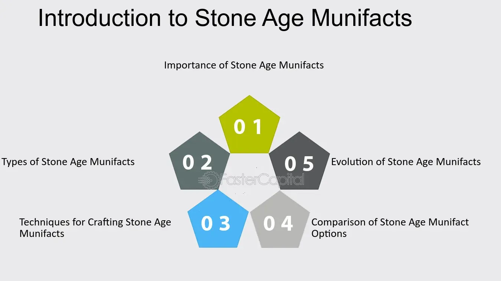

## Table of Contents

## What are munifacts?

Munifacts are small objects or souvenirs that people collect from places they visit. They are often things like keychains, magnets, or postcards that remind people of their trips and experiences. People like to buy munifacts because they help them remember special moments and places they have been.

These items are usually inexpensive and easy to find in tourist spots. Shops near famous landmarks or in busy city centers often sell them. Munifacts are popular because they are a simple way to take a piece of a place home with you. They can also make great gifts for friends and family who couldn't go on the trip.

## How do munifacts differ from other types of artifacts?

Munifacts are different from other types of artifacts because they are made for tourists and travelers. Other artifacts, like ancient tools or pottery, are usually old and important for history. They help us learn about the past. Munifacts, on the other hand, are new and made to be souvenirs. They are not usually important for history, but they are important for the people who buy them because they remind them of their trips.

Another difference is where you find them. You can find munifacts in gift shops or tourist spots. They are easy to buy and take home. Other artifacts are often found in museums or archaeological sites. They are protected and studied by experts. Munifacts are meant to be taken and kept as personal memories, while other artifacts are preserved for everyone to learn from.

## What is the historical significance of munifacts?

Munifacts do not have a big historical significance like ancient artifacts. They are new items made for tourists to remember their trips. They are not old or important for understanding the past like tools or pottery found in history. Munifacts are more about personal memories than history.

Even though munifacts are not important for history, they can still tell us a little about what people like to buy when they travel. Shops sell things like keychains and magnets because people want to take a piece of their trip home. So, munifacts show us what souvenirs are popular at different times and places.

## What are some common examples of munifacts?

Common examples of munifacts include keychains, magnets, and postcards. Keychains often have the name of a place or a picture of a famous landmark on them. People like to collect keychains from different places they visit. Magnets are also very popular. They stick to fridges and show off where someone has been. Postcards are another common munifact. They have pictures of places and can be sent to friends or kept as a memory.

Other examples of munifacts are small statues, t-shirts, and mugs. Small statues might look like famous buildings or animals from the area. T-shirts often have the name of the place or a funny saying on them. People wear them to remember their trip. Mugs are also popular because people can use them every day and think about their travels. All these items help people remember their trips and share their experiences with others.

## How are munifacts typically discovered and documented?

Munifacts are usually found in gift shops or tourist spots. People see them when they are visiting a new place. They might buy a keychain or a magnet because they like the design or want to remember the trip. Sometimes, people collect munifacts from many places and keep them at home. They might show them to friends or put them on a special shelf.

These items are not usually documented like historical artifacts. People might take pictures of their munifacts or write about them in a travel journal. They do this to remember where they got each item and what it means to them. Sometimes, people share their collections on social media or in blogs. This way, others can see what munifacts they have and learn about different places.

## What methods are used to date munifacts?

Munifacts are new items made for tourists, so they don't need to be dated like old artifacts. They often have the year they were made or bought printed on them. For example, a keychain might say "Paris 2023" to show when it was made. People can also remember when they bought their munifacts because they keep them as souvenirs from their trips.

If someone wants to know when a munifact was made and there's no date on it, they can look at other clues. They might check when the shop that sold it opened or when the design became popular. Sometimes, people write the date they bought a munifact in a journal or on a label. This helps them remember when they got it.

## What can munifacts tell us about past civilizations?

Munifacts don't tell us much about past civilizations because they are new items made for tourists. They are not old like ancient tools or pottery that help us learn about history. Munifacts are things like keychains and magnets that people buy to remember their trips. They are not important for understanding how people lived long ago.

Even though munifacts are not useful for learning about past civilizations, they can show us what people like to buy when they travel. Shops sell these items because tourists want to take a piece of their trip home. So, munifacts can tell us a little about what souvenirs are popular at different times and places. But they don't give us information about how people lived in the past.

## How do preservation techniques affect the study of munifacts?

Munifacts are new items like keychains and magnets that people buy when they travel. They don't need special preservation techniques like old artifacts do. Old artifacts, like ancient tools or pottery, need to be kept in special ways to stop them from getting damaged. Munifacts are not important for history, so people don't need to use special methods to keep them safe. They can just keep them at home or in a box.

Even though munifacts don't need special preservation, how people take care of them can affect what we learn from them. If someone keeps their munifacts in good condition, they can show us what souvenirs were popular at different times. But if munifacts get lost or broken, we might not be able to see what people liked to buy when they traveled. So, taking care of munifacts can help us understand a little about what tourists liked in the past.

## What are the ethical considerations in the study and display of munifacts?

When people study and show munifacts, they need to think about what is right and fair. Munifacts are new things like keychains and magnets that tourists buy. They are not important for history like old artifacts. But, it's still important to be honest about where the munifacts come from and not to make up stories about them. People should also be careful not to take munifacts from places where they are not supposed to, like private property or protected areas.

Another thing to think about is how munifacts are shown to others. If someone is sharing their collection of munifacts, they should be clear that these items are just souvenirs and not important for history. It's also good to think about how showing munifacts might affect the places they came from. For example, if too many people want to buy munifacts from a certain place, it might harm the environment or the local culture. So, it's important to be respectful and think about these things when studying and displaying munifacts.

## How have technological advances impacted the analysis of munifacts?

Technological advances have made it easier to keep track of munifacts. People can now use their phones to take pictures of their souvenirs and share them online. This helps them remember where they got each item and what it means to them. They can also use apps to organize their collections and keep notes about when and where they bought each munifact. This makes it easier to show their souvenirs to friends and family, even if they live far away.

Technology also helps people learn more about the places where they got their munifacts. They can use the internet to find out more about the landmarks or cities on their souvenirs. This can make the munifacts more interesting because people can learn more about the stories behind them. But, even with all these new tools, munifacts are still just souvenirs and not important for history like old artifacts.

## What are the current challenges in munifact research?

Munifacts are new items like keychains and magnets that people buy when they travel. They are not old or important for history like ancient artifacts. Because of this, there are not many big challenges in studying munifacts. The main challenge is keeping track of where they come from and what they mean to people. Since munifacts are just souvenirs, it can be hard to remember all the details about when and where they were bought. People might forget or lose the information over time.

Another challenge is making sure that munifacts are not confused with real historical artifacts. Sometimes, people might think that a munifact is more important than it really is. This can happen if someone tells a story about a munifact that is not true. It's important to be clear that munifacts are just souvenirs and not important for understanding the past. Keeping this clear can help avoid confusion and make sure that people understand what munifacts really are.

## What future directions might munifact studies take?

In the future, people might study munifacts more to learn about what tourists like to buy and how these souvenirs change over time. They could look at which munifacts are popular in different places and why. This could help shops decide what to sell and help us understand more about what people want to remember from their trips. Researchers might use the internet and social media to see what people are sharing about their munifacts and learn from that.

Another thing that might happen is that people could start using technology more to keep track of their munifacts. They might use apps to take pictures and write notes about where they got each item. This could make it easier to remember the stories behind their souvenirs. Even though munifacts are not important for history like old artifacts, studying them can still tell us a little about what people enjoy and how they remember their travels.

## References & Further Reading

[1]: Lopez de Prado, M. (2018). ["Advances in Financial Machine Learning,"](https://www.amazon.com/Advances-Financial-Machine-Learning-Marcos/dp/1119482089) John Wiley & Sons.

[2]: Jansen, S. (2020). ["Machine Learning for Algorithmic Trading,"](https://github.com/stefan-jansen/machine-learning-for-trading) Packt Publishing.

[3]: Chan, E. (2008). ["Quantitative Trading: How to Build Your Own Algorithmic Trading Business,"](https://github.com/ftvision/quant_trading_echan_book) John Wiley & Sons.

[4]: Aronson, D.R. (2006). ["Evidence-Based Technical Analysis: Applying the Scientific Method and Statistical Inference to Trading Signals,"](https://www.amazon.com/Evidence-Based-Technical-Analysis-Scientific-Statistical/dp/0470008741) John Wiley & Sons.

[5]: Harris, L. (2003). ["Trading and Exchanges: Market Microstructure for Practitioners,"](https://academic.oup.com/book/52292) Oxford University Press.

[6]: Park, S.H., Lee, B., Kim, T. (2019). ["Algorithmic Trading in the Market for Municipal Bonds,"](https://www.semanticscholar.org/paper/Observation-of-an-exceptional-point-in-a-Park-Lee/56b0dd0691c15b067b1793c08d20c5faf516cdaa) Semantic Scholar.

[7]: Harris, L.E., and Piwowar, M.S. (2006). ["Secondary Trading Costs in the Municipal Bond Market,"](https://onlinelibrary.wiley.com/doi/10.1111/j.1540-6261.2006.00875.x) The Journal of Finance.