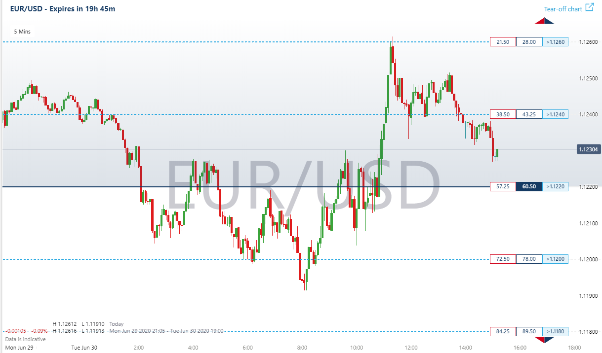

Binary options trading has gained popularity due to its straightforward approach and the clear delineation of potential profits and losses. This financial instrument allows traders to speculate on the price movements of various underlying assets, including currencies, indices, and commodities, all while knowing their risk and reward before entering the trade. The binary nature of these options—where the outcome is either a profit or a loss—makes them accessible and appealing to both novice and experienced traders.

Nadex (North American Derivatives Exchange) stands out as a prominent exchange for binary options in the United States. It offers a regulated trading environment, which is crucial for ensuring the safety and transparency of transactions. With its low entry barriers, Nadex provides traders with an array of opportunities to participate in the financial markets. It is particularly favored for its straightforward regulatory framework, as it is overseen by the Commodity Futures Trading Commission (CFTC), ensuring that traders' funds are protected and that the trading processes are transparent.



This article aims to provide an in-depth examination of binary options trading as facilitated by Nadex. It will cover essential aspects such as trading strategies that can be utilized, the tools available to traders on the platform, and the potential for algorithmic trading (algo trading) to enhance trading efficiency and accuracy. By focusing on these areas, the article will provide valuable insights for those looking to understand and potentially leverage binary options in their trading activities.

## Table of Contents

## Understanding Binary Options Trading

Binary options are a type of financial instrument characterized by simplicity, where the outcome is based on a yes or no proposition. This form of trading allows participants to bet on the price movement of various underlying assets, including currencies, indices, commodities, and even specific economic events. A binary option contract is structured so that it offers a predetermined profit or loss, thereby reducing trading risk while providing the potential for significant returns.

In a typical binary options trade, a trader will predict whether the price of an underlying asset will be above or below a certain level at a specified point in time. If the prediction is correct, the trader receives a fixed payout. However, if the prediction is incorrect, the trader loses the predetermined amount of their investment. This fixed reward and risk structure is central to binary options trading and can be expressed mathematically as:

$$
\text{Profit/Loss} = \begin{cases} 
\text{Payout} & \text{if prediction is correct} \\
-\text{Investment} & \text{if prediction is incorrect} 
\end{cases}
$$

The allure of binary options trading lies in its straightforward nature and the ability to know potential risks and rewards before entering a trade. This contrasts with other forms of trading, where factors like leverage, margin calls, and varying commissions can complicate profitability. Furthermore, binary options can be traded in various time frames, ranging from minutes to months, allowing traders to choose strategies that fit their risk tolerance and market outlook.

Traders engaging in binary options must analyze market conditions and trends effectively. They typically use a combination of technical and [fundamental analysis](/wiki/fundamental-analysis) to forecast price movements. Technical analysis may include the use of charts, indicators, and historical price data, while fundamental analysis might involve monitoring economic news releases or events that could influence the underlying asset prices.

In summary, binary options trading offers a simplified approach to speculate on market movements with clearly defined outcomes. The predefined profit and loss structure can appeal to traders seeking a transparent and bounded risk environment, although successful trading still requires careful market analysis and strategy development.

## Why Choose Nadex for Binary Options?

Nadex serves as the largest regulated exchange for binary options in the United States, providing a secure and reliable trading environment for investors. As a U.S.-based exchange, Nadex is regulated by the Commodity Futures Trading Commission (CFTC), which emphasizes safety, transparency, and fairness in its operations. This regulation ensures that traders have a secure platform to engage in binary options trading, bolstering confidence in the integrity of transactions.

Nadex distinguishes itself by offering a diverse array of trading opportunities. In addition to binary options, the platform features knock-outs and call spreads, which further diversify trading strategies available to investors. Knock-outs, for example, are contracts with set boundaries, allowing traders to speculate on the price movements of an underlying asset. These contracts are beneficial for traders looking to capitalize on short-term market [volatility](/wiki/volatility-trading-strategies) without the risk of losing more than the predetermined limit.

Call spreads on Nadex enable traders to buy or sell a contract within a specified range, offering a built-in floor and ceiling. This feature allows for strategic trades where the risk and reward can be clearly defined. Both knock-outs and call spreads provide flexibility and additional avenues for traders looking to leverage their strategies beyond traditional binary options.

The platform's CFTC regulation mandates strict compliance with financial safety and operational transparency. This includes the segregation of client funds in designated banks, ensuring that traders' money is not used for operational purposes of the exchange. Traders can thus be assured that their funds are both protected and accessible, further reinforcing Nadex's reputation as a trustworthy platform for binary options trading.

In summary, Nadex's regulated status, coupled with its broad spectrum of trading instruments, makes it an attractive choice for traders seeking a structured and secure environment to execute binary options and other innovative financial contracts. This combination of protection and diverse offerings positions Nadex as a leading choice for both novice and experienced traders in the U.S. binary options market.

## Algo Trading on Nadex

Algorithmic trading (algo trading) involves using computer algorithms to automate trading strategies based on pre-set criteria such as timing, price, or [volume](/wiki/volume-trading-strategy). This technology-driven approach has significantly transformed financial markets by allowing traders to execute large volumes of trades at speeds and frequencies impractical for human traders. 

Nadex, known for offering binary options, supports algo trading through its reliable market data and robust trading infrastructure. By providing real-time access to precise market information, Nadex enables traders to leverage algorithmic systems effectively. This support is crucial for algo trading, as real-time data feeds and execution tools can sharply enhance a trader's ability to respond to market conditions instantly.

The inclusion of algo trading in binary options opens up prospects for improved speed and efficiency in trade execution. Algorithms can instantly process vast data, recognize trading opportunities, and execute transactions much faster than manual trading. This capability can lead to enhanced decision-making accuracy because algorithms are devoid of emotional influences that often lead to suboptimal trading decisions. Moreover, the systematic nature of algo trading reduces human errors, ensuring consistency in trading execution.

Python is a widely-used programming language for developing trading algorithms due to its extensive libraries and ease of use. Here's a simple example of a Python script that listens for a market condition to place a binary options trade on a hypothetical Nadex platform:

```python
import random

def get_market_data():
    # Mock function to simulate market data retrieval
    return random.choice(['UP', 'DOWN'])

def should_place_trade(market_trend):
    # Simple trading logic based on market trend
    return market_trend == 'UP'

def place_trade():
    # Mock function to simulate placing an order
    print("Trade Placed")

market_trend = get_market_data()

if should_place_trade(market_trend):
    place_trade()
```

In this script, a basic strategy involves placing a trade based on a market trend indicator. While this example is illustrative, real algos use more sophisticated strategies involving advanced techniques like [machine learning](/wiki/machine-learning) and data analysis.

Algorithmic trading on platforms like Nadex thus offers traders the ability to execute trades with high speed and precision, enhancing their overall trading performance. The benefits of improved efficiency and decision-making accuracy make algo trading an attractive option for those engaging in binary options trading.

## Pros and Cons of Binary Options on Nadex

Binary options trading on Nadex presents various advantages and disadvantages, attracting a diverse group of traders while posing certain challenges to others. 

One of the notable benefits of trading binary options on Nadex is the low fees and the absence of account minimums. These features make the platform accessible to a broad spectrum of traders, from beginners to seasoned professionals. This inclusivity is a significant draw as it allows traders to start trading without the pressure of substantial financial commitments. 

Additionally, the fixed risk and reward structure of binary options provides a straightforward trading format. Traders are fully aware of their potential gains and losses prior to entering a trade, which can be particularly advantageous for those who wish to manage their financial exposure accurately. This clarity appeals to both novices, who may find traditional trading mechanisms daunting, and experienced traders looking for straightforward decision-making processes.

However, trading on Nadex is not without its drawbacks. One of the challenges traders might face is the limited availability of research tools compared to more traditional trading platforms. This limitation can pose a problem for those who rely heavily on in-depth analysis and comprehensive data to guide their trading decisions. The complexity of some binary options products offered by Nadex might also prove challenging, especially for traders who are accustomed to more conventional trading formats. The necessity to understand unique features such as knock-outs and call spreads could require a learning curve for those new to this style of trading. 

In conclusion, while Nadex provides a cost-effective and straightforward avenue for trading binary options, it may require traders to adapt and learn to fully harness the potential of its offerings.

## Developing a Successful Trading Strategy

Successful trading on Nadex, a prominent platform for binary options, depends significantly on the trader's ability to understand various market dynamics and employ effective strategies that mitigate risks while maximizing potential gains. A crucial element of achieving success involves grasping market trends, making use of technical analysis, and adhering to robust risk management practices.

Understanding market trends requires an awareness of both broad economic indicators and specific asset movements. Traders should analyze historical price movements and recognize patterns that might predict future behavior. For instance, tools such as Moving Averages (MA) and Relative Strength Index (RSI) can be pivotal. The Moving Average can smooth price data to identify trends, while RSI provides insights into whether an asset is overbought or oversold.

Technical analysis forms the backbone of predicting future price movements based on historical data. It involves using charts and various indicators to assess an asset's behavior. Commonly used techniques include chart patterns like head and shoulders or flags, and indicators such as Bollinger Bands and Fibonacci Retracements. The latter can predict potential levels of support and resistance using ratios derived from the Fibonacci sequence.

Risk management is another cornerstone in developing a trading strategy. This involves setting stop-loss measures, which automatically sell an asset when it reaches a predetermined price, curtailing potential losses. A simple formula for a stop-loss might involve setting a threshold based on the expected volatility of the asset:

$$
\text{Stop-loss level} = \text{Entry price} - (\text{Average True Range (ATR)} \times \text{Multiplier})
$$

ATR is an indicator that measures market volatility, while the multiplier can be adjusted according to risk appetite.

Nadex offers substantial educational resources to support traders in honing their strategy development skills. The platform provides webinars, tutorials, and demo accounts where traders can practice without financial risk. Demo accounts are particularly useful for testing strategies in a risk-free environment, thus enabling traders to gain confidence and technical proficiency.

Formulating a comprehensive trading plan is integral to effective trading. A trading plan should encompass clear objectives—whether they involve percentage returns or risk tolerance—and well-defined parameters for entering and exiting trades. Additionally, it is imperative to review performance regularly, using tools and metrics to assess the effectiveness of the strategies employed. This review process helps in iterating strategies and adapting to changing market conditions.

Through leveraging technical analysis, utilizing educational resources from platforms like Nadex, and employing stringent risk management protocols, traders can develop a trading strategy that offers a structured pathway to achieving trading success.

## Conclusion

Trading binary options on Nadex provides a vibrant and regulated environment for both novice and seasoned traders alike. Nadex is recognized for its transparent and secure trading framework, ensuring that participants can focus on their strategies without undue concern for safety or reliability issues. The platform’s regulated nature, under the oversight of the U.S. Commodity Futures Trading Commission (CFTC), adds an additional layer of security and trust, making it an appealing choice for many traders.

The integration of [algorithmic trading](/wiki/algorithmic-trading) in binary options offers enhanced opportunities for executing refined trading strategies with precision. By utilizing algorithms, traders can capitalize on various market conditions with speed and accuracy that manual trading may not allow. These algorithms can process large volumes of data to make informed decisions quickly, often providing a competitive edge. For instance, a simple strategy in Python could automate the process of placing trades based on pre-determined signals:

```python
import requests

class AutoTrader:
    def __init__(self, market, condition):
        self.market = market
        self.condition = condition

    def get_price(self):
        # This function would interact with Nadex's API to fetch market data
        response = requests.get(f'https://api.nadex.com/{self.market}')
        return response.json()['price']

    def trade(self):
        current_price = self.get_price()
        if self.condition(current_price):
            # Execute buy/sell logic here
            print(f"Trade executed at price: {current_price}")

# Example usage
def example_condition(price):
    # Define simple trading condition
    threshold = 100
    return price > threshold

trader = AutoTrader(market='binaryOptions', condition=example_condition)
trader.trade()
```

To thrive on Nadex and other trading platforms, continuous learning and adaptability to market changes are paramount. As the financial markets evolve with economic developments, geopolitical events, and technological advancements, staying informed is crucial. Traders are encouraged to engage with educational resources such as webinars, articles, and demo accounts offered by Nadex to enhance their understanding and skills. Furthermore, regularly reviewing and adapting strategies ensures they remain effective under varying market conditions. This iterative process of learning, testing, and adapting not only enhances performance but also builds the resilience necessary to succeed in dynamic trading environments.

## References & Further Reading

[1]: Bergstra, J., Bardenet, R., Bengio, Y., & Kégl, B. (2011). ["Algorithms for Hyper-Parameter Optimization."](https://dl.acm.org/doi/10.5555/2986459.2986743) Advances in Neural Information Processing Systems 24.

[2]: ["Advances in Financial Machine Learning"](https://www.amazon.com/Advances-Financial-Machine-Learning-Marcos/dp/1119482089) by Marcos Lopez de Prado

[3]: ["Evidence-Based Technical Analysis: Applying the Scientific Method and Statistical Inference to Trading Signals"](https://www.amazon.com/Evidence-Based-Technical-Analysis-Scientific-Statistical/dp/0470008741) by David Aronson

[4]: ["Machine Learning for Algorithmic Trading"](https://github.com/stefan-jansen/machine-learning-for-trading) by Stefan Jansen

[5]: ["Quantitative Trading: How to Build Your Own Algorithmic Trading Business"](https://www.amazon.com/Quantitative-Trading-Build-Algorithmic-Business/dp/1119800064) by Ernest P. Chan