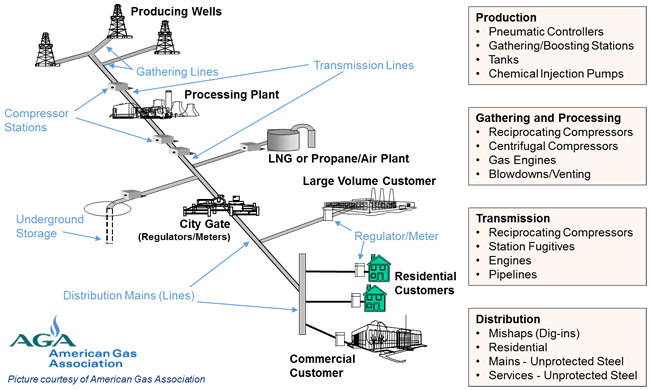

## Table of Contents

## What is the oil and gas industry?

The oil and gas industry is all about finding, taking out, and using oil and natural gas from the earth. These resources are very important because they give us energy for things like cars, heating our homes, and making electricity. People in this industry look for oil and gas deep underground or under the ocean. Once they find it, they drill into the earth to get it out. Then, they move it to places where it can be turned into things like gasoline or plastic.

The industry is split into three main parts: upstream, midstream, and downstream. Upstream is about finding and drilling for oil and gas. Midstream involves moving the oil and gas from where it's found to where it's needed, often through pipelines or ships. Downstream is about turning the oil and gas into products we use every day, like fuel for cars or materials for making things. Each part of the industry is important and works together to make sure we have the energy and products we need.

## What are the main sectors of the oil and gas industry?

The oil and gas industry has three main sectors: upstream, midstream, and downstream. The upstream sector is all about finding oil and gas in the ground or under the sea. People in this sector explore different places to see if there's oil or gas there. If they find some, they drill into the earth to get it out. This part of the industry is really important because without finding oil and gas, we wouldn't have any to use.

The midstream sector is about moving the oil and gas from where it's found to where it's needed. This can involve using pipelines to transport it across land or ships to move it across water. The midstream sector also includes storing oil and gas until it's ready to be used. It's like the transportation and storage part of the industry, making sure that the oil and gas gets to the right places.

The downstream sector is where oil and gas get turned into things we use every day. This includes refining oil into gasoline for cars or making natural gas into energy for heating homes. The downstream sector also makes other products from oil and gas, like plastics and chemicals. It's the part of the industry that takes the raw materials and turns them into useful stuff for people.

## How is oil and gas formed?

Oil and gas are formed from tiny plants and animals that lived in the sea millions of years ago. When these tiny creatures died, they sank to the bottom of the ocean and got buried under layers of mud and sand. Over time, more and more layers piled up, and the pressure from these layers, along with heat from the earth, started to change the remains of the plants and animals. This process, which took millions of years, turned the remains into oil and gas.

The oil and gas then moved through tiny spaces in the rock until they got trapped under a layer of rock that they couldn't get through. This is called a reservoir. When people find these reservoirs, they can drill into them to get the oil and gas out. So, the oil and gas we use today come from ancient life in the ocean that was transformed by heat and pressure deep underground.

## What are the primary methods of oil and gas extraction?

The primary method of oil and gas extraction is drilling. People use big machines called drilling rigs to make deep holes in the ground or under the ocean. They drill down until they reach the oil or gas that's trapped in the rock. Once they hit the oil or gas, they can pump it up to the surface. This method is used all over the world and is the most common way to get oil and gas out of the earth.

Another method is called hydraulic fracturing, or fracking. In fracking, people drill down into the rock and then pump in a special liquid at high pressure. This liquid, which is mostly water mixed with sand and chemicals, cracks the rock and lets the oil or gas flow out. The sand keeps the cracks open so the oil or gas can keep coming out. Fracking is used a lot in places where the oil and gas are trapped in tight rock that's hard to get to with just drilling.

There's also a method called enhanced oil recovery, which is used when the oil in a reservoir is hard to get out. In this method, people inject things like steam, gas, or chemicals into the reservoir to make the oil flow better. This helps push more oil out of the rock and up to the surface. Enhanced oil recovery is important because it can get more oil out of places that might have been thought to be empty.

## What is the role of exploration in the oil and gas industry?

Exploration is super important in the oil and gas industry. It's the first step in finding new places where oil and gas might be hiding underground or under the ocean. People use special tools like seismic surveys to look deep into the earth. They send sound waves down and listen to the echoes to see if there are any oil or gas traps down there. If they think they've found something, they'll drill a test well to see if they're right. Without exploration, we wouldn't know where to drill, and we'd miss out on a lot of oil and gas.

Once a good spot is found, exploration helps figure out how much oil or gas is there and how easy it will be to get it out. This information is really important because it helps companies decide if it's worth spending a lot of money to drill there. If the exploration shows there's a lot of oil or gas and it's not too hard to get, then companies will go ahead and start drilling. Exploration is like the detective work of the oil and gas industry, making sure we find the best places to look for these important resources.

## How does the refining process work in the oil and gas industry?

Refining is how we turn raw oil into things we use every day, like gasoline for cars or jet fuel for airplanes. When oil comes out of the ground, it's a thick, dark liquid called crude oil. To use it, we need to clean it up and break it down into different parts. This happens at a place called a refinery. First, the crude oil is heated up in a big tower called a distillation column. As it gets hot, different parts of the oil turn into gas at different temperatures and rise up the tower. The gases cool down at different levels and turn back into liquids, which are collected. This separates the oil into things like gasoline, diesel, and kerosene.

After the oil is separated, it might need more work to be really useful. Some parts of the oil might be turned into other things through processes like cracking or reforming. Cracking breaks big molecules into smaller ones, which can be used to make more gasoline. Reforming changes the shape of molecules to make them better for things like making high-octane gasoline. All these steps make sure that the oil is turned into the best products we need. The refining process is really important because it takes the raw oil and turns it into the fuels and other products that keep our world running.

## What are the major challenges facing the oil and gas industry today?

One big challenge for the oil and gas industry today is the push to use less oil and gas because of climate change. More and more people want to use clean energy like wind and solar power instead of oil and gas, which can harm the environment. This means the oil and gas industry has to find new ways to make their products cleaner or find other things to do with their skills and resources. It's a big change, and it's hard for the industry to keep up with all the new rules and demands for cleaner energy.

Another challenge is the ups and downs of oil and gas prices. The prices can change a lot because of things like politics, how much oil and gas people want, and what's happening in the world. When prices go down, it can be hard for companies to make money, and they might have to cut back on what they do. This can lead to people losing their jobs and less money being spent on finding new oil and gas. It's a tricky situation, and the industry has to be ready to handle these changes and keep going strong.

Lastly, finding new oil and gas is getting harder and more expensive. A lot of the easy-to-find oil and gas has already been used up, so now companies have to look in tougher places like deep under the ocean or in the Arctic. This costs a lot of money and can be risky. Plus, there are more rules about where and how they can drill, which makes it even harder. The industry has to keep looking for new ways to find oil and gas without spending too much or breaking the rules.

## How does the oil and gas industry impact the global economy?

The oil and gas industry is a big part of the global economy. It gives jobs to millions of people all over the world. These jobs are in finding oil and gas, moving it around, and turning it into things we use every day like gasoline and plastic. The money made from oil and gas helps countries grow and build things like roads and schools. When oil and gas prices go up or down, it can change how much money people and countries have, which can make the whole economy go up or down.

Oil and gas are also really important for moving things around the world. Planes, ships, and trucks all need oil to run, so without it, it would be hard to get goods from one place to another. This means that the oil and gas industry helps keep the world connected and working together. But, because oil and gas can harm the environment, there's a big push to use less of them and find cleaner energy. This change can be hard for the economy because it means finding new ways to do things and new jobs for people.

## What are the environmental concerns associated with the oil and gas industry?

One big environmental concern with the oil and gas industry is that it can harm the air, water, and land. When oil and gas are taken out of the ground, it can leak and pollute the water and soil. This can hurt plants, animals, and people who live nearby. Also, when oil and gas are burned, they release greenhouse gases like carbon dioxide into the air. These gases trap heat and make the earth warmer, which can change the weather and cause problems like melting ice and rising sea levels.

Another concern is that the industry can harm wildlife and their homes. Drilling and building pipelines can destroy forests, wetlands, and other places where animals live. This can make it hard for animals to find food and places to live. Oil spills, like the ones that happen in the ocean, can be really bad for sea animals. The oil can cover birds and make it hard for them to fly or stay warm, and it can poison fish and other sea creatures. These spills can have long-lasting effects on the environment and take a long time to clean up.

## What are the latest technologies being used to improve oil and gas production?

One of the latest technologies in the oil and gas industry is called digital oilfield technology. This technology uses computers and special software to help find oil and gas more easily and quickly. It can also help make drilling safer and more efficient. For example, sensors are placed in oil wells to gather information about what's happening underground. This information is sent to computers on the surface, where it's used to make better decisions about how to drill and get the oil out. This can save time and money and help the industry be more successful.

Another important technology is called enhanced oil recovery. This method is used to get more oil out of places that are hard to reach or where the oil doesn't flow well. One way to do this is by injecting steam into the oil reservoir. The steam heats up the oil, making it thinner and easier to pump out. Another way is by using chemicals or gases to push the oil out of the rock. These methods can help get more oil from places that might have been thought to be empty, which is good for the industry.

Lastly, there's a technology called carbon capture and storage (CCS). This is used to help the environment by trapping the carbon dioxide that comes from burning oil and gas. The carbon dioxide is captured at power plants or refineries and then stored deep underground where it can't harm the air. This technology helps reduce the impact of oil and gas on the environment and is becoming more important as people try to use less fossil fuels and find cleaner ways to use energy.

## How does the oil and gas industry manage and mitigate risks?

The oil and gas industry faces many risks, like accidents, environmental harm, and changes in oil prices. To manage these risks, companies use careful planning and safety rules. They train their workers well and use the latest technology to make sure everything is done safely. For example, they use strong equipment and check it often to avoid accidents. They also have emergency plans ready in case something goes wrong, so they can act fast and keep people and the environment safe.

Another way the oil and gas industry mitigates risks is by thinking about the future. They use special studies to guess what might happen with oil prices and plan their work around that. They also work hard to follow all the rules about protecting the environment. This means using technology like carbon capture to reduce pollution and cleaning up any spills quickly. By planning ahead and following strict safety and environmental rules, the industry tries to keep risks as low as possible.

## What are the future trends and predictions for the oil and gas industry?

The future of the oil and gas industry is changing because more people want to use clean energy like wind and solar power. This means the industry might have to find new ways to make their products cleaner or look for other things to do with their skills and resources. They might use more technology like carbon capture to reduce pollution. Also, they might start making more biofuels, which come from plants and are better for the environment. The industry will need to keep up with new rules and demands for cleaner energy, which can be hard but also open up new opportunities.

Another trend is that finding new oil and gas is getting harder and more expensive. A lot of the easy-to-find oil and gas has already been used up, so companies have to look in tougher places like deep under the ocean or in the Arctic. This costs a lot of money and can be risky. To deal with this, the industry might use more advanced technology like digital oilfield technology to find oil and gas more easily and safely. They might also work on better ways to get more oil out of places that are hard to reach, like using enhanced oil recovery methods. These trends show that the oil and gas industry will need to be smart and flexible to keep going strong in the future.

## References & Further Reading

[1]: Bergstra, J., Bardenet, R., Bengio, Y., & Kégl, B. (2011). ["Algorithms for Hyper-Parameter Optimization."](https://dl.acm.org/doi/10.5555/2986459.2986743) Advances in Neural Information Processing Systems 24.

[2]: ["Advances in Financial Machine Learning"](https://www.amazon.com/Advances-Financial-Machine-Learning-Marcos/dp/1119482089) by Marcos Lopez de Prado

[3]: ["Evidence-Based Technical Analysis: Applying the Scientific Method and Statistical Inference to Trading Signals"](https://www.amazon.com/Evidence-Based-Technical-Analysis-Scientific-Statistical/dp/0470008741) by David Aronson

[4]: ["Machine Learning for Algorithmic Trading"](https://github.com/PacktPublishing/Machine-Learning-for-Algorithmic-Trading-Second-Edition) by Stefan Jansen

[5]: ["Quantitative Trading: How to Build Your Own Algorithmic Trading Business"](https://books.google.com/books/about/Quantitative_Trading.html?id=j70yEAAAQBAJ) by Ernest P. Chan