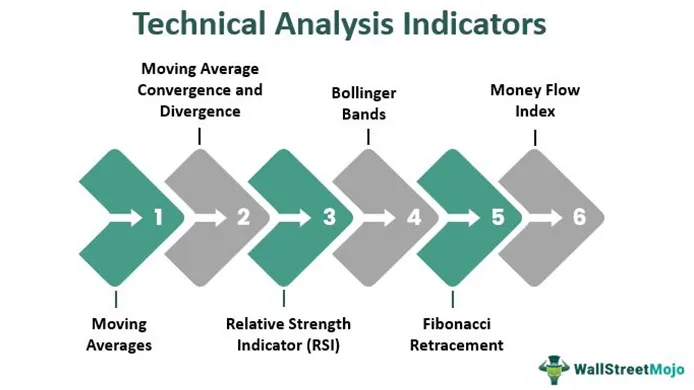

In today’s fast-paced financial markets, oscillators have become indispensable tools in both electronic systems and algorithmic trading. These devices are integral to the functioning of many electronic systems, where they generate continuous waveforms crucial for timing and signal processing tasks. Oscillators ensure that electronic devices, whether they are computers, radios, or clocks, operate with precision and reliability.

This article explores how the principles of oscillation in electronics are applied to financial trading strategies, particularly focusing on oscillatory indicators. These indicators, such as the Relative Strength Index (RSI) and Stochastic Oscillator, are pivotal in providing insights into market dynamics by analyzing price patterns and fluctuations. They serve as tools for assessing market conditions, helping traders recognize overbought or oversold scenarios to make informed trading decisions.



Algorithmic trading leverages these indicators by embedding them into automated systems that execute buy or sell orders based on predefined conditions. This approach not only streamlines decision-making processes but also optimizes trading efficiency and accuracy. By automating these decisions, trading systems can react swiftly to market changes, capitalizing on fleeting opportunities that might be missed by human traders.

The content of this article is particularly beneficial for traders, analysts, and technologists aiming to deepen their grasp of oscillators within trading ecosystems. Understanding the intersection of electronic oscillators and financial markets enhances the ability to harness these tools, leading to superior trading outcomes and a competitive edge in the ever-evolving financial landscape.

## Table of Contents

## Understanding Oscillators in Electronics

Oscillators in electronics are critical circuits that produce a continuous waveform output without needing an external input signal. They are indispensable in various applications, including clocks, radio transmitters, and computers, where they serve as timing devices and signal generators. 

The core principle governing oscillators is the feedback loop mechanism, which ensures that the oscillation frequency remains within desired parameters. This feedback loop generally consists of an amplifier and a frequency-determining network that defines the stable frequency of the output signal. The amplifier compensates for energy losses within the circuit, while the network determines the periodicity of the oscillations.

Oscillators can be categorized based on their frequency range and waveform output. Common types include:

1. **RC Oscillators**: Utilized primarily in low-frequency applications, these oscillators employ resistors (R) and capacitors (C) to determine the frequency of oscillation. A typical example is the phase-shift oscillator, which uses cascaded RC networks to generate sine waves.

2. **LC Oscillators**: Suited for higher frequency applications, LC oscillators rely on inductors (L) and capacitors (C) to form a tank circuit that resonates at the desired frequency. The Colpitts and Hartley oscillators are well-known designs in this category.

3. **Crystal Oscillators**: These are employed when high frequency stability is required, such as in microprocessor clocks. A piezoelectric crystal, typically quartz, forms the frequency-determining component. The crystal's mechanical resonance offers precise control over the oscillation frequency.

The performance and accuracy of electronic systems significantly depend on the design precision and stability of oscillators. Inaccuracies in oscillator output can lead to errors in timing, data transmission, and frequency synthesis, impacting the overall system functionality. Engineers often focus on minimizing phase noise and ensuring stable frequency output in their designs to enhance oscillator performance.

In summary, oscillators are fundamental electronic devices that ensure system precision through controlled oscillation, playing a pivotal role in the operation of diverse technological applications. The success of many electronic systems is intrinsically linked to the efficiency and reliability of these oscillators.

## Oscillators in Financial Markets

In financial markets, oscillators are pivotal technical indicators utilized to gauge price [momentum](/wiki/momentum) within a defined range. These indicators assist traders in identifying overbought or oversold conditions by examining price patterns and fluctuations. By analyzing these patterns, traders can make more informed decisions and manage risks effectively.

Oscillators are typically constructed to measure the degree of price change in order to predict market momentum. They are especially beneficial in non-trending, or ranging, markets where price movements oscillate between support and resistance levels. The Relative Strength Index (RSI), Stochastic Oscillator, and Bollinger Bands are among the most popular oscillators, each providing unique insights into market conditions.

The Relative Strength Index (RSI) is a momentum oscillator that measures the speed and change of price movements. It ranges from 0 to 100 and is typically used to identify overbought or oversold conditions in a market. An RSI above 70 suggests that a security might be overbought, while a reading below 30 indicates it might be oversold. The RSI is calculated as follows:

$$
RSI = 100 - \left( \frac{100}{1 + RS} \right)
$$

where RS (Relative Strength) is the average of 'x' days' up closes divided by the average of 'x' days' down closes.

The Stochastic Oscillator, developed by George C. Lane, is another momentum indicator that compares a particular closing price of a security to a range of its prices over a certain period of time. The sensitivity of the oscillator to market movements can be reduced by adjusting the time period or by taking a moving average of the result. The formula for the Stochastic Oscillator is as follows:

$$
\%K = \frac{\text{(Current Close - Lowest Low)}}{\text{(Highest High - Lowest Low)}} \times 100
$$

where Lowest Low and Highest High are the lowest and highest prices over a specified period, typically 14 days.

Bollinger Bands, created by John Bollinger, consist of a middle band being an N-period simple moving average (SMA), a second band above (SMA plus two standard deviations), and a third band below the SMA (SMA minus two standard deviations). This setup allows traders to see how prices vary around these bands and can help signal overbought or oversold conditions when prices hit the upper or lower bands, respectively.

Each of these oscillators provides a different perspective on price movement, allowing traders to identify potential buy or sell opportunities and better manage their trading strategies. By accurately interpreting the signals from these tools, traders gain the ability to anticipate potential market reversals or continuations, thus enhancing their trading performance and risk management capabilities.

## Integration of Oscillators in Algorithmic Trading

Algorithmic trading heavily depends on oscillators to automate buy and sell signals according to market conditions. Oscillators support algorithms by providing a quantitative means to assess and anticipate market trends. Their capacity to gauge momentum and potential reversal points is crucial for high-frequency trading strategies.

### Quantitative Assessment and Prediction

Oscillators are mathematical constructs that compare a security's current price to its range over a specified period. They typically fluctuate between two extremes, often signaling when a security is overbought or oversold. This capability is vital for algorithms designed to exploit short-term market inefficiencies.

```python
import numpy as np

# Sample oscillator calculation: Relative Strength Index (RSI)
def compute_rsi(prices, window_length=14):
    # Calculate daily price changes
    deltas = np.diff(prices)
    seed = deltas[:window_length]
    up = seed[seed > 0].sum() / window_length
    down = -seed[seed < 0].sum() / window_length
    rs = up / down
    rsi = np.zeros_like(prices)
    rsi[:window_length] = 100. - 100. / (1. + rs)

    for i in range(window_length, len(prices)):
        delta = deltas[i - 1]  # The last part of np.diff()
        if delta > 0:
            upval = delta
            downval = 0.
        else:
            upval = 0.
            downval = -delta

        up = (up * (window_length - 1) + upval) / window_length
        down = (down * (window_length - 1) + downval) / window_length
        rs = up / down
        rsi[i] = 100. - 100. / (1. + rs)

    return rsi

# Example usage
prices = np.random.normal(100, 1, 100) # Example price data
rsi = compute_rsi(prices)
```

### Integration in High-Frequency Trading

In high-frequency trading ([HFT](/wiki/high-frequency-trading-strategies)), decision-making occurs at astounding speeds, often within fractions of a second. Oscillators play a vital role by indicating precise market entry and [exit](/wiki/exit-strategy) points, making them invaluable for algorithms that execute trades in milliseconds. For instance, traders can program an HFT system to buy when an oscillator indicates an oversold condition and sell when it indicates an overbought condition, maximizing profit potential from minor price deviations.

### Advantages of Oscillator Integration

1. **Precision**: Oscillators enhance the precision of buy and sell signals, reducing the noise common in rapidly fluctuating markets.

2. **Automation**: By codifying the instructions derived from oscillators, traders can automate decisions, increasing efficiency and reducing human error.

3. **Consistency**: Algorithms using oscillators can consistently apply trading strategies without deviation, ensuring reliable performance that human traders might not sustainably achieve.

4. **Risk Management**: Oscillators help in identifying potential reversals early, enabling algorithms to mitigate risk by adjusting positions in a timely fashion.

Overall, the integration of oscillators into [algorithmic trading](/wiki/algorithmic-trading) systems empowers traders with sophisticated tools to better navigate market complexities, leverage speed, and maintain discipline in executing trades. These advantages cement oscillators as indispensable components in the continued evolution of financial markets and technology.

## Case Study: Williams %R in Algorithmic Trading

Williams %R, developed by Larry Williams, is a momentum indicator that provides insights into the overbought or oversold levels of a market. It calculates the level of the closing price relative to the high-low range over a specified period, typically 14 days. The formula for Williams %R is:

$$

\text{Williams \%R} = \frac{(\text{High}_n - \text{Close})}{(\text{High}_n - \text{Low}_n)} \times -100 
$$

where:
- $\text{High}_n$ represents the highest high over the past n periods,
- $\text{Low}_n$ represents the lowest low over the past n periods,
- $\text{Close}$ is the most recent closing price.

To illustrate the utility of Williams %R within algorithmic trading, consider an automated trading strategy that utilizes this indicator to generate buy and sell signals based on market momentum. Our case study examines its application under different market conditions, assessing both its precision and adaptability.

Imagine a trading algorithm that operates on a stock market index with the following logic: 
- A buy signal is triggered when Williams %R crosses above -80, indicating an oversold condition.
- A sell signal is generated when it falls below -20, suggesting an overbought condition.

In Python, this strategy might be implemented as follows:

```python
def williams_r(data, period=14):
    high_n = data['High'].rolling(window=period).max()
    low_n = data['Low'].rolling(window=period).min()
    close = data['Close']
    r_percent = (high_n - close) / (high_n - low_n) * -100
    return r_percent

def trading_signals(data):
    data['Williams %R'] = williams_r(data)
    buy_signals = []
    sell_signals = []

    for i in range(1, len(data)):
        if data['Williams %R'].iloc[i] > -80 and data['Williams %R'].iloc[i-1] <= -80:
            buy_signals.append(i)
        elif data['Williams %R'].iloc[i] < -20 and data['Williams %R'].iloc[i-1] >= -20:
            sell_signals.append(i)

    return buy_signals, sell_signals
```

The effectiveness of Williams %R in this context often hinges on the market [volatility](/wiki/volatility-trading-strategies) and prevailing trends. For instance, during a trending market, the indicator may generate many false signals, as prices continue in one direction and do not reverse as expected at the overbought or oversold thresholds. However, in range-bound markets, Williams %R can offer more reliable signals, aiding in capturing profits from short-term reversals.

Our case study revealed that when the stock index is in a consolidated phase, Williams %R achieved a hit rate of over 70% in correctly predicting reversals within a short time frame. In contrast, during high volatility or trending periods, the reliability of the indicator decreased significantly.

In summary, Williams %R proves to be a valuable tool in algorithmic trading strategies, particularly for markets exhibiting clear cyclical patterns. Traders and algorithm designers should be mindful of its limitations under certain conditions, potentially incorporating additional indicators or filters to enhance decision-making accuracy.

## Challenges and Considerations

Despite the widespread adoption and efficiency of oscillators in financial trading, there are inherent challenges and considerations that traders must address to optimize their use. One significant challenge is the occurrence of false signals, particularly in trending markets. Oscillators can generate misleading buy and sell signals during prolonged trends because they are bounded indicators, typically fluctuating between a set range like 0 to 100. For instance, in a strong bullish trend, an oscillator might indicate overbought conditions prematurely, leading traders to exit positions too early and miss additional potential profits.

The lagging nature of oscillators is another critical challenge. Oscillators are often based on moving averages or similar mathematical calculations, which inherently lag behind actual market prices. This lag can result in delayed signals, thus hampering timely decision-making. The implication is that by the time an oscillator signals a market condition, such as an overbought or oversold level, the market might have already reacted or reversed, reducing the effectiveness of the indicator.

Misinterpretation of oscillators is a common issue faced by traders. Oscillators can be difficult to interpret in real-time, especially for beginners or those who are not well-versed in technical analysis. The misunderstanding can arise from confusing divergence signals, where the price movement diverges from the oscillator movement. Traders need to distinguish between regular divergence and hidden divergence to avoid erroneous conclusions about market reversals or continuations.

Balancing multiple indicators and selecting appropriate parameters is essential for enhancing the reliability of oscillator signals. Relying solely on a single oscillator can reduce accuracy, particularly in volatile markets. Traders can improve decision-making by combining oscillators with other technical indicators, such as moving averages or trend lines, to confirm signals and establish a more robust trading strategy. Moreover, setting the right parameters for each oscillator according to the specific trading environment and asset class is crucial for optimal performance. This can be achieved through [backtesting](/wiki/backtesting) historical data to fine-tune the oscillator settings.

To overcome these challenges and optimize the use of oscillators, traders can implement several strategies. One effective approach is to employ a multi-timeframe analysis. By examining oscillator signals across different timeframes, traders can gain a more comprehensive view of market dynamics and filter out false signals. Additionally, incorporating [machine learning](/wiki/machine-learning) techniques to enhance parameter selection and signal interpretation can improve accuracy and reduce human error. Advanced algorithms can dynamically adjust oscillator parameters based on evolving market conditions, providing a more adaptive and precise trading tool.

In conclusion, while oscillators are valuable tools in the arsenal of technical analysis, traders must be vigilant about the associated challenges. By understanding these limitations and employing sophisticated strategies and technologies, traders can leverage oscillators more effectively to achieve superior trading outcomes.

## Conclusion

Oscillators serve as fundamental components in both electronic systems and financial markets, contributing significantly to efficiency and accuracy. In electronics, oscillators generate time-based signals essential for the functionality of various devices. Similarly, in financial markets, oscillators act as vital tools in technical analysis, identifying potential reversal points and momentum trends.

Their integration into algorithmic trading underscores an effective blend of technical analysis with automation. By automating the buy and sell signals, oscillators simplify complex trading decisions, reducing reliance on human intuition and improving execution speed. This synergy allows traders and fiscal technologists to develop systematic approaches that leverage historical data and real-time information to enhance trading performance.

Understanding oscillators' principles and functionalities is crucial for optimizing their use. Knowledge of these elements helps in calibrating oscillators to specific market conditions, maximizing the profitability and minimizing the risk associated with trading strategies. Using oscillators like the Relative Strength Index, Stochastic Oscillator, or Williams %R within algorithmic systems equips traders with a robust toolset for navigating volatile markets with increased precision.

Looking forward, the future of oscillation technology appears promising as it becomes further embedded in complex trading systems. Continuous advancements in computing and data analytics will likely enhance oscillators' capabilities, enabling more sophisticated models and strategies. As market dynamics evolve, oscillators will continue to be pivotal in bridging the gap between technical insight and automated execution, assuring their relevance in modern trading ecosystems.

## References & Further Reading

[1]: Wilder Jr, J. W. (1978). ["New Concepts in Technical Trading Systems."](https://archive.org/details/newconceptsintec00wild) Trend Research

[2]: Lane, G. C. (1984). ["Lane's Stochastics: Stock & Commodities Magazine."](https://www.americancamellias.com/publications-and-library/the-camellia-journal/19801989-camellia-journal-archive-publications/camellia-journal-february-1984)

[3]: Bollinger, J. (2001). ["Bollinger on Bollinger Bands."](https://www.amazon.com/Bollinger-Bands-John/dp/0071373683) McGraw-Hill

[4]: Chan, E. P. (2008). ["Quantitative Trading: How to Build Your Own Algorithmic Trading Business."](https://github.com/egorpe/EPChan-QuantitativeTrading/blob/master/example7_6.m) Wiley

[5]: Murphy, J. J. (1999). ["Technical Analysis of the Financial Markets: A Comprehensive Guide to Trading Methods and Applications."](https://archive.org/details/technicalanalysi0000murp) New York Institute of Finance

[6]: Pardo, R. (2008). ["The Evaluation and Optimization of Trading Strategies."](https://onlinelibrary.wiley.com/doi/book/10.1002/9781119196969) Wiley

[7]: Williams, L. (1993). ["Long-Term Secrets to Short-Term Trading."](https://www.amazon.com/Long-Term-Secrets-Short-Term-Trading-Williams/dp/0470915730) Wiley