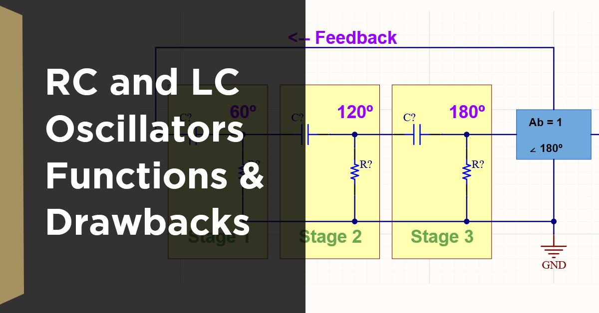

## Table of Contents

## What is an oscillator?

An oscillator is a device or a system that produces a repeating motion or signal. Imagine a swing moving back and forth or the steady ticking of a clock. These are examples of oscillators because they keep repeating the same movement over and over. In electronics, an oscillator can create a regular electrical signal, like the sound from a speaker or the waves that carry radio broadcasts.

Oscillators are important in many areas of technology and science. For example, in a wristwatch, a tiny oscillator keeps time accurately. In music, oscillators help create the sounds of electronic instruments. They are also used in computers and smartphones to help them run smoothly. By understanding and using oscillators, we can make many useful devices that depend on regular, repeating actions.

## What are the basic types of oscillators?

There are several basic types of oscillators, but we can group them into two main categories: mechanical oscillators and electronic oscillators. Mechanical oscillators are devices that produce motion, like a pendulum in a grandfather clock or a spring in a watch. These use physical forces to keep swinging or vibrating back and forth. They're all around us, from the simple swing in a playground to the more complex machinery in cars and airplanes.

Electronic oscillators, on the other hand, create electrical signals instead of physical motion. They are found in many devices, like radios, computers, and cell phones. A common example is a crystal oscillator, which uses a tiny piece of quartz to produce a very steady signal. This signal can help keep time in a watch or [carry](/wiki/carry-trading) information in a radio broadcast. Electronic oscillators are crucial because they can produce signals that are very accurate and reliable, which is important for modern technology.

## How does a simple harmonic oscillator work?

A simple harmonic oscillator is like a toy that moves back and forth in a very predictable way. Imagine a spring with a weight attached to it. If you pull the weight down and let it go, it will start bouncing up and down. The spring pulls the weight back toward its starting point, but then the weight overshoots and goes too far, so the spring pulls it back again. This back-and-forth motion keeps repeating as long as nothing stops it. The key thing about a simple harmonic oscillator is that the force pulling it back is always trying to bring it back to the middle, and the force gets stronger the farther away it is.

This type of motion is called simple harmonic motion because it follows a simple pattern. The movement can be described by a sine wave, which looks like a smooth, repeating curve. The time it takes to complete one full back-and-forth cycle is called the period, and how many cycles it does in a second is called the frequency. Simple harmonic oscillators are used in many places, like in clocks where a pendulum swings back and forth to keep time, or in music where a guitar string vibrates to make sound. Understanding how these oscillators work helps us make and use many different kinds of machines and devices.

## What are the main components of an electronic oscillator?

An electronic oscillator needs a few key parts to work. The first part is an amplifier, which makes a small signal bigger. Think of it like turning up the [volume](/wiki/volume-trading-strategy) on a radio. The second part is a feedback loop, which takes some of the output signal and sends it back to the input. This loop is like a circle that keeps the signal going round and round. The last important part is a frequency-determining component, like a crystal or a capacitor and inductor pair, which decides how fast the signal repeats. This part is like the beat that keeps the music going at the right speed.

These parts work together to make the oscillator do its job. The amplifier makes the signal strong enough to keep going, and the feedback loop keeps the signal alive by sending it back to the start. The frequency-determining component makes sure the signal repeats at a steady pace. Without any of these parts, the oscillator wouldn't be able to create the repeating signal that's so important for things like keeping time in a watch or sending signals in a radio.

## What is the difference between a linear and a nonlinear oscillator?

A linear oscillator is like a simple toy that always behaves the same way. If you push it a little, it moves a little. If you push it a lot, it moves a lot, but always in a predictable way. This kind of oscillator follows a straight-line rule, like a spring bouncing up and down. The motion can be described by a simple equation, and the energy stays the same as it moves back and forth. Linear oscillators are easy to understand and predict because their behavior doesn't change no matter how much you push them.

A nonlinear oscillator, on the other hand, is like a toy that can surprise you. If you push it a little, it might not move much, but if you push it a lot, it might start behaving in a totally different way. The motion doesn't follow a straight-line rule; it can be more like a twisty path. Nonlinear oscillators can do things like suddenly jump to a different way of moving or even seem to move in a chaotic way that's hard to predict. This makes them more interesting but also harder to understand and control. They are found in many natural systems, like the beating of a heart or the swinging of a pendulum in a grandfather clock when the swing gets really big.

## How do you calculate the frequency of an oscillator?

To calculate the frequency of an oscillator, you need to know how long it takes for the oscillator to go through one complete cycle. This time is called the period. Once you know the period, you can find the frequency by dividing 1 by the period. Frequency is usually measured in hertz (Hz), which means cycles per second. So if the period is 2 seconds, the frequency would be 1 divided by 2, which is 0.5 Hz.

For a simple harmonic oscillator, like a mass on a spring, you can find the period using the mass of the object and the stiffness of the spring. The formula for the period of a mass-spring system is T = 2π√(m/k), where T is the period, m is the mass, and k is the spring constant. Once you have the period, you can calculate the frequency the same way as before. For other types of oscillators, like a pendulum, the formula for the period might be different, but the basic idea of finding the period first and then calculating the frequency stays the same.

## What are some common applications of oscillators?

Oscillators are used in many everyday devices. They help keep time in watches and clocks. In a wristwatch, a tiny oscillator makes sure the seconds tick by accurately. Oscillators are also important in music. They create the sounds in electronic instruments like synthesizers. When you play a note on a keyboard, an oscillator inside the instrument makes the sound you hear.

Oscillators are also key in communication technology. They help send and receive signals in radios, TVs, and cell phones. For example, in a radio, an oscillator creates the waves that carry the music or talk shows to your ears. In computers and smartphones, oscillators help the devices run smoothly by keeping everything in sync. Without oscillators, many of the devices we use every day wouldn't work properly.

## How do relaxation oscillators differ from harmonic oscillators?

Relaxation oscillators and harmonic oscillators are both types of oscillators, but they work in different ways. A harmonic oscillator, like a spring or a pendulum, moves back and forth smoothly in a repeating pattern. It follows a simple rule where the force pulling it back is always trying to bring it to the middle. This kind of motion is called simple harmonic motion, and it's very predictable. You can see harmonic oscillators in things like clocks or musical instruments, where they help keep time or make steady sounds.

On the other hand, a relaxation oscillator works by building up energy until it reaches a point where it suddenly releases it. Imagine filling a bucket with water until it overflows. The water level stays low until the bucket is full, and then it suddenly spills out. Relaxation oscillators are used in devices like flashing lights or electronic circuits where they create a pattern of quick bursts. Unlike harmonic oscillators, their motion isn't smooth; it's more like a series of jumps. This makes them useful for different kinds of tasks, like controlling the timing of electronic signals or making rhythmic patterns in music.

## What are the stability issues associated with oscillators?

Oscillators can have problems with stability, which means they might not keep their rhythm steady over time. One issue is that changes in temperature can affect how an oscillator works. For example, a crystal oscillator might start to run a little faster or slower if it gets too hot or too cold. Another problem is that the parts inside the oscillator can wear out or change over time, making the oscillator less reliable. This is why you might need to reset your watch or fix a clock that's running too fast or too slow.

To deal with these stability issues, engineers use different tricks. They might use special materials that don't change much with temperature, or they might add extra circuits to help keep the oscillator on track. For example, in a computer or a smartphone, there are often several oscillators working together, and they can help each other stay stable. By understanding and fixing these stability problems, we can make sure that our devices keep working well and stay on time.

## How can noise affect the performance of an oscillator?

Noise can mess up how an oscillator works. Imagine you're trying to keep a steady beat on a drum, but someone keeps making random sounds around you. It's hard to stay on beat because the noise throws you off. In an oscillator, noise can come from different places like heat or other electronic devices nearby. This noise can make the oscillator's signal less clear and steady, which can cause problems in things like radios or watches that need a very regular signal to work right.

To deal with noise, engineers use special tricks. They might add filters to the oscillator to block out the unwanted noise, kind of like putting on noise-canceling headphones. Or they might use stronger signals that can push through the noise better. By doing these things, they can make sure the oscillator keeps working well even when there's a lot of noise around. This is important because many devices we use every day, like cell phones and computers, need oscillators to work properly.

## What advanced techniques are used to improve oscillator precision?

To make oscillators more precise, engineers use a few smart tricks. One way is to use special materials that don't change much when the temperature goes up or down. For example, in a crystal oscillator, they might use a type of quartz that stays very stable no matter how hot or cold it gets. Another trick is to add extra circuits that help the oscillator stay on track. These circuits can watch the oscillator's signal and make tiny adjustments to keep it running smoothly. This is like having a friend who helps you stay on beat when you're playing music.

Another technique is to use something called phase-locked loops, which help keep the oscillator's signal steady. A phase-locked loop compares the oscillator's signal to a very stable reference signal and makes adjustments to keep them in sync. It's like having a metronome that helps you keep time while playing an instrument. By using these advanced techniques, engineers can make sure that oscillators in devices like watches, computers, and radios work with high precision, even when conditions around them change.

## How do quantum oscillators differ from classical oscillators?

Quantum oscillators are different from classical oscillators because they follow the rules of quantum mechanics instead of regular physics. In a classical oscillator, like a spring bouncing up and down, you can know exactly where it is and how fast it's moving at any time. But in a quantum oscillator, things are a bit weird. You can't know both the position and the speed of the oscillator perfectly at the same time. This is because of something called the Heisenberg uncertainty principle, which says that the more you know about one thing, the less you know about the other.

Another big difference is that quantum oscillators can only have certain energy levels, kind of like steps on a staircase. They can't be at any energy level they want; they have to jump from one step to another. This is different from classical oscillators, which can have any amount of energy. For example, if you push a spring harder, it will move faster and have more energy, but you can push it as hard as you want. Quantum oscillators are used to study tiny things like atoms and particles, and they help us understand how the world works at a very small scale.

## What role do oscillators play in financial markets?

In financial markets, oscillators are pivotal technical indicators utilized to gauge price [momentum](/wiki/momentum) within a defined range. These indicators assist traders in identifying overbought or oversold conditions by examining price patterns and fluctuations. By analyzing these patterns, traders can make more informed decisions and manage risks effectively.

Oscillators are typically constructed to measure the degree of price change in order to predict market momentum. They are especially beneficial in non-trending, or ranging, markets where price movements oscillate between support and resistance levels. The Relative Strength Index (RSI), Stochastic Oscillator, and Bollinger Bands are among the most popular oscillators, each providing unique insights into market conditions.

The Relative Strength Index (RSI) is a momentum oscillator that measures the speed and change of price movements. It ranges from 0 to 100 and is typically used to identify overbought or oversold conditions in a market. An RSI above 70 suggests that a security might be overbought, while a reading below 30 indicates it might be oversold. The RSI is calculated as follows:

$$
RSI = 100 - \left( \frac{100}{1 + RS} \right)
$$

where RS (Relative Strength) is the average of 'x' days' up closes divided by the average of 'x' days' down closes.

The Stochastic Oscillator, developed by George C. Lane, is another momentum indicator that compares a particular closing price of a security to a range of its prices over a certain period of time. The sensitivity of the oscillator to market movements can be reduced by adjusting the time period or by taking a moving average of the result. The formula for the Stochastic Oscillator is as follows:

$$
\%K = \frac{\text{(Current Close - Lowest Low)}}{\text{(Highest High - Lowest Low)}} \times 100
$$

where Lowest Low and Highest High are the lowest and highest prices over a specified period, typically 14 days.

Bollinger Bands, created by John Bollinger, consist of a middle band being an N-period simple moving average (SMA), a second band above (SMA plus two standard deviations), and a third band below the SMA (SMA minus two standard deviations). This setup allows traders to see how prices vary around these bands and can help signal overbought or oversold conditions when prices hit the upper or lower bands, respectively.

Each of these oscillators provides a different perspective on price movement, allowing traders to identify potential buy or sell opportunities and better manage their trading strategies. By accurately interpreting the signals from these tools, traders gain the ability to anticipate potential market reversals or continuations, thus enhancing their trading performance and risk management capabilities.

## What is the role of Williams %R in Algorithmic Trading according to the case study?

Williams %R, developed by Larry Williams, is a momentum indicator that provides insights into the overbought or oversold levels of a market. It calculates the level of the closing price relative to the high-low range over a specified period, typically 14 days. The formula for Williams %R is:

$$

\text{Williams \%R} = \frac{(\text{High}_n - \text{Close})}{(\text{High}_n - \text{Low}_n)} \times -100 
$$

where:
- $\text{High}_n$ represents the highest high over the past n periods,
- $\text{Low}_n$ represents the lowest low over the past n periods,
- $\text{Close}$ is the most recent closing price.

To illustrate the utility of Williams %R within [algorithmic trading](/wiki/algorithmic-trading), consider an automated trading strategy that utilizes this indicator to generate buy and sell signals based on market momentum. Our case study examines its application under different market conditions, assessing both its precision and adaptability.

Imagine a trading algorithm that operates on a stock market index with the following logic: 
- A buy signal is triggered when Williams %R crosses above -80, indicating an oversold condition.
- A sell signal is generated when it falls below -20, suggesting an overbought condition.

In Python, this strategy might be implemented as follows:

```python
def williams_r(data, period=14):
    high_n = data['High'].rolling(window=period).max()
    low_n = data['Low'].rolling(window=period).min()
    close = data['Close']
    r_percent = (high_n - close) / (high_n - low_n) * -100
    return r_percent

def trading_signals(data):
    data['Williams %R'] = williams_r(data)
    buy_signals = []
    sell_signals = []

    for i in range(1, len(data)):
        if data['Williams %R'].iloc[i] > -80 and data['Williams %R'].iloc[i-1] <= -80:
            buy_signals.append(i)
        elif data['Williams %R'].iloc[i] < -20 and data['Williams %R'].iloc[i-1] >= -20:
            sell_signals.append(i)

    return buy_signals, sell_signals
```

The effectiveness of Williams %R in this context often hinges on the market [volatility](/wiki/volatility-trading-strategies) and prevailing trends. For instance, during a trending market, the indicator may generate many false signals, as prices continue in one direction and do not reverse as expected at the overbought or oversold thresholds. However, in range-bound markets, Williams %R can offer more reliable signals, aiding in capturing profits from short-term reversals.

Our case study revealed that when the stock index is in a consolidated phase, Williams %R achieved a hit rate of over 70% in correctly predicting reversals within a short time frame. In contrast, during high volatility or trending periods, the reliability of the indicator decreased significantly.

In summary, Williams %R proves to be a valuable tool in algorithmic trading strategies, particularly for markets exhibiting clear cyclical patterns. Traders and algorithm designers should be mindful of its limitations under certain conditions, potentially incorporating additional indicators or filters to enhance decision-making accuracy.

## References & Further Reading

[1]: Wilder Jr, J. W. (1978). ["New Concepts in Technical Trading Systems."](https://archive.org/details/newconceptsintec00wild) Trend Research

[2]: Lane, G. C. (1984). ["Lane's Stochastics: Stock & Commodities Magazine."](https://www.americancamellias.com/publications-and-library/the-camellia-journal/19801989-camellia-journal-archive-publications/camellia-journal-february-1984)

[3]: Bollinger, J. (2001). ["Bollinger on Bollinger Bands."](https://www.amazon.com/Bollinger-Bands-John/dp/0071373683) McGraw-Hill

[4]: Chan, E. P. (2008). ["Quantitative Trading: How to Build Your Own Algorithmic Trading Business."](https://github.com/egorpe/EPChan-QuantitativeTrading/blob/master/example7_6.m) Wiley

[5]: Murphy, J. J. (1999). ["Technical Analysis of the Financial Markets: A Comprehensive Guide to Trading Methods and Applications."](https://archive.org/details/technicalanalysi0000murp) New York Institute of Finance

[6]: Pardo, R. (2008). ["The Evaluation and Optimization of Trading Strategies."](https://onlinelibrary.wiley.com/doi/book/10.1002/9781119196969) Wiley

[7]: Williams, L. (1993). ["Long-Term Secrets to Short-Term Trading."](https://www.amazon.com/Long-Term-Secrets-Short-Term-Trading-Williams/dp/0470915730) Wiley