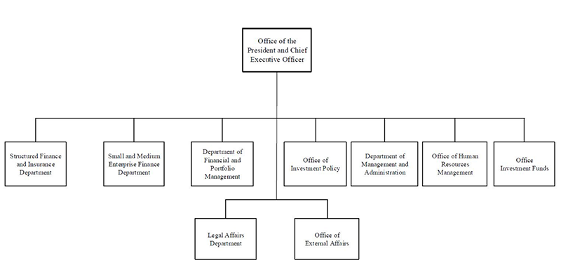

## Table of Contents

## What is the Overseas Private Investment Corporation (OPIC)?

The Overseas Private Investment Corporation (OPIC) was a U.S. government agency that helped American businesses invest in developing countries. It did this by providing loans, guarantees, and insurance to reduce the risks of investing in these places. OPIC's goal was to promote economic development in these countries while also helping American companies grow their businesses abroad.

In 2019, OPIC merged with the Development Credit Authority of the U.S. Agency for International Development to form the U.S. International Development Finance Corporation (DFC). The DFC continues the work of OPIC but with more resources and a broader scope. It aims to support projects that create jobs, improve infrastructure, and promote sustainable development in emerging markets.

## When was OPIC established and why?

OPIC was established in 1971. The main reason for creating OPIC was to help American businesses invest in developing countries. At that time, many businesses were hesitant to invest in these countries because of the high risks involved, like political instability and economic uncertainty. OPIC was set up to reduce these risks by offering loans, guarantees, and insurance to American companies.

The goal of OPIC was not just to help American businesses but also to promote economic growth in developing countries. By supporting investments, OPIC helped create jobs and improve infrastructure in these countries. This was seen as a way to build stronger ties between the U.S. and developing nations, and to promote global economic development.

## What are the main objectives of OPIC?

The main goal of OPIC was to help American businesses invest in developing countries. It did this by offering loans, guarantees, and insurance to reduce the risks of investing in places where the economy might be unstable or the government might change suddenly. This made it easier for American companies to start projects in these countries, which they might have been too scared to do otherwise.

Another big objective of OPIC was to help developing countries grow their economies. By supporting American investments, OPIC helped create jobs and build important things like roads and hospitals in these countries. This not only helped the countries get better but also made them friendlier with the United States. So, OPIC's work was good for both American businesses and the people in developing countries.

## How does OPIC support U.S. businesses?

OPIC supports U.S. businesses by giving them loans, guarantees, and insurance. This helps them feel safer about investing in developing countries. These countries can be risky because of things like political changes or economic problems. But with OPIC's help, American companies can start projects without worrying so much about losing their money.

By doing this, OPIC also helps these countries grow. When American businesses build things like factories or hospitals, they create jobs for local people. This makes the economy of the developing country stronger. It's a win-win situation: U.S. businesses can expand, and developing countries can improve their communities.

## What types of financial products does OPIC offer?

OPIC offers loans to U.S. businesses that want to invest in developing countries. These loans help the businesses start projects without needing to find all the money themselves. OPIC's loans can be used for things like building factories or starting new businesses. By giving out loans, OPIC helps American companies grow and create jobs in other countries.

OPIC also provides guarantees. A guarantee is like a promise that if something goes wrong with the project, OPIC will help cover the costs. This makes businesses feel safer about investing in places where things can be risky. For example, if a government changes and causes problems for the business, OPIC's guarantee can help protect the company's investment.

Another product OPIC offers is insurance. This insurance protects U.S. businesses from losing money because of political risks in developing countries. For instance, if there's a war or if the government takes over the business, the insurance can help the company recover its losses. This way, businesses can invest in new places without being too worried about losing everything.

## Can you explain the process of applying for OPIC support?

To apply for OPIC support, a U.S. business first needs to find a project in a developing country that they want to invest in. They should make sure the project fits with OPIC's goals of helping these countries grow and creating jobs. Once they have a project in mind, the business needs to fill out an application form. This form asks for details about the project, like how much money is needed and what the business plans to do with it. The business also needs to show that they can handle the project well and that it will be good for the local community.

After sending in the application, OPIC will review it to see if it meets their rules. They will check if the project is in a country where they can work and if it will help the local economy. OPIC might ask for more information or even visit the project site to make sure everything is okay. If the project passes all the checks, OPIC will decide what kind of support to give, like a loan, a guarantee, or insurance. Once everything is agreed upon, the business can start their project with OPIC's help.

## What are the eligibility criteria for projects seeking OPIC financing?

To get financing from OPIC, a project needs to be in a developing country where OPIC can work. The project should help the local economy grow and create jobs for people there. It also needs to be run by a U.S. business or have a big part of it owned by a U.S. company. The project should follow all the rules and laws of the country it's in, and it should be good for the environment and the community.

OPIC will check if the project is safe and if it can be done well. They want to make sure the business running the project knows what they're doing and can handle it. The project should not harm people or the environment. If everything looks good, OPIC will decide if they can give a loan, a guarantee, or insurance to help the project get started.

## How does OPIC ensure environmental and social responsibility in its projects?

OPIC makes sure its projects are good for the environment and the community by checking them carefully. They have rules that all projects must follow to protect the environment. For example, they look at how a project might affect the air, water, and land. If a project could harm the environment, OPIC might ask the business to change their plans or add things to make it safer. They also make sure that projects follow local laws about the environment.

OPIC also cares about the people who live near the projects. They check if the project will be good for the community or if it might cause problems. They talk to local people to see what they think and make sure the project will help them. If there are risks to people's health or safety, OPIC works with the business to fix these issues. This way, OPIC helps make sure that projects are not just good for business but also good for the environment and the community.

## What is the impact of OPIC on developing countries?

OPIC helps developing countries by bringing in American businesses to invest in them. When these businesses start projects like building factories or hospitals, they create jobs for local people. This means more people can work and earn money, which helps the whole economy grow. OPIC's support makes it easier for these businesses to take risks in new places, so they are more likely to invest in developing countries.

Besides creating jobs, OPIC's projects also help build important things like roads, schools, and health centers. These projects make life better for people in developing countries. They can get to work more easily, their kids can go to school, and they can get medical help when they need it. By supporting these kinds of projects, OPIC helps developing countries grow and become stronger.

## How has OPIC's role evolved over time?

When OPIC started in 1971, its main job was to help American businesses invest in developing countries. It did this by giving loans, guarantees, and insurance to make it safer for businesses to start projects in places where things could be risky. Over the years, OPIC helped a lot of projects get going, which created jobs and helped build things like roads and hospitals in these countries.

As time went on, OPIC's role grew bigger. It started to focus more on making sure projects were good for the environment and the local people. They made rules to check if projects were safe and helpful for the community. In 2019, OPIC changed a lot when it joined with another group to become the U.S. International Development Finance Corporation (DFC). The DFC has more money and can do more things to help developing countries grow and work better with the United States.

## What are some notable projects that OPIC has supported?

One big project that OPIC helped with is the Azura-Edo power plant in Nigeria. This power plant makes electricity for a lot of people in Nigeria. It helps businesses run and homes have lights. OPIC gave a loan to help build it, and now it's making life better for many people in Nigeria.

Another project OPIC supported is the expansion of the Coca-Cola bottling plant in Egypt. This project helped Coca-Cola make more drinks and sell them in Egypt and other places. It created jobs for local people and helped the economy grow. OPIC's loan made it possible for Coca-Cola to do this big project.

OPIC also helped with a project in India called the ReNew Power solar farm. This project makes clean energy from the sun. It's good for the environment and helps India have more power without using dirty fuels. OPIC's support made it easier for ReNew Power to build this big solar farm.

## How does OPIC coordinate with other U.S. government agencies and international organizations?

OPIC works with other U.S. government agencies to make sure its projects help the country's goals. For example, it talks with the U.S. Department of State to see if projects fit with what the U.S. wants to do in different countries. OPIC also works with the U.S. Agency for International Development (USAID) to make sure projects help people in developing countries. By working together, these agencies can do more to help both American businesses and the countries they work in.

OPIC also teams up with international groups like the World Bank and the United Nations. These groups have big goals to help countries grow and become better places to live. OPIC's projects can fit into these big plans, making them even more helpful. By working with these groups, OPIC can make sure its projects are part of a bigger effort to help the world.

## References & Further Reading

[1]: ["The Role of International Financial Institutions in Global Economic Governance."](https://ijrar.org/download.php?file=IJRAR22D3155.pdf) The Brookings Institution.

[2]: Samiha, M. (2020). ["The U.S. International Development Finance Corporation Act: Supporting American Businesses in Developing Countries."](https://www.sciencedirect.com/science/article/pii/S2772375524003150) Federal Register.

[3]: ["The Practitioner's Guide To Global Investing."](https://www.amazon.com/Global-Investing-Practical-Financial-Opportunities/dp/1119856663) CFA Institute.

[4]: Lopez de Prado, M. (2018). ["Advances in Financial Machine Learning"](https://www.amazon.com/Advances-Financial-Machine-Learning-Marcos/dp/1119482089). Wiley.

[5]: Chan, E. P. (2013). ["Algorithmic Trading: Winning Strategies and Their Rationale"](https://github.com/ftvision/quant_trading_echan_book). Wiley.

[6]: ["DFC and Development Finance Institutions: Enhancing Development Impact."](https://www.dfc.gov/media/press-releases/eight-international-organizations-and-development-finance-institutions-join) Center for Strategic and International Studies.