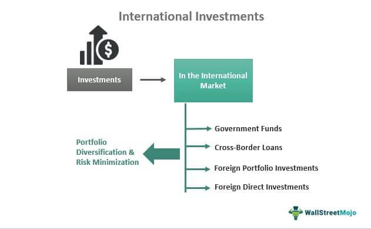

In an ever-globalizing economy, the importance of private investment in overseas markets is paramount. These investments drive economic growth, mitigate risks through diversification, and foster international development. A significant player in facilitating such investments is the U.S. Overseas Private Investment Corporation (OPIC), which has evolved into the U.S. International Development Finance Corporation (DFC). This transformation signifies a strategic enhancement in the United States' approach to international development finance, aimed at expanding American business footprints in emerging markets and mitigating investment risks.

OPIC, through its programs, has historically supported American enterprises by offering financial products tailored to the complex nature of investing in developing regions. These include political risk insurance and financing solutions that safeguard against potential adversities such as expropriation or currency instability. The establishment of DFC has further broadened these offerings by incorporating more sophisticated financial products and capabilities, enabling a greater reach and impact of U.S. investments on a global scale.



Alongside institutional support mechanisms, technological advancements such as algorithmic trading have transformed how investors approach overseas investments. Algorithmic trading allows for the automation of trading strategies, increasing efficiency, precision, and the ability to manage risks associated with international portfolios. By leveraging sophisticated algorithms, investors can execute trades based on pre-defined strategies with minimal human intervention, thereby optimizing investment outcomes in high-growth markets.

This article investigates the intersection of OPIC/DFC's financial facilitation and the technological prowess of algorithmic trading, illustrating how these elements work collectively to influence and enhance private investment in global markets. Together, they empower investors to navigate complex international environments, balancing policy objectives with economic returns and fostering sustainable economic development worldwide.

## Table of Contents

## Understanding OPIC and Its Evolution to DFC

The Overseas Private Investment Corporation (OPIC) was established in 1971 as an agency of the U.S. government with the primary goal of promoting American business investment in emerging markets. This was designed to support U.S. foreign policy by stimulating economic development in less stable and underdeveloped regions, thereby contributing to global political stability and economic growth.

OPIC's mandate was to help American businesses invest in these markets by providing services that mitigated various investment risks. This included offering insurance against political risks such as expropriation, political violence, and currency inconvertibility. Furthermore, OPIC provided financing through direct loans and loan guarantees, facilitating capital flows to projects that might not otherwise obtain necessary funding due to perceived uncertainties.

In 2019, a significant evolution occurred when OPIC merged with the U.S. Agency for International Development's Development Credit Authority (DCA), resulting in the formation of the U.S. International Development Finance Corporation (DFC). This merger was a strategic move to leverage the capabilities of both entities. The DCA had expertise in using guarantees to encourage private sector investment, which complemented OPIC's risk management and investment facilitation functions.

The creation of the DFC aimed to expand and modernize the financial products available to U.S. investors operating overseas, enabling them to more effectively address the complexities of global markets. This was done by extending the scope of services beyond those previously offered by OPIC and DCA, incorporating innovative financial instruments designed to enhance competitiveness and foster economic growth in the target regions.

By broadening the reach of U.S. investments, the DFC sought to strengthen the ability of American businesses to engage in strategic international projects, thus supporting broader development objectives while advancing U.S. interests globally. This transformation underscores an ongoing commitment to adapting and enhancing the mechanisms of support for U.S. investments in developing and emerging markets.

## Role of DFC in Promoting U.S. Overseas Investments

The U.S. International Development Finance Corporation (DFC) is a vital instrument for promoting American private sector investment in developing countries. By offering a suite of financial products, the DFC facilitates U.S. business expansion into international markets which are characterized by high growth potential but also significant risks. Among the most critical tools provided by the DFC are political risk insurance, loan guarantees, and direct loans. These financial instruments serve to empower American enterprises to manage and mitigate the inherent risks of international investments, thereby supporting the broader objectives of U.S. foreign policy and national security.

Political risk insurance offered by the DFC protects investors against losses resulting from political events such as expropriation, political violence, or currency inconvertibility. This type of insurance fundamentally boosts investor confidence as it offers a safety net against non-commercial risks that can deter investment in volatile regions. For instance, if an American company invests in infrastructure development in a politically unstable country, political risk insurance will safeguard its assets and operations from potential government seizure or unrest. 

Loan guarantees are another critical financial tool provided by the DFC. These guarantees reduce the default risk for lenders by ensuring repayment in case of borrower default. This facilitates access to capital for American businesses by lowering the cost of borrowing and enabling banks and other lenders to extend credit more readily to projects that would otherwise be deemed too risky. Direct loans, on the other hand, allow the DFC to lend directly to projects that align with its developmental goals, thereby enabling the execution of large-scale projects in developing markets.

The overarching strategy of the DFC aligns with U.S. foreign policy and national security interests by fostering economic development abroad. By equipping American businesses with the necessary financial tools to operate in high-growth international markets, the DFC plays a pivotal role in enhancing the economic infrastructure of emerging economies. This, in turn, promotes stability and prosperity in these regions, which is essential for global economic integration and geopolitical stability.

Furthermore, the activities of the DFC help to create jobs both abroad and in the United States, stimulate economic activity, and build sustainable infrastructure in developing countries. By doing so, the DFC not only supports U.S. economic interests but also contributes to the broader mission of international development and cooperation. In summary, the DFC is instrumental in facilitating overseas expansion of American businesses while advancing the dual imperatives of economic development and national security.

## Algorithmic Trading in International Investment

Algorithmic trading has transformed the landscape of international investment by enabling investors to execute complex strategies more efficiently with limited human oversight. This method employs algorithms, which are sets of rules or calculations, to determine the optimal times for buying or selling financial instruments. These algorithms can analyze vast amounts of data across multiple global markets in real-time, allowing investors to react quickly to shifts in market conditions.

In the context of overseas markets, [algorithmic trading](/wiki/algorithmic-trading) enhances the execution of investment strategies by increasing precision and reducing latency—the time it takes to execute a trade after a decision has been made. This is crucial in international markets, where time zone differences and market [liquidity](/wiki/liquidity-risk-premium) can impact the timing and performance of trades. Algorithms can be programmed to consider these variables, ensuring trades are conducted at the most advantageous moments.

Additionally, algorithmic trading facilitates portfolio diversification in international markets. Diversification is a risk management strategy that mixes a wide variety of investments within a portfolio to reduce exposure to individual asset [volatility](/wiki/volatility-trading-strategies). Algorithms can simultaneously process and analyze multiple data streams from diverse geographic regions, allowing for real-time risk assessment and rebalancing of investment portfolios. Advanced algorithms can model financial markets, assess correlated risks, and execute trades that efficiently distribute capital to maintain optimal diversification.

For example, an algorithm can be designed to monitor currency exchange rates, stock indices, commodity prices, and political developments across several countries. If an unexpected event occurs that might influence the market, the algorithm can quickly adjust the investor’s portfolio by reallocating assets to stabilize returns or capitalize on potential gains.

The automation and efficiency provided by algorithmic trading result in enhanced risk management capabilities. Investors can set pre-defined risk thresholds, and algorithms can ensure these limits are not breached by continuously assessing market data and executing trades accordingly. This proactive approach to risk can shield investors from sudden market downturns or geopolitical upheavals that might affect international markets.

Moreover, algorithmic trading strategies can incorporate [machine learning](/wiki/machine-learning) to improve their predictive accuracy over time. Machine learning models can adapt based on historical market data and ongoing trends, refining their strategies to better forecast market movements, thus providing an additional layer of sophistication in managing international investments.

In summary, algorithmic trading supports international investment by offering a high degree of precision, efficiency, and adaptability, allowing investors to navigate the complexities of global financial markets with enhanced confidence and control.

## The Intersection of OPIC/DFC and Algorithmic Trading

OPIC's historical role in managing investment risks in volatile markets finds resonance in the approach of algorithmic trading. Both function as strategic mechanisms to mitigate risk and optimize opportunities for American investors engaged in international markets. OPIC, now evolved into the DFC, has traditionally provided various risk mitigation tools such as political risk insurance, loan guarantees, and direct loans to empower U.S. businesses to undertake profitable ventures in developing economies. These services help stabilize the uncertainties inherent in overseas investments, particularly in regions prone to political or economic instability.

Similarly, algorithmic trading offers a technological solution to managing risks and seizing opportunities in fast-moving financial markets. By leveraging algorithms and automated systems, traders can react swiftly to market developments, thereby reducing human error and enhancing the precision of trades. Algorithms can be tailored to monitor real-time data and execute trades based on a predefined set of conditions, leading to more efficient and accurate outcomes.

The integration of OPIC/DFC's risk management services with algorithmic trading creates a complementary dynamic for investors. While OPIC/DFC provides financial instruments that protect against macro-level risks such as political upheaval or currency devaluation, algorithmic trading focuses on micro-level market dynamics, ensuring optimal execution of investment strategies. This dual approach allows investors to maximize returns by managing both country-specific risks and market volatility.

For instance, an investor engaging in overseas markets might leverage DFC's loan guarantees to secure financing while employing algorithmic trading strategies to optimize investment portfolios. This combined strategy can result in a balanced approach that not only safeguards capital through governmental financial products but also takes advantage of technological efficiencies offered by automated trading systems.

In summary, the intersection of OPIC/DFC and algorithmic trading presents a robust framework for international investors to manage risks and enhance returns. By blending governmental and technological resources, this collaboration provides a comprehensive toolkit, enabling investors to navigate the complexities of global markets effectively.

## Challenges and Opportunities

Overseas investments offer substantial rewards but are not without significant challenges. These challenges can primarily be categorized into regulatory, political, and economic risks. Regulatory risk emerges from the variability in laws and regulations across different countries, which can impact investment outcomes. For instance, sudden changes in foreign investment policies, tax regulations, or data protection laws can impose additional constraints or costs on investors.

Political risk involves changes in government policies, political instability, or conflicts that can adversely affect investment value. Events such as nationalization, expropriation, or embargoes often fall under this category, and measures like political risk insurance offered by the Development Finance Corporation (DFC) are vital tools in mitigating these risks. These tools provide a safety net against unforeseeable political events that could jeopardize investment returns.

Economic risks include currency fluctuations, inflation, and economic downturns that can erode investment gains. Investors must also consider the possibility of default by foreign partners or market volatility impacting asset prices. These risks necessitate comprehensive risk management strategies that investors must implement to protect their investments.

Algorithmic trading presents both challenges and opportunities in this context. Balancing algorithmic trading with the aforementioned considerations requires meticulous planning and robust risk management strategies. The complexity arises from ensuring these automated systems can adapt to the regulatory and economic idiosyncrasies of foreign markets. This involves programming algorithms to account for international market hours, currency conversions, and local trading regulations.

A robust risk management strategy may also employ predictive analytics to anticipate market shifts or use hedging techniques to offset potential losses caused by volatile exchange rates. For instance, using Python, investors can model exchange rate volatilities or implement algorithmic trading strategies designed to minimize downside risks. Here’s a basic Python code example outlining a simple currency hedging strategy:

```python
import pandas as pd
import numpy as np

# Simulated currency and portfolio values
np.random.seed(42)
currency_changes = np.random.normal(0, 0.1, 100)  # simulated currency fluctuations
portfolio_values = np.random.normal(100, 5, 100)  # simulated portfolio returns

# Hedging Strategy: Calculate returns with and without hedging
unhedged_returns = portfolio_values * (1 + currency_changes)
hedge_ratio = 0.5  # 50% hedge against currency risk
hedged_currency_changes = currency_changes * (1 - hedge_ratio)
hedged_returns = portfolio_values * (1 + hedged_currency_changes)

results = pd.DataFrame({
    'Unhedged Returns': unhedged_returns,
    'Hedged Returns': hedged_returns
})

results.describe()
```

DFC and algorithmic trading offer vast opportunities for investors ready to navigate these challenges. By leveraging DFC's financial resources and risk mitigation products alongside the precision and speed of algorithmic trading, investors can strategically position themselves in international markets. These tools together facilitate enhanced market opportunities and the potential for optimized returns, particularly in high-growth regions where political and economic risks are prominent. In essence, while the challenges are significant, the synergy between traditional financial support mechanisms and advanced technological tools paves the way for sustainable and profitable overseas investment ventures.

## Conclusion

The landscape of private investment overseas is undergoing significant transformation, driven by continuous advancements in technology and shifts in regulatory frameworks. Entities such as the Overseas Private Investment Corporation (OPIC) and its successor, the U.S. International Development Finance Corporation (DFC), alongside tools like algorithmic trading, offer multifaceted avenues for investors to effectively engage with international markets. By leveraging these entities and tools, investors have the capacity to strategically navigate complexities, mitigate risks, and capitalize on new opportunities in foreign markets.

OPIC and DFC have historically played pivotal roles in providing risk mitigation and financial support to U.S. businesses venturing into emerging and developing economies. Their capabilities in offering political risk insurance, loan guarantees, and direct loans are essential in facilitating entry into markets that are otherwise perceived as high-risk. These mechanisms are instrumental not only in managing financial risks but also in aligning U.S. investments with broader foreign policy and national security interests.

In parallel, algorithmic trading has introduced a technological dimension that enhances precision and efficiency in international investment strategies. By automating trading processes and strategies, algorithmic systems allow investors to respond swiftly to market changes, optimize portfolio diversification, and manage risks with greater efficacy. The algorithmic approach ensures that investment decisions are data-driven and minimally affected by human error.

The synergy between governmental financial instruments provided by DFC and the cutting-edge technological advancements in algorithmic trading propels the growth of U.S. investments on a global scale. This dual approach combines the robustness of institutional backing with the agility and precision of modern technology, providing a comprehensive framework to address the challenges of international investment. As both regulatory environments and technological landscapes continue to evolve, this synergy is expected to further strengthen, enabling U.S. investors to expand their global footprint and drive economic development worldwide.

## References & Further Reading

[1]: ["The Role of International Financial Institutions in Global Economic Governance."](https://ijrar.org/download.php?file=IJRAR22D3155.pdf) The Brookings Institution.

[2]: Samiha, M. (2020). ["The U.S. International Development Finance Corporation Act: Supporting American Businesses in Developing Countries."](https://www.sciencedirect.com/science/article/pii/S2772375524003150) Federal Register.

[3]: ["The Practitioner's Guide To Global Investing."](https://www.amazon.com/Global-Investing-Practical-Financial-Opportunities/dp/1119856663) CFA Institute.

[4]: Lopez de Prado, M. (2018). ["Advances in Financial Machine Learning"](https://www.amazon.com/Advances-Financial-Machine-Learning-Marcos/dp/1119482089). Wiley.

[5]: Chan, E. P. (2013). ["Algorithmic Trading: Winning Strategies and Their Rationale"](https://github.com/ftvision/quant_trading_echan_book). Wiley.

[6]: ["DFC and Development Finance Institutions: Enhancing Development Impact."](https://www.dfc.gov/media/press-releases/eight-international-organizations-and-development-finance-institutions-join) Center for Strategic and International Studies.