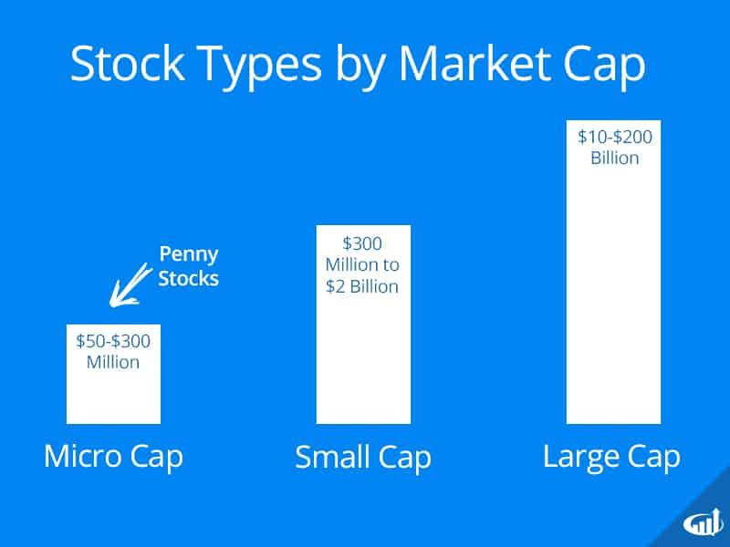

## Table of Contents

## What are penny stocks?

Penny stocks are stocks that trade at a very low price, usually less than a dollar. They are often from small companies that are just starting out or are not doing very well. Because they are cheap, some people think they can make a lot of money by buying them. But penny stocks can be risky because they are not as closely watched by big financial groups, and the companies might not share all their information.

Investing in penny stocks can be exciting because their prices can go up a lot in a short time. But they can also go down just as fast. This makes them very risky. It's important for anyone thinking about buying penny stocks to do a lot of research first. They should also only use money they can afford to lose, because there's a good chance they might not get it back.

## How are penny stocks different from other stocks?

Penny stocks are different from other stocks mainly because of their price and the size of the companies they come from. Penny stocks usually cost less than a dollar, while other stocks can be much more expensive. The companies that issue penny stocks are often small and new, or they might be struggling. This is different from other stocks, which are usually from bigger, more established companies that are watched closely by financial experts.

Another big difference is how risky penny stocks are. Because they are from smaller companies, there's less information available about them. This makes it harder to know if the company is doing well or not. Other stocks, especially from big companies, have a lot of information that investors can look at. This makes them less risky. Penny stocks can go up in value very quickly, but they can also go down just as fast, which makes them a gamble for investors.

## What are the typical price ranges for penny stocks?

Penny stocks are usually very cheap. They often cost less than a dollar per share. Sometimes, they can be a bit more expensive, but they are almost always under $5. This low price is what makes them different from other stocks, which can cost a lot more.

Because penny stocks are so cheap, some people think they can buy a lot of them and make a big profit if the price goes up. But the price can also go down a lot, so they are risky. It's important to know that just because a stock is cheap, it doesn't mean it's a good investment.

## Where can penny stocks be traded?

Penny stocks can be traded on major stock exchanges like the New York Stock Exchange (NYSE) or the NASDAQ, but they are more often found on smaller exchanges like the OTC Bulletin Board (OTCBB) or the Pink Sheets. These smaller exchanges have less strict rules, which makes it easier for small companies to list their stocks there.

Trading penny stocks can be exciting because their prices can change a lot in a short time. But it's important to be careful. Since these stocks are from smaller companies, there might not be as much information available about them. This makes it harder to know if the company is doing well or not, so trading penny stocks can be risky.

## What are the risks associated with investing in penny stocks?

Investing in penny stocks can be very risky. One big risk is that these stocks are from small companies that might not share all their information. This makes it hard to know if the company is doing well or not. Without enough information, it's like guessing if the stock will go up or down. Also, because penny stocks are cheap, their prices can change a lot in a short time. This means you could lose money fast if the stock goes down.

Another risk is that penny stocks are not watched as closely by big financial groups. This can make them easier to be involved in scams or fraud. Some people might try to trick others into buying penny stocks by spreading false information. It's important to be careful and do a lot of research before buying any penny stock. Even then, there's still a good chance you could lose your money, so only invest what you can afford to lose.

## What are the potential rewards of investing in penny stocks?

Investing in penny stocks can be exciting because they have the potential to make you a lot of money quickly. Since penny stocks are very cheap, you can buy a lot of them with a little bit of money. If the price of the stock goes up, even a little bit, you could make a big profit. For example, if you buy a stock for 10 cents and it goes up to 50 cents, you've made a lot of money in a short time. This is why some people like to take the risk and invest in penny stocks.

But it's not just about making quick money. Sometimes, penny stocks are from small companies that could grow a lot in the future. If you find a good company early on, and it becomes successful, the value of your stock could go up a lot over time. This means you could make a big profit if you hold onto the stock for a long time. It's like finding a hidden gem that turns into something valuable.

## How can one identify promising penny stocks?

Finding good penny stocks can be hard, but there are some things you can look at to help you decide. First, you should look at the company's financials. This means checking if they are making money or losing it. You can find this information in their financial reports. If a company is making money and growing, it might be a good sign. Also, look at what the company does. If they are in a business that is growing or has a lot of potential, that could be a good thing. For example, if they are working on new technology or in a popular industry, it might be worth looking into.

Another thing to think about is the people running the company. If the leaders have a good track record and know what they are doing, that's a good sign. You can also look at what other people are saying about the stock. Sometimes, other investors or experts will share their thoughts on a company. But be careful, because not all information you find online is true. It's important to do your own research and not just follow what others say. Remember, even if a penny stock looks promising, it's still risky, so only invest money you can afford to lose.

## What are common strategies for trading penny stocks?

One common strategy for trading penny stocks is called "momentum trading." This means you look for stocks that are going up fast and try to buy them before they go up even more. You hope to sell them quickly for a profit. This can be exciting because the prices can change a lot in a short time, but it's also risky. You need to watch the market closely and be ready to sell if the stock starts to go down.

Another strategy is "long-term investing." This means you find a penny stock from a company you think will do well in the future. You buy the stock and hold onto it for a long time, hoping the company will grow and the stock price will go up a lot. This can be less risky than momentum trading, but it takes patience. You need to do a lot of research to find a good company and be ready to wait for your investment to pay off.

Some people also use a strategy called "dollar-cost averaging." This means you invest a little bit of money in a penny stock at regular times, no matter what the price is. Over time, this can help you buy the stock at a lower average price. This strategy can help reduce the risk of losing money if the stock price goes down, but it still takes time and patience.

## What regulatory considerations should be taken into account with penny stocks?

When you're thinking about buying penny stocks, it's important to know about the rules that govern them. Penny stocks are often traded on smaller exchanges like the OTC Bulletin Board or Pink Sheets, which don't have as strict rules as bigger exchanges like the NYSE or NASDAQ. This means that companies selling penny stocks don't have to share as much information about their business. This can make it harder for you to know if the company is doing well or not. Also, the U.S. Securities and Exchange Commission (SEC) has special rules for penny stocks to protect investors. For example, brokers have to give you a special document called a "Penny Stock Disclosure Document" before they can sell you penny stocks. This document tells you about the risks of buying penny stocks.

Another thing to think about is that penny stocks can be more likely to be involved in scams or fraud. The SEC and other groups watch for this, but it can still happen. They might try to trick you into buying a stock by spreading false information. This is called a "pump and dump" scheme. To stay safe, you should always do your own research and be careful about where you get your information. Remember, just because a stock is cheap, it doesn't mean it's a good investment. Always think about the risks and only invest money you can afford to lose.

## How do market conditions affect penny stocks?

Market conditions can have a big impact on penny stocks. When the overall market is doing well, people might feel more confident and be more willing to take risks. This can make penny stocks go up in price because more people are buying them. But if the market is not doing well, people might get scared and sell their stocks, including penny stocks. This can make the prices of penny stocks go down a lot because they are already risky and people might want to get out of them quickly.

Penny stocks can also be affected by things happening in specific industries. For example, if there's good news about a new technology, penny stocks in that industry might go up because people think those companies will do well. But if there's bad news, like a new law that makes it harder for those companies to make money, the prices of their stocks might go down. Because penny stocks are from small companies, they can be more sensitive to these changes than bigger stocks.

## What are some success stories of penny stock investments?

One famous success story is Monster Beverage Corporation. A long time ago, when it was called Hansen Natural Corporation, its stock was a penny stock. People who bought it back then made a lot of money because the company grew big and its stock price went way up. Monster Beverage became really popular for its energy drinks, and now it's a big company. This shows that if you find a good company early and hold onto its stock for a long time, you could make a big profit.

Another example is Ford Motor Company. During the 2008 financial crisis, Ford's stock price dropped a lot and became a penny stock. Some people saw this as a chance to buy the stock cheap. They believed Ford would get better and its stock price would go up again. They were right. Ford worked hard to fix its problems and its stock price went back up. People who bought Ford's stock when it was a penny stock made money when it went up again. This shows that even big companies can become penny stocks during tough times, and if you believe in the company, you might make money when it gets better.

## What advanced analysis techniques can be used to evaluate penny stocks?

One advanced way to look at penny stocks is by using technical analysis. This means you look at charts and patterns to see how the stock's price has moved in the past. You can use things like moving averages, which help you see if the stock is going up or down over time. Another tool is the Relative Strength Index (RSI), which tells you if a stock is overbought or oversold. This can help you decide when to buy or sell. Technical analysis can be tricky, but it can give you clues about what might happen to the stock's price next.

Another technique is fundamental analysis. This means you look at the company's financials to see if it's doing well. You can check things like the company's earnings, how much debt it has, and if it's growing. You might also look at the industry the company is in and see if it's doing well or not. This can help you figure out if the company has a good chance of making money in the future. Fundamental analysis takes a lot of time and research, but it can help you find penny stocks that might be good investments.

Some people also use a mix of both technical and fundamental analysis. They look at the charts to see if the stock's price is moving in a good way, and they also check the company's financials to make sure it's doing well. This can give you a fuller picture of the stock and help you make better decisions. But remember, even with these advanced techniques, penny stocks are still risky. Always do your homework and only invest money you can afford to lose.

## References & Further Reading

[1]: Bergstra, J., Bardenet, R., Bengio, Y., & Kégl, B. (2011). ["Algorithms for Hyper-Parameter Optimization."](https://dl.acm.org/doi/10.5555/2986459.2986743) Advances in Neural Information Processing Systems 24.

[2]: ["Advances in Financial Machine Learning"](https://www.amazon.com/Advances-Financial-Machine-Learning-Marcos/dp/1119482089) by Marcos Lopez de Prado

[3]: ["Evidence-Based Technical Analysis: Applying the Scientific Method and Statistical Inference to Trading Signals"](https://www.amazon.com/Evidence-Based-Technical-Analysis-Scientific-Statistical/dp/0470008741) by David Aronson

[4]: ["Machine Learning for Algorithmic Trading"](https://github.com/stefan-jansen/machine-learning-for-trading) by Stefan Jansen

[5]: ["Quantitative Trading: How to Build Your Own Algorithmic Trading Business"](https://www.amazon.com/Quantitative-Trading-Build-Algorithmic-Business/dp/1119800064) by Ernest P. Chan