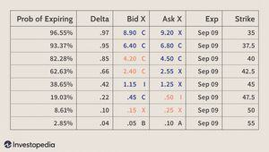

## Table of Contents

## What are options and how do they work in trading?

Options are financial instruments that give you the right, but not the obligation, to buy or sell an asset at a specific price within a certain time period. They are often used in trading stocks, but can also be used for other assets like commodities or currencies. There are two types of options: calls and puts. A call option gives you the right to buy an asset, while a put option gives you the right to sell it. You pay a fee, called a premium, to buy an option.

When you trade options, you're essentially betting on the future price movement of an asset. If you think the price of a stock will go up, you might buy a call option. If the stock price does go up above the specified price (called the strike price) before the option expires, you can buy the stock at the lower strike price and either keep it or sell it for a profit. If you think the price of a stock will go down, you might buy a put option. If the stock price falls below the strike price, you can sell the stock at the higher strike price and make a profit. If the stock price doesn't move in the direction you expected, you could lose the premium you paid for the option.

## What are the basic types of options: calls and puts?

A call option is like a ticket that gives you the right to buy something at a set price before a certain date. Imagine you want to buy a toy that costs $10, but you think the price might go up. You can buy a call option for that toy at $10. If the toy's price goes up to $15 before your option expires, you can use your option to buy the toy for $10 and then either keep it or sell it for a profit. But if the toy's price stays the same or goes down, you don't have to buy it, and you only lose the small fee you paid for the option.

A put option is the opposite. It's like a ticket that gives you the right to sell something at a set price before a certain date. Let's say you have a toy that you bought for $10, but you think its price might go down. You can buy a put option to sell that toy at $10. If the toy's price drops to $5 before your option expires, you can use your option to sell the toy for $10 and make a profit. If the toy's price stays the same or goes up, you don't have to sell it, and you only lose the small fee you paid for the option.

## How can selling options generate income for investors?

Selling options can be a way for investors to make money by collecting the fees, or premiums, that buyers pay for the options. When you sell a call option, you're promising to sell a stock at a set price if the buyer decides to use their option. If the stock's price stays below that set price, the buyer won't use the option, and you get to keep the premium as profit. It's like renting out your stock for a little while and getting paid for it. But if the stock's price goes above the set price, you have to sell the stock at the lower price, which could mean you lose money if you had to buy the stock at a higher price to fulfill the option.

Selling put options works the other way around. When you sell a put option, you're promising to buy a stock at a set price if the buyer decides to use their option. If the stock's price stays above that set price, the buyer won't use the option, and again, you get to keep the premium as profit. It's like getting paid to have the chance to buy a stock at a discount. But if the stock's price falls below the set price, you have to buy the stock at the higher price, which could mean you lose money if the stock keeps falling after you buy it. Both strategies can generate income, but they also come with risks if the stock's price moves against your position.

## What are the risks associated with selling options?

Selling options can be risky because you might have to buy or sell a stock at a price that's not good for you. When you sell a call option, you promise to sell a stock at a set price. If the stock's price goes way up, you still have to sell it at the lower price you promised. This means you could lose a lot of money if you had to buy the stock at the higher price to give it to the buyer. It's like promising to sell your bike for $50, but then someone else offers you $100 for it. You still have to sell it for $50, and you miss out on the extra money.

Selling put options is risky too. When you sell a put option, you promise to buy a stock at a set price. If the stock's price drops a lot, you still have to buy it at the higher price you promised. This means you could lose money if the stock keeps going down after you buy it. It's like promising to buy a toy for $10, but then the toy's price drops to $5. You still have to pay $10 for it, and you lose money because you could have bought it cheaper. Both ways of selling options can make you money, but they can also make you lose money if the stock's price moves the wrong way.

## What is the difference between covered and naked options selling?

When you sell a covered call option, you already own the stock you're promising to sell. It's like promising to sell your bike for $50 when you already have the bike. If someone uses the option and buys your bike, you just give them the bike you already own. This is less risky because you're not promising to sell something you don't have. The worst that can happen is you have to sell your stock at a lower price than it's worth, but you still get to keep the money from selling the option.

Selling a naked call option is riskier. It's like promising to sell a bike for $50 when you don't even have a bike. If someone uses the option, you have to go out and buy a bike to sell it to them. If the price of bikes goes up a lot, you could lose a lot of money because you have to buy the bike at a higher price than you're selling it for. This is why selling naked options can be very risky, and it's not something that everyone should do.

Selling a naked put option is also risky. It's like promising to buy a toy for $10 when you don't have the toy. If the price of the toy goes down a lot, you still have to buy it for $10, which means you could lose money. Selling covered put options is less common, but it would mean you already have the money set aside to buy the stock if you have to.

## How does the options pricing model affect the decision to sell options?

The options pricing model helps figure out how much an option should cost. It looks at things like how long the option lasts, how much the stock's price might move around, and where the stock's price is compared to the option's price. When you're thinking about selling an option, you want to know if the price you're getting for it is fair. If the model says the option should be worth more than what someone is willing to pay, you might not want to sell it because you could be losing out on money. But if the model says the option is worth less than what someone is offering, selling it could be a good deal for you.

The options pricing model also helps you understand the risks of selling options. If the model shows that the stock's price could move a lot, selling an option might be riskier because there's a bigger chance you'll have to buy or sell the stock at a bad price. Knowing this can help you decide if the money you get from selling the option is worth the risk. If the risk seems too high, you might choose not to sell the option, or you might look for ways to make the risk smaller, like selling a covered option instead of a naked one.

## What are the key strategies for selling options, such as covered calls and cash-secured puts?

Selling covered calls is a popular strategy for people who own stocks and want to make some extra money. When you sell a covered call, you promise to sell your stock at a certain price if someone wants to buy it. You get to keep the money from selling the option, which is called the premium. This can be a good way to make money if you think the stock's price won't go up much. But if the stock's price goes way up, you might have to sell it at a lower price than it's worth. It's like renting out your stock for a little while and getting paid for it, but you have to be ready to let it go if the price gets too high.

Selling cash-secured puts is another strategy that can help you make money and maybe buy a stock at a good price. When you sell a cash-secured put, you promise to buy a stock at a certain price if someone wants to sell it to you. You get to keep the money from selling the option, which is the premium. This can be a good way to make money if you think the stock's price won't go down much. But if the stock's price drops a lot, you have to buy it at a higher price than it's worth. It's like getting paid to have the chance to buy a stock at a discount, but you have to be ready to buy it if the price gets too low. Both strategies can help you make money, but they also come with risks if the stock's price moves the wrong way.

## How can an investor manage and adjust positions when selling options?

When you sell options, you need to keep an eye on the stock's price and be ready to make changes if things don't go as planned. If you sold a covered call and the stock's price starts going up a lot, you might want to buy back the option to keep your stock. This means you pay a little money to get out of your promise to sell the stock. If the stock's price goes down, you might decide to do nothing and just keep the money you got from selling the option. It's like deciding whether to keep renting out your stock or take it back if the price changes a lot.

If you sold a cash-secured put and the stock's price starts dropping a lot, you might want to buy back the option to avoid having to buy the stock at a high price. This means you pay a little money to get out of your promise to buy the stock. If the stock's price goes up, you might decide to do nothing and just keep the money you got from selling the option. It's like deciding whether to keep the chance to buy the stock at a discount or let go of that chance if the price changes a lot. Both ways, you need to be ready to make changes to your plan based on what the stock's price is doing.

## What are the tax implications of selling options?

When you sell options, you need to think about taxes. If you make money from selling options, you have to pay taxes on that money. The tax you pay depends on how long you held the option before selling it. If you held it for less than a year, the money you make is called short-term capital gains, and you pay regular income tax on it. If you held it for more than a year, the money you make is called long-term capital gains, and you might pay a lower tax rate on it. It's like getting money from a job or selling something you owned for a long time.

If you lose money from selling options, you can use those losses to lower your taxes. You can take the losses off your income, which means you pay less tax. But there are rules about how much you can take off and how you report it. It's important to keep good records of all your option trades so you can figure out your taxes correctly. It's like keeping track of how much you spent on something so you can get money back if you need to.

## How does market volatility impact the strategy of selling options?

Market [volatility](/wiki/volatility-trading-strategies), which means how much stock prices go up and down, can really change how you sell options. When the market is very volatile, the prices of options go up because there's a bigger chance the stock's price will move a lot. This can be good for you if you're selling options because you can get more money for them. But it's also riskier because if the stock's price moves the wrong way, you could lose more money. It's like getting paid more to rent out your bike, but also having a bigger chance that someone might take it and not bring it back.

When the market is calm and not moving around much, the prices of options go down because there's less chance the stock's price will change a lot. This means you get less money for selling options, but it's also less risky because the stock's price is less likely to move against you. It's like getting paid less to rent out your bike, but also having a smaller chance that someone might take it and not bring it back. So, when you're thinking about selling options, you need to look at how much the market is moving and decide if the money you can make is worth the risk.

## What advanced techniques can be used to optimize returns from selling options?

One advanced technique for optimizing returns from selling options is called the "iron condor." This strategy involves selling both a call spread and a put spread on the same stock at the same time. It's like betting that the stock's price will stay in a certain range. You make money if the stock's price doesn't move too much in either direction. But if the stock's price moves a lot, you could lose money. This strategy can help you make more money than just selling one option, but it's also more complicated and riskier.

Another technique is called "delta hedging." This means you buy or sell the stock to balance out the risk of the options you sold. If you sold a call option, you might buy some of the stock to protect yourself if the stock's price goes up. If you sold a put option, you might sell some of the stock to protect yourself if the stock's price goes down. It's like putting on a seatbelt to make your ride safer. Delta hedging can help you make more money by reducing the risk of big losses, but it also means you have to keep an eye on the stock's price and make changes to your plan as it moves.

## How can one use options selling as part of a broader investment portfolio strategy?

Selling options can be a smart way to add extra income to your investment portfolio. When you sell options, you get money from the premiums, which can help boost your overall returns. For example, if you own stocks, you can sell covered calls on them to earn more money while you wait for the stock's price to go up. This can be a good way to make your portfolio more profitable, especially if the market isn't moving much. But you have to be careful because selling options also adds risk to your portfolio. If the stock's price moves a lot, you might have to buy or sell the stock at a bad price, which could hurt your returns.

You can also use options selling to balance out other parts of your portfolio. For instance, if you have a lot of stocks and you're worried about the market going down, you can sell put options to make money if the market stays steady or goes up a little. This can help protect your portfolio from big losses. Another way to use options selling is to create income while you wait for other investments to grow. If you have money sitting in cash, you can sell cash-secured puts to earn some money on that cash. This can make your portfolio more efficient and help you reach your investment goals faster. Just remember, options selling can be tricky, so it's important to understand the risks and have a plan for managing them.

## References & Further Reading

[1]: Hull, J. C. (2018). ["Options, Futures, and Other Derivatives."](https://www.semanticscholar.org/paper/Options%2C-Futures%2C-and-Other-Derivatives-Hull/89bdee500c8623864fc9eb7a471546aa713acc44) Pearson.

[2]: Kissell, R. (2013). ["The Science of Algorithmic Trading and Portfolio Management."](https://www.sciencedirect.com/book/9780124016897/the-science-of-algorithmic-trading-and-portfolio-management) Academic Press.

[3]: Chakravorty, S., & Azzopardi, D. (2016). ["A Beginner's Guide to Python for Financial Analysis."](https://pubmed.ncbi.nlm.nih.gov/27886869/) 

[4]: Black, F., & Scholes, M. (1973). ["The Pricing of Options and Corporate Liabilities."](https://www.cs.princeton.edu/courses/archive/fall09/cos323/papers/black_scholes73.pdf) Journal of Political Economy, 81(3), 637-654.

[5]: Avellaneda, M., & Stoikov, S. (2008). ["High-frequency trading in a limit order book."](https://math.nyu.edu/~avellane/HighFrequencyTrading.pdf) Quantitative Finance, 8(3), 217-224.