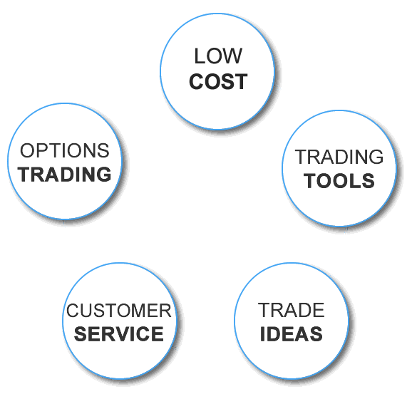

## Table of Contents

## What is SogoTrade?

SogoTrade is a company that helps people buy and sell stocks and other investments online. It's like a store where you can trade things like stocks, options, and ETFs. They have a website and an app that you can use to make trades from your computer or phone. SogoTrade charges lower fees than many other companies, which can save you money when you're trading.

The company was started in 2010 and is based in the United States. They want to make trading easy and affordable for everyone, not just people with a lot of money. SogoTrade offers tools and information to help you make smart choices about your investments. They also have customer service to help you if you have questions or problems.

## How does SogoTrade compare to other online brokerages?

SogoTrade stands out because it offers low fees for trading stocks and options. Many other online brokerages charge more money for each trade you make. This can be a big deal if you trade a lot, because you can save money with SogoTrade. They also have a simple website and app that are easy to use, even if you're new to trading. But, SogoTrade might not have as many tools and research options as some bigger brokerages like E*TRADE or Fidelity.

Compared to other low-cost brokerages like Robinhood, SogoTrade offers more types of investments. While Robinhood is known for free trades, SogoTrade lets you trade stocks, options, and ETFs, and they also offer some mutual funds. This can be good if you want more choices for your money. However, Robinhood might be easier to use for beginners because it has a very simple design and no trading fees at all.

In terms of customer service, SogoTrade provides support through phone and email, which is similar to many other brokerages. Some bigger brokerages might offer more ways to get help, like live chat or in-person support at branches. SogoTrade's customer service is good, but it might not be as fast or available as some of the bigger names in the industry. Overall, SogoTrade is a good choice if you want low fees and a variety of investment options, but you might need to look elsewhere if you want more advanced tools or a simpler, free trading experience.

## What types of accounts can be opened with SogoTrade?

SogoTrade offers different types of accounts to meet different needs. You can open an individual account if you want to trade on your own. This is good for people who want to manage their own money. They also have joint accounts, which are great if you want to share an account with someone else, like a spouse or family member. For people saving for retirement, SogoTrade offers traditional and Roth IRA accounts. These help you save money for when you're older and not working anymore.

If you're a business owner, SogoTrade has accounts for businesses too. You can open a corporate account to manage your company's investments. They also offer accounts for trusts, which are good if you're managing money for someone else, like a family member or a charity. No matter what kind of account you choose, SogoTrade makes it easy to start trading and managing your money.

## What are the fees associated with using SogoTrade?

SogoTrade charges low fees for trading. For stocks and ETFs, they charge $4.95 per trade. This is less than many other brokerages, which can help you save money if you trade a lot. For options, SogoTrade charges $4.95 per trade plus $0.65 per contract. This means you pay a base fee and then a little more for each option you buy or sell. They don't charge any fees for account maintenance or inactivity, so you don't have to worry about extra costs if you're not trading all the time.

There are some other fees you should know about. If you want to move your money out of SogoTrade to another brokerage, there's a transfer fee of $75. Also, if you need a paper statement mailed to you, it costs $5. But if you're okay with getting statements online, you won't have to pay that fee. Overall, SogoTrade keeps their fees simple and low, which can be a big help for people trying to save money while trading.

## How can one open an account with SogoTrade?

Opening an account with SogoTrade is easy and you can do it online. First, go to their website and click on the button that says "Open an Account." You'll need to fill out a form with your personal information like your name, address, and Social Security number. Make sure you have this information ready before you start. After you fill out the form, you'll need to agree to their terms and conditions. This is important because it tells you the rules you need to follow when using their service.

Once you've filled out the form and agreed to the terms, you'll need to fund your account. You can do this by linking your bank account and transferring money into your SogoTrade account. It might take a few days for the money to show up, so be patient. After your account is funded, you're ready to start trading! If you have any questions or need help, SogoTrade has customer service that you can call or email.

## What trading platforms does SogoTrade offer?

SogoTrade offers a web-based trading platform that you can use on your computer. It's easy to use and has all the tools you need to buy and sell stocks, options, and ETFs. You can see your account balance, check your trades, and get real-time quotes for different investments. The website is simple and clear, so even if you're new to trading, you can figure it out quickly.

They also have a mobile app that you can download on your phone or tablet. This app lets you trade on the go, so you can buy and sell investments no matter where you are. The app has a lot of the same features as the website, like real-time quotes and account information. It's great for people who want to keep an eye on their investments all the time and make quick trades when they need to.

## What are the minimum deposit requirements for SogoTrade accounts?

SogoTrade makes it easy for people to start trading by having a low minimum deposit requirement. For most accounts, like individual and joint accounts, you only need to put in $1 to open them. This is good news if you don't have a lot of money to start with but still want to trade.

For retirement accounts like traditional and Roth IRAs, the minimum deposit is a bit higher. You need to put in at least $500 to open one of these accounts. This is still not too much money and can help you save for the future.

## What investment products can be traded through SogoTrade?

SogoTrade lets you trade different kinds of investments. You can buy and sell stocks, which are pieces of a company. They also let you trade ETFs, which are like baskets of different stocks that you can buy and sell as one thing. Options are another thing you can trade with SogoTrade. Options give you the right to buy or sell a stock at a certain price, but you don't have to do it if you don't want to.

Besides stocks, ETFs, and options, SogoTrade also offers some mutual funds. Mutual funds are another way to invest in a bunch of different things at once, like stocks and bonds. This can be good if you want to spread your money around and not put it all in one place. So, with SogoTrade, you have a few different choices for what you can invest in, depending on what you're looking for.

## How does SogoTrade support customer service and education?

SogoTrade helps its customers by offering good customer service. You can call them on the phone or send them an email if you have questions or need help with your account. They are friendly and try to answer your questions quickly. This is important because it makes trading easier and less confusing, especially if you are new to it. 

SogoTrade also provides educational resources to help you learn about trading. They have articles and guides on their website that explain how to buy and sell stocks, options, and ETFs. These resources are useful if you want to understand more about investing and how to make smart choices with your money. By offering both customer service and educational tools, SogoTrade makes sure you have the support you need to trade successfully.

## What are the security measures implemented by SogoTrade to protect user data and funds?

SogoTrade takes security very seriously to keep your data and money safe. They use strong encryption to protect your personal information when you use their website or app. This means your data is turned into a secret code that only SogoTrade can read. They also have a system called two-[factor](/wiki/factor-investing) authentication. This means you need to enter a special code sent to your phone or email, in addition to your password, to log in. This makes it much harder for someone else to get into your account.

Besides these measures, SogoTrade keeps your money safe by using something called SIPC insurance. This insurance protects your investments up to $500,000 if the brokerage firm ever has big problems. They also watch for strange activity on your account, like if someone tries to log in from a new place or make big trades without your permission. If they see something odd, they will let you know right away. All these steps help make sure your money and information are secure when you use SogoTrade.

## How does SogoTrade handle account funding and withdrawals?

SogoTrade makes it easy to put money into your account. You can do this by linking your bank account to your SogoTrade account. Once they are linked, you can transfer money from your bank to SogoTrade. It might take a few days for the money to show up in your account, so be patient. You can also send a check if you prefer, but using your bank is usually faster and easier.

Taking money out of your SogoTrade account is also simple. You can move money back to your bank account by making a withdrawal request. Just like when you put money in, it might take a few days for the money to get to your bank. SogoTrade doesn't charge you any fees for moving money in or out of your account, which is good because it means you can keep more of your money.

## What advanced trading features does SogoTrade provide for experienced traders?

SogoTrade offers some advanced trading features that can be helpful for experienced traders. One of these features is the ability to place different types of orders. You can use limit orders, which let you set a specific price at which you want to buy or sell a stock. There are also stop orders, which can help you limit your losses if a stock's price starts to drop too much. These order types give you more control over your trades and can be important tools for managing your investments.

Another useful feature for experienced traders is the real-time market data that SogoTrade provides. This means you can see the current prices of stocks and other investments as they change throughout the day. This can help you make quick decisions and take advantage of market movements. SogoTrade also offers charting tools that let you look at the history of a stock's price and see patterns that might help you predict where the price is going next. These features can make a big difference for traders who know what they're doing and want to use advanced strategies.

## References & Further Reading

[1]: Bergstra, J., Bardenet, R., Bengio, Y., & Kégl, B. (2011). ["Algorithms for Hyper-Parameter Optimization."](https://papers.nips.cc/paper/4443-algorithms-for-hyper-parameter-optimization) Advances in Neural Information Processing Systems 24.

[2]: ["Advances in Financial Machine Learning"](https://www.amazon.com/Advances-Financial-Machine-Learning-Marcos/dp/1119482089) by Marcos Lopez de Prado

[3]: ["Evidence-Based Technical Analysis: Applying the Scientific Method and Statistical Inference to Trading Signals"](https://www.amazon.com/Evidence-Based-Technical-Analysis-Scientific-Statistical/dp/0470008741) by David Aronson

[4]: ["Machine Learning for Algorithmic Trading"](https://github.com/PacktPublishing/Machine-Learning-for-Algorithmic-Trading-Second-Edition) by Stefan Jansen

[5]: ["Quantitative Trading: How to Build Your Own Algorithmic Trading Business"](https://www.amazon.com/Quantitative-Trading-Build-Algorithmic-Business/dp/1119800064) by Ernest P. Chan