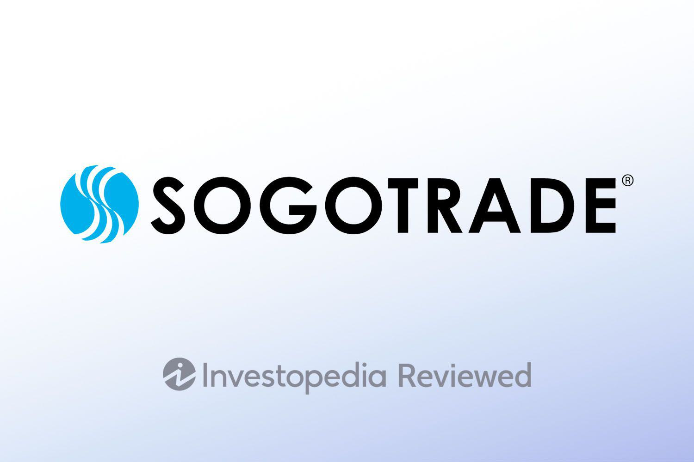

The online brokerage landscape has undergone significant transformations in recent years, driven largely by advancements in technology and the increasing demand for user-friendly and accessible trading platforms. As financial markets continue to globalize and evolve, the role of online brokerages has become pivotal in providing individual investors with direct access to stocks, options, and other financial instruments. These platforms have democratized trading by lowering barriers to entry and offering sophisticated tools that were once available only to institutional investors. Within this dynamic environment, trading platforms such as SogoTrade have emerged as key players, offering a wide array of services designed to cater to both novice and experienced investors.

SogoTrade distinguishes itself as a significant entity in the trading market by providing a comprehensive suite of services that appeal to a diverse client base. The platform is designed to offer competitive pricing, robust customer support, and a variety of account types, making it an attractive option for traders seeking cost-effective and versatile trading solutions. Furthermore, SogoTrade has carved out a niche for itself by catering to the growing interest in algorithmic trading—often referred to as algo trading—which has become an integral part of modern trading practices.

Algorithmic trading involves the use of algorithms to automate trading strategies, enabling traders to execute large orders at optimal prices without human intervention. The significance of algo trading in contemporary financial markets cannot be overstated, as it allows for rapid decision-making and efficient market strategies that capitalize on momentary price differentials. SogoTrade recognizes the importance of these features and has integrated tools and functionalities specifically designed to support traders interested in implementing algorithmic strategies.

The purpose of this article is to provide an in-depth review of SogoTrade, with a particular emphasis on its features related to algorithmic trading. We will explore the platform's historical context, product offerings, tools for algo traders, as well as its advantages and potential limitations. By evaluating SogoTrade's offerings in the context of the competitive brokerage industry, we aim to provide readers with a comprehensive understanding of this platform's capabilities and how it stands out among its peers.

The structure of the article is as follows: We start with a background on SogoTrade, highlighting its history, milestones, and market position. This is followed by an examination of its core features, including account types, trading platforms, commission structures, and support resources. We then delve into the specifics of algorithmic trading on SogoTrade, discussing the tools available and the user experience. Finally, we assess the pros and cons of using SogoTrade, backed by user reviews and comparisons with other platforms, before concluding with final thoughts and recommendations for potential users.

## Table of Contents

## Background on SogoTrade

SogoTrade is a prominent name in the landscape of online brokerage, having established itself as a significant player since its inception. The company was founded in 1986 and has since grown to become a well-regarded broker, offering a plethora of trading services and products to its clientele. Throughout its history, SogoTrade has achieved several key milestones, such as the launch of innovative trading platforms and the expansion of its service offerings to accommodate a diverse range of trading needs.

SogoTrade is strategically positioned to cater to a broad target audience, including individual investors, professional traders, and institutional clients. The brokerage aims to provide these groups with a robust platform for trading various financial instruments, including stocks, options, and ETFs, thereby solidifying its presence in the competitive brokerage market.

A significant unique selling point of SogoTrade is its competitive commission structure, which appeals particularly to cost-conscious traders. This pricing model positions SogoTrade favorably against competitors who may have higher fee structures. Additionally, SogoTrade's comprehensive suite of trading tools and platforms offers flexibility and functionality that rival those of some of the industry's leading brokerage firms.

Moreover, SogoTrade has formed strategic partnerships and affiliations that enhance its brokerage offerings. These collaborations enable the company to provide enhanced services such as improved market data access, sophisticated trading technology, and advanced analytical tools, thereby enriching the trading experience for its users.

In comparison to other brokerage platforms, SogoTrade strives to balance cost efficiency with high-quality service delivery, attracting a customer base that values both affordability and excellence in trading facilitation.

## Features of SogoTrade

SogoTrade offers a range of features designed to meet the diverse needs of traders, from beginners to more advanced users. One of the primary aspects of SogoTrade's offerings is the variety of account types available. These include individual brokerage accounts, joint accounts, retirement accounts such as IRAs, and custodial accounts for minors. Each account type is tailored to different investor goals and compliance needs, ensuring broad accessibility and utility for various user segments.

Trading platforms form a critical component of SogoTrade's services, providing the necessary tools for executing trades and analyzing market trends. SogoTrade offers multiple platforms to accommodate different trading styles and preferences. The two main platforms are SogoTrader, designed for desktop users, and SogoMobile, which provides the flexibility for traders on-the-go. SogoTrader offers a comprehensive suite of tools including real-time market data, advanced charting capabilities, and various order types, enabling traders to perform detailed market analyses and execute trades efficiently. SogoMobile is optimized for mobile devices, allowing users to trade stocks and options seamlessly from their smartphones or tablets.

Regarding the commission structure, SogoTrade implements a competitive pricing strategy, which is often a deciding [factor](/wiki/factor-investing) for many traders. For equity trades, SogoTrade offers commission-free trading, a feature that has become standard in the industry. Options trading incurs a per-contract fee, which is competitive compared to other brokers. The fee structure is transparent, allowing traders to understand the costs associated with their trading activities upfront.

In addition to trading functionalities, SogoTrade provides access to a wealth of research tools and market analysis. This includes real-time market data, stock screeners, and news updates, which are crucial for making informed trading decisions. Additionally, SogoTrade offers research reports and analyst ratings, aiding traders in evaluating potential investments.

Customer support and educational resources are vital aspects of SogoTrade’s offerings. The company provides various support channels, including phone, email, and live chat, ensuring that users can access help when they need it. Moreover, SogoTrade emphasizes education through its extensive library of resources, including articles, webinars, and video tutorials. These resources cover a wide range of topics from basic investing principles to advanced trading strategies, catering to the learning needs of both novice and experienced traders.

Overall, SogoTrade's features are designed to provide a comprehensive trading experience, supported by robust platforms, transparent pricing, and valuable resources. These features position SogoTrade as a competitive player in the online brokerage landscape.

## Algorithmic Trading with SogoTrade

Algorithmic trading has emerged as a transformative force in the financial markets, leveraging pre-set rules and algorithms to execute trades at speeds and frequencies unimaginable for human traders. Algorithms are mathematical models that analyze market data to identify and capitalize on trading opportunities. The significance of [algorithmic trading](/wiki/algorithmic-trading) lies in its ability to minimize the impact of human emotions on trading decisions, enhance execution efficiency, and exploit opportunities across various timeframes and market conditions.

SogoTrade recognizes the importance of algorithmic trading and offers dedicated tools and platforms to support algo traders. SogoTrade’s trading platforms are equipped with features that cater to both novice and advanced quantitative traders. The platforms provide an interface for designing and deploying trading algorithms, ensuring seamless integration with market data sources and execution systems.

One of the critical aspects of SogoTrade’s offering is the ease of customization and user-friendliness of its algorithmic trading tools. Traders can adjust parameters to match their specific trading strategies and preferences. This flexibility is crucial for developing sophisticated models that cater to diverse market scenarios. Users can construct their algorithms using various programming languages, with Python being particularly popular due to its extensive libraries for data analysis and financial modeling.

Backtesting capabilities are another significant feature provided by SogoTrade, allowing traders to test their algorithms against historical market data. This process is essential for assessing a strategy’s viability and profitability before actual deployment. By simulating how an algorithm would have performed in past market conditions, traders can optimize their strategies, make informed adjustments, and improve risk management. Access to comprehensive historical data enables a thorough evaluation of potential trading models and strategies.

Security and integrity of algorithmic trading on SogoTrade are paramount. The platform implements advanced security measures to protect user data and ensure safe execution of trades. This includes encryption protocols for data transmission and secure access to trading accounts. SogoTrade’s infrastructure supports real-time monitoring and logging, allowing immediate detection and response to any irregularities in trading activities. 

By combining powerful tools with robust security measures, SogoTrade provides an accommodating environment for algotraders to develop and deploy their trading strategies effectively. This level of support and the technological resources available highlight SogoTrade as a significant contender for traders seeking a reliable platform for algorithmic trading.

## Pros and Cons of SogoTrade

SogoTrade operates as a noteworthy participant in the online brokerage domain, characterized by a blend of distinctive strengths and several areas that potential users might find limiting. 

### Strengths of SogoTrade

SogoTrade distinguishes itself through a competitive pricing model that appeals to cost-sensitive traders. The brokerage's low commission structure, along with periodic promotions of free trades, sets it apart from other platforms by reducing the overall trading costs for users. Additionally, SogoTrade offers a range of trading platforms catered to different trading needs, including a web-based platform, a desktop application, and mobile trading apps. These platforms boast a variety of functionalities such as real-time streaming quotes and integrated research tools, providing traders with comprehensive market information to facilitate informed trading decisions.

Moreover, SogoTrade emphasizes educational resources and customer support. The platform provides a variety of webinars, tutorials, and articles aimed at enhancing user knowledge and trading skills, which is particularly beneficial for novice traders. In terms of customer service, SogoTrade offers support via phone, email, and live chat, ensuring users can receive assistance conveniently.

### Potential Drawbacks or Limitations

Despite its advantages, SogoTrade does present certain limitations. A notable drawback is its platform interface, which may not be as user-friendly or visually refined as some industry competitors. The platform may require a steeper learning curve, particularly for those unfamiliar with trading software. Additionally, while SogoTrade offers basic research tools, some traders may find the depth and breadth of its analytical tools lacking compared to higher-end brokerage services that provide more advanced charting and robust third-party research options.

Another area of concern could be its international reach. SogoTrade primarily caters to U.S.-based clients, which may limit the scope for traders interested in accessing international markets and instruments.

### Comparison with Other Popular Brokerage Platforms

When compared to other established brokerage firms like TD Ameritrade, E*TRADE, or Charles Schwab, SogoTrade often wins in cost-effectiveness due to its lower fees and commissions. However, it may fall short in terms of advanced trading features and comprehensive research offerings. Platforms like TD Ameritrade's thinkorswim or E*TRADE's Power E*TRADE offer robust tools tailored for active traders and sophisticated investors seeking extensive market analytics and customizability.

### User Reviews and Feedback

User feedback regarding SogoTrade is generally mixed, reflecting the dichotomy between its cost advantages and usability issues. Some users appreciate the affordability and the accessibility of basic trading functions, while others critique the user interface and absence of certain advanced features or research capabilities. Overall, the consensus indicates that SogoTrade is well-suited for cost-conscious, straightforward U.S.-based equity traders but may not meet the needs of more demanding, tech-savvy investors.

### Considerations for Potential Users

Prospective users considering SogoTrade should evaluate their trading needs and priorities closely. For those prioritizing low costs and operating primarily within U.S. markets, SogoTrade presents a viable option. However, traders requiring advanced analytical tools, intuitive platform design, or international exposure might find other brokerages more accommodating. Assessing the trade-offs between cost and functionality is crucial for deciding whether SogoTrade aligns with one’s trading strategy and expectations.

## Conclusion

SogoTrade has carved out a niche in the competitive online brokerage industry by offering a suite of tools and features that cater to a diverse range of traders, from novices to experienced professionals. The platform stands out for its focus on low-cost trading, comprehensive algorithmic trading tools, and robust educational resources, making it an attractive choice for those seeking to optimize their trading strategies through advanced technology. The competitive commission structure and variety of account types enhance its appeal, providing flexibility and cost-efficiency.

In terms of algorithmic trading, SogoTrade provides substantial value with tools that enable traders to design, test, and deploy automated trading strategies with relative ease. The availability of [backtesting](/wiki/backtesting) features, data access, and secure environments ensures that users can fine-tune their algorithms effectively. These features, combined with the platform's commitment to security, offer peace of mind for those engaging in high-frequency trading or other automated approaches.

However, traders should also weigh potential drawbacks, such as the depth of market research tools and the overall user experience, which may not be as rich as those offered by some larger competitors. User feedback highlights these areas as potential points of improvement, suggesting that while SogoTrade excels in cost-efficiency and specific trading capabilities, it may not fully meet the needs of traders requiring extensive research support.

For traders considering SogoTrade, especially those interested in algorithmic trading, the platform offers tools that cater to customization and innovation. The competitive fee structure coupled with a focus on technology-driven trading solutions makes it a compelling option for tech-savvy traders. As the brokerage industry continues to evolve with technological advancements, SogoTrade is well-positioned to adapt and expand its offerings to meet the changing needs of its users.

Ultimately, exploring SogoTrade firsthand could provide insights into how the platform aligns with individual trading goals. Prospective users are encouraged to assess how SogoTrade's features can be leveraged for their unique trading requirements, particularly if their focus aligns with cost-effective, algorithm-based trading strategies.

## References & Further Reading

[1]: Bergstra, J., Bardenet, R., Bengio, Y., & Kégl, B. (2011). ["Algorithms for Hyper-Parameter Optimization."](https://papers.nips.cc/paper/4443-algorithms-for-hyper-parameter-optimization) Advances in Neural Information Processing Systems 24.

[2]: ["Advances in Financial Machine Learning"](https://www.amazon.com/Advances-Financial-Machine-Learning-Marcos/dp/1119482089) by Marcos Lopez de Prado

[3]: ["Evidence-Based Technical Analysis: Applying the Scientific Method and Statistical Inference to Trading Signals"](https://www.amazon.com/Evidence-Based-Technical-Analysis-Scientific-Statistical/dp/0470008741) by David Aronson

[4]: ["Machine Learning for Algorithmic Trading"](https://github.com/PacktPublishing/Machine-Learning-for-Algorithmic-Trading-Second-Edition) by Stefan Jansen

[5]: ["Quantitative Trading: How to Build Your Own Algorithmic Trading Business"](https://www.amazon.com/Quantitative-Trading-Build-Algorithmic-Business/dp/1119800064) by Ernest P. Chan