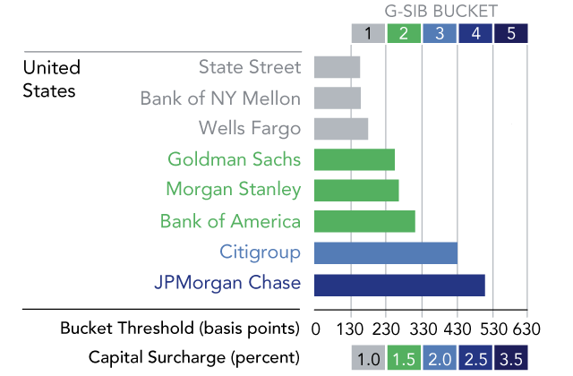

## Table of Contents

## What are Systemically Important Financial Institutions (SIFIs)?

Systemically Important Financial Institutions, or SIFIs, are big banks and financial companies that are so important to the economy that if they fail, it could cause major problems for everyone. Think of them like the pillars of a building; if one pillar falls, the whole building might collapse. That's why governments and financial regulators keep a close eye on SIFIs to make sure they don't get into trouble.

Because SIFIs are so crucial, they have to follow stricter rules and have more checks than smaller banks. These rules are meant to keep them strong and safe, so they don't cause a financial crisis. For example, they might need to keep more money in reserve or have plans ready in case something goes wrong. This way, if a SIFI starts to have problems, there's a better chance to fix it before it affects the whole economy.

## Why are SIFIs important to the global financial system?

SIFIs are important to the global financial system because they play a big role in keeping the economy running smoothly. They handle a lot of money and are connected to many other banks and businesses around the world. If a SIFI gets into trouble, it can affect not just itself but also other financial institutions and even whole countries. This is why people call them "too big to fail." If one of these big banks fails, it could cause a domino effect, leading to a financial crisis that impacts everyone.

To prevent such problems, governments and financial watchdogs pay extra attention to SIFIs. They make sure these big banks follow strict rules to stay strong and safe. This includes having enough money set aside to cover losses and having plans ready for emergencies. By keeping a close watch on SIFIs, regulators hope to avoid major financial disasters and keep the global economy stable.

## How are SIFIs identified and classified?

SIFIs are identified and classified by looking at how big they are and how connected they are to other parts of the financial system. Regulators, like the Financial Stability Board (FSB) and central banks, use a bunch of different measures to figure this out. They check things like how much money the bank has, how many other banks and businesses it works with, and how important it is to the economy. If a bank is really big and its failure could cause a lot of problems, it gets labeled as a SIFI.

Once a bank is identified as a SIFI, it gets put into different groups based on how important it is. There are global SIFIs, which are the biggest and most connected banks in the world, and there are also domestic SIFIs, which are important within their own country. These classifications help regulators decide what kind of rules and checks the bank needs to follow to stay safe and keep the economy stable.

## What are the different categories of SIFIs?

SIFIs are split into two main groups: global SIFIs and domestic SIFIs. Global SIFIs are the biggest banks in the world that work with a lot of other banks and businesses all over the globe. If one of these banks gets into trouble, it could cause problems everywhere, not just in one country. That's why they are watched very closely by international groups like the Financial Stability Board.

Domestic SIFIs are important within their own country but might not be as big or connected as global SIFIs. They are still very important to their local economy, and if they fail, it could cause a lot of problems at home. Regulators in each country keep a close eye on these banks to make sure they follow the rules and stay strong. Both types of SIFIs have to follow strict rules to keep the financial system safe.

## What are the regulatory requirements for SIFIs?

SIFIs have to follow stricter rules than smaller banks to make sure they stay strong and don't cause problems for the economy. These rules include having more money set aside, called capital, to cover losses if things go wrong. They also need to have enough money ready to use, called [liquidity](/wiki/liquidity-risk-premium), so they can keep going even during tough times. Plus, SIFIs need to have plans ready, called recovery and resolution plans, so they know what to do if they start to have big problems. These plans help them fix things before it's too late.

Regulators also make SIFIs do regular check-ups, called stress tests, to see how they would handle bad situations, like a big economic downturn. If a SIFI doesn't pass these tests, they have to fix whatever is wrong. Another rule is that SIFIs can't take as many risks as smaller banks. They have to be more careful with the kind of deals they make and the money they lend out. All these rules help keep SIFIs safe and make sure they don't cause a big financial mess if something goes wrong.

## How do SIFIs impact financial stability?

SIFIs are really important for keeping the financial system stable. They are like the big players in the economy, handling a lot of money and working with many other banks and businesses. If a SIFI gets into trouble, it can cause a lot of problems not just for itself but for the whole economy. This is because SIFIs are so connected to everything else. If one fails, it can start a chain reaction, making other banks and businesses struggle too. That's why keeping SIFIs strong and safe is so important for everyone.

To make sure SIFIs don't cause big problems, they have to follow strict rules. These rules make them keep more money set aside and be ready for emergencies. Regulators watch them closely and make them do regular check-ups to see how they would handle tough times. By making SIFIs follow these rules, the chances of them causing a financial crisis go down. This helps keep the economy stable and protects people from the big problems that could happen if a SIFI fails.

## What are the risks associated with SIFIs?

SIFIs can be risky because they are so big and connected to everything else in the economy. If a SIFI gets into trouble, it can cause a lot of problems for other banks and businesses. This is called a domino effect. For example, if a SIFI can't pay back its loans, other banks that lent money to it might also struggle. This can lead to a financial crisis that affects everyone, not just the people directly involved with the SIFI.

To try and stop these problems, SIFIs have to follow strict rules. But even with these rules, there are still risks. Sometimes, SIFIs might take big risks to make more money, which can be dangerous. Also, if people think a SIFI is "too big to fail," they might take more risks because they think the government will always bail them out. This can make the whole financial system less stable and increase the chances of a big problem happening.

## How have SIFIs been affected by past financial crises?

SIFIs were hit hard by past financial crises, like the 2008 global financial crisis. Many big banks, which were SIFIs, got into big trouble because they took too many risks with their money. They made loans to people who couldn't pay them back and invested in things that lost value. When these risky moves failed, it caused a huge mess. Banks like Lehman Brothers, a SIFI, went bankrupt, which scared everyone and made other banks and businesses struggle too. Governments had to step in and help to stop the crisis from getting worse.

After the 2008 crisis, rules for SIFIs got a lot stricter. Governments and financial watchdogs realized that SIFIs needed to be watched more closely to keep the economy safe. They made new rules that forced SIFIs to keep more money set aside and be ready for emergencies. These changes were meant to make sure that if another crisis happened, SIFIs would be better prepared and less likely to cause big problems. Even with these new rules, SIFIs still face risks, but the hope is that they are now stronger and the financial system is safer.

## What measures are in place to prevent the failure of SIFIs?

To stop SIFIs from failing, there are a lot of rules they have to follow. These rules make SIFIs keep more money set aside, called capital, so they can cover losses if things go wrong. They also need to have enough money ready to use, called liquidity, so they can keep going even during tough times. SIFIs have to make plans, called recovery and resolution plans, so they know what to do if they start to have big problems. These plans help them fix things before it's too late. Regulators also make SIFIs do regular check-ups, called stress tests, to see how they would handle bad situations, like a big economic downturn. If a SIFI doesn't pass these tests, they have to fix whatever is wrong.

Another important measure is that SIFIs can't take as many risks as smaller banks. They have to be more careful with the kind of deals they make and the money they lend out. Regulators watch SIFIs closely to make sure they follow all these rules. If a SIFI starts to have problems, regulators can step in early to help fix things before it turns into a big crisis. All these measures help keep SIFIs strong and safe, which is important for keeping the whole economy stable and protecting people from the big problems that could happen if a SIFI fails.

## How do international regulations differ for SIFIs?

International regulations for SIFIs are set by groups like the Financial Stability Board (FSB) and the Basel Committee on Banking Supervision. These rules are made to keep big banks safe all over the world. They say that SIFIs need to have more money set aside, called capital, and be ready for emergencies with enough money to use, called liquidity. They also have to make plans for what to do if things go wrong, called recovery and resolution plans. These rules help make sure that if a SIFI starts to have problems, it can fix them before they get too big.

Different countries might add their own rules on top of these international ones. For example, the United States has the Dodd-Frank Act, which makes SIFIs follow even stricter rules. In Europe, there are rules like the Capital Requirements Directive and the Bank Recovery and Resolution Directive. These extra rules can be different from country to country, but they all aim to keep SIFIs strong and stop them from causing big problems. By working together, countries try to make sure that SIFIs are safe no matter where they are.

## What role do SIFIs play in economic policy and monetary policy?

SIFIs play a big part in economic policy because they are so important to the economy. Governments and central banks watch SIFIs closely to make sure they are doing well. If SIFIs are strong, it helps the whole economy stay strong too. But if SIFIs start to have problems, it can make the economy shaky. That's why governments make rules for SIFIs to follow, to keep them safe and help the economy stay stable. These rules can affect how much money SIFIs can lend and how they invest, which in turn can affect things like jobs and growth in the economy.

SIFIs also have a big role in monetary policy, which is about controlling the money supply and interest rates. Central banks use tools like setting interest rates to control how much money is in the economy. SIFIs are often the ones that help make these tools work. For example, when a central bank changes interest rates, SIFIs change the rates they offer to customers too. This can make people borrow more or less money, which affects spending and the economy. By working with SIFIs, central banks can use monetary policy to help keep the economy on track.

## What are the future challenges and trends for SIFIs in the evolving financial landscape?

SIFIs face a lot of challenges and changes as the world of finance keeps evolving. One big challenge is keeping up with new technology. Things like online banking, cryptocurrencies, and [artificial intelligence](/wiki/ai-artificial-intelligence) are changing how people use and think about money. SIFIs need to use these new tools to stay competitive, but they also have to be careful because these technologies can bring new risks. Another challenge is dealing with new rules and regulations. After big financial crises, governments keep making more rules to keep SIFIs safe, but this can make it harder for them to do business and make money.

A trend that SIFIs are seeing is more focus on sustainability and social responsibility. People and governments are pushing for banks to help the environment and support fair practices. SIFIs are starting to think about how their actions affect the planet and society, and they are trying to do business in ways that are good for everyone. Another trend is the growth of global markets. As more countries and businesses connect, SIFIs need to work across borders more than ever. This can open up new opportunities, but it also means they have to deal with different rules and risks in different places. Keeping up with all these changes will be important for SIFIs to stay strong and help the economy grow.

## References & Further Reading

[1]: Financial Stability Board. ["2019 List of Global Systemically Important Banks (G-SIBs)."](https://www.fsb.org/2019/11/2019-list-of-global-systemically-important-banks-g-sibs/) Financial Stability Board, 2019.

[2]: Basel Committee on Banking Supervision. ["Basel III: Finalising Post-Crisis Reforms."](https://www.bis.org/bcbs/publ/d424.htm) Bank for International Settlements, December 2017.

[3]: Markose, S. M. (2012). ["Systemic Risks from Global Financial Derivatives: A Network Analysis of Contagion and Its Mitigation with Super-Spreader Tax."](https://pmc.ncbi.nlm.nih.gov/articles/PMC7184062/) Institute of Developing Economies.

[4]: Acharya, V. V., Cooley, T., Richardson, M., & Walter, I. (2011). ["Regulating Wall Street: The Dodd-Frank Act and the New Architecture of Global Finance."](https://www.semanticscholar.org/paper/Regulating-Wall-Street%3A-The-Dodd-Frank-Act-and-the-Acharya-Cooley/7612070173671c54906cca898a62f6c63cd38ded) Wiley & Sons.

[5]: Yadav, P. K. (2013). ["Algorithmic Trading and Market Dynamics."](https://www.semanticscholar.org/paper/How-Algorithmic-Trading-Undermines-Efficiency-in-Yadav/b33509e48ebf31e3dc46d9bc0f960ed459cb4641) In: French, K. R., & Schwert, G. W. (Eds.), Handbook of the Economics of Finance, Volume 2B, Elsevier.