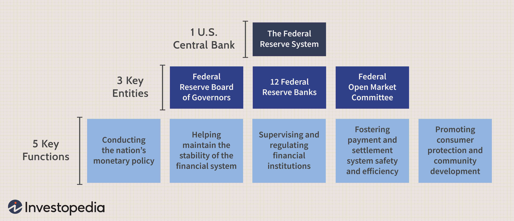

Systemically Important Financial Institutions (SIFIs) are a critical component in maintaining the stability of the global financial system. These entities are often referred to as "too big to fail" due to their significant size, market influence, and the potential systemic impact their failure could have on the broader economy. The identification and regulation of SIFIs are essential to mitigating risks that could lead to financial crises, similar to the one experienced in 2008.

The purpose of this article is to examine the impact of SIFIs on global financial stability. It aims to unpack the complex regulatory frameworks that govern these institutions and explore their interactions with modern financial technologies, such as algorithmic trading. SIFIs are subject to stringent regulatory requirements to ensure they have sufficient capital reserves and are capable of weathering financial shocks. These regulations are designed not only to safeguard the institutions themselves but also to protect the wider financial system.

Algorithmic trading represents a significant shift in how financial markets operate, characterized by high-speed and data-driven decision-making processes. SIFIs, with their substantial resources and market presence, are at the forefront of incorporating such technologies to enhance their operations. This fusion of traditional finance with cutting-edge technology can lead to improvements in market liquidity and efficient risk management, although it also introduces new vulnerabilities and complexities.

In conclusion, SIFIs play a pivotal role in the financial ecosystem. Understanding their operations, regulatory landscape, and interaction with emerging technologies is crucial in navigating the current economic environment and planning for future financial stability. This article provides a comprehensive overview of these topics, contributing to a nuanced appreciation of the balance between regulatory oversight and technological advancement in the finance sector.

## Table of Contents

## Understanding Systemically Important Financial Institutions (SIFIs)

Systemically Important Financial Institutions (SIFIs) are financial entities whose failure could trigger a widespread economic crisis due to their size, market importance, and interconnectedness within the financial system. These institutions are often deemed "too big to fail" because their collapse can lead to significant disruptions in the global economy. The designation as a SIFI implies heightened regulatory scrutiny to mitigate risks associated with their potential failure.

### Criteria for Identifying SIFIs

SIFIs are identified based on several criteria, primarily focusing on the institution's size, interconnectedness, and substitutability, as well as its complexity and cross-jurisdictional activity. The key factors are:

1. **Size**: The sheer volume of assets and liabilities managed by an institution is a crucial determinant. Larger institutions, by virtue of handling significant portions of the industry’s assets, have the potential to impact the market substantially if they fail.

2. **Interconnectedness**: Institutions with extensive links to other financial entities can propagate financial distress swiftly across the system. The more interconnected an institution, the higher the risk of systemic contagion.

3. **Substitutability**: This criterion assesses the institution's role in providing critical financial services and infrastructure. If the services offered by the institution cannot be easily replaced by others, the institution poses a greater systemic risk.

4. **Complexity**: Institutions with elaborate organizational structures and complex financial products are harder to resolve or liquidate, thus posing a higher systemic risk.

5. **Cross-Jurisdictional Activity**: Institutions operating across multiple countries create challenges in regulation and resolution due to different legal systems and regulatory environments.

These criteria are used by regulators worldwide to determine which institutions should be classified as SIFIs, resulting in enhanced regulatory oversight.

### Historical Context and Reforms Following the 2008 Financial Crisis

The concept of SIFIs gained prominence following the 2008 global financial crisis, which exposed vulnerabilities in the financial system linked to the collapse of major institutions like Lehman Brothers. The crisis underscored the lack of adequate regulatory measures for large, interconnected entities and the severe economic repercussions of their failures.

In response, global regulatory bodies and national governments initiated comprehensive financial reforms aimed at enhancing the resilience of the financial system. One of the pivotal reforms was the establishment of the Financial Stability Board (FSB), which, in collaboration with the Basel Committee on Banking Supervision, began identifying and regulating SIFIs. The aim was to ensure that these institutions maintain higher capital buffers and adhere to stricter risk management standards.

The 2010 Dodd-Frank Wall Street Reform and Consumer Protection Act in the United States exemplifies significant legislative action targeting SIFIs. It led to the creation of the Financial Stability Oversight Council (FSOC), responsible for monitoring systemic risks and designating certain non-bank financial companies as SIFIs based on their potential impact on financial stability.

These reforms reflected a paradigm shift towards more proactive risk management and supervisory practices, laying the groundwork for reducing the likelihood of future financial crises linked to the collapse of large financial institutions.

The establishment and ongoing regulation of SIFIs represent a critical effort in addressing systemic risk, promoting market stability, and safeguarding global economic health.

## Regulatory Requirements and Oversight for SIFIs

Systemically Important Financial Institutions (SIFIs) are subject to extensive regulatory oversight, derived primarily from the need to mitigate risks that could lead to significant disruptions in the global financial system. Following the 2008 financial crisis, substantial regulatory frameworks were established, focusing on enhancing the resilience of these institutions.

### Higher Capital Reserves and Mandatory Stress Tests

One of the critical regulatory requirements for SIFIs is maintaining higher capital reserves. This mandate ensures that SIFIs possess sufficient capital buffers to absorb losses and continue operations during periods of financial distress. Regulators have established specific capital adequacy standards, such as the Common Equity Tier 1 (CET1) capital ratio, which requires SIFIs to maintain a higher proportion of high-quality capital relative to their risk-weighted assets.

Mandatory stress tests are another crucial component. These tests assess a SIFI's ability to withstand adverse economic scenarios. By simulating extreme financial conditions, regulators can evaluate the institution's capital adequacy and overall resilience. The results can lead to directives requiring capital increases or adjustments in risk management strategies.

### Financial Stability Oversight Council (FSOC) and Living Wills

The Financial Stability Oversight Council (FSOC) plays a pivotal role in monitoring risks to the financial stability of the United States. Established under the Dodd-Frank Wall Street Reform and Consumer Protection Act of 2010, the FSOC is tasked with identifying SIFIs and coordinating regulatory efforts across various agencies. One of the FSOC’s key initiatives is the requirement for SIFIs to prepare "living wills." These living wills are comprehensive plans that outline the institution’s strategy for rapid and orderly resolution in the event of failure. They are intended to avoid government bailouts and minimize systemic disruption.

### Dodd-Frank Act and Regulatory Adjustments

The Dodd-Frank Act laid the foundation for rigorous regulatory standards aimed at enhancing accountability and managing systemic risk among SIFIs. The Act introduced several reforms, including the establishment of the FSOC, enhanced capital requirements, and mechanisms for resolving failing institutions. 

During Trump’s presidency, certain adjustments were made to alleviate some of the regulatory burdens on financial institutions. Notably, the Economic Growth, Regulatory Relief, and Consumer Protection Act, enacted in 2018, raised the threshold for SIFI designation from $50 billion to $250 billion in assets. This adjustment reduced the number of banks classified as SIFIs, aiming to ease compliance costs for smaller banks while focusing regulatory efforts on the largest institutions.

These regulatory requirements and oversight mechanisms are integral to maintaining the financial stability of SIFIs. By enforcing robust capital standards, routine stress testing, and comprehensive planning for failure, these regulations aim to prevent the recurrence of destabilizing financial crises.

## The Role of Algorithmic Trading in SIFI Operations

Algorithmic trading refers to the use of computer systems to execute trading strategies that involve complex algorithms, processing vast amounts of data at exceptionally high speeds. It plays a crucial role in modern financial markets by enabling high-frequency trading, optimizing execution prices, and managing trading risks. The adoption of [algorithmic trading](/wiki/algorithmic-trading) has significantly transformed how financial instruments, including stocks, currencies, and commodities, are traded globally.

Systemically Important Financial Institutions (SIFIs) leverage algorithmic trading to enhance efficiency in operations. These institutions often employ algorithms for risk management by automatically assessing and mitigating exposure to various market risks. Through continuous monitoring of market conditions, algorithms can execute trades that align SIFI portfolios with set risk parameters almost instantaneously. This rapid response capability is pivotal in maintaining stability, especially in volatile market conditions.

Additionally, SIFIs use algorithmic trading to provide [liquidity](/wiki/liquidity-risk-premium) to financial markets, acting as market makers. By offering quotes for buying and selling financial instruments, SIFIs ensure that other market participants can transact with ease. Algorithms facilitate this by rapidly adjusting buy and sell prices based on real-time market data. This liquidity provision is essential not only for market efficiency but also for ensuring smoother price discovery processes.

Market-making activities also benefit from algorithmic trading by optimizing the spread between buying and selling prices. Algorithms analyze historical and current market data to forecast short-term price movements, thereby setting spreads that maximize profit while managing risk. The ability to adjust strategies dynamically allows SIFIs to remain competitive in fast-paced trading environments.

Despite the advantages, algorithmic trading poses potential risks for SIFIs. The complexity and speed of algorithmic operations can lead to unintended consequences like flash crashes, where rapid price swings occur due to erroneously executed trades. The flash crash of May 6, 2010, highlighted how algorithmic and high-frequency trading can exacerbate [volatility](/wiki/volatility-trading-strategies) if left unchecked. Moreover, algorithmic trading systems are susceptible to operational risks, including software bugs and cyber threats, which can have significant repercussions for large financial institutions.

To mitigate these risks, SIFIs implement rigorous testing and ongoing oversight of their algorithmic systems. They employ safeguards like kill switches to halt trading in case of system failures or suspicious market activities. Additionally, regulatory bodies have established guidelines for algorithmic trading, requiring transparency and accountability from financial institutions engaging in such activities.

In conclusion, algorithmic trading constitutes a vital component of SIFI operations, offering enhanced risk management, liquidity provision, and market-making capabilities. However, the inherent risks necessitate robust risk management frameworks and regulatory oversight to ensure that the benefits of algorithmic trading are not undermined by potential market disruptions.

## Criticisms and Challenges Facing SIFIs

Systemically Important Financial Institutions (SIFIs) have garnered significant attention due to their designation as entities whose failure could trigger a wider financial collapse. While this label intends to preserve global economic stability, several criticisms arise from its implications, notably the perpetuation of the "too big to fail" phenomenon. 

Critics argue that the SIFI designation could, paradoxically, amplify the moral hazard it aims to mitigate. The assurance of government intervention might encourage these institutions to engage in risky financial activities, under the premise that they would receive bailouts if their ventures go awry. This potential behavior contradicts the primary objective of marking SIFIs—reinforcing stability and risk management within the financial system.

A significant legal challenge to the SIFI designation arose from MetLife Inc., an American insurance giant that contested its identification as a SIFI by the Financial Stability Oversight Council (FSOC). MetLife argued that the designation was arbitrary and capricious, lacking a comprehensive risk assessment consistent with the provisions of the Dodd-Frank Act. The U.S. District Court for the District of Columbia ruled in favor of MetLife in 2016, rescinding its SIFI label and underscoring the complexities of classifying institutions under this designation. This legal precedent highlighted not only the potential overreach in regulatory classifications but also raised questions about the transparency and methodology employed by regulatory bodies.

The regulatory burdens placed upon SIFIs often involve stringent capital reserve requirements, mandatory stress tests, and the preparation of "living wills" or resolution plans. These regulations are designed to ensure these institutions can withstand financial shocks. However, they may inadvertently create competitive disadvantages for smaller financial entities. As larger firms shoulder the SIFI tag with government-backed credibility, smaller firms might struggle to compete, lacking the implied safety net afforded to their larger counterparts. This discrepancy can lead to market consolidation, further amplifying the very systemic risks regulators aim to diffuse.

Thus, while the SIFI framework aims to bolster financial oversight, it harbors inherent criticisms and challenges. These include reinforcing "too big to fail" sentiments, potential regulatory overextensions, and fostering competitive imbalances within the financial industry. Addressing these issues requires a nuanced approach that balances the imperative of safeguarding financial markets against inadvertently stifling competition and innovation.

## The Future of SIFIs and Financial Market Stability

The future landscape for Systemically Important Financial Institutions (SIFIs) is poised at the intersection of regulatory evolution and technological advancement. As financial markets continue to evolve, the regulatory framework governing SIFIs must adapt to new challenges and opportunities, ensuring financial stability without stifling innovation.

Technological advancements, particularly in [artificial intelligence](/wiki/ai-artificial-intelligence) (AI), have the potential to transform how SIFIs operate. AI-driven analytics and automation could revolutionize risk management, allowing for more precise forecasting and mitigation strategies. For instance, [machine learning](/wiki/machine-learning) algorithms can analyze vast datasets to identify patterns and anomalies, aiding in the detection of potential market disruptions or fraudulent activities. Furthermore, AI can enhance decision-making processes in trading, asset management, and customer service, leading to increased efficiency and reduced operational costs.

However, the integration of AI into SIFI operations raises regulatory considerations. Regulators must ensure that these technologies do not compromise the stability of the financial system. This may involve developing new standards for AI governance, including transparency requirements and ethical guidelines. Ensuring that AI systems are robust, transparent, and free from biases is crucial to maintaining trust in financial markets.

On an international level, discussions on financial reform continue to shape the future regulatory environment for SIFIs. Organizations such as the Financial Stability Board (FSB) and the International Monetary Fund (IMF) play a pivotal role in coordinating global standards to mitigate systemic risks. These discussions often focus on strengthening the resilience of SIFIs through enhanced capital requirements, improved risk management practices, and rigorous stress testing.

One potential outcome of these reforms is the harmonization of regulatory standards across jurisdictions, which could reduce the regulatory [arbitrage](/wiki/arbitrage) that might occur when institutions operate in multiple countries. Such harmonization aims to create a level playing field, promoting fairness and competition while safeguarding financial stability.

Additionally, there's an increasing emphasis on sustainable finance and the role of SIFIs in fostering economic resilience in the face of climate change. Future regulations may incorporate environmental, social, and governance ([ESG](/wiki/esg-investing)) criteria, encouraging SIFIs to align their strategies with long-term sustainability goals.

In conclusion, the evolving nature of financial markets and technological innovation necessitates a balanced approach to SIFI regulation. While advancements such as AI offer significant operational benefits, they must be implemented within a robust regulatory framework to ensure stability and trust. International cooperation and adaptation to global economic trends will be key to the future role of SIFIs in maintaining financial market stability.

## Conclusion

The article has explored the multi-faceted dynamics related to Systemically Important Financial Institutions (SIFIs) and their crucial role in maintaining global financial stability. Central to the discourse is the intricate balance between ensuring robust regulatory oversight and fostering innovation needed to advance financial stability. SIFIs, identified based on criteria such as size, complexity, and interconnectedness, are subject to strict regulatory requirements, including higher capital reserves and stress testing. These measures are largely shaped by post-2008 financial crisis reforms to mitigate systemic risks and avoid future taxpayer-funded bailouts.

Regulatory frameworks, notably the Dodd-Frank Act, have undergone transformations, reflecting changes in political landscapes and economic philosophies. However, even these extensive regulatory frameworks have faced criticisms for potentially reinforcing the "too big to fail" paradigm and imposing significant compliance costs that might disadvantage smaller financial institutions. Key legal challenges, such as the case of MetLife Inc., underscore ongoing debates about the implications of SIFI designations.

In the juxtaposition of innovation and regulation, elements like algorithmic trading illustrate how SIFIs have adeptly incorporated advanced technologies to optimize risk management, liquidity, and market efficiency. Such advancements also necessitate adaptive regulatory approaches to preemptly address challenges like market volatility and systemic risks that can arise from new technologies.

Looking ahead, there is a manifest need for policy frameworks that are both insightful and forward-looking, addressing the dual requirements of managing risks and capitalizing on technological opportunities. Ongoing international discussions and financial reform initiatives will likely shape the future landscape for SIFIs, requiring coordinated efforts to ensure that financial systems remain resilient yet dynamic.

In conclusion, while SIFI regulations play a vital role in global financial stability, the balance between oversight and innovation remains pivotal. Sustainable financial systems will depend on agile policies that appropriately manage emerging risks while harnessing the potential of technology to foster robust economic growth.

## References & Further Reading

[1]: Financial Stability Board. ["2019 List of Global Systemically Important Banks (G-SIBs)."](https://www.fsb.org/2019/11/2019-list-of-global-systemically-important-banks-g-sibs/) Financial Stability Board, 2019.

[2]: Basel Committee on Banking Supervision. ["Basel III: Finalising Post-Crisis Reforms."](https://www.bis.org/bcbs/publ/d424.htm) Bank for International Settlements, December 2017.

[3]: Markose, S. M. (2012). ["Systemic Risks from Global Financial Derivatives: A Network Analysis of Contagion and Its Mitigation with Super-Spreader Tax."](https://pmc.ncbi.nlm.nih.gov/articles/PMC7184062/) Institute of Developing Economies.

[4]: Acharya, V. V., Cooley, T., Richardson, M., & Walter, I. (2011). ["Regulating Wall Street: The Dodd-Frank Act and the New Architecture of Global Finance."](https://www.semanticscholar.org/paper/Regulating-Wall-Street%3A-The-Dodd-Frank-Act-and-the-Acharya-Cooley/7612070173671c54906cca898a62f6c63cd38ded) Wiley & Sons.

[5]: Yadav, P. K. (2013). ["Algorithmic Trading and Market Dynamics."](https://www.semanticscholar.org/paper/How-Algorithmic-Trading-Undermines-Efficiency-in-Yadav/b33509e48ebf31e3dc46d9bc0f960ed459cb4641) In: French, K. R., & Schwert, G. W. (Eds.), Handbook of the Economics of Finance, Volume 2B, Elsevier.