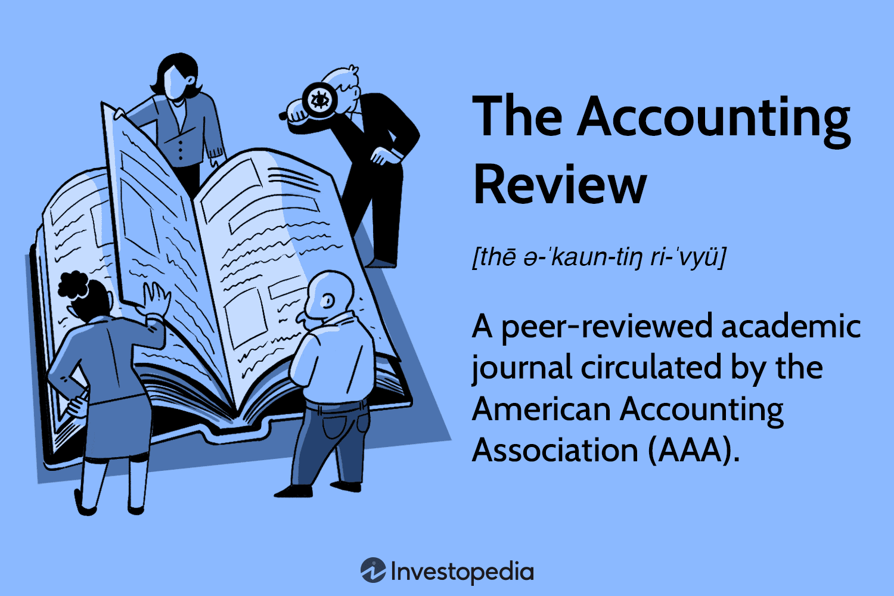

Accounting journals are fundamental to advancing knowledge, enhancing education, and evolving practices within the accounting profession. Among these, "The Accounting Review" stands out as a pivotal publication, providing a platform for disseminating rigorous research that influences both academic and practical developments in the field. Established in 1926 by the American Accounting Association (AAA), this journal has made substantial contributions to accounting by offering peer-reviewed articles that cover a broad range of topics, including theoretical frameworks, empirical research, and methodological advancements. These articles not only inform academics and practitioners but also foster an environment of continuous improvement by promoting the exchange of ideas and research findings.

The role of such journals extends beyond traditional accounting matters, as evidenced by their coverage of innovative topics like algorithmic trading. This integration of finance and technology challenges conventional approaches and introduces new dimensions to accounting research and practice. Algorithmic trading employs complex algorithms to automate trading strategies, requiring rapid analysis and execution of financial data. This intersection poses implications for financial accuracy, audit processes, and risk management, demonstrating the dynamic nature of modern accounting practices. Accounting journals critically assess these developments, addressing associated challenges such as data management, transparency, and regulatory compliance.

Furthermore, the American Accounting Association plays a key role in supporting accounting education and research. By overseeing publications like "The Accounting Review" and organizing academic conferences, the AAA contributes to the dissemination of knowledge and the advancement of the accounting discipline. Through these efforts, the association supports educators, researchers, and practitioners, ensuring the ongoing development of the field.

In summary, accounting journals serve as vital resources that drive both theoretical and practical advancements within the accounting profession. From traditional topics to emerging trends like algorithmic trading, these journals encapsulate the breadth and depth of contemporary accounting research. As the field continues to adapt to technological advances and economic changes, academic publications remain indispensable for educating new generations of accountants and ensuring the sustainable development of accounting standards and theories.

## Table of Contents

## Overview of The Accounting Review

'The Accounting Review', established in 1926, stands as a preeminent academic journal within the field of accounting. It is published bi-monthly by the American Accounting Association (AAA), an influential organization supporting accounting education and research. The journal is recognized for its focus on accounting education, research, and practice by disseminating peer-reviewed articles across a wide array of accounting topics.

The journal is renowned for its emphasis on quantitative research and the integration of rigorous mathematical models. These elements are crucial as they empower researchers to develop well-substantiated insights and recommendations, fundamentally enhancing the academic accounting community's analytical capabilities. Furthermore, 'The Accounting Review' acts as a critical platform for academics, researchers, and graduate students, fostering an environment where they can share innovative methodologies and findings. This exchange of knowledge facilitates the growth and evolution of accounting practices, ensuring that the discipline remains responsive to modern trends and challenges.

Over the decades, 'The Accounting Review' has evolved alongside the broader accounting profession, continually aligning its focus with contemporary issues. This adaptability is evident in the journal's diverse content, which reflects the dynamic nature of accounting and its intersection with emerging topics such as technology and globalization. By staying attuned to the ongoing changes within the field, 'The Accounting Review' ensures its relevance and importance in advancing both academic understanding and practical application in accounting.

## The Role of Peer-Reviewed Accounting Journals

Peer-reviewed accounting journals, including "The Accounting Review", play a fundamental role in advancing the field of accounting by ensuring that research published within their pages adheres to high standards of quality and credibility. The peer-review process involves a thorough evaluation by experts in the field, who assess the validity, significance, and originality of the submitted research. This process is crucial for maintaining the integrity of academic publications, as it filters out unsubstantiated claims and encourages rigor in research methodologies.

These journals act as crucial platforms for academics to disseminate validated research findings. Researchers across the globe submit their work to these journals to gain recognition and feedback from the scholarly community. The validation conferred by peer-reviewed journals provides assurance to practitioners who might apply these insights in real-world contexts. For instance, an accounting journal article addressing new financial reporting standards or risk management techniques can directly influence corporate practices and policies.

Additionally, peer-reviewed journals promote collaboration among academics by providing an avenue for the sharing of ideas and methodologies, thereby contributing to the continuous evolution of accounting theories and practices. As interdisciplinary research becomes increasingly common, these journals serve as a bridge between accounting and other fields such as finance, economics, and information technology. By incorporating a wide array of perspectives, journals foster innovation and provide comprehensive solutions to complex accounting challenges.

The historical perspective offered by peer-reviewed journals is invaluable in understanding the evolution of accounting paradigms over time. By archiving research that captures shifts in regulatory frameworks, technological advances, and methodological innovations, journals document the dynamic nature of the discipline. This historical context not only aids current researchers in building on past work but also highlights the progression and refinement of accounting as a science.

In sum, peer-reviewed journals are an indispensable resource for both academia and the accounting profession. They uphold scholarly discourse through rigorous evaluation processes, facilitate the application of research to practical scenarios, encourage interdisciplinary collaboration, and preserve the historical advancement of the field. As accounting continues to evolve, these journals will remain central to its development, providing a foundation for future innovations and knowledge dissemination.

## Algorithmic Trading in Accountancy

Algorithmic trading refers to the use of intricate algorithms for automating trading strategies, enabling the rapid analysis and execution of large volumes of financial data. This innovative approach significantly influences various aspects of accounting, including financial accuracy, audit practices, and risk management. Algorithmic trading systems employ advanced computational models to process data at speeds and volumes that exceed human capabilities, thereby facilitating more efficient and precise trading operations.

The integration of [algorithmic trading](/wiki/algorithmic-trading) into accounting practices introduces several implications for the field. One primary area affected is financial accuracy. By automating the trading process, algorithmic systems reduce human error and inconsistencies, enhancing the reliability of financial records. This automation allows for precise calculations and adjustments in real-time, influencing how transactions are recorded and reported.

Audit processes also undergo transformation with the advent of algorithmic trading. Traditional audit methodologies often rely on sampling techniques to verify financial statements, but algorithmic systems enable auditors to assess larger datasets with higher precision. This shift towards comprehensive data analysis enhances an auditor's ability to detect anomalies and potential fraudulent activities, thereby increasing the robustness of auditing procedures.

Risk management is another critical area impacted by algorithmic trading. These automated systems can swiftly adapt to changing market conditions, providing firms with more dynamic risk assessment tools. By continuously evaluating market trends and executing trades based on predefined criteria, algorithmic trading aids in minimizing risks associated with market [volatility](/wiki/volatility-trading-strategies). This proactive risk management approach helps organizations maintain stable financial standings even amidst turbulent market conditions.

Accounting journals frequently assess the impact of algorithmic trading, addressing challenges such as data management, transparency, and regulatory compliance. The sheer [volume](/wiki/volume-trading-strategy) of data processed by algorithmic systems necessitates sophisticated data management strategies to ensure accuracy and completeness. Moreover, transparency in algorithmic trading remains a significant concern, as the complexity of these systems can obscure the decision-making processes behind trades. Regulatory bodies continue to develop frameworks to ensure that algorithmic trading operations adhere to financial regulations and ethical standards.

Studies in accounting literature often explore how technology can streamline and complicate traditional accounting tasks. While algorithmic trading improves efficiency, it also introduces new complexities in data interpretation and system oversight. Understanding these dynamics is crucial for accountants to leverage technology effectively.

By examining these intersections, academic journals play a vital role in connecting technology with finance and accounting practices. They provide valuable insights that help professionals navigate the evolving landscape of financial technologies, ensuring that accounting practices remain robust and relevant amid technological advancements.

## Historical Context and Evolution

'The Accounting Review' was established in 1926 by William Andrew Patton with a core mission aimed at supporting both accounting practitioners and educators. This journal emerged as a crucial platform for addressing the challenges facing the accounting industry through scholarly discourse. Initially, early editions of the journal were heavily inclined towards industry-specific challenges, with articles often based on anecdotal evidence and illustrations. These editions served as practical guides that informed the day-to-day operations of accounting professionals while simultaneously offering insights into the educational realm of accounting.

In the succeeding decades, beginning notably in the 1960s, 'The Accounting Review' underwent a significant transformation. The journal began to place a greater emphasis on quantitative research, which involved the integration of sophisticated mathematical models and statistical techniques. This shift mirrored broader trends within the field of accounting, where data-driven decision-making gradually became paramount. The journal's interdisciplinary approach during this period encouraged contributions that spanned various related domains, incorporating insights from economics, finance, and management to enrich accounting discourse.

Moreover, 'The Accounting Review' adapted to the evolving needs of the accounting community by carefully balancing educational and practical insights. Articles began to reflect both theoretical advancements and pragmatic considerations, thereby enhancing the applicability of scholarly research to real-world accounting practices. This responsiveness reinforced the journal's role in bridging the gap between academic research and practical accounting applications.

The evolution of 'The Accounting Review' encapsulates the broader trajectory of accounting research, which now emphasizes decision-making based on empirical data and the development of accounting policy. This transition aligns with the growing complexity of the financial landscape, where robust analytical skills and an interdisciplinary perspective are indispensable. Through its historical transformation, 'The Accounting Review' has continually contributed to the progression of accounting theory and practice, serving as an enduring resource for both academics and industry professionals seeking to navigate the challenges and opportunities presented by the dynamic field of accounting.

## Conclusion

Accounting journals, particularly 'The Accounting Review,' play an essential role in advancing the accounting discipline by providing a robust repository of peer-reviewed research and progressive insights. The rigorous research disseminated through these journals underpins both academic and practical advancements within the field, fostering an environment where new ideas can be tested and validated by the academic community. This ongoing dissemination of knowledge is crucial for propelling the accounting discipline forward, addressing contemporary challenges, and refining existing practices.

The integration of algorithmic trading within the discourse of accounting journals accentuates the dynamic nature of modern accounting practices. As technology continues to intersect with finance, the implications of algorithmic trading for accounting accuracy, audit processes, and financial risk management emerge as critical points of study. Accounting journals are pivotal in examining how these technological advancements influence traditional accounting methodologies, offering insights that are necessary for adapting to evolving market conditions.

As the accounting field continues to adapt to technological advances, such resources remain invaluable for educating new generations of accountants and researchers. The continuous evaluation and publication of pioneering research ensure that academic journals do not merely archive past knowledge but actively contribute to the sustainable development of accounting standards and theories. By maintaining a commitment to scholarly integrity and relevance, these publications play a crucial role in shaping the future trajectory of the accounting profession, fostering continual innovation and informed practice.

## References & Further Reading

[1]: Bergstra, J., Bardenet, R., Bengio, Y., & Kégl, B. (2011). ["Algorithms for Hyper-Parameter Optimization."](https://dl.acm.org/doi/10.5555/2986459.2986743) Advances in Neural Information Processing Systems 24.

[2]: ["Advances in Financial Machine Learning"](https://www.amazon.com/Advances-Financial-Machine-Learning-Marcos/dp/1119482089) by Marcos Lopez de Prado

[3]: ["Evidence-Based Technical Analysis: Applying the Scientific Method and Statistical Inference to Trading Signals"](https://www.amazon.com/Evidence-Based-Technical-Analysis-Scientific-Statistical/dp/0470008741) by David Aronson

[4]: ["Machine Learning for Algorithmic Trading"](https://github.com/stefan-jansen/machine-learning-for-trading) by Stefan Jansen

[5]: ["Quantitative Trading: How to Build Your Own Algorithmic Trading Business"](https://www.amazon.com/Quantitative-Trading-Build-Algorithmic-Business/dp/1119800064) by Ernest P. Chan