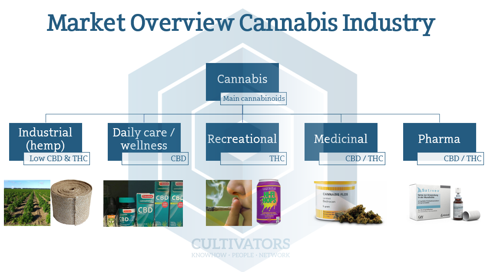

## Table of Contents

## What is cannabis and what are its primary uses?

Cannabis is a plant that people use for different reasons. It has chemicals in it called cannabinoids, like THC and CBD. THC is what makes people feel high, while CBD does not. People have been using cannabis for a very long time, in many parts of the world.

The main uses of cannabis are for medicine and fun. For medicine, people use it to help with pain, nausea, and some other health problems. Doctors in some places can give it to patients. For fun, people smoke it, eat it in food, or use it in other ways to feel relaxed or happy. But, it's important to know that using cannabis can also have risks and it's not legal everywhere.

## How has the legalization of cannabis evolved globally?

The way countries treat cannabis has changed a lot over time. A long time ago, many places did not allow cannabis at all. But in the last few decades, more and more countries have started to change their rules. Some countries have made it legal to use cannabis for medical reasons. This means doctors can give it to people who need it for health problems. Other countries have gone further and made it legal for adults to use cannabis just for fun, not just for medicine.

In places like Canada and Uruguay, adults can buy and use cannabis without getting in trouble with the law. Some states in the United States have also done this, even though it's still against the law at the national level. In Europe, countries like the Netherlands have been more relaxed about cannabis for a long time, even if it's not fully legal. Other countries, like Germany and Italy, have laws that allow medical cannabis but not for fun. Overall, the world is slowly changing its mind about cannabis, but the rules can be very different from one place to another.

## What are the different types of cannabis products available in the market?

There are many different types of cannabis products you can find in the market. The most common type is dried cannabis flower, which people usually smoke or use in a vaporizer. Another popular product is cannabis concentrates, like oils, waxes, and shatter. These are very strong and people use them in special vaporizers or mix them with other things. Edibles are also very popular; these are foods like cookies, candies, and drinks that have cannabis in them. People eat these to feel the effects of cannabis without smoking.

There are also cannabis tinctures, which are liquid extracts that you put under your tongue or mix into food and drinks. Topicals are another type, like creams and lotions that you rub on your skin. These are often used for pain relief and don't make you feel high. Lastly, there are cannabis capsules and pills, which are easy to take and give a measured dose of cannabis. Each type of product can be different in how strong it is and how quickly you feel its effects, so it's important to know what you're using.

## What is the difference between medical and recreational cannabis?

Medical cannabis is used to help people with health problems. Doctors can give it to patients who need it for things like pain, nausea, or other medical issues. The cannabis used for medicine is often tested to make sure it's safe and has the right amount of chemicals like THC and CBD. In places where medical cannabis is legal, patients usually need a special card or prescription to buy it from a store or dispensary.

Recreational cannabis is used for fun, not for health reasons. Adults can buy it and use it to relax or feel happy. It's legal in some places for people over a certain age, usually 21 or older. Recreational cannabis can come in many forms, like flower, edibles, and concentrates. The rules for buying and using recreational cannabis can be different from medical cannabis, and it's not always tested as strictly as medical cannabis.

Both types of cannabis come from the same plant, but the way they are used and the rules around them can be very different. Medical cannabis focuses on helping people feel better, while recreational cannabis is about enjoying the effects of the plant.

## How does the cultivation of cannabis work, and what are the key considerations?

Growing cannabis starts with choosing the right seeds or clones. Seeds can be bought from a store or taken from a cannabis plant. Clones are small pieces of a plant that can grow into a new plant. Once you have your seeds or clones, you need to plant them in soil or another growing medium. Cannabis plants need a lot of light to grow well. If you're growing inside, you'll need special lights. If you're growing outside, you need a sunny spot. The plants also need water and nutrients to grow big and strong.

There are a few important things to think about when growing cannabis. First, you need to know the laws in your area. Growing cannabis is not legal everywhere, so make sure you're allowed to do it. Second, you need to keep the plants healthy. This means watching out for bugs and diseases and making sure they get the right amount of water and nutrients. Third, you need to think about the space you have. Cannabis plants can get very big, so you need enough room for them to grow. Finally, you need to know when to harvest the plants. This is usually when the flowers are ready, and it can take a few months from when you start growing.

## What are the main regulatory challenges facing the cannabis industry?

The cannabis industry faces many regulatory challenges. One big problem is that the rules can be very different from one place to another. In some countries, cannabis is legal for medical use but not for fun. In other places, it's legal for both. This makes it hard for businesses to know where they can sell their products and how. Also, the rules can change a lot over time. A country might decide to make cannabis legal one year and then change its mind later. This makes it hard for companies to plan for the future.

Another challenge is making sure cannabis products are safe and good quality. Governments want to make sure that what people are buying is safe to use. This means businesses have to follow strict rules about how they grow, make, and sell cannabis. They have to test their products to make sure they don't have harmful things in them. This can be expensive and take a lot of time. Also, there are rules about how cannabis can be advertised. Companies can't always tell people about their products the way they want to, which can make it hard to grow their business.

## How is the cannabis industry structured, and what are the key market segments?

The cannabis industry is made up of different parts that work together to grow, make, and sell cannabis products. At the start, there are growers who plant and take care of cannabis plants. They can grow the plants inside or outside, depending on where they live and what the rules are. Once the plants are ready, they go to processors who turn the plants into different products like oils, edibles, and concentrates. After that, the products go to dispensaries or stores where people can buy them. There are also companies that help with things like testing the products to make sure they are safe and good quality, and others that help with getting the products from one place to another.

The cannabis market is divided into different segments based on what people use cannabis for and what kind of products they want. The two main segments are medical cannabis and recreational cannabis. Medical cannabis is for people who need it to help with health problems, and they usually need a doctor's note to buy it. Recreational cannabis is for people who want to use it for fun, and they don't need a doctor's note. Within these segments, there are also different types of products like flower, edibles, concentrates, and topicals. Each type of product can be popular with different groups of people, depending on what they like and what they need.

## What are the economic impacts of the cannabis industry on local and national economies?

The cannabis industry can have a big effect on local and national economies. When cannabis is legal, it can create a lot of jobs. People are needed to grow the plants, make the products, and sell them in stores. This means more people can find work and earn money. Also, the government can make money from taxes on cannabis. This money can be used to help pay for things like schools, roads, and other public services. So, the cannabis industry can help the economy grow by creating jobs and bringing in tax money.

But there are also some challenges. The cannabis industry can be hard to control because the rules are different in different places. This can make it hard for businesses to know where they can sell their products and how. Also, the cost of making sure cannabis products are safe and good quality can be high. Businesses have to spend a lot of money on testing and following the rules. This can make it harder for them to make a profit. Overall, the cannabis industry can help the economy, but it also comes with some problems that need to be managed carefully.

## What are the current trends and innovations in cannabis production and consumption?

In cannabis production, one big trend is using technology to grow plants better. Growers are using things like special lights, automatic watering systems, and even robots to help take care of the plants. This makes it easier to grow a lot of cannabis and make sure it's good quality. Another trend is growing cannabis without soil, called hydroponics. This can help plants grow faster and use less space. Also, more growers are using green methods to save water and energy, which is good for the environment.

In how people use cannabis, there are also new trends. One is using vape pens and other devices that let people inhale cannabis without smoking it. This can be easier and less harmful than smoking. Another trend is edibles, like gummies and drinks, that have cannabis in them. These can be a fun way to use cannabis and they don't smell like smoking does. Also, more people are using cannabis for health reasons, like to help with pain or sleep. This has made medical cannabis more popular and led to new products made just for health.

## How do taxation and pricing strategies affect the cannabis market?

Taxation and pricing strategies have a big impact on the cannabis market. When governments put high taxes on cannabis, it can make the price go up a lot. This can make people buy less cannabis because it's too expensive. But, high taxes can also bring in a lot of money for the government. They can use this money to help pay for things like schools and roads. So, finding the right tax rate is important. If it's too high, people might buy cannabis from places where it's not legal and the government loses out on tax money. If it's too low, the government might not get enough money to help the community.

Pricing strategies also matter a lot. Companies need to think about how much to charge for their cannabis products. If they charge too much, people might not buy them. If they charge too little, they might not make enough money to keep their business going. Also, the price can affect how much people use cannabis. If it's cheap, more people might use it, which can be good for business but might cause more problems in the community. So, companies need to find a good balance in their pricing to keep their business healthy and follow the rules set by the government.

## What are the potential health benefits and risks associated with cannabis use?

Cannabis has some health benefits that people use it for. Many people find that it helps with pain, like the kind that comes from arthritis or cancer. It can also help with nausea and vomiting, which is why some cancer patients use it during chemotherapy. Another use is for people who have trouble sleeping; cannabis can help them fall asleep easier. Some studies also suggest that cannabis might help with mental health problems like anxiety and depression, but the research is not clear yet. Overall, many people find that cannabis helps them feel better in different ways.

But there are also risks to using cannabis. One big risk is that it can affect your thinking and memory, especially if you use it a lot when you're young. This can make it harder to learn and remember things. Another risk is that cannabis can make you feel anxious or paranoid, especially if you use a lot of it or if it's very strong. It can also be addictive, and some people find it hard to stop using it even when they want to. Also, smoking cannabis can be bad for your lungs, just like smoking tobacco. So, while cannabis can help with some health problems, it's important to think about these risks too.

## What future developments can we expect in the cannabis industry?

In the future, the cannabis industry will likely see more changes in the rules. More places might decide to make cannabis legal for medical or fun use. This could make the market grow a lot and create more jobs. Also, the rules might become more clear and the same everywhere, which would help businesses know what they can do. Governments might also find better ways to tax cannabis and use the money to help the community.

Technology will also play a big role in the future of cannabis. Growers will use more advanced tools to make their plants grow better and faster. They might use robots and smart systems to take care of the plants. Also, new products will come out, like better edibles and drinks that have cannabis in them. People might find more ways to use cannabis for health reasons, and scientists will learn more about how it can help with different problems. Overall, the cannabis industry will keep changing and growing in the years to come.

## References & Further Reading

[1]: McPartland, J. M., & Hegeman, S. B. (2018). ["Cannabis sativa L. - Botany and Biotechnology"](https://www.researchgate.net/profile/John-Mcpartland/publication/318024824_Cannabis_sativa_and_Cannabis_indica_versus_Sativa_and_Indica/links/5c02e41f299bf1a3c159c2e9/Cannabis-sativa-and-Cannabis-indica-versus-Sativa-and-Indica.pdf). Springer.

[2]: Barstow, L., & Borden, A. (2020). ["The Rise of Algorithmic Trading in The Cannabis Market"](https://www.jstor.org/stable/43612951) Benzinga.

[3]: ["Algorithmic Trading: An Overview"](https://link.springer.com/chapter/10.1007/978-3-031-62843-6_8) - Investopedia

[4]: Ford, M. J. (2020). ["Wall Street and the Cannabis Stock Boom: A Comparative Analysis"](https://pubmed.ncbi.nlm.nih.gov/33049222/). Financial Geek.

[5]: Rosalie Liccardo Pacula, Beau Kilmer, Michael A. Caulkins, R. L. Chiesa. (2010). ["A Framework for Thinking About the Cannabis Market"](https://pubmed.ncbi.nlm.nih.gov/24825201/). RAND Corporation.

[6]: Narang, R. K. (2013). ["Inside the Black Box: A Simple Guide to Quantitative and High-Frequency Trading"](https://onlinelibrary.wiley.com/doi/book/10.1002/9781118662717). Wiley.