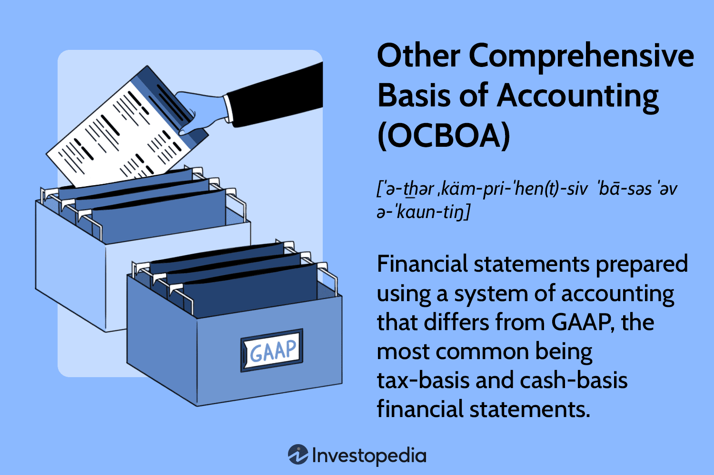

## Table of Contents

## What is the Other Comprehensive Basis of Accounting (OCBOA)?

The Other Comprehensive Basis of Accounting (OCBOA) is a way of preparing financial statements that follows rules different from the usual Generally Accepted Accounting Principles (GAAP). OCBOA is used when a business or organization wants to use a simpler or more specific way of accounting that fits their needs better than GAAP. This can include methods like cash basis, modified cash basis, income tax basis, or regulatory basis of accounting.

Using OCBOA can make financial reporting easier and more relevant for certain businesses, especially small ones or those in specific industries. For example, a small business might find it easier to track their finances using the cash basis of accounting, where they record income and expenses only when money changes hands. However, it's important to note that financial statements prepared under OCBOA must clearly state that they do not follow GAAP, so users of the statements understand the basis used.

## What are the different types of OCBOA?

There are several types of OCBOA that businesses can use instead of GAAP. One common type is the cash basis of accounting. With this method, a business records income when they receive money and records expenses when they pay money. It's simple and easy to understand, which is why small businesses often use it. Another type is the modified cash basis, which is similar to the cash basis but allows for some accruals, like recording depreciation or inventory.

Another type of OCBOA is the income tax basis of accounting. This method follows the rules used for filing income tax returns. It can be useful for businesses because it makes it easier to prepare both financial statements and tax returns using the same numbers. Lastly, there's the regulatory basis of accounting, which follows rules set by a regulatory agency. This is often used by businesses in industries like insurance or banking, where specific regulations require a certain way of reporting finances.

## How does OCBOA differ from Generally Accepted Accounting Principles (GAAP)?

OCBOA and GAAP are two different ways to prepare financial statements. GAAP is a set of rules that most businesses follow to make sure their financial statements are consistent and easy to understand. These rules are set by organizations like the Financial Accounting Standards Board (FASB). On the other hand, OCBOA is a more flexible approach. It lets businesses use different methods like cash basis, modified cash basis, income tax basis, or regulatory basis, depending on what works best for them.

The main difference is that GAAP is more strict and detailed, while OCBOA can be simpler and more tailored to a business's needs. For example, a small business might find it easier to use the cash basis under OCBOA, where they only record money when it's received or paid. This is simpler than GAAP, which requires recording income and expenses when they're earned or incurred, even if no money has changed hands yet. However, financial statements prepared under OCBOA must clearly state that they don't follow GAAP, so users know the difference.

## In what situations might a business choose to use OCBOA instead of GAAP?

A business might choose to use OCBOA instead of GAAP if they want a simpler way to keep track of their money. Small businesses often find OCBOA easier because it doesn't have as many rules as GAAP. For example, with the cash basis of OCBOA, a business only writes down money when it comes in or goes out. This can be less confusing and easier to manage than GAAP, which requires recording money when it's earned or owed, even if it hasn't been paid yet.

Another reason a business might choose OCBOA is if they need to follow specific rules set by a regulator or if they want their financial statements to match their tax returns. For instance, businesses in industries like insurance or banking might have to use a regulatory basis of accounting. Also, using the income tax basis of OCBOA can make it easier to prepare both financial statements and tax returns using the same numbers, which can save time and reduce errors.

## What are the advantages of using OCBOA for financial reporting?

Using OCBOA for financial reporting can make things simpler for businesses, especially small ones. With OCBOA, a business can choose a method that fits their needs better than the strict rules of GAAP. For example, the cash basis of OCBOA lets a business record money only when it's received or paid. This can be easier to understand and manage than GAAP, which requires recording money when it's earned or owed, even if it hasn't been paid yet. This simplicity can save time and reduce the chance of making mistakes.

Another advantage of OCBOA is that it can be more relevant for certain businesses. For instance, if a business needs to follow specific rules set by a regulator, they can use the regulatory basis of OCBOA. Also, if a business wants their financial statements to match their tax returns, they can use the income tax basis of OCBOA. This can make preparing both financial statements and tax returns easier and more consistent, which can save time and reduce errors. Overall, OCBOA offers flexibility and can be tailored to meet the specific needs of a business.

## What are the potential disadvantages or limitations of OCBOA?

Using OCBOA can have some downsides. One big problem is that financial statements made with OCBOA might not be as easy to compare with other businesses. This is because OCBOA lets businesses use different methods, like cash basis or income tax basis, while GAAP has strict rules that everyone follows. If a business uses OCBOA, it might be harder for investors or lenders to understand their financial health compared to other companies that use GAAP.

Another limitation is that OCBOA might not give a full picture of a business's finances. For example, the cash basis of OCBOA only records money when it's received or paid. This means it might not show money that's owed to the business or money the business owes to others. This can make it harder to see the true financial situation of the business. Also, if a business wants to go public or get big loans, they might need to use GAAP because it's more accepted and trusted by big investors and banks.

## How is financial statement presentation different under OCBOA compared to GAAP?

Financial statement presentation under OCBOA can be different from GAAP because OCBOA lets businesses use different ways to show their money. With OCBOA, a business might use the cash basis, where they only write down money when it comes in or goes out. This can make the financial statements simpler and easier to understand, but they might not show everything, like money that's owed to the business or money the business owes to others. On the other hand, GAAP has strict rules that everyone follows, so financial statements are more detailed and show a fuller picture of the business's finances.

Another difference is that financial statements under OCBOA must clearly say that they don't follow GAAP. This is important so that people who read the statements know they're looking at a different way of accounting. This can make it harder to compare the business's financial statements with other businesses that use GAAP. But for some businesses, especially small ones or those in specific industries, using OCBOA can make their financial reporting easier and more relevant to their needs.

## What are the disclosure requirements for financial statements prepared under OCBOA?

Financial statements prepared under OCBOA need to include a clear statement that they do not follow GAAP. This is important so that anyone reading the statements knows they are looking at a different way of accounting. This disclosure helps users understand the basis used for the financial statements and can affect how they interpret the information.

In addition to stating that GAAP is not followed, the financial statements should also explain the specific OCBOA method used, like cash basis, modified cash basis, income tax basis, or regulatory basis. This helps users understand the rules that were followed to prepare the statements. While OCBOA might not require as many detailed disclosures as GAAP, it's still important to provide enough information so that the financial statements are clear and useful to readers.

## Can OCBOA financial statements be audited, and if so, what are the auditing standards?

Yes, OCBOA financial statements can be audited. When an auditor looks at OCBOA financial statements, they follow the same general auditing standards as they would for GAAP statements. These standards are set by groups like the American Institute of Certified Public Accountants (AICPA). The main goal of an audit is to check if the financial statements are correct and follow the rules of the accounting method used, whether it's OCBOA or GAAP.

The audit process for OCBOA statements is a bit different because the rules are different. The auditor will make sure the financial statements follow the specific OCBOA method used, like cash basis or income tax basis. They will also check if the statements clearly say they don't follow GAAP. This helps make sure anyone reading the statements knows they're looking at a different way of accounting. Even though the rules are different, the auditor still needs to be thorough and careful to give a fair opinion on the financial statements.

## How does the use of OCBOA impact the comparability of financial statements across different companies?

Using OCBOA can make it harder to compare financial statements from different companies. This is because OCBOA lets businesses use different ways to keep track of their money, like the cash basis or income tax basis. When companies use different methods, their financial statements can look very different, even if they are doing the same kind of business. This makes it tough for people like investors or lenders to see how one company is doing compared to another.

On the other hand, GAAP has strict rules that everyone follows. This means that financial statements made with GAAP are easier to compare across different companies. If a company uses OCBOA, they need to clearly say that they don't follow GAAP. This helps people know they're looking at a different way of accounting, but it still makes comparing the statements more difficult. So, while OCBOA can be simpler and more useful for some businesses, it can also make it harder to see how they stack up against others.

## What are the tax implications of using OCBOA for financial reporting?

Using OCBOA for financial reporting can make things easier when it comes to taxes. If a business uses the income tax basis of OCBOA, their financial statements will match their tax returns. This means they only need to do one set of numbers for both their financial reports and their taxes. This can save time and reduce the chance of making mistakes because everything is consistent.

However, using OCBOA can also have some downsides for taxes. If a business uses a different method like the cash basis, their financial statements might not match their tax returns. This can make things more complicated because they'll need to keep two sets of books. Also, if a business wants to take advantage of certain tax benefits or deductions, they might need to use GAAP because it's more accepted by tax authorities. So, while OCBOA can simplify some parts of tax reporting, it might also create extra work in other areas.

## What future trends or regulatory changes might affect the use of OCBOA?

In the future, changes in rules or new technology might change how businesses use OCBOA. As more businesses use software to keep track of their money, it might become easier to use GAAP instead of OCBOA. This is because software can handle the more detailed rules of GAAP without making things too hard for businesses. Also, if regulators decide to make new rules about how businesses should report their money, this could make OCBOA less popular. For example, if new laws say that all businesses need to use GAAP for certain things, more businesses might switch to GAAP.

Another thing that could affect OCBOA is how investors and lenders feel about it. If more people start to think that GAAP gives a better picture of a business's money, they might ask businesses to use GAAP instead of OCBOA. This could make businesses switch to GAAP to get more money from investors or to get better loans. But, if small businesses keep finding OCBOA easier and more useful, they might keep using it, especially if they don't need to show their money to a lot of outside people.

## References & Further Reading

[1]: ["Accounting Daemons: Dynamic Accrual Accounting"](https://quickbooks.intuit.com/r/accounting/accrual-accounting/) by Anjan Thakor and Ankur Pareek

[2]: ["Advanced Financial Accounting"](https://www.studocu.com/row/document/addis-ababa-university/financial-accounting-1/advanced-financial-accounting-ii/40173834) by Richard Baker, Valdean Lembke, Thomas King

[3]: ["Fundamentals of Algorithmic Trading"](https://kx.com/glossary/the-fundamentals-of-algorithmic-trading/) by John S. Schwarz

[4]: ["Algorithmic Trading and DMA: An introduction to Direct Access Trading Strategies"](https://archive.org/details/algorithmictradi0000john) by Barry Johnson

[5]: Upton, D., & Creedy, D. (2004). ["A Non-GAAP Measure Guide for FIs: Introducing Other Comprehensive Basis of Accounting"](https://quizlet.com/604324069/special-reports-flash-cards/) CFA Institute

[6]: ["Accounting for Algorithmic Markets"](https://dl.acm.org/doi/abs/10.1145/3351095.3372833) by Carsten Murawski and Timo P. Panczyk

[7]: Harris, L.E., & Gurel, T. (1986). ["Price and Volume Effects Associated with Changes in the S&P 500 List: New Evidence for the Existence of Price Pressures"](https://onlinelibrary.wiley.com/doi/10.1111/j.1540-6261.1986.tb04550.x) Cowles Foundation Discussion Paper

[8]: ["Financial Accounting and Reporting"](https://cpaneeds.com/financial-accounting-vs-reporting-important-differences-you-need-to-know/) by Barry Elliott and Jamie Elliott

[9]: ["Blockchain and the Future of Algorithmic Trading: Practices and Examples"](https://wjaets.com/sites/default/files/WJAETS-2024-0054.pdf) ACM Digital Library